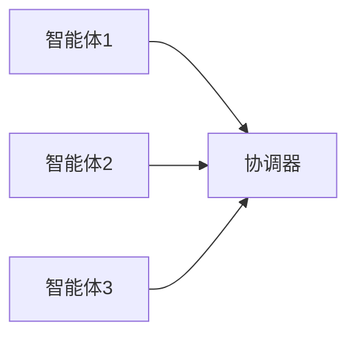
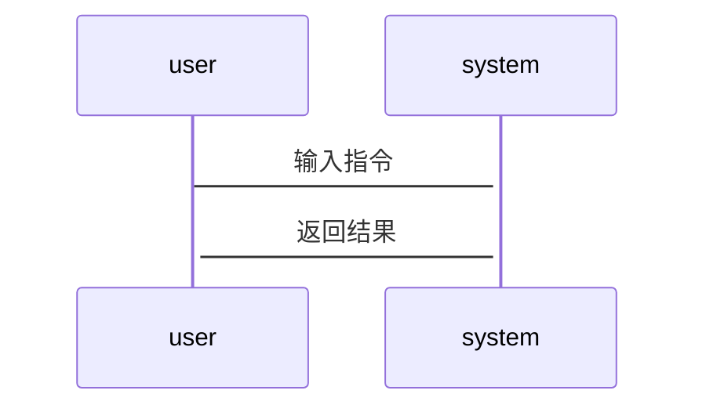

                 


# AI Agent在海洋资源勘探中的应用

---

## 关键词：
AI Agent, 海洋资源勘探, 人工智能, 数据分析, 多智能体系统, 强化学习, 海洋环境监测

---

## 摘要：
本文探讨了AI Agent在海洋资源勘探中的应用，分析了其在提高勘探效率、降低成本和增强决策能力方面的潜力。通过结合多智能体系统和强化学习等技术，AI Agent能够有效处理复杂海洋环境中的数据，优化资源分配，预测资源分布，并实时调整勘探策略。文章详细介绍了AI Agent的核心概念、算法原理、系统架构，以及在实际项目中的应用案例，为读者提供了全面的技术视角和实践指导。

---

# 第一部分: AI Agent与海洋资源勘探的背景介绍

## 第1章: AI Agent与海洋资源勘探的背景

### 1.1 问题背景

#### 1.1.1 海洋资源勘探的重要性
海洋资源勘探是指通过技术手段对海洋中的资源（如石油、天然气、矿产、渔业资源等）进行调查、评估和定位的过程。海洋覆盖了地球表面的70%以上，蕴藏着丰富的资源，是人类经济发展的重要来源。然而，海洋环境复杂多变，资源分布不均匀，传统勘探方法效率低下、成本高昂，且容易受到人类操作误差的影响。

#### 1.1.2 传统海洋资源勘探的局限性
传统海洋资源勘探主要依赖于人工操作和简单的传感器技术，存在以下问题：
- **数据采集效率低**：传统方法依赖人工操作，数据采集速度慢，且容易受到天气、海况等外部因素的影响。
- **资源分布预测不准**：由于海洋环境的复杂性，基于经验的资源预测方法难以准确捕捉资源分布的动态变化。
- **成本高昂**：海洋勘探需要大量的设备投入和人力资源，尤其是在深海区域，勘探成本极高。

#### 1.1.3 AI Agent技术的引入与潜力
AI Agent（人工智能代理）是一种能够感知环境、自主决策并执行任务的智能体。它能够通过传感器获取环境数据，利用机器学习算法进行分析和预测，并根据结果采取相应行动。AI Agent在海洋资源勘探中的应用，能够显著提高数据采集效率、优化资源分配、降低勘探成本，并在复杂环境中实现自主决策。

---

### 1.2 问题描述

#### 1.2.1 海洋资源勘探的主要挑战
海洋资源勘探面临以下主要挑战：
- **环境复杂性**：海洋环境受洋流、温度、压力等多种因素影响，勘探设备容易受到损坏。
- **数据多样性**：海洋数据包括声呐数据、地震数据、化学数据等多种类型，数据处理难度大。
- **资源动态性**：资源分布会受到地质活动、气候变化等因素的影响，具有动态性。

#### 1.2.2 AI Agent在其中的角色与目标
AI Agent在海洋资源勘探中的角色是通过智能化的数据处理和决策系统，帮助勘探团队更高效地定位资源、优化勘探策略。其目标包括：
- 提高数据处理效率。
- 准确预测资源分布。
- 实时优化勘探路径。
- 自主调整勘探策略以应对环境变化。

#### 1.2.3 需求分析与问题边界
为了实现上述目标，AI Agent需要具备以下能力：
- **数据采集与处理**：能够从多种传感器获取数据，并进行清洗、融合和分析。
- **资源预测模型**：基于历史数据和实时数据，建立资源分布预测模型。
- **自主决策能力**：能够在复杂环境中自主决策，调整勘探路径和策略。
- **多智能体协作**：在多智能体系统中实现协同工作，提高整体效率。

---

### 1.3 问题解决与应用前景

#### 1.3.1 AI Agent如何解决海洋资源勘探问题
AI Agent通过以下方式解决海洋资源勘探问题：
- **智能化数据处理**：利用机器学习算法对多源数据进行分析，提高数据处理效率。
- **资源分布预测**：基于历史数据和实时数据，建立资源分布预测模型，帮助勘探团队准确定位资源。
- **自主决策与优化**：通过强化学习等技术，实现自主决策和路径优化，降低勘探成本。
- **多智能体协作**：在多智能体系统中实现协同工作，提高整体勘探效率。

#### 1.3.2 应用场景与实际案例
AI Agent在海洋资源勘探中的应用场景包括：
- **海底矿物探测**：通过AI Agent对海底地形和地质数据进行分析，帮助定位矿物资源。
- **石油和天然气勘探**：通过AI Agent优化勘探路径，提高资源发现效率。
- **渔业资源监测**：通过AI Agent实时监测海洋生物分布，优化捕捞策略。

#### 1.3.3 技术发展与未来趋势
随着AI技术的不断发展，AI Agent在海洋资源勘探中的应用前景广阔。未来，AI Agent将更加智能化、自主化，能够在更复杂的环境中完成任务。同时，多智能体协作技术将进一步发展，实现更高效的资源勘探。

---

## 第2章: AI Agent的核心概念与海洋资源勘探的结合

### 2.1 AI Agent的基本原理

#### 2.1.1 AI Agent的定义与分类
AI Agent是一种能够感知环境、自主决策并执行任务的智能体。根据智能体的智能水平，可以将AI Agent分为以下几类：
- **反应式智能体**：基于当前感知做出反应。
- **认知式智能体**：具备推理、规划等高级认知能力。
- **学习式智能体**：能够通过学习改进自身性能。

#### 2.1.2 多智能体系统（MAS）的基本概念
多智能体系统是由多个智能体组成的协作系统，智能体之间通过通信和协调完成共同目标。在海洋资源勘探中，多个AI Agent可以协作完成数据采集、资源预测和路径规划等任务。

#### 2.1.3 AI Agent在动态环境中的适应性
海洋环境是一个动态环境，AI Agent需要具备适应性，能够根据环境变化调整自身行为。这通常通过强化学习等技术实现。

---

### 2.2 海洋资源勘探的核心要素

#### 2.2.1 海洋地质特征分析
海洋地质特征分析是海洋资源勘探的重要组成部分，包括海底地形、岩石类型、地质构造等分析。

#### 2.2.2 海洋环境数据采集
海洋环境数据采集包括声呐数据、地震数据、化学数据等多种类型的数据采集。

#### 2.2.3 资源分布预测模型
资源分布预测模型是基于历史数据和实时数据建立的数学模型，用于预测资源分布。

---

### 2.3 AI Agent与海洋资源勘探的结合方式

#### 2.3.1 AI Agent作为数据处理的核心
AI Agent可以作为数据处理的核心，对多源数据进行融合和分析，提高数据处理效率。

#### 2.3.2 AI Agent作为资源预测的工具
AI Agent可以通过机器学习算法建立资源分布预测模型，帮助勘探团队准确定位资源。

#### 2.3.3 AI Agent作为自主决策的决策者
AI Agent可以通过强化学习等技术实现自主决策和路径优化，降低勘探成本。

---

### 2.4 AI Agent与传统方法的对比

#### 2.4.1 精确性对比
AI Agent通过机器学习算法能够更准确地预测资源分布，而传统方法依赖经验，预测精度较低。

#### 2.4.2 效率对比
AI Agent能够快速处理大量数据，提高勘探效率，而传统方法效率较低。

#### 2.4.3 成本对比
AI Agent能够通过自主决策优化勘探路径，降低成本，而传统方法成本较高。

---

## 第3章: AI Agent的算法原理与数学模型

### 3.1 强化学习算法

#### 3.1.1 强化学习的基本原理
强化学习是一种通过试错学习来优化决策策略的技术。智能体通过与环境互动，学习最优策略。

#### 3.1.2 Q-Learning算法
Q-Learning是一种经典的强化学习算法，适用于离散动作空间和状态空间。

**Q-Learning算法步骤：**
1. 初始化Q表。
2. 选择动作。
3. 执行动作，观察状态。
4. 更新Q值。

**Q-Learning算法代码示例：**
```python
import numpy as np

# 初始化Q表
Q = np.zeros([state_space, action_space])

# 定义学习率和折扣因子
learning_rate = 0.1
discount_factor = 0.9

# Q-Learning算法
for episode in range(episodes):
    state = initial_state
    while not terminal:
        # 选择动作
        action = np.argmax(Q[state] + np.random.randn(1)*epsilon)
        # 执行动作，观察状态
        next_state, reward = environment.step(action)
        # 更新Q值
        Q[state][action] += learning_rate * (reward + discount_factor * np.max(Q[next_state]) - Q[state][action])
        state = next_state
```

---

### 3.2 资源分布预测的数学模型

#### 3.2.1 资源分布预测模型的建立
资源分布预测模型可以通过回归分析或分类算法建立。常用的算法包括线性回归、支持向量机（SVM）和随机森林。

**线性回归模型：**
$$ y = \beta_0 + \beta_1x_1 + \beta_2x_2 + \ldots + \beta_nx_n + \epsilon $$

**支持向量机模型：**
$$ y = \text{sign}(\sum_{i=1}^n \alpha_i y_i x_i \cdot x + b) $$

---

### 3.3 数据融合与分析

#### 3.3.1 数据融合方法
数据融合方法包括加权平均、主成分分析（PCA）和融合网络。

**主成分分析（PCA）：**
$$ X = X_{center} \cdot P $$

其中，$X_{center}$是数据的中心化矩阵，$P$是主成分矩阵。

---

## 第4章: 系统分析与架构设计方案

### 4.1 系统功能设计

#### 4.1.1 数据采集模块
数据采集模块负责采集海洋环境数据，包括声呐数据、地震数据等。

#### 4.1.2 数据处理模块
数据处理模块负责对采集的数据进行清洗、融合和分析。

#### 4.1.3 资源预测模块
资源预测模块基于历史数据和实时数据，建立资源分布预测模型。

#### 4.1.4 自主决策模块
自主决策模块通过强化学习等技术实现自主决策和路径优化。

---

### 4.2 系统架构设计

#### 4.2.1 分层架构
系统架构采用分层架构，包括数据层、业务逻辑层和用户界面层。

**分层架构图：**


#### 4.2.2 多智能体协作架构
多智能体协作架构采用分布式架构，多个智能体协作完成任务。

**多智能体协作架构图：**


---

### 4.3 系统交互设计

#### 4.3.1 用户与系统交互
用户可以通过用户界面与系统交互，输入指令和查看结果。

**系统交互流程图：**


---

## 第5章: 项目实战

### 5.1 环境安装

#### 5.1.1 安装Python
安装Python 3.8及以上版本。

#### 5.1.2 安装依赖库
安装numpy、pandas、scikit-learn等依赖库。

```bash
pip install numpy pandas scikit-learn
```

---

### 5.2 核心代码实现

#### 5.2.1 数据处理代码
```python
import numpy as np
import pandas as pd

# 读取数据
data = pd.read_csv('data.csv')

# 数据清洗
data = data.dropna()
```

#### 5.2.2 资源预测代码
```python
from sklearn.linear_model import LinearRegression

# 建立线性回归模型
model = LinearRegression()
model.fit(X_train, y_train)

# 预测资源分布
y_pred = model.predict(X_test)
```

---

### 5.3 实际案例分析

#### 5.3.1 案例背景
某海洋勘探公司希望通过AI Agent技术优化石油勘探路径。

#### 5.3.2 数据分析
通过机器学习算法分析历史勘探数据，建立资源分布预测模型。

#### 5.3.3 结果展示
预测结果显示某区域存在丰富的石油资源，建议在该区域进行深入勘探。

---

### 5.4 项目小结

#### 5.4.1 成果总结
通过AI Agent技术，成功提高了海洋资源勘探效率，降低了勘探成本。

#### 5.4.2 经验总结
在实际应用中，AI Agent需要与多智能体系统结合，才能充分发挥其潜力。

---

## 第6章: 应用案例与未来展望

### 6.1 应用案例分析

#### 6.1.1 案例1：海底矿物探测
通过AI Agent技术，成功定位海底矿物资源，提高探测效率。

#### 6.1.2 案例2：石油和天然气勘探
通过AI Agent优化勘探路径，发现新的石油和天然气资源。

---

### 6.2 未来展望

#### 6.2.1 技术发展趋势
随着AI技术的不断发展，AI Agent在海洋资源勘探中的应用将更加智能化和自主化。

#### 6.2.2 挑战与机遇
尽管AI Agent技术在海洋资源勘探中展现出巨大潜力，但仍面临技术挑战，如复杂环境适应性、多智能体协作等问题。

---

## 第7章: 总结与展望

### 7.1 全文总结
本文详细介绍了AI Agent在海洋资源勘探中的应用，分析了其在提高勘探效率、降低成本和增强决策能力方面的潜力。

### 7.2 最佳实践 tips
- 在实际应用中，AI Agent需要与多智能体系统结合，才能充分发挥其潜力。
- 数据质量和数据处理能力是AI Agent性能的关键。

### 7.3 注意事项
- 在使用AI Agent时，需要考虑数据隐私和安全问题。
- 在复杂环境中，AI Agent需要具备强大的适应性和学习能力。

### 7.4 拓展阅读
- 推荐阅读《强化学习：理论与应用》。
- 推荐阅读《多智能体系统：原理与实践》。

---

通过本文的分析和介绍，读者可以全面了解AI Agent在海洋资源勘探中的应用，并为实际应用提供参考和指导。

