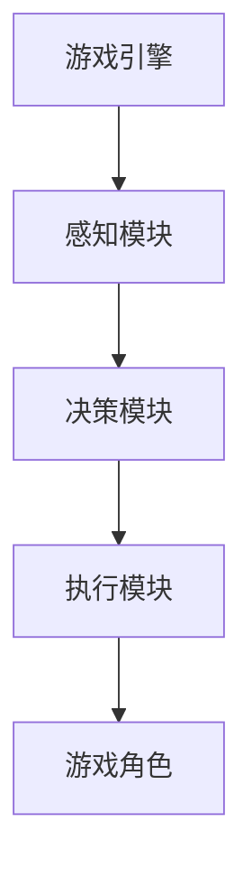

                 


# AI Agent在游戏产业中的应用

> 关键词：AI Agent，游戏产业，人工智能，游戏开发，智能NPC，算法原理，系统架构

> 摘要：AI Agent在游戏产业中的应用正在改变游戏开发和玩家体验。本文从AI Agent的基本概念出发，详细探讨其在游戏产业中的核心原理、算法实现、系统架构设计以及实际项目中的应用案例。通过分析AI Agent在游戏中的具体应用场景，本文旨在为游戏开发者和技术爱好者提供深入的技术洞察和实践指导，帮助他们更好地理解和应用AI Agent技术。

---

# 第一部分: AI Agent 在游戏产业中的背景与概念

## 第1章: AI Agent 的基本概念与背景

### 1.1 AI Agent 的定义与核心概念

#### 1.1.1 AI Agent 的定义
AI Agent（智能体）是指能够感知环境并采取行动以实现目标的实体。在游戏产业中，AI Agent通常用于模拟游戏中的智能NPC（非玩家角色）、自动寻路算法、敌人行为控制等。

#### 1.1.2 AI Agent 的核心概念与属性
- **自主性**：AI Agent能够自主决策，无需外部干预。
- **反应性**：能够实时感知环境并做出反应。
- **目标导向**：基于目标驱动行为。
- **学习能力**：通过经验或数据不断优化行为。

#### 1.1.3 AI Agent 在游戏产业中的重要性
AI Agent通过模拟智能行为，显著提升了游戏的趣味性和可玩性。例如，在角色扮演游戏（RPG）中，智能NPC能够与玩家互动并做出复杂的行为决策，增强玩家的沉浸感。

### 1.2 游戏产业中的 AI Agent 应用背景

#### 1.2.1 游戏产业的现状与发展趋势
随着游戏产业的快速发展，玩家对游戏体验的需求日益增长。传统基于脚本的AI行为模式已难以满足复杂游戏场景的需求，AI Agent技术因此成为游戏开发的重要工具。

#### 1.2.2 AI 技术在游戏产业中的应用现状
AI技术在游戏产业中的应用包括智能NPC、自动寻路、敌人AI、游戏推荐系统等。AI Agent作为其中的核心技术，正在推动游戏开发的智能化和自动化。

#### 1.2.3 AI Agent 在游戏产业中的独特价值
AI Agent通过模拟人类思维和行为，能够实现高度个性化的游戏体验，降低游戏开发成本，并提升游戏的质量和可玩性。

### 1.3 AI Agent 的边界与外延

#### 1.3.1 AI Agent 的边界
AI Agent的应用范围主要集中在游戏内的智能行为模拟，其边界包括：
- **功能边界**：仅限于游戏内行为模拟，不涉及游戏外的操作。
- **性能边界**：受限于硬件和算法性能，无法实现过于复杂的决策逻辑。

#### 1.3.2 AI Agent 的外延与相关概念
AI Agent的相关技术包括：
- **强化学习**：通过奖励机制优化AI行为。
- **自然语言处理（NLP）**：用于智能NPC的对话生成。
- **计算机视觉**：用于环境感知和目标识别。

#### 1.3.3 AI Agent 与游戏产业的结合点
AI Agent与游戏产业的结合点主要体现在智能NPC、自动寻路、敌人AI、游戏推荐系统等方面。

### 1.4 本章小结
本章介绍了AI Agent的基本概念、核心属性及其在游戏产业中的重要性。通过对AI Agent的定义和应用背景的分析，为后续章节的深入探讨奠定了基础。

---

# 第二部分: AI Agent 的核心概念与原理

## 第2章: AI Agent 的核心概念与原理

### 2.1 AI Agent 的核心概念

#### 2.1.1 AI Agent 的定义与分类
AI Agent可以分为以下几类：
- **基于规则的AI Agent**：通过预定义的规则进行决策。
- **基于状态的AI Agent**：根据当前状态和环境信息进行决策。
- **基于学习的AI Agent**：通过机器学习算法优化行为策略。

#### 2.1.2 AI Agent 的核心要素与组成
AI Agent的核心要素包括：
- **感知模块**：感知环境信息。
- **决策模块**：基于感知信息做出决策。
- **执行模块**：将决策转化为具体行动。

#### 2.1.3 AI Agent 的工作原理与流程
AI Agent的工作流程通常包括：
1. **感知环境**：通过传感器或API获取环境信息。
2. **分析信息**：解析感知数据并理解环境状态。
3. **制定决策**：基于当前状态和目标，选择最优行动方案。
4. **执行行动**：将决策转化为具体操作。

### 2.2 AI Agent 的类型与特点

#### 2.2.1 基于规则的 AI Agent
基于规则的AI Agent通过预定义的规则库进行决策。例如，在策略游戏中，敌人AI可以通过规则库中的“追击玩家”规则来决定行动。

#### 2.2.2 基于状态的 AI Agent
基于状态的AI Agent通过状态机模型进行决策。例如，在角色扮演游戏中，智能NPC可以根据当前状态（闲逛、对话、战斗）做出不同的行为选择。

#### 2.2.3 基于学习的 AI Agent
基于学习的AI Agent通过机器学习算法优化行为策略。例如，使用强化学习训练AI Agent在复杂游戏场景中做出最优决策。

### 2.3 AI Agent 的核心原理

#### 2.3.1 AI Agent 的感知与决策机制
AI Agent的感知机制包括：
- **视觉感知**：通过视觉数据（如图像）识别环境信息。
- **听觉感知**：通过音频数据（如声音）获取环境信息。
- **触觉感知**：通过物理反馈（如碰撞检测）感知环境。

AI Agent的决策机制包括：
- **规则驱动决策**：基于预定义规则做出决策。
- **状态机决策**：根据当前状态和环境信息选择行为。
- **学习驱动决策**：基于机器学习模型做出决策。

#### 2.3.2 AI Agent 的行为决策模型

##### 2.3.2.1 基于规则的决策模型
基于规则的决策模型通过预定义的规则库进行决策。例如：
$$
\text{如果玩家靠近，则执行追击行为；否则执行巡逻行为。}
$$

##### 2.3.2.2 基于状态的决策模型
基于状态的决策模型通过状态机模型进行决策。例如：
$$
\text{当前状态为“巡逻”时，执行随机移动；当前状态为“战斗”时，执行攻击行为。}
$$

##### 2.3.2.3 基于学习的决策模型
基于学习的决策模型通过机器学习模型进行决策。例如，使用强化学习训练AI Agent在复杂游戏场景中做出最优决策。

#### 2.3.4 AI Agent 的学习与优化
AI Agent的学习与优化包括：
- **监督学习**：通过标记数据训练AI Agent。
- **强化学习**：通过奖励机制优化AI行为。
- **无监督学习**：通过聚类分析发现隐藏的模式。

### 2.4 本章小结
本章详细探讨了AI Agent的核心概念、类型与特点，以及其在游戏产业中的核心原理。通过对AI Agent的感知与决策机制的分析，为后续章节的算法实现奠定了理论基础。

---

# 第三部分: AI Agent 的算法原理与实现

## 第3章: AI Agent 的算法原理

### 3.1 强化学习在AI Agent中的应用

#### 3.1.1 强化学习的基本原理
强化学习是一种通过试错机制优化行为的算法。AI Agent通过与环境互动，不断尝试不同的行为组合，并根据奖励机制优化决策策略。

#### 3.1.2 强化学习的数学模型
强化学习的数学模型包括：
- **状态空间**：所有可能的状态集合。
- **动作空间**：所有可能的动作集合。
- **奖励函数**：根据状态和动作返回奖励值。
- **策略函数**：定义在给定状态下选择动作的概率分布。

#### 3.1.3 强化学习在游戏中的应用案例
例如，在《英雄联盟》中，AI Agent可以通过强化学习优化英雄的战斗策略。

### 3.2 监督学习在AI Agent中的应用

#### 3.2.1 监督学习的基本原理
监督学习是一种通过标记数据训练模型的算法。AI Agent可以通过监督学习模型预测行为输出。

#### 3.2.2 监督学习的数学模型
监督学习的数学模型包括：
- **输入特征**：用于预测行为的特征向量。
- **目标标签**：对应每个输入特征的标签。
- **损失函数**：衡量预测值与真实值之间的差异。
- **优化算法**：用于最小化损失函数。

#### 3.2.3 监督学习在游戏中的应用案例
例如，在智能NPC的对话生成中，可以通过监督学习训练模型生成自然语言对话。

### 3.3 生成模型在AI Agent中的应用

#### 3.3.1 生成模型的基本原理
生成模型是一种通过生成新数据来模仿训练数据的分布的算法。例如，生成对抗网络（GAN）可以通过生成模型生成逼真的游戏场景。

#### 3.3.2 生成模型的数学模型
生成模型的数学模型包括：
- **生成器**：通过生成对抗网络生成数据。
- **判别器**：判断生成数据与真实数据之间的差异。

#### 3.3.3 生成模型在游戏中的应用案例
例如，在游戏场景生成中，可以通过生成模型生成多样化的地形和建筑。

### 3.4 本章小结
本章详细探讨了强化学习、监督学习和生成模型在AI Agent中的应用。通过对这些算法的数学模型和实现原理的分析，为后续章节的系统架构设计奠定了算法基础。

---

# 第四部分: AI Agent 的系统架构与设计

## 第4章: AI Agent 的系统架构设计

### 4.1 游戏AI系统的功能模块设计

#### 4.1.1 感知模块
感知模块负责获取游戏环境中的相关信息。例如：
- **视觉感知**：通过摄像头获取游戏画面。
- **听觉感知**：通过麦克风获取游戏音效。

#### 4.1.2 决策模块
决策模块负责根据感知信息做出行为决策。例如：
- **基于规则的决策**：根据预定义规则做出决策。
- **基于学习的决策**：根据机器学习模型做出决策。

#### 4.1.3 执行模块
执行模块负责将决策转化为具体行动。例如：
- **移动控制**：控制角色在游戏中的移动。
- **动作控制**：执行具体的战斗动作。

### 4.2 游戏AI系统的数据流与交互流程

#### 4.2.1 数据流设计
游戏AI系统的数据流设计包括：
- **输入数据**：来自游戏引擎的环境信息。
- **处理数据**：通过感知模块、决策模块和执行模块进行处理。
- **输出数据**：生成的行为指令或反馈信息。

#### 4.2.2 交互流程设计
游戏AI系统的交互流程包括：
1. **感知环境**：获取环境信息。
2. **分析信息**：解析感知数据。
3. **制定决策**：根据当前状态和目标做出决策。
4. **执行行动**：将决策转化为具体操作。

### 4.3 游戏AI系统的架构设计

#### 4.3.1 系统架构图


#### 4.3.2 功能模块设计
- **感知模块**：负责获取环境信息。
- **决策模块**：负责做出行为决策。
- **执行模块**：负责执行具体行动。

### 4.4 本章小结
本章详细探讨了游戏AI系统的功能模块设计、数据流与交互流程，以及系统架构设计。通过对系统架构的分析，为后续章节的项目实战奠定了系统设计基础。

---

# 第五部分: AI Agent 在游戏产业中的项目实战

## 第5章: AI Agent 的项目实战

### 5.1 智能NPC系统开发案例

#### 5.1.1 项目背景与需求分析
智能NPC系统旨在实现智能NPC与玩家的互动，提升游戏的可玩性和沉浸感。

#### 5.1.2 系统环境搭建
- **开发工具**：使用Unity或Unreal Engine进行游戏开发。
- **AI框架**：使用TensorFlow或PyTorch进行机器学习模型训练。
- **编程语言**：使用Python或C++进行开发。

#### 5.1.3 系统核心实现

##### 5.1.3.1 环境感知模块
环境感知模块通过摄像头获取游戏画面，并通过图像识别技术识别玩家位置。

##### 5.1.3.2 行为决策模块
行为决策模块通过强化学习模型优化NPC的行为策略。

##### 5.1.3.3 动作执行模块
动作执行模块通过控制NPC的运动和动作实现具体行为。

#### 5.1.4 系统代码实现

##### 5.1.4.1 环境感知模块代码
```python
import cv2

def detect_player(image):
    # 使用OpenCV进行图像识别
    gray = cv2.cvtColor(image, cv2.COLOR_BGR2GRAY)
    # 使用模板匹配检测玩家位置
    template = cv2.imread('player_template.png', cv2.IMREAD_GRAYSCALE)
    w, h = template.shape[::-1]
    res = cv2.matchTemplate(gray, template, cv2.TM_CCOEFF)
    min_val, max_val, min_loc, max_loc = cv2.minmaxLoc(res)
    top_left = max_loc
    bottom_right = (top_left[0] + w, top_left[1] + h)
    return (bottom_right[0], bottom_right[1])
```

##### 5.1.4.2 行为决策模块代码
```python
import numpy as np

class DecisionModule:
    def __init__(self):
        self.state = 'patrol'
        self.target = None

    def update(self, player_pos):
        if self.target is None:
            self.target = player_pos
            self.state = 'chase'
        elif self.target == player_pos:
            self.state = 'patrol'

    def get_action(self):
        if self.state == 'patrol':
            return 'random_move'
        else:
            return 'chase_target'
```

##### 5.1.4.3 动作执行模块代码
```python
class ActionModule:
    def execute(self, action):
        if action == 'random_move':
            # 随机移动
            return (np.random.uniform(0, 10), np.random.uniform(0, 10))
        elif action == 'chase_target':
            # 追踪目标
            return (target_pos.x, target_pos.y)
```

#### 5.1.5 系统功能测试
通过测试环境感知模块、行为决策模块和动作执行模块的功能，验证智能NPC系统的实现效果。

#### 5.1.6 系统优化与改进
根据测试结果，优化智能NPC系统的性能和行为策略。

### 5.2 项目实战总结

#### 5.2.1 项目实现的关键点
- **环境感知**：通过图像识别技术实现环境感知。
- **行为决策**：通过强化学习优化NPC的行为策略。
- **动作执行**：通过控制NPC的运动和动作实现具体行为。

#### 5.2.2 项目实现的难点
- **算法优化**：如何在复杂游戏场景中实现高效的算法。
- **系统集成**：如何将AI Agent系统与游戏引擎无缝集成。

#### 5.2.3 项目实现的经验总结
- **算法选择**：根据具体需求选择合适的算法。
- **系统设计**：注重系统架构的合理性。
- **代码实现**：注重代码的可读性和可维护性。

### 5.3 本章小结
本章通过智能NPC系统的开发案例，详细探讨了AI Agent在游戏产业中的项目实战。通过对项目的实现过程和经验总结，为后续章节的优化与改进提供了宝贵的实践经验。

---

# 第六部分: AI Agent 的最佳实践与总结

## 第6章: AI Agent 的最佳实践

### 6.1 AI Agent 在游戏开发中的最佳实践

#### 6.1.1 算法选择与优化
根据具体需求选择合适的算法，并通过优化算法参数提升性能。

#### 6.1.2 系统设计与实现
注重系统架构的合理性，确保各模块之间的协同工作。

#### 6.1.3 代码实现与维护
注重代码的可读性和可维护性，便于后续优化和扩展。

### 6.2 小结

#### 6.2.1 核心知识点回顾
- **AI Agent 的基本概念与原理**
- **AI Agent 的算法实现与系统架构设计**
- **AI Agent 在游戏产业中的项目实战**

#### 6.2.2 本章总结
AI Agent技术正在深刻改变游戏产业的开发方式和玩家体验。通过对AI Agent的核心原理、算法实现和系统架构设计的深入探讨，我们可以更好地理解和应用这项技术。

### 6.3 注意事项

#### 6.3.1 开发中的常见问题
- **性能瓶颈**：如何在复杂游戏场景中实现高效的算法。
- **系统兼容性**：如何将AI Agent系统与不同游戏引擎无缝集成。

#### 6.3.2 开发中的解决方案
- **算法优化**：通过优化算法参数和结构提升性能。
- **系统集成**：通过良好的系统设计确保兼容性。

### 6.4 拓展阅读

#### 6.4.1 相关技术领域
- **强化学习**：进一步了解强化学习在游戏AI中的应用。
- **生成模型**：研究生成模型在游戏场景生成中的应用。

#### 6.4.2 推荐书籍与资源
- **《强化学习：理论与算法》**：深入理解强化学习的核心原理。
- **《游戏AI编程基础》**：系统学习游戏AI的开发与实现。

---

# 第七部分: 总结与展望

## 第7章: 总结与展望

### 7.1 本篇文章的总结
本文从AI Agent的基本概念出发，详细探讨了其在游戏产业中的核心原理、算法实现、系统架构设计以及实际项目中的应用案例。通过对AI Agent在游戏中的具体应用场景的分析，本文旨在为游戏开发者和技术爱好者提供深入的技术洞察和实践指导。

### 7.2 对未来的展望
随着AI技术的不断发展，AI Agent在游戏产业中的应用将更加广泛和深入。未来，AI Agent将通过与其他技术（如区块链、虚拟现实）的结合，进一步推动游戏产业的创新和发展。

### 7.3 本章小结
本文总结了AI Agent在游戏产业中的应用现状和发展趋势，为读者提供了对未来发展的展望。

---

# 结语

通过本文的深入探讨，我们不仅了解了AI Agent在游戏产业中的核心原理和实现方法，还通过实际案例展示了其在游戏开发中的具体应用。希望本文能够为游戏开发者和技术爱好者提供有价值的参考和启发，推动AI Agent技术在游戏产业中的进一步发展。

--- 

# END

