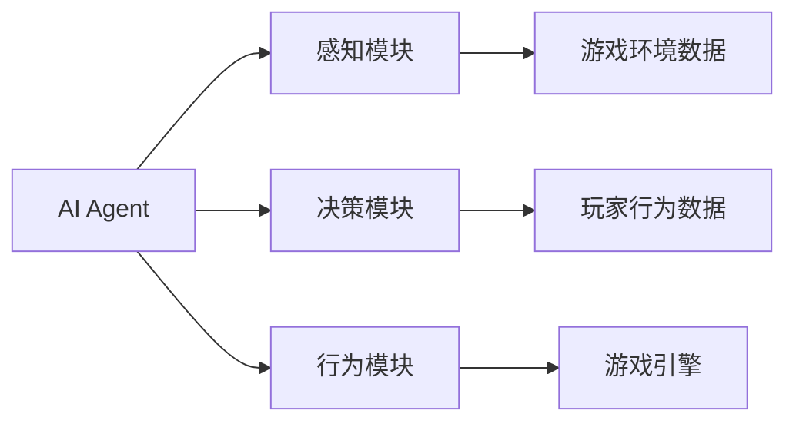
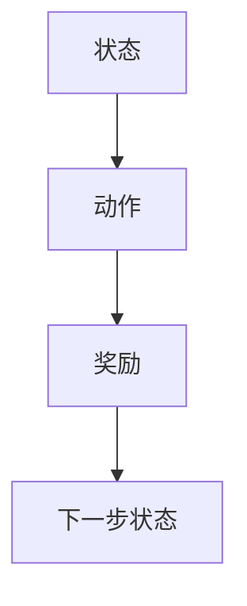
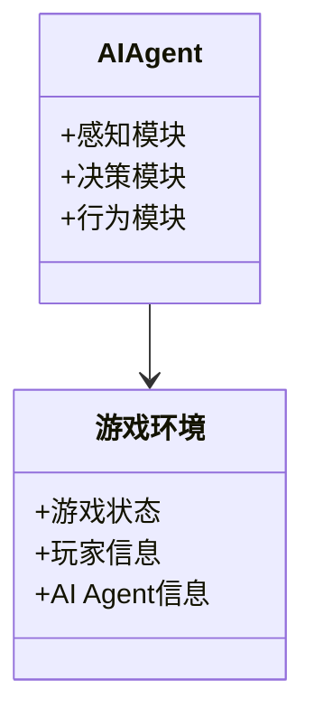
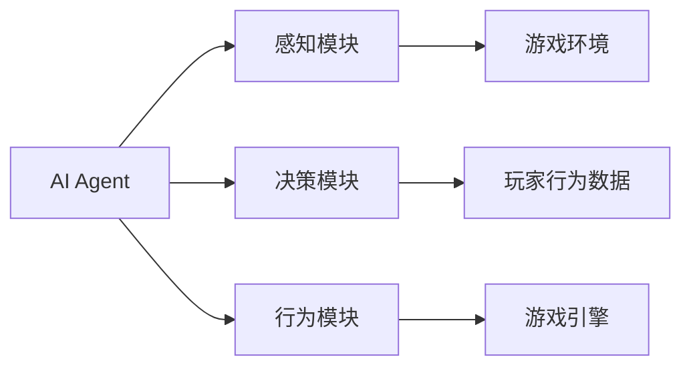
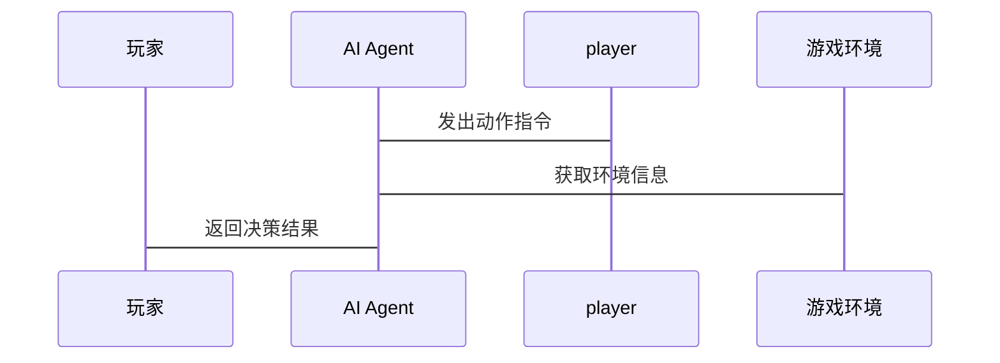

                 


# AI Agent在游戏开发中的创新应用

> 关键词：AI Agent, 游戏开发, 人工智能, 强化学习, 多智能体协作, 行为树, 状态机

> 摘要：本文将详细探讨AI Agent在游戏开发中的创新应用，从基本概念到核心算法，再到系统设计和项目实战，全面解析AI Agent如何提升游戏体验和开发效率。通过具体案例分析和代码实现，深入浅出地展示AI Agent在游戏中的实际应用，帮助读者掌握AI Agent的核心技术与实践方法。

---

# 第1章: AI Agent的基本概念与背景

## 1.1 AI Agent的定义与特点
### 1.1.1 什么是AI Agent
AI Agent（人工智能代理）是一种能够感知环境、自主决策并执行任务的智能体。它通过接收输入信息，分析处理后输出决策或行为，从而与环境或用户进行交互。

### 1.1.2 AI Agent的核心特点
- **自主性**：能够在没有外部干预的情况下自主运行。
- **反应性**：能够实时感知环境并做出相应的反应。
- **目标导向性**：具备明确的目标，并根据目标调整行为。
- **学习能力**：通过学习提升自身的决策能力和行为效率。

### 1.1.3 AI Agent与传统游戏AI的区别
传统游戏AI通常基于简单的规则和脚本实现，而AI Agent具备更强的自主性和适应性，能够根据实时信息动态调整策略。

---

## 1.2 游戏开发中的AI Agent应用背景
### 1.2.1 游戏行业的发展现状
现代游戏越来越注重玩家体验，AI技术的应用可以帮助实现更智能、更个性化的游戏内容。

### 1.2.2 AI技术在游戏开发中的潜力
- 提升NPC（非玩家角色）的智能性，使其行为更加自然和多样化。
- 实现多智能体协作，增强游戏的复杂性和可玩性。
- 通过机器学习优化游戏平衡和玩家体验。

### 1.2.3 当前游戏AI的主要挑战
- **计算资源限制**：复杂的AI算法可能对硬件性能要求较高。
- **行为预测难度**：如何准确预测玩家行为并做出实时反馈是一个难题。
- **多智能体协作**：在多人在线游戏中，多个AI Agent的协作需要高效的通信和协调机制。

---

## 1.3 本章小结
本章介绍了AI Agent的基本概念和特点，并探讨了其在游戏开发中的应用背景及面临的挑战。通过理解这些内容，读者可以为后续的技术分析和应用实践打下基础。

---

# 第2章: AI Agent的核心模块分析

## 2.1 AI Agent的感知模块
### 2.1.1 感知模块的功能与实现
感知模块负责接收游戏环境中的各种信息，如玩家位置、动作、游戏状态等，并进行初步的分析和处理。

### 2.1.2 常见的感知算法
- **基于规则的感知**：通过预定义的规则来判断环境信息。
- **基于机器学习的感知**：利用深度学习模型（如CNN）提取环境特征。

### 2.1.3 感知模块的优化技巧
- 使用高效的特征提取方法，减少计算量。
- 通过数据增强技术提升感知模型的泛化能力。

---

## 2.2 AI Agent的决策模块
### 2.2.1 决策模块的分类
- **基于规则的决策**：根据预定义的规则做出决策。
- **基于机器学习的决策**：通过训练模型实现决策。

### 2.2.2 基于规则的决策算法
- **状态机**：通过状态转移实现不同的行为模式。
- **行为树**：通过节点和条件判断实现复杂的决策逻辑。

### 2.2.3 基于机器学习的决策算法
- **强化学习**：通过奖励机制训练AI Agent做出最优决策。
- **监督学习**：基于标注数据训练分类器进行决策。

---

## 2.3 AI Agent的行为模块
### 2.3.1 行为树的构建与优化
行为树是一种树状结构，通过节点的条件判断和任务执行来实现复杂的行为逻辑。优化行为树的关键在于减少重复判断和提高执行效率。

### 2.3.2 基于状态机的行为管理
状态机通过状态之间的转移实现行为的切换，适用于需要明确状态切换的场景。

### 2.3.3 多智能体协作的行为设计
在多人在线游戏中，多个AI Agent需要通过通信和协调实现协作行为。常用的方法包括：
- **分布式决策**：每个智能体独立做出决策，通过通信实现协作。
- **集中式控制**：由一个中央智能体协调其他智能体的行为。

---

## 2.4 核心模块的属性特征对比表
| 模块         | 属性         | 特征                                       |
|--------------|--------------|--------------------------------------------|
| 感知模块     | 数据来源     | 游戏环境数据、玩家行为数据                 |
| 决策模块     | 算法类型     | 基于规则、基于机器学习                   |
| 行为模块     | 执行方式     | 行为树、状态机                             |

---

## 2.5 AI Agent的实体关系图


---

## 2.6 本章小结
本章详细分析了AI Agent的核心模块，包括感知、决策和行为模块的功能、实现方式和优化技巧，并通过对比表和实体关系图展示了各个模块之间的关系。

---

# 第3章: AI Agent的算法原理与数学模型

## 3.1 强化学习算法
### 3.1.1 强化学习的基本原理
强化学习是一种通过试错学习的算法，通过与环境的交互获得奖励，从而优化决策策略。

### 3.1.2 强化学习的数学模型


数学公式：
$$ R = r_1 + r_2 + \dots + r_n $$
其中，$R$ 表示总奖励，$r_i$ 表示每个动作的奖励。

### 3.1.3 强化学习的实现步骤
1. 初始化策略参数 $\theta$。
2. 在环境中执行动作，获得奖励。
3. 更新策略参数，最大化期望奖励。

---

## 3.2 状态空间搜索算法
### 3.2.1 状态空间搜索的基本原理
通过搜索游戏的状态空间，找到最优路径或最优解。

### 3.2.2 状态空间搜索的数学模型
$$ S = \{s_1, s_2, \dots, s_n\} $$
其中，$S$ 表示状态空间，$s_i$ 表示每个状态。

---

## 3.3 蒙特卡洛树搜索算法
### 3.3.1 蒙特卡洛树搜索的基本原理
通过构建一棵树，评估每个动作的期望值，选择最优动作。

### 3.3.2 蒙特卡洛树搜索的数学模型
$$ Q(s, a) = \frac{1}{n_a} \sum_{i=1}^{n_a} r_i $$
其中，$Q(s, a)$ 表示状态 $s$ 下动作 $a$ 的期望值，$n_a$ 表示动作 $a$ 的尝试次数，$r_i$ 表示每次尝试的奖励。

---

## 3.4 本章小结
本章介绍了几种常用的AI Agent算法，包括强化学习、状态空间搜索和蒙特卡洛树搜索，并通过数学模型和公式展示了它们的实现原理。

---

# 第4章: AI Agent的系统分析与架构设计

## 4.1 游戏开发场景介绍
在多人在线游戏中，AI Agent需要与玩家和其他AI Agent进行实时交互，实现复杂的协作和对抗行为。

---

## 4.2 系统功能设计
### 4.2.1 领域模型设计


### 4.2.2 系统架构设计


### 4.2.3 接口设计
- **输入接口**：接收游戏环境和玩家行为数据。
- **输出接口**：输出AI Agent的决策和行为指令。

---

## 4.3 系统交互设计


---

## 4.4 本章小结
本章通过系统分析和架构设计，展示了AI Agent在游戏开发中的具体应用场景和实现方式。

---

# 第5章: AI Agent的项目实战

## 5.1 环境安装与配置
### 5.1.1 开发工具安装
- Python
- PyTorch（深度学习框架）
- Unity（游戏引擎）

### 5.1.2 依赖库安装
```bash
pip install numpy torch matplotlib
```

---

## 5.2 核心代码实现
### 5.2.1 强化学习代码示例
```python
import torch
import numpy as np

class AIAgent:
    def __init__(self, state_space, action_space):
        self.state_space = state_space
        self.action_space = action_space
        self.theta = torch.randn(state_space, action_space)

    def act(self, state):
        return torch.argmax(self.theta[state, :]).item()

# 初始化AI Agent
state_space = 10
action_space = 4
agent = AIAgent(state_space, action_space)

# 训练过程
for episode in range(1000):
    state = np.random.randint(0, state_space)
    action = agent.act(state)
    reward = np.random.randn()  # 假设奖励是随机的
    # 更新参数
    agent.theta[state, action] += reward
```

### 5.2.2 行为树代码示例
```python
class BehaviorTree:
    def __init__(self):
        self.root = self.create_tree()

    def create_tree(self):
        return {
            'name': 'Main',
            'type': 'selector',
            'children': [
                {
                    'name': 'CheckTarget',
                    'type': 'task',
                    'function': lambda: self.has_target()
                },
                {
                    'name': 'MoveToTarget',
                    'type': 'task',
                    'function': lambda: self.move_to_target()
                }
            ]
        }

    def has_target(self):
        return hasattr(self, 'target')

    def move_to_target(self):
        # 实现移动逻辑
        pass
```

---

## 5.3 代码应用解读与分析
### 5.3.1 强化学习代码解读
- 初始化AI Agent时，随机生成策略参数 $\theta$。
- 在每个 episode 中，AI Agent根据当前状态选择动作。
- 通过奖励更新策略参数，实现强化学习。

### 5.3.2 行为树代码解读
- 行为树通过选择器节点选择第一个成功的子任务。
- 每个任务节点都有一个函数判断是否可以执行。

---

## 5.4 实际案例分析
### 5.4.1 案例一：RPG游戏中的NPC行为
- NPC根据玩家行为动态调整巡逻路线。
- 使用强化学习训练NPC的战斗策略。

### 5.4.2 案例二：RTS游戏中的多智能体协作
- 多个AI Agent协同完成资源采集、建筑建设等任务。
- 使用分布式决策算法实现协作。

---

## 5.5 项目小结
通过实际案例分析，展示了AI Agent在不同类型游戏中的应用，帮助读者理解理论知识的实际应用。

---

# 第6章: 最佳实践与注意事项

## 6.1 最佳实践
- **模块化设计**：将感知、决策、行为模块独立设计，便于维护和扩展。
- **性能优化**：在保证功能的前提下，尽可能优化算法复杂度和计算效率。
- **数据管理**：合理管理游戏数据，确保数据的准确性和实时性。

---

## 6.2 注意事项
- **算法选择**：根据具体场景选择合适的算法，避免盲目追求复杂算法。
- **测试与调试**：通过大量测试确保AI Agent的行为符合预期。
- **团队协作**：AI Agent的开发需要跨团队协作，确保各个模块的协调一致。

---

## 6.3 拓展阅读
- 《Game AI: Theory and Practice》
- 《Multi-Agent Systems: Algorithm and Applications》
- 《Deep Reinforcement Learning for Games》

---

## 6.4 本章小结
本章总结了AI Agent开发中的最佳实践和注意事项，并提供了拓展阅读的方向，帮助读者进一步深入学习。

---

# 附录: AI Agent开发工具与资源

## 附录A: 开发工具推荐
- **Python**：适合快速 prototyping 和实验。
- **Unity**：强大的游戏引擎，支持多种AI算法实现。
- **PyTorch**：深度学习框架，适合实现复杂的强化学习算法。

---

## 附录B: 开发资源推荐
- 官方文档：[Unity AI & Scripting](https://unity.com/)
- 在线课程：[AI in Games](https://www.udemy.com/course/ai-in-games/)
- 开源项目：[OpenAI Gym](https://gym.openai.com/)

---

## 附录C: 代码示例汇总
- 强化学习代码示例
- 行为树代码示例
- 状态机代码示例

---

## 附录D: 术语表
- **AI Agent**：人工智能代理。
- **强化学习**：通过试错学习的算法。
- **行为树**：树状结构，用于实现复杂的决策逻辑。

---

## 附录E: 参考文献
1. Russell, S., & Norvig, P. (2010). Artificial Intelligence: A Modern Approach.
2. Sutton, R. S., & Barto, A. G. (2018). Reinforcement Learning: An Introduction.
3. 多智能体协作相关论文和书籍。

---

## 附录F: 致谢
感谢所有参与本书编写和支持的团队成员和合作伙伴。

---

# 附录G: 索引

---

通过以上目录结构，可以系统地了解AI Agent在游戏开发中的创新应用，从基础理论到实际应用，帮助读者全面掌握相关知识和技能。

