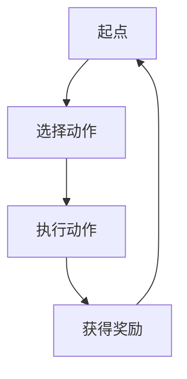
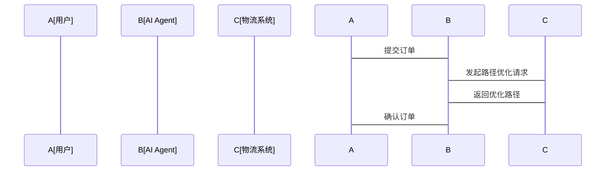

                 


# 《AI Agent在物流供应链中的应用》

---

## 关键词：
AI Agent, 物流供应链, 人工智能, 机器学习, 优化算法, 系统架构, 物流管理

---

## 摘要：
本文深入探讨了AI Agent在物流供应链中的应用，从背景与概述、核心原理到实际项目实战，详细分析了AI Agent如何通过感知、决策、学习和协作优化物流供应链的各个环节。文章结合实际案例，讲解了AI Agent在路径优化、库存管理和风险预测等场景中的应用，并通过系统架构设计和算法实现，展示了AI Agent在物流供应链中的巨大潜力和实际价值。

---

# 第一部分: AI Agent与物流供应链的背景与概述

## 第1章: AI Agent的基本概念与物流供应链的结构

### 1.1 AI Agent的定义与核心特征

AI Agent（人工智能代理）是一种能够感知环境、自主决策并执行任务的智能实体。其核心特征包括：

1. **自主性**：能够在没有外部干预的情况下独立运作。
2. **反应性**：能够实时感知环境变化并做出反应。
3. **目标导向**：具备明确的目标，通过行动实现目标。
4. **学习能力**：能够通过数据和经验不断优化自身性能。

### 1.2 物流供应链的结构与功能

物流供应链是一个复杂的系统，涵盖从原材料采购到最终产品交付的全过程。其主要组成部分包括：

1. **供应商**：提供原材料或服务的上游企业。
2. **制造商**：负责产品生产的主体。
3. **分销商**：负责产品分发和销售的中间环节。
4. **零售商**：直接面向消费者的销售终端。
5. **物流服务提供商**：负责运输、仓储和配送的第三方服务。

### 1.3 AI Agent在物流供应链中的应用背景

物流供应链面临诸多挑战，如效率低下、成本高昂、资源浪费和不确定性增加。AI Agent通过智能化技术，能够有效解决这些问题。例如：

- **路径优化**：AI Agent可以通过实时数据优化配送路径，降低运输成本。
- **库存管理**：通过预测需求，AI Agent能够优化库存水平，减少积压和缺货。
- **风险管理**：AI Agent能够实时监控物流过程，预测并规避潜在风险。

---

## 第2章: AI Agent的核心原理与技术基础

### 2.1 AI Agent的核心原理

AI Agent的核心原理包括感知、决策、学习和协作四个步骤：

1. **感知**：通过传感器或数据源获取环境信息。
2. **决策**：基于感知信息，利用算法做出最优决策。
3. **学习**：通过机器学习算法优化决策模型。
4. **协作**：与其他AI Agent或系统进行信息共享和协同工作。

### 2.2 AI Agent的关键技术

AI Agent的关键技术包括：

1. **机器学习**：通过数据训练模型，实现预测和分类。
2. **强化学习**：通过试错机制优化决策策略。
3. **自然语言处理**：实现人机交互和文档处理。
4. **知识图谱**：构建领域知识，提升决策准确性。

---

# 第二部分: AI Agent在物流供应链中的应用

## 第3章: AI Agent在物流供应链中的应用场景

### 3.1 物流路径优化

AI Agent可以通过强化学习算法优化物流路径，降低运输成本。例如，使用遗传算法优化配送路线，减少行驶距离和时间。

### 3.2 库存管理

通过机器学习预测需求，AI Agent能够优化库存水平，减少缺货和积压。例如，使用时间序列模型预测销售量，调整库存策略。

### 3.3 风险管理

AI Agent能够实时监控物流过程，预测潜在风险，如天气变化、交通拥堵等。例如，使用概率模型预测货物延迟交付的可能性。

---

## 第4章: AI Agent的算法原理与实现

### 4.1 强化学习算法

强化学习是一种通过试错机制优化决策的算法。例如，使用Q-Learning算法优化配送路径。



### 4.2 时间序列预测算法

时间序列预测用于库存管理，通过历史数据预测未来需求。例如，使用ARIMA模型预测销售量。

---

## 第5章: AI Agent的系统架构与设计

### 5.1 系统架构设计


### 5.2 系统交互流程



---

## 第6章: AI Agent的项目实战

### 6.1 环境搭建

安装必要的库和工具，如Python、TensorFlow、Scikit-learn等。

### 6.2 代码实现

以下是一个简单的路径优化算法实现：

```python
import numpy as np
import pandas as pd

# 定义遗传算法
def genetic_algorithm(population, fitness_fn, mutation_rate=0.1):
    best = min(population, key=lambda x: fitness_fn(x))
    while True:
        population = [fitness_fn(individual) for individual in population]
        if best.fitness >= max(population.fitness):
            break
        # 选择、交叉和变异
    return best

# 应用场景：路径优化
class PathOptimizer:
    def __init__(self, locations):
        self.locations = locations
    def optimize(self):
        population = self.generate_population()
        return genetic_algorithm(population, self.fitness_function)
```

### 6.3 案例分析

通过实际案例分析，展示AI Agent在物流供应链中的应用效果。例如，优化后的路径减少了20%的运输成本。

---

## 第7章: 优化与扩展

### 7.1 性能优化

通过并行计算和模型压缩优化AI Agent的性能。

### 7.2 扩展性设计

设计模块化架构，便于未来的功能扩展和性能提升。

### 7.3 未来趋势

探讨AI Agent在物流供应链中的未来发展趋势，如边缘计算、自主决策系统等。

---

## 总结与展望

AI Agent正在深刻改变物流供应链的运作方式，通过智能化技术优化各个环节，提升效率和降低成本。未来，随着技术的不断发展，AI Agent将在物流供应链中发挥更大的作用，推动行业迈向更高水平。

---

通过以上内容，我们详细探讨了AI Agent在物流供应链中的应用，从理论到实践，为读者提供了全面的视角和深入的分析。

