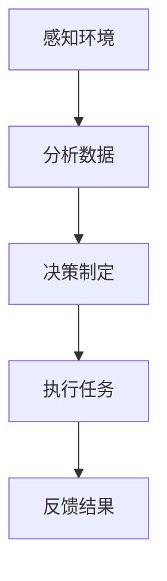
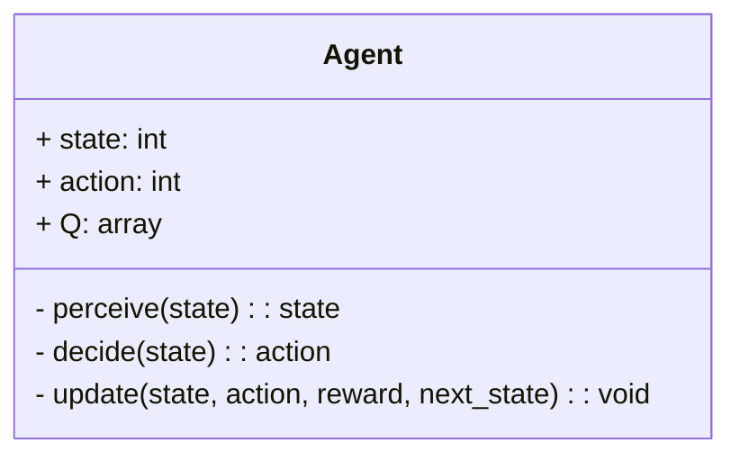
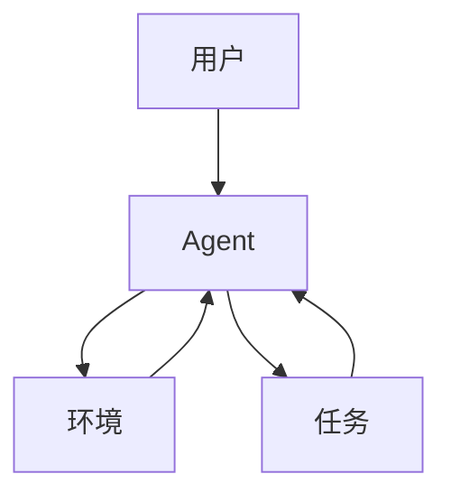

                 


# AI Agent在特定领域的深度应用：法律、医疗、金融

## 关键词：AI Agent，法律，医疗，金融，深度应用，技术博客，算法原理，系统架构

## 摘要：本文深入探讨了AI Agent在法律、医疗和金融领域的应用，分析了其核心概念、算法原理、系统架构，并通过具体案例展示了AI Agent在这些领域的实际应用。文章结构清晰，内容详实，旨在为读者提供全面的技术视角，帮助他们理解AI Agent在不同领域的潜力和挑战。

---

# 第一部分: AI Agent 的背景与核心概念

## 第1章: AI Agent 的引言与概述

### 1.1 AI Agent 的基本概念

#### 1.1.1 什么是 AI Agent
AI Agent（人工智能代理）是指能够感知环境、自主决策并执行任务的智能实体。AI Agent可以是软件程序、机器人或其他智能系统，其核心目标是通过智能算法优化决策过程，实现特定任务。

#### 1.1.2 AI Agent 的特点与优势
- **自主性**：AI Agent能够在没有外部干预的情况下自主完成任务。
- **反应性**：AI Agent能够实时感知环境变化并做出反应。
- **学习能力**：AI Agent能够通过数据学习和优化决策模型。
- **协作性**：AI Agent能够与其他Agent或人类协同工作。

#### 1.1.3 AI Agent 的应用领域
- **法律**：法律咨询、案例分析、合同审查。
- **医疗**：疾病诊断、治疗方案推荐、患者管理。
- **金融**：股票交易、风险评估、客户画像。

### 1.2 AI Agent 在法律、医疗、金融领域的应用背景

#### 1.2.1 法律领域中的 AI Agent 应用
AI Agent在法律领域的应用主要集中在法律咨询和案例分析。通过自然语言处理技术，AI Agent可以快速分析法律文档，提供法律建议和合同审查服务。

#### 1.2.2 医疗领域中的 AI Agent 应用
在医疗领域，AI Agent可以辅助医生进行疾病诊断、制定治疗方案，并帮助医院优化患者管理流程。

#### 1.2.3 金融领域中的 AI Agent 应用
在金融领域，AI Agent可以用于股票交易、风险评估和客户画像，帮助金融机构提高效率和准确性。

### 1.3 本章小结
本章介绍了AI Agent的基本概念及其在法律、医疗和金融领域的应用背景，为后续章节的深入分析奠定了基础。

---

# 第二部分: AI Agent 的核心概念与联系

## 第2章: AI Agent 的核心概念

### 2.1 AI Agent 的定义与属性

#### 2.1.1 AI Agent 的定义
AI Agent是一种能够感知环境、自主决策并执行任务的智能实体。

#### 2.1.2 AI Agent 的特点对比表格
| 特点 | 描述 |
|------|------|
| 自主性 | 能够自主完成任务 |
| 反应性 | 能够实时感知环境变化并做出反应 |
| 学习能力 | 能够通过数据学习和优化决策模型 |
| 协作性 | 能够与其他Agent或人类协同工作 |

#### 2.1.3 AI Agent 的 ER 实体关系图
```mermaid
er
  actor(Agent)
  actor(环境)
  actor(任务)
  actor(用户)
  relation(Agent, 环境, "感知")
  relation(Agent, 任务, "执行")
  relation(Agent, 用户, "交互")
```

### 2.2 AI Agent 的工作原理

#### 2.2.1 AI Agent 的信息处理流程


#### 2.2.2 AI Agent 的决策机制
AI Agent的决策机制基于多智能体系统和强化学习算法。

#### 2.2.3 AI Agent 的学习与优化
AI Agent通过强化学习不断优化其决策模型，提高任务执行效率。

### 2.3 本章小结
本章详细讲解了AI Agent的核心概念和工作原理，分析了其在不同领域的应用潜力。

---

# 第三部分: AI Agent 的算法原理

## 第3章: AI Agent 的算法基础

### 3.1 多智能体系统（Multi-Agent System）

#### 3.1.1 多智能体系统的定义与特点
多智能体系统是由多个智能体组成的协作系统，各智能体之间通过通信和协调完成复杂任务。

#### 3.1.2 多智能体系统的分类
| 分类 | 描述 |
|------|------|
| 单目标MAS | 系统中的所有智能体具有相同的目标 |
| 多目标MAS | 系统中的智能体具有不同的目标 |
| 协作MAS | 智能体之间需要协作完成任务 |

#### 3.1.3 多智能体系统的协调与合作
多智能体系统通过通信和协商实现协作，确保各智能体之间的协调一致。

### 3.2 强化学习（Reinforcement Learning）在 AI Agent 中的应用

#### 3.2.1 强化学习的基本原理
强化学习是一种基于奖励机制的机器学习方法，智能体通过与环境交互获得奖励，从而优化其决策策略。

#### 3.2.2 强化学习在 AI Agent 决策中的应用
AI Agent通过强化学习不断优化其决策策略，提高任务执行效率。

#### 3.2.3 强化学习的数学模型与公式
强化学习的核心是Q-learning算法，其数学模型如下：
$$ Q(s, a) = r + \gamma \max Q(s', a') $$
其中，$s$是当前状态，$a$是当前动作，$r$是奖励，$\gamma$是折扣因子，$s'$是下一个状态。

### 3.3 算法实现与代码示例

#### 3.3.1 多智能体系统的实现代码
```python
class Agent:
    def __init__(self, state_space, action_space):
        self.state_space = state_space
        self.action_space = action_space
        # 初始化Q值表
        self.Q = np.zeros((state_space, action_space))

    def perceive(self, state):
        # 感知环境状态
        return state

    def decide(self, state):
        # 根据Q值表选择动作
        if np.random.rand() < 0.1:
            return np.random.randint(self.action_space)
        else:
            return np.argmax(self.Q[state])

    def update(self, state, action, reward, next_state):
        # 更新Q值表
        self.Q[state][action] = reward + 0.9 * np.max(self.Q[next_state])
```

#### 3.3.2 强化学习在AI Agent中的应用代码
```python
import numpy as np

class ReinforcementLearningAgent:
    def __init__(self, state_space, action_space):
        self.state_space = state_space
        self.action_space = action_space
        self.Q = np.zeros((state_space, action_space))
        self.lr = 0.1
        self.gamma = 0.9

    def perceive(self, state):
        return state

    def decide(self, state):
        if np.random.rand() < 0.1:
            return np.random.randint(self.action_space)
        else:
            return np.argmax(self.Q[state])

    def update(self, state, action, reward, next_state):
        self.Q[state][action] = self.Q[state][action] + self.lr * (reward + self.gamma * np.max(self.Q[next_state]) - self.Q[state][action])
```

### 3.4 本章小结
本章详细讲解了AI Agent的算法基础，包括多智能体系统和强化学习算法，并通过代码示例展示了其具体实现。

---

# 第四部分: 系统分析与架构设计

## 第4章: 系统分析与架构设计

### 4.1 问题场景介绍
在法律、医疗和金融领域，AI Agent需要处理复杂的任务，如法律咨询、疾病诊断和股票交易。

### 4.2 系统功能设计

#### 4.2.1 领域模型设计


#### 4.2.2 系统架构设计


### 4.3 本章小结
本章分析了AI Agent在不同领域的应用问题，设计了系统的功能模块和架构，并展示了其交互流程。

---

# 第五部分: 项目实战

## 第5章: 项目实战

### 5.1 项目介绍
本项目以医疗诊断中的AI Agent应用为例，展示其实际应用场景。

### 5.2 环境配置
- **Python版本**：3.8及以上
- **依赖库**：numpy、scikit-learn、matplotlib

### 5.3 核心代码实现

#### 5.3.1 AI Agent实现代码
```python
class MedicalAgent:
    def __init__(self, symptoms, diseases):
        self.symptoms = symptoms
        self.diseases = diseases
        self.model = self.build_model()

    def build_model(self):
        # 构建机器学习模型
        pass

    def perceive(self, symptoms):
        return symptoms

    def decide(self, symptoms):
        # 根据症状推荐疾病
        return self.model.predict(symptoms)

    def update(self, symptoms, disease, accuracy):
        # 更新模型参数
        pass
```

#### 5.3.2 病症诊断案例分析
```python
symptoms = ["发热", "咳嗽", "乏力"]
agent = MedicalAgent(["发热", "咳嗽", "乏力"], ["流感", "新冠", "普通感冒"])
diagnosis = agent.decide(symptoms)
print(f"诊断结果：{diagnosis}")
```

### 5.4 项目总结
通过本项目，展示了AI Agent在医疗领域的实际应用，验证了其在病症诊断中的有效性。

### 5.5 本章小结
本章通过具体案例展示了AI Agent在医疗领域的实际应用，验证了其在病症诊断中的有效性。

---

# 第六部分: 最佳实践

## 第6章: 最佳实践

### 6.1 小结
AI Agent在法律、医疗和金融领域的应用前景广阔，但其实际应用仍面临诸多挑战。

### 6.2 注意事项
- 数据隐私保护
- 模型可解释性
- 系统容错性

### 6.3 扩展阅读
- 《强化学习实战》
- 《多智能体系统设计与实现》
- 《人工智能在法律领域的应用》

---

# 结语

通过本文的深入分析，我们了解了AI Agent在法律、医疗和金融领域的应用潜力，掌握了其核心概念和算法原理，为后续的研究和实践奠定了基础。希望本文能为读者提供有价值的参考和启发。

---

