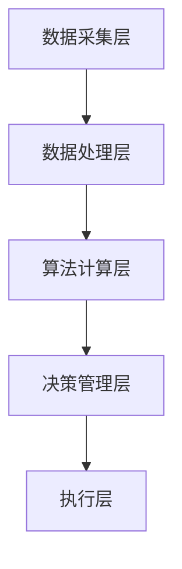
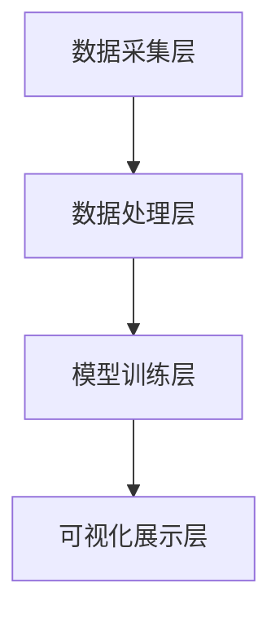

                 


# AI Agent在环境保护中的应用

## 关键词：AI Agent, 环境保护, 人工智能, 算法原理, 系统架构

## 摘要：  
AI Agent（人工智能代理）作为一种智能化的工具，正在逐渐应用于环境保护领域。通过AI Agent，我们可以实现环境数据的实时监测、污染源的智能识别、资源的优化配置以及环境问题的预测与解决方案的自动生成。本文将从AI Agent的核心概念、算法原理、系统架构到实际应用案例，全面探讨AI Agent在环境保护中的潜力与应用价值。

---

## 第一部分: AI Agent在环境保护中的应用概述

### 第1章: AI Agent在环境保护中的作用

#### 1.1 环境保护问题背景
环境保护是全球关注的焦点，当前面临的主要问题包括空气污染、水污染、资源枯竭、气候变化等。这些问题不仅威胁生态系统的平衡，还对人类健康和经济发展造成严重的影响。传统的环境保护方法依赖于人工监测和经验判断，效率低下且难以应对复杂的环境问题。

**AI Agent的作用**：  
AI Agent通过自动化感知、分析和决策，能够实时监测环境数据，预测环境变化趋势，并提出最优解决方案。例如，AI Agent可以用于空气质量预测、污染源追踪、资源优化配置等领域，帮助我们更高效地解决环境保护问题。

#### 1.2 AI Agent的基本概念
AI Agent是一种能够感知环境、自主决策并采取行动的智能实体。它具备以下核心属性：
- **自主性**：能够在没有外部干预的情况下独立运行。
- **反应性**：能够实时感知环境变化并做出响应。
- **学习能力**：通过数据和经验不断优化自身的算法和决策能力。
- **协作性**：能够与其他AI Agent或人类协同工作，共同完成复杂的任务。

#### 1.3 AI Agent在环境保护中的应用前景
AI Agent在环境保护中的潜力巨大。例如：
- **污染监测与预警**：通过AI Agent实时监测空气、水质等环境数据，提前预警潜在的污染事件。
- **资源优化配置**：AI Agent可以通过数据分析，优化水、电、能源等资源的分配，减少浪费。
- **环境问题预测**：通过历史数据和机器学习模型，AI Agent可以预测未来的环境变化趋势，帮助制定应对策略。

**企业采用AI Agent的优势**：  
- 提高环境监测的效率和准确性。
- 降低环境治理的成本。
- 实现环境数据的智能化分析与决策。

**挑战与机遇**：  
尽管AI Agent在环境保护中的应用前景广阔，但仍然面临数据隐私、算法复杂性、技术成本高等挑战。然而，随着技术的不断进步，这些挑战将逐步被克服，AI Agent将在环境保护领域发挥更大的作用。

---

## 第二部分: AI Agent的核心概念与系统架构

### 第2章: AI Agent的核心原理

#### 2.1 AI Agent的感知与决策机制
AI Agent的核心功能包括感知、决策和行动三个模块。

**感知模块**：  
感知模块通过传感器或其他数据源获取环境信息，并将其转化为可分析的数据。例如，空气质量传感器可以收集PM2.5、二氧化硫等污染物的数据。

**决策模块**：  
决策模块基于感知到的数据，结合预设的目标和约束条件，生成最优的决策方案。例如，当空气质量指数超过预警阈值时，决策模块可以建议采取交通限行措施。

**行动模块**：  
行动模块根据决策模块的指令，执行具体的行动。例如，启动洒水装置来降低空气中的颗粒物浓度。

#### 2.2 AI Agent的系统架构设计
AI Agent的系统架构通常包括以下几个部分：
- **数据采集层**：负责收集环境数据，例如传感器数据。
- **数据处理层**：对收集到的数据进行清洗、转换和存储。
- **算法计算层**：利用机器学习、深度学习等算法对数据进行分析和处理。
- **决策管理层**：生成决策方案并输出指令。
- **执行层**：根据指令执行具体的行动。

**系统架构图**：


#### 2.3 AI Agent的交互与反馈机制
AI Agent需要与人类或其他系统进行交互，以确保决策的准确性和可解释性。

**人机交互设计**：  
- 提供直观的用户界面，方便用户与AI Agent交互。
- 支持自然语言处理，用户可以通过语音或文本与AI Agent进行对话。

**反馈机制**：  
- AI Agent需要根据环境反馈调整自身的决策策略。
- 用户可以通过反馈对AI Agent的决策进行干预或优化。

---

## 第三部分: AI Agent的算法原理与数学模型

### 第3章: AI Agent的感知算法

#### 3.1 感知算法的数学模型
感知算法的核心是将环境数据转化为有意义的信息。常用的感知算法包括：
- **回归分析**：用于预测环境变量的变化趋势。
- **分类算法**：用于将环境数据分类，例如将空气质量分为“良好”、“中等”、“差”三个类别。
- **聚类分析**：用于发现环境数据中的隐藏模式。

**数学公式**：  
例如，线性回归模型可以表示为：
$$ y = \beta_0 + \beta_1 x + \epsilon $$
其中，$y$ 是目标变量，$x$ 是自变量，$\beta_0$ 和 $\beta_1$ 是回归系数，$\epsilon$ 是误差项。

#### 3.2 感知算法的实现代码
以下是一个简单的空气质量预测模型的Python代码示例：
```python
import pandas as pd
from sklearn.linear_model import LinearRegression

# 加载数据
data = pd.read_csv('air_quality.csv')

# 分离特征和目标变量
X = data[['PM2.5', 'SO2']]
y = data['AQI']

# 训练模型
model = LinearRegression()
model.fit(X, y)

# 预测
new_data = [[50, 20]]
print(model.predict(new_data))
```

#### 3.3 感知算法的案例分析
假设我们有一个空气质量监测系统，收集了多个城市的PM2.5和SO2数据，目标是预测AQI（空气质量指数）。通过线性回归模型，我们可以训练出一个模型，并对新的数据进行预测。

---

### 第4章: AI Agent的决策算法

#### 4.1 决策算法的数学模型
决策算法的目标是根据感知到的数据，生成最优的决策方案。常用的决策算法包括：
- **随机森林**：用于分类和回归问题。
- **支持向量机（SVM）**：用于分类和回归问题。
- **强化学习**：通过试错方式优化决策策略。

**数学公式**：  
例如，SVM的分类问题可以表示为：
$$ \text{minimize } \frac{1}{2} \sum_{i=1}^n \omega_i^2 + C \sum_{i=1}^n \xi_i $$
$$ \text{subject to } y_i (w \cdot x_i + b) \geq 1 - \xi_i, \xi_i \geq 0 $$

#### 4.2 决策算法的实现代码
以下是一个简单的决策树分类模型的Python代码示例：
```python
from sklearn.tree import DecisionTreeClassifier

# 加载数据
data = pd.read_csv('environment_data.csv')

# 分离特征和目标变量
X = data[['温度', '湿度', '风速']]
y = data['类别']

# 训练模型
model = DecisionTreeClassifier()
model.fit(X, y)

# 预测
new_data = [[25, 60, 5]]
print(model.predict(new_data))
```

#### 4.3 决策算法的案例分析
假设我们有一个环境数据集，包含温度、湿度、风速等特征变量，目标是预测空气质量类别。通过决策树模型，我们可以训练出一个分类器，并对新的数据进行分类预测。

---

## 第四部分: 项目实战与最佳实践

### 第5章: 项目实战

#### 5.1 项目背景与需求分析
项目背景：某城市面临严重的空气污染问题，希望通过AI Agent实现空气质量的实时监测和预测。

项目需求：
- 实时采集空气质量和气象数据。
- 使用机器学习算法预测空气质量指数。
- 提供可视化界面，方便用户查看预测结果。

#### 5.2 系统设计与实现
**系统功能设计**：
- 数据采集：通过传感器获取PM2.5、SO2、温度、湿度等数据。
- 数据处理：对数据进行清洗和存储。
- 模型训练：使用机器学习算法训练空气质量预测模型。
- 可视化展示：将预测结果以图表形式展示。

**系统架构图**：


#### 5.3 项目测试与优化
- 测试数据的准确性：确保传感器数据的采集和处理无误。
- 模型评估：通过交叉验证评估模型的准确率和召回率。
- 系统优化：根据测试结果优化算法和系统性能。

#### 5.4 项目总结与经验分享
通过该项目，我们成功实现了空气质量的实时监测和预测。关键经验包括：
- 数据预处理是模型训练的基础，需要高度重视。
- 选择合适的算法和模型参数可以显著提高预测精度。
- 系统的可扩展性和可维护性是项目成功的重要保障。

---

### 第6章: 最佳实践与注意事项

#### 6.1 最佳实践
1. **数据质量管理**：确保数据的准确性和完整性。
2. **算法选择**：根据具体问题选择合适的算法，避免盲目追求复杂模型。
3. **系统集成**：注重系统各模块的协同工作，确保整体性能最优。
4. **用户体验**：提供直观易用的交互界面，方便用户与AI Agent进行交互。

#### 6.2 注意事项
1. **数据隐私**：在处理环境数据时，需要注意数据隐私保护，避免泄露敏感信息。
2. **算法复杂性**：复杂的算法可能导致系统运行效率低下，需要在准确性和效率之间找到平衡。
3. **技术成本**：AI Agent的开发和部署需要较高的技术和资金投入，企业需要充分评估自身能力。

#### 6.3 拓展阅读
1. 《机器学习实战》——周志华
2. 《深度学习》——Ian Goodfellow
3. 《Python机器学习》——Andreas Müller

---

通过本文的详细讲解，我们全面探讨了AI Agent在环境保护中的应用，从理论基础到实际案例，为读者提供了丰富的知识和实践指导。希望本文能够为环境保护领域的技术人员和研究人员提供有价值的参考。

