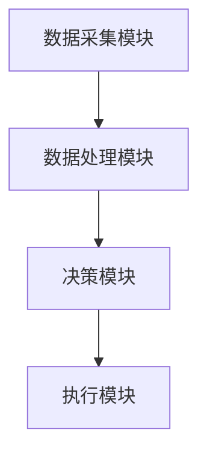

                 


# AI Agent在环境监测与保护中的角色

## 关键词
AI Agent, 环境监测, 人工智能, 智能决策, 数据分析

## 摘要
AI Agent（人工智能代理）在环境监测与保护中发挥着越来越重要的作用。通过感知、决策和执行机制，AI Agent能够实时分析环境数据，识别潜在问题，并采取相应措施，从而提高环境监测的效率和准确性。本文详细探讨了AI Agent的核心原理、应用场景、系统架构设计以及实际案例，旨在为读者提供全面的了解和深入的分析。

---

# 第1章: AI Agent与环境监测概述

## 1.1 AI Agent的基本概念

### 1.1.1 AI Agent的定义与特点
AI Agent是一种能够感知环境、做出决策并采取行动的智能实体。与传统算法不同，AI Agent具有主动性、目标性和适应性，能够根据环境变化动态调整行为。

- **主动性**：AI Agent不需要外部干预，能够主动执行任务。
- **目标性**：AI Agent的行为基于明确的目标，能够优化决策以实现目标。
- **适应性**：AI Agent能够根据环境反馈调整策略，适应复杂多变的环境。

### 1.1.2 AI Agent的核心原理
AI Agent的工作流程包括感知、决策和执行三个阶段：

1. **感知**：通过传感器或数据源获取环境信息。
2. **决策**：基于感知数据，利用算法制定最优行动方案。
3. **执行**：根据决策结果，采取具体行动。

### 1.1.3 环境监测的基本概念
环境监测是指对环境质量及其变化进行长期、连续的观察和测量。常见的环境监测指标包括空气质量、水质、噪声污染等。

---

## 1.2 AI Agent在环境监测中的作用

### 1.2.1 环境监测的主要问题与挑战
传统的环境监测方法存在以下问题：
- 数据采集成本高。
- 数据分析耗时，难以实时处理。
- 环境问题复杂，需要多学科协同解决。

### 1.2.2 AI Agent在环境监测中的优势
AI Agent能够显著提升环境监测的效率和精度：
- **实时性**：AI Agent可以实时分析数据，快速识别异常。
- **准确性**：通过机器学习算法，AI Agent能够准确预测环境变化。
- **成本低**：AI Agent可以减少人工干预，降低监测成本。

### 1.2.3 AI Agent与传统环境监测方法的对比
| 对比维度 | AI Agent | 传统方法 |
|----------|-----------|-----------|
| 数据处理 | 实时分析   | 事后分析 |
| 精度     | 高         | 中等       |
| 成本     | 低         | 高         |
| 灵活性   | 高         | 低         |

---

# 第2章: AI Agent的核心原理与技术

## 2.1 AI Agent的感知机制

### 2.1.1 数据采集与处理
AI Agent通过传感器（如温度传感器、空气质量传感器）获取环境数据，并将其转化为结构化的数据格式。

**代码示例**：
```python
import pandas as pd
# 读取传感器数据
data = pd.read_csv('environment_data.csv')
# 数据预处理
data = data.dropna()  # 删除缺失值
print(data.head())
```

### 2.1.2 感知模型的构建
感知模型通常采用机器学习算法（如支持向量机、随机森林）对数据进行分类或回归分析。

**数学模型**：
$$
y = w_1x_1 + w_2x_2 + \dots + w_nx_n + b
$$
其中，$y$为预测结果，$x_i$为输入特征，$w_i$为权重，$b$为偏置。

### 2.1.3 感知数据的特征提取
特征提取是将原始数据转换为更有意义的特征，例如将温度、湿度等特征组合成空气质量指数（AQI）。

---

## 2.2 AI Agent的决策机制

### 2.2.1 决策算法的选择与优化
决策算法通常采用强化学习（如Q-learning）或监督学习（如随机森林）。以下是Q-learning算法的伪代码：

```python
def q_learning():
    while True:
        state = get_current_state()
        action = choose_action(state)
        next_state = take_action(state, action)
        reward = get_reward(next_state)
        update_q_value(state, action, reward)
```

### 2.2.2 决策模型的训练与评估
训练数据通常包括历史环境数据和标签（如“正常”或“异常”）。训练完成后，模型可以对新数据进行分类。

**数学模型**：
$$
P(y|x) = \frac{P(x|y)P(y)}{P(x)}
$$
其中，$P(y|x)$为后验概率，$P(x|y)$为似然概率，$P(y)$为先验概率，$P(x)$为边际概率。

### 2.2.3 多目标优化的实现
多目标优化通常采用遗传算法或粒子群优化算法。以下是粒子群优化算法的伪代码：

```python
def particle_swarm_optimization():
    Initialize particle positions and velocities
    While not converged:
        For each particle:
            Update personal best
            Update global best
            Update velocity and position
    Return global best
```

---

## 2.3 AI Agent的执行机制

### 2.3.1 执行策略的设计
执行策略通常基于决策模型的结果，例如当空气质量指数超过阈值时，启动空气净化设备。

### 2.3.2 执行过程的监控与反馈
AI Agent需要实时监控执行结果，并根据反馈调整策略。以下是反馈机制的示意图：


### 2.3.3 执行结果的评估与优化
评估指标通常包括准确率、召回率和F1分数。优化方法包括调整算法参数或引入新的数据。

---

## 2.4 本章小结

---

# 第3章: AI Agent在环境监测中的应用场景

## 3.1 水质监测中的AI Agent应用

### 3.1.1 水质监测的主要指标与数据来源
水质监测的主要指标包括pH值、溶解氧、浊度等。数据来源包括传感器和实验室分析。

### 3.1.2 AI Agent在水质异常检测中的应用
AI Agent可以通过分析历史数据，识别水质异常的模式，并发出警报。

### 3.1.3 AI Agent在水质预测与优化中的应用
AI Agent可以预测未来水质变化，并优化废水处理方案。

---

## 3.2 空气质量监测中的AI Agent应用

### 3.2.1 空气质量监测的主要指标与数据来源
空气质量监测的主要指标包括PM2.5、PM10、SO2等。数据来源包括空气传感器和气象数据。

### 3.2.2 AI Agent在空气质量异常检测中的应用
AI Agent可以通过分析实时数据，识别空气污染事件，并预测污染扩散趋势。

### 3.2.3 AI Agent在空气质量预测与优化中的应用
AI Agent可以优化空气质量模型，并制定减排策略。

---

## 3.3 生态监测中的AI Agent应用

### 3.3.1 生态监测的主要指标与数据来源
生态监测的主要指标包括生物多样性、生态系统的稳定性等。数据来源包括卫星遥感和生态传感器。

### 3.3.2 AI Agent在生态异常检测中的应用
AI Agent可以通过分析生态数据，识别生态退化趋势，并提出保护措施。

### 3.3.3 AI Agent在生态预测与优化中的应用
AI Agent可以预测生态系统的未来状态，并优化生态管理策略。

---

## 3.4 本章小结

---

# 第4章: 系统架构设计与实现

## 4.1 系统整体架构

### 4.1.1 系统模块划分
系统主要模块包括数据采集模块、数据处理模块、决策模块和执行模块。

### 4.1.2 数据流与交互流程
以下是系统数据流的Mermaid图：



### 4.1.3 系统架构的优缺点
- **优点**：模块化设计，便于维护和扩展。
- **缺点**：需要协调各个模块的通信，可能增加系统复杂性。

---

## 4.2 项目实战

### 4.2.1 环境搭建
- 安装Python和相关库（如NumPy、Pandas、Scikit-learn）。
- 配置传感器和数据采集设备。

### 4.2.2 核心代码实现

#### 数据采集模块
```python
import serial

# 读取传感器数据
ser = serial.Serial('COM3', 9600)
data = ser.readline().decode().strip()
print(data)
```

#### 数据处理模块
```python
import pandas as pd

# 数据预处理
data = pd.DataFrame([data])
data = data.apply(lambda x: x.str.strip())
print(data.head())
```

#### 决策模块
```python
from sklearn.ensemble import RandomForestClassifier

# 训练模型
model = RandomForestClassifier()
model.fit(X_train, y_train)
```

#### 执行模块
```python
# 根据决策结果采取行动
if prediction == '异常':
    send_command('启动净化设备')
```

### 4.2.3 案例分析
以空气质量监测为例，假设模型预测PM2.5浓度将超过阈值，AI Agent将启动空气净化设备，并向相关部门发出警报。

---

## 4.3 本章小结

---

# 第5章: 总结与展望

## 5.1 总结
AI Agent在环境监测中的应用显著提升了监测效率和准确性。通过感知、决策和执行机制，AI Agent能够实时分析环境数据，识别潜在问题，并采取相应措施。

## 5.2 展望
未来，AI Agent在环境监测中的应用将更加广泛。随着技术的进步，AI Agent将具备更强的自主学习能力和更高的决策精度。

---

## 5.3 注意事项
- 数据隐私问题需要高度重视。
- 系统设计需要考虑容错性和可扩展性。
- 需要定期更新模型，以应对环境变化。

---

## 5.4 拓展阅读
- 《机器学习实战》
- 《深度学习入门：基于Python》
- 《环境科学导论》

---

通过本文的分析，读者可以全面了解AI Agent在环境监测中的角色和应用，并为实际项目提供参考。

