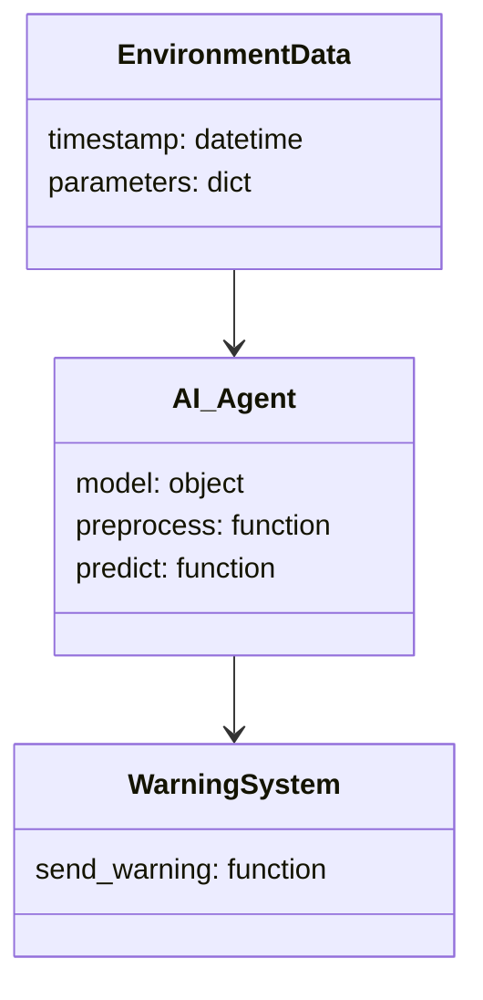

                 


# AI Agent在环境监测与预警中的实践

## 关键词：
- AI Agent
- 环境监测
- 预警系统
- 机器学习
- 实时数据处理

## 摘要：
本文探讨了AI Agent在环境监测与预警中的应用，分析了其核心算法、系统架构及实际案例。通过详细讲解AI Agent的原理、算法实现和系统设计，展示了其在环境监测中的优势，为未来的研究和应用提供了参考。

---

## 第三章 算法原理与实现

### 3.1 算法原理
AI Agent的核心在于实时处理环境数据并做出预测。常用的算法包括时间序列分析和分类模型。

#### 3.1.1 时间序列分析
时间序列分析用于预测环境参数的变化趋势。常用模型有ARIMA和LSTM。

- ARIMA模型：
  $$ ARIMA(p, d, q) $$
  其中，p为自回归阶数，d为差分阶数，q为移动平均阶数。

- LSTM模型：
  LSTM通过门控机制捕捉长期依赖关系，适用于非线性数据。

#### 3.1.2 分类模型
分类模型用于识别环境状态，如正常或异常。常用随机森林和XGBoost。

### 3.2 数据预处理
环境数据通常包含缺失值和噪声。预处理步骤包括数据清洗、归一化和特征提取。

#### 数据清洗
处理缺失值和异常值，例如使用插值法填充缺失值。

#### 数据归一化
将数据标准化到同一范围，使用公式：
$$ x_{norm} = \frac{x - \mu}{\sigma} $$
其中，μ为均值，σ为标准差。

### 3.3 特征工程
提取关键特征，如温度、湿度、污染物浓度等，使用主成分分析（PCA）降维。

### 3.4 模型训练与优化
采用交叉验证选择最优模型，并使用网格搜索调参。

### 3.5 实现代码
以下是一个使用LSTM模型的Python代码示例：

```python
import numpy as np
from tensorflow.keras.models import Sequential
from tensorflow.keras.layers import LSTM, Dense

# 数据准备
data = np.random.rand(1000, 1)
look_back = 50

# 划分训练集和测试集
train = data[:800]
test = data[800:]

# 生成输入和输出
X_train = []
y_train = []
for i in range(len(train) - look_back):
    X_train.append(train[i:i+look_back])
    y_train.append(train[i+look_back])

X_train = np.array(X_train).reshape(len(X_train), look_back, 1)
y_train = np.array(y_train)

# 模型构建
model = Sequential()
model.add(LSTM(50, input_shape=(look_back, 1)))
model.add(Dense(1))
model.compile(optimizer='adam', loss='mean_squared_error')

# 训练模型
model.fit(X_train, y_train, epochs=50, batch_size=64)
```

## 第四章 系统架构设计与实现

### 4.1 系统架构设计
系统由数据采集、数据处理、AI Agent决策和预警模块组成。

#### 领域模型类图


#### 系统架构图


### 4.2 系统实现
- 数据采集模块：从传感器获取实时数据。
- 数据处理模块：预处理数据并提取特征。
- AI Agent模块：训练模型并进行预测。
- 预警系统模块：根据预测结果发送预警。

## 第五章 项目实战与案例分析

### 5.1 环境安装
安装必要的库：
```bash
pip install numpy pandas scikit-learn tensorflow
```

### 5.2 核心实现代码
空气质量监测系统的AI Agent实现：

```python
import pandas as pd
from sklearn.ensemble import RandomForestClassifier
from sklearn.metrics import accuracy_score

# 加载数据
data = pd.read_csv('air_quality.csv')

# 特征与目标分离
X = data.drop(columns=['label'])
y = data['label']

# 训练模型
model = RandomForestClassifier()
model.fit(X, y)

# 预测
y_pred = model.predict(X)
print("Accuracy:", accuracy_score(y, y_pred))
```

### 5.3 实际案例分析
以空气质量监测为例，AI Agent能够准确预测污染等级，帮助相关部门及时采取措施。

### 5.4 项目小结
通过项目实战，验证了AI Agent在环境监测中的有效性，展示了从数据采集到预警的完整流程。

## 第六章 总结与展望

### 6.1 总结
AI Agent通过实时数据处理和智能预测，显著提升了环境监测的效率和准确性。

### 6.2 未来展望
- 结合多模态数据，如图像和声音，提升监测能力。
- 应用边缘计算，降低延迟，提高实时性。

### 6.3 注意事项
- 数据隐私：确保环境数据的安全。
- 模型鲁棒性：定期更新模型以应对环境变化。
- 系统稳定性：保证系统在极端情况下的稳定运行。

### 6.4 拓展阅读
推荐学习多模态数据融合和边缘计算技术，以进一步提升AI Agent的能力。

---

通过以上章节，我们详细探讨了AI Agent在环境监测中的应用，从理论到实践，为读者提供了全面的指导和深入的分析。

