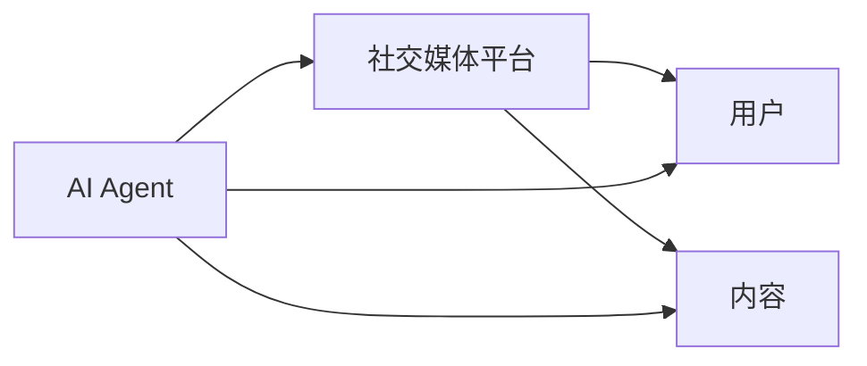
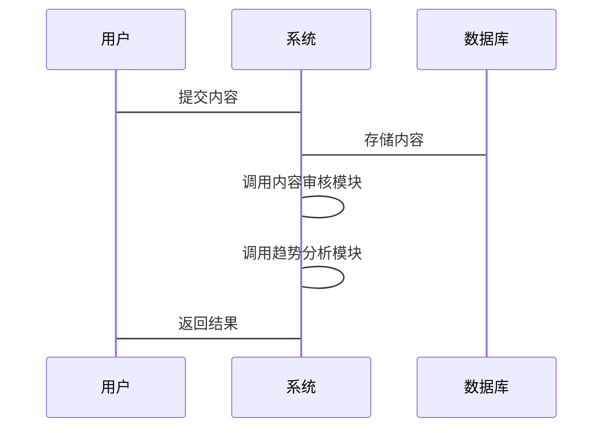

                 


# AI Agent在社交媒体中的应用：内容审核与趋势分析

## 关键词
AI Agent, 社交媒体, 内容审核, 趋势分析, 自然语言处理, 机器学习, 社会网络分析

## 摘要
随着社交媒体的快速发展，内容审核和趋势分析成为了保障平台健康和用户体验的关键任务。AI Agent作为一种智能化的代理，能够高效地处理海量数据，识别有害信息，并预测用户行为趋势。本文详细探讨了AI Agent在社交媒体中的应用，从背景介绍、核心概念到算法原理、系统设计，再到项目实战，全面分析了AI Agent如何在内容审核和趋势分析中发挥重要作用。通过实际案例和代码实现，展示了AI Agent的应用潜力和实际效果。

---

## 第1章：AI Agent的基本概念与应用背景

### 1.1 AI Agent的定义与核心特征
AI Agent（人工智能代理）是指能够感知环境并采取行动以实现目标的智能实体。其核心特征包括：
- **自主性**：能够在没有外部干预的情况下自主运行。
- **反应性**：能够根据环境变化调整自身行为。
- **目标导向性**：所有行动均以实现特定目标为导向。
- **学习能力**：能够通过数据和经验不断优化自身性能。

AI Agent的应用场景广泛，包括智能助手、推荐系统、自动化交易等。

### 1.2 社交媒体的发展与现状
社交媒体作为信息传播和用户互动的重要平台，经历了从早期的文字论坛到如今的多模态社交网络的演变。主要社交媒体平台包括Facebook、Twitter、Instagram等，它们的特点如下：
- **数据多样性**：支持文本、图片、视频等多种内容形式。
- **用户行为复杂性**：用户行为受情感、兴趣等因素驱动，表现出高度的复杂性。
- **实时性**：内容更新速度快，需要实时处理和反馈。

### 1.3 AI Agent在社交媒体中的应用背景
社交媒体的内容审核和趋势分析是保障平台内容安全和用户体验的关键任务。然而，随着数据量的激增和用户行为的复杂化，传统的手动审核和分析方法已难以满足需求。AI Agent凭借其高效性和智能性，成为解决这些问题的理想选择。AI Agent在社交媒体中的应用背景主要体现在：
- **内容审核的必要性**：识别垃圾信息、仇恨言论、虚假信息等有害内容。
- **趋势分析的重要性**：预测热点话题、用户行为趋势，优化平台运营策略。
- **AI Agent的优势**：能够快速处理海量数据，提供实时反馈，降低人工成本。

---

## 第2章：AI Agent与社交媒体的核心概念与联系

### 2.1 AI Agent与社交媒体的实体关系图
以下使用Mermaid图展示AI Agent与社交媒体之间的关系：



从图中可以看出，AI Agent与社交媒体平台、用户和内容之间存在密切的交互关系。

### 2.2 核心概念的原理与特征
AI Agent在社交媒体中的应用涉及多个核心概念，以下是它们的原理和属性特征对比：

| 特性       | AI Agent                          | 社交媒体内容                          |
|------------|------------------------------------|----------------------------------------|
| 输入形式   | 文本、图像、数据            | 文本、图像、视频、链接等               |
| 输出形式   | 行动指令、分析结果            | 内容标签、用户行为数据                |
| 处理方式   | 自主决策、学习优化            | 手动或自动化处理                      |
| 目标       | 实现预设目标                    | 提供信息、分析数据                    |

通过对比可以看出，AI Agent在社交媒体中的应用需要结合多种数据形式和处理方式，以实现高效的内容审核和趋势分析。

---

## 第3章：AI Agent在内容审核中的算法原理

### 3.1 自然语言处理模型
自然语言处理（NLP）是AI Agent进行内容审核的核心技术之一。常用的模型包括：
- **词袋模型（Bag of Words）**：将文本表示为词汇的集合。
- **TF-IDF（Term Frequency-Inverse Document Frequency）**：衡量关键词的重要性。
- **词嵌入（Word Embedding）**：如Word2Vec、GloVe，将词转化为向量表示。

#### 3.1.1 分析过程
1. **文本预处理**：去除停用词、分词处理。
2. **特征提取**：使用TF-IDF提取关键词。
3. **分类模型训练**：使用监督学习算法（如SVM、随机森林）训练分类器。

#### 3.1.2 代码实现示例
```python
from sklearn.feature_extraction.text import TfidfVectorizer
from sklearn.svm import SVC

# 示例文本
texts = ["This is a spam message", "This is a legitimate message"]

# 特征提取
vectorizer = TfidfVectorizer()
X = vectorizer.fit_transform(texts)

# 模型训练
model = SVC()
model.fit(X, [0, 1])

# 预测
new_text = "Click here to win!"
X_new = vectorizer.transform([new_text])
print(model.predict(X_new))
```

### 3.2 监督式机器学习算法
监督式学习算法（如逻辑回归、随机森林）常用于分类任务，如垃圾信息识别和情感分析。

#### 3.2.1 算法流程
1. 数据清洗与预处理。
2. 特征工程。
3. 模型训练与优化。
4. 模型评估与部署。

#### 3.2.2 数学模型
- **逻辑回归**：
  $$ P(y=1|x) = \frac{e^{\beta x + \beta_0}}{1 + e^{\beta x + \beta_0}} $$
  其中，$\beta$ 是特征的系数，$\beta_0$ 是截距。

- **随机森林**：
  随机森林通过构建多个决策树并对结果进行投票，提高模型的鲁棒性。

---

## 第4章：AI Agent在趋势分析中的算法原理

### 4.1 主题模型
主题模型（如LDA）用于识别文本中的主题分布。

#### 4.1.1 算法流程
1. 数据预处理：分词、去除停用词。
2. 矩阵分解：构建主题-词矩阵。
3. 主题识别：识别每个主题的核心词。

#### 4.1.2 代码实现示例
```python
from sklearn.decomposition import LatentDirichletAllocation

# 示例文本
texts = ["Sports news", "Politics news", "Technology news"]

# 特征提取
vectorizer = TfidfVectorizer()
X = vectorizer.fit_transform(texts)

# 主题模型训练
lda = LatentDirichletAllocation(n_topics=3)
lda.fit(X)

# 获取主题词
print(vectorizer.get_feature_names()[lda.components_[0].argsort()[::-1][:5]])
```

### 4.2 情感分析
情感分析用于判断文本的情感倾向（正面、负面、中性）。

#### 4.2.1 算法流程
1. 数据清洗：去除标点符号、停用词。
2. 特征提取：使用词嵌入（如Word2Vec）。
3. 模型训练：使用深度学习模型（如LSTM、BERT）进行分类。

#### 4.2.2 数学模型
- **余弦相似度**：
  $$ \cos\theta = \frac{\vec{A} \cdot \vec{B}}{|\vec{A}| |\vec{B}|} $$
  用于衡量两个文本的相似性。

---

## 第5章：系统分析与架构设计方案

### 5.1 项目背景与目标
本项目旨在设计一个AI Agent辅助的社交媒体内容审核与趋势分析系统，目标是实现自动化内容审核和精准趋势预测。

### 5.2 系统功能设计
以下是系统的主要功能模块：

- **内容审核模块**：
  - 垃圾信息识别。
  - 仇恨言论检测。
  - 虚假信息识别。

- **趋势分析模块**：
  - 热点话题预测。
  - 用户行为分析。
  - 情感倾向分析。

### 5.3 系统架构设计
使用分层架构设计，分为数据层、服务层和应用层。

#### 5.3.1 数据层
- 数据存储：使用数据库存储用户、内容、审核结果等信息。
- 数据处理：对数据进行清洗、转换和存储。

#### 5.3.2 服务层
- API接口：提供内容审核和趋势分析的API。
- 服务逻辑：实现内容审核和趋势分析的业务逻辑。

#### 5.3.3 应用层
- 用户界面：展示审核结果和趋势分析结果。
- 交互逻辑：处理用户的请求和反馈。

### 5.4 系统接口设计
以下是系统接口的序列图：



---

## 第6章：项目实战

### 6.1 环境搭建
- 安装Python和必要的库（如Scikit-learn、NLTK、TensorFlow）。
- 安装社交媒体API（如Twitter API）。

### 6.2 核心代码实现
以下是一个内容审核模块的实现示例：

```python
import pandas as pd
from sklearn.model_selection import train_test_split
from sklearn.metrics import accuracy_score
from sklearn.linear_model import LogisticRegression

# 加载数据
data = pd.read_csv('data.csv')
X = data['text']
y = data['label']

# 数据分割
X_train, X_test, y_train, y_test = train_test_split(X, y, test_size=0.2)

# 特征提取
vectorizer = TfidfVectorizer()
X_train_vec = vectorizer.fit_transform(X_train)
X_test_vec = vectorizer.transform(X_test)

# 模型训练
model = LogisticRegression()
model.fit(X_train_vec, y_train)

# 模型评估
y_pred = model.predict(X_test_vec)
print("Accuracy:", accuracy_score(y_test, y_pred))
```

### 6.3 实际案例分析
以Twitter上的热点话题预测为例，通过AI Agent分析用户的关键词和情感倾向，预测下一个热点话题。

---

## 第7章：最佳实践与总结

### 7.1 总结
本文详细探讨了AI Agent在社交媒体内容审核和趋势分析中的应用，从理论到实践，全面分析了其在实际场景中的潜力和效果。AI Agent通过自然语言处理和机器学习算法，能够高效地处理海量数据，提供实时反馈，为社交媒体平台的运营和用户体验优化提供了有力支持。

### 7.2 注意事项
在实际应用中，需要注意以下问题：
- 数据隐私：确保用户数据的安全性和隐私性。
- 模型泛化能力：避免模型过拟合，确保其在不同场景下的适用性。

### 7.3 拓展阅读
- 《自然语言处理实战》
- 《机器学习算法与应用》
- 《社交媒体网络分析》

---

通过本文的分析和实战，读者可以深入了解AI Agent在社交媒体中的应用，并能够实际操作相关技术，为未来的研究和实践提供坚实的基础。

