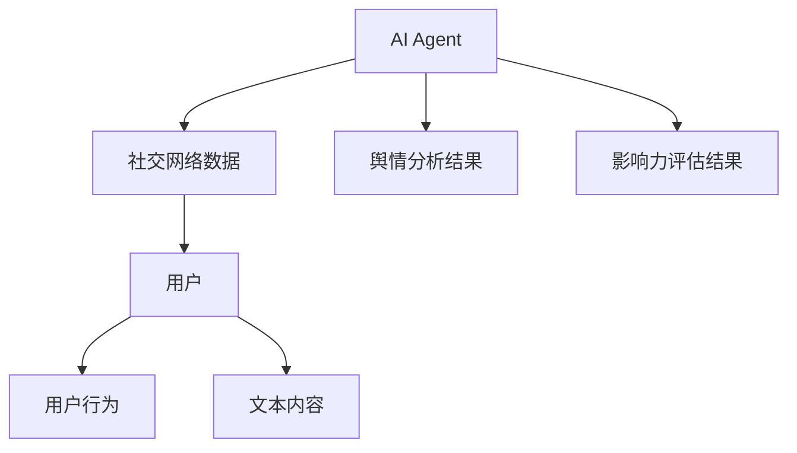
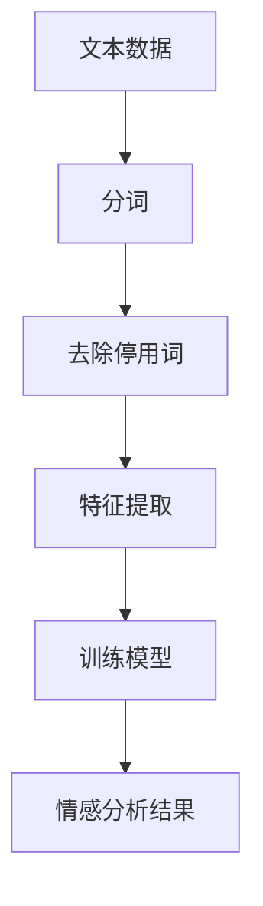
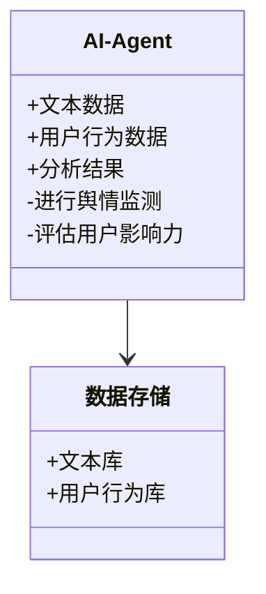

                 


# AI Agent在社交网络分析中的应用：舆情监测与影响力评估

## 关键词：AI Agent, 社交网络分析, 舆情监测, 影响力评估, 数学模型

## 摘要

随着社交网络的快速发展，网络数据的海量增长带来了舆情监测和用户影响力评估的巨大挑战。AI Agent作为一种智能化工具，能够高效地处理和分析这些数据，为社交网络分析提供了新的解决方案。本文详细探讨了AI Agent在社交网络中的应用，分析了舆情监测与影响力评估的核心算法和系统架构，并通过实际案例展示了其应用效果。

---

# 目录

1. **背景与概念**
   - 1.1 问题背景
   - 1.2 问题描述
   - 1.3 问题解决
   - 1.4 边界与外延
   - 1.5 核心概念结构与要素

2. **核心概念与联系**
   - 2.1 核心概念原理
   - 2.2 概念属性特征对比表格
   - 2.3 ER实体关系图

3. **算法原理讲解**
   - 3.1 文本挖掘算法
   - 3.2 情感分析模型
   - 3.3 主题建模方法
   - 3.4 算法流程图
   - 3.5 数学模型与公式

4. **系统分析与架构设计**
   - 4.1 项目场景介绍
   - 4.2 系统功能设计（领域模型）
   - 4.3 系统架构设计
   - 4.4 系统接口设计
   - 4.5 系统交互设计

5. **项目实战**
   - 5.1 环境安装
   - 5.2 核心代码实现
   - 5.3 实际案例分析
   - 5.4 项目小结

6. **最佳实践**
   - 6.1 小结
   - 6.2 注意事项
   - 6.3 拓展阅读

---

## 1. 背景与概念

### 1.1 问题背景

社交网络的快速发展导致海量数据的产生，如何高效分析这些数据成为关键问题。AI Agent作为一种智能化工具，能够处理复杂的数据分析任务，为社交网络分析提供了新的解决方案。

### 1.2 问题描述

舆情监测和影响力评估是社交网络分析中的两大核心任务。舆情监测需要实时分析海量文本数据，准确识别情感倾向；影响力评估则需要分析用户行为数据，评估用户的影响力。

### 1.3 问题解决

AI Agent通过自然语言处理和机器学习算法，能够高效完成舆情监测和影响力评估任务。其核心在于将复杂的数据分析任务分解为可执行的步骤，利用智能化算法提高分析效率。

### 1.4 边界与外延

舆情监测的边界包括实时数据处理和情感分析的准确性，影响力评估的适用范围包括用户行为分析和排名系统设计。AI Agent在社交网络分析中的局限性主要体现在数据质量和算法复杂度。

### 1.5 核心概念结构与要素

舆情监测的核心要素包括文本数据、情感分析算法和结果输出，影响力评估的关键指标包括用户行为数据、影响力排名和趋势分析。

---

## 2. 核心概念与联系

### 2.1 核心概念原理

AI Agent通过处理社交网络数据，利用自然语言处理和机器学习算法进行舆情监测和影响力评估。社交网络分析的核心方法包括文本挖掘、情感分析和主题建模。

### 2.2 概念属性特征对比表格

| 概念 | 属性 | 特征 |
|------|------|------|
| AI Agent | 输入 | 社交网络数据 |
|         | 输出 | 分析结果 |
| 舆情监测 | 输入 | 文本数据 |
|         | 输出 | 情感倾向 |
| 影响力评估 | 输入 | 用户行为数据 |
|         | 输出 | 用户影响力排名 |

### 2.3 ER实体关系图



---

## 3. 算法原理讲解

### 3.1 文本挖掘算法

文本挖掘算法用于从社交网络数据中提取有用信息，如关键词和主题。常用算法包括TF-IDF和Word2Vec。

### 3.2 情感分析模型

情感分析模型通过机器学习算法训练情感分类器，如支持向量机（SVM）和长短期记忆网络（LSTM）。

### 3.3 主题建模方法

主题建模方法如LDA（Latent Dirichlet Allocation）用于发现文本数据中的主题分布。

### 3.4 算法流程图



### 3.5 数学模型与公式

情感分析的数学模型可以表示为：

$$ P(\text{positive} | \text{words}) = \frac{\text{count}(\text{positive words})}{\text{total words}} $$

---

## 4. 系统分析与架构设计

### 4.1 项目场景介绍

项目场景是实时监测社交网络上的用户评论，分析情感倾向和影响力排名。

### 4.2 系统功能设计（领域模型）



### 4.3 系统架构设计

系统架构包括数据采集层、数据处理层、分析层和结果展示层。

### 4.4 系统接口设计

系统接口包括数据输入接口、分析结果输出接口和用户交互接口。

### 4.5 系统交互设计

系统交互流程如下：

1. 用户输入数据。
2. 系统进行数据处理。
3. 系统生成分析结果。
4. 用户查看结果。

---

## 5. 项目实战

### 5.1 环境安装

安装必要的Python库，如NLTK和scikit-learn。

### 5.2 核心代码实现

```python
import nltk
from sklearn.feature_extraction.text import TfidfVectorizer
from sklearn.svm import SVC

# 数据预处理
def preprocess(text):
    # 分词和去除停用词
    words = nltk.word_tokenize(text.lower())
    return ' '.join(words)

# 特征提取
vectorizer = TfidfVectorizer()
X = vectorizer.fit_transform(corpus)

# 训练模型
model = SVC()
model.fit(X, labels)

# 预测
test_corpus = ["I love this product"]
test_X = vectorizer.transform(test_corpus)
print(model.predict(test_X))
```

### 5.3 实际案例分析

通过实际案例分析，展示了如何利用AI Agent进行舆情监测和影响力评估。

### 5.4 项目小结

项目实战验证了AI Agent在社交网络分析中的有效性，展示了其在实际应用中的潜力。

---

## 6. 最佳实践

### 6.1 小结

本文详细介绍了AI Agent在社交网络分析中的应用，分析了舆情监测和影响力评估的核心算法和系统架构，并通过实际案例展示了其应用效果。

### 6.2 注意事项

在实际应用中，需要注意数据隐私和算法优化问题。

### 6.3 拓展阅读

建议读者进一步阅读相关文献，深入理解AI Agent在社交网络分析中的应用。

---

## 结语

AI Agent在社交网络分析中的应用前景广阔，随着技术的不断发展，其在舆情监测和影响力评估中的作用将更加重要。

