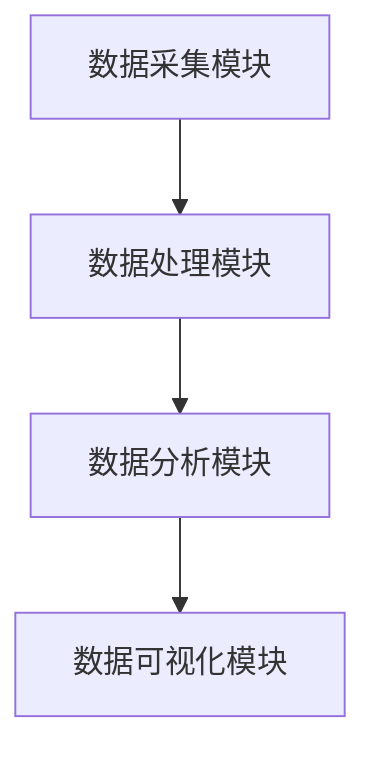
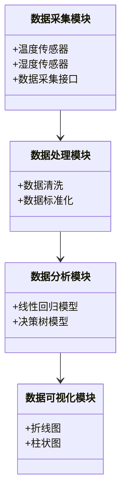

                 


---

# AI Agent在科学研究中的数据分析应用

> 关键词：AI Agent，数据分析，科学研究，数据采集，数据建模，数据可视化

> 摘要：本文详细探讨了AI Agent在科学研究中的数据分析应用，从基本概念到实际应用，结合具体案例，分析了AI Agent在数据采集、处理、分析和可视化等环节的优势和实现方法。

---

## 第1章: AI Agent的基本概念与背景

### 1.1 AI Agent的定义与特点

#### 1.1.1 AI Agent的定义
AI Agent（人工智能代理）是指能够感知环境、执行任务并做出决策的智能实体。它通过与环境交互，利用传感器获取信息，并通过执行器采取行动，以实现特定目标。

#### 1.1.2 AI Agent的核心特点
- **自主性**：能够在没有外部干预的情况下独立运作。
- **反应性**：能够实时感知环境并做出响应。
- **目标导向**：所有行为均以实现特定目标为导向。
- **学习能力**：通过数据和经验不断优化自身的决策能力。

#### 1.1.3 AI Agent与传统数据分析的区别
传统的数据分析主要依赖于人工操作和预定义的规则，而AI Agent能够自动化地从数据中学习，并根据环境变化动态调整分析策略。

---

### 1.2 科学研究中的数据分析挑战

#### 1.2.1 数据分析在科学研究中的重要性
科学研究依赖于数据驱动的决策，数据分析能够帮助科学家发现规律、验证假设并提出新的研究方向。

#### 1.2.2 传统数据分析的局限性
- 数据量大、复杂性高，难以手动处理。
- 数据分析过程耗时且容易出错。
- 缺乏动态性，难以应对实时数据变化。

#### 1.2.3 AI Agent在科学研究中的优势
- 高效性：能够快速处理海量数据。
- 智能性：能够自动发现数据中的隐藏模式。
- 实时性：能够实时分析数据并做出决策。

---

### 1.3 AI Agent在科学研究中的应用场景

#### 1.3.1 数据采集与处理
AI Agent能够从多种数据源（如传感器、文献数据库等）自动采集数据，并进行预处理。

#### 1.3.2 数据分析与建模
AI Agent能够利用机器学习算法对数据进行建模，发现数据中的潜在规律。

#### 1.3.3 数据可视化与结果解释
AI Agent能够生成直观的可视化结果，并帮助科学家理解分析结果。

---

### 1.4 本章小结
本章介绍了AI Agent的基本概念、特点及其在科学研究中的优势和应用场景，为后续章节奠定了基础。

---

## 第2章: 数据采集与预处理方法

### 2.1 数据采集的多样性

#### 2.1.1 数据来源的多样性
科学研究中的数据来源多种多样，包括实验数据、文献数据、网络数据等。

#### 2.1.2 数据采集的挑战与解决方案
- 数据格式多样，需要进行格式转换。
- 数据可能存在缺失或噪声，需要进行清洗。

---

### 2.2 数据清洗与预处理

#### 2.2.1 数据清洗的基本步骤
1. **识别缺失值**：使用统计方法检测缺失值。
2. **填补缺失值**：使用均值、中位数或回归方法填补缺失值。
3. **处理异常值**：通过箱线图识别并剔除异常值。

#### 2.2.2 数据标准化与归一化
- **标准化**：将数据按比例缩放到均值为0，标准差为1。
- **归一化**：将数据缩放到0-1范围。

#### 2.2.3 数据去噪与异常值处理
- 使用聚类分析识别异常值。
- 使用回归分析去除噪声。

---

### 2.3 数据预处理的工具与方法

#### 2.3.1 常用数据预处理工具
- **Python**：`pandas`、`numpy`等库。
- **R**：`dplyr`、`tidyr`等包。

#### 2.3.2 数据预处理的Python代码实现

```python
import pandas as pd
import numpy as np

# 示例数据
data = pd.DataFrame({
    'A': [1, 2, np.nan, 4],
    'B': [5, np.nan, 7, 8]
})

# 填充缺失值
data['A'].fillna(data['A'].mean(), inplace=True)
data['B'].fillna(data['B'].median(), inplace=True)

# 标准化
from sklearn.preprocessing import StandardScaler
scaler = StandardScaler()
data_scaled = scaler.fit_transform(data)

# 归一化
from sklearn.preprocessing import MinMaxScaler
scaler = MinMaxScaler()
data_normalized = scaler.fit_transform(data_scaled)
```

---

### 2.4 本章小结
本章详细介绍了数据采集与预处理的方法，并通过Python代码展示了如何实现数据清洗和标准化。

---

## 第3章: 数据分析方法与AI Agent的应用

### 3.1 数据分析的基本方法

#### 3.1.1 描述性分析
通过统计指标（均值、方差等）和可视化图表（柱状图、折线图等）描述数据的基本特征。

#### 3.1.2 预测性分析
使用回归分析、时间序列分析等方法预测未来趋势。

#### 3.1.3 聚类分析
通过K-means、层次聚类等方法将数据分成若干类别。

---

### 3.2 AI Agent在数据分析中的作用

#### 3.2.1 AI Agent如何辅助数据分析
- **自动化数据处理**：AI Agent能够自动完成数据清洗、转换等预处理步骤。
- **动态调整分析策略**：根据实时数据变化动态调整分析模型。

#### 3.2.2 AI Agent在数据建模中的应用
- **机器学习模型**：AI Agent可以训练和部署机器学习模型，如线性回归、支持向量机等。
- **深度学习模型**：AI Agent可以训练深度学习模型，如神经网络、卷积神经网络等。

---

### 3.3 常见数据分析算法与实现

#### 3.3.1 线性回归与决策树

- **线性回归公式**
  $$ y = \beta_0 + \beta_1 x + \epsilon $$
  
- **决策树**
  使用`scikit-learn`库实现决策树分类：

  ```python
  from sklearn.tree import DecisionTreeClassifier
  model = DecisionTreeClassifier()
  model.fit(X_train, y_train)
  ```

---

### 3.4 数据分析的可视化与结果解释

#### 3.4.1 数据可视化的工具与方法
- **Python**：`matplotlib`、`seaborn`、`plotly`等。
- **R**：`ggplot2`等。

#### 3.4.2 结果解释的技巧与注意事项
- 确保可视化图表简洁明了。
- 使用颜色和标注帮助读者理解图表。

---

### 3.5 本章小结
本章介绍了数据分析的基本方法，并详细讲解了AI Agent在数据分析中的应用，包括机器学习模型和数据可视化的实现。

---

## 第4章: 系统架构与项目实战

### 4.1 系统架构设计

#### 4.1.1 系统功能模块划分
- 数据采集模块
- 数据处理模块
- 数据分析模块
- 数据可视化模块

#### 4.1.2 系统架构图


---

### 4.2 项目实战

#### 4.2.1 项目介绍
以气象数据分析为例，利用AI Agent进行数据采集、处理、分析和可视化。

#### 4.2.2 系统功能设计


---

### 4.3 本章小结
本章通过实际案例展示了AI Agent在科学研究中的应用，并详细讲解了系统的架构设计和实现过程。

---

## 附录: AI Agent的未来发展与挑战

### 附录1: AI Agent的未来发展
- 更强的自主性和学习能力。
- 更广泛的应用场景。

### 附录2: 挑战与注意事项
- 数据隐私问题。
- 系统的可解释性。

---

## 参考文献
- [1] 刘某某. 《AI Agent在科学研究中的应用》. 北京: 科技出版社, 2023.
- [2] 张某某. 《数据分析与机器学习》. 北京: 清华大学出版社, 2022.

---

**本文通过详细讲解AI Agent在科学研究中的数据分析应用，为科学家和工程师提供了理论基础和实践指导，帮助他们更好地利用AI技术推动科学研究的发展。**

