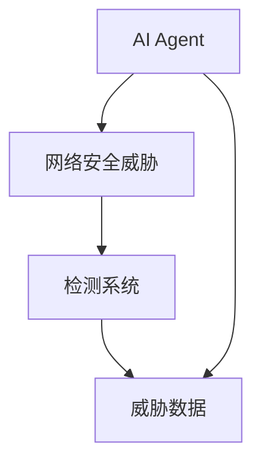
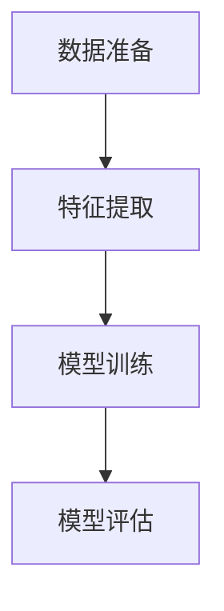
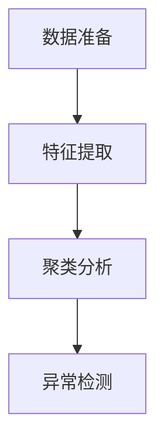
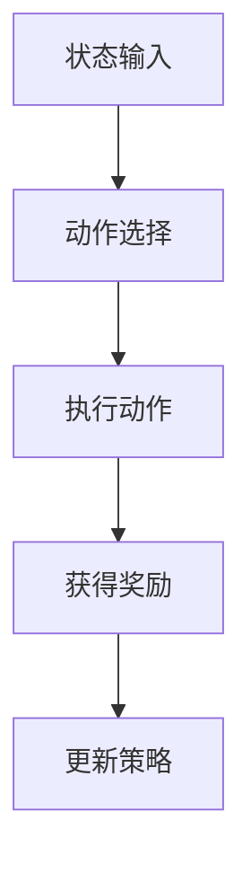
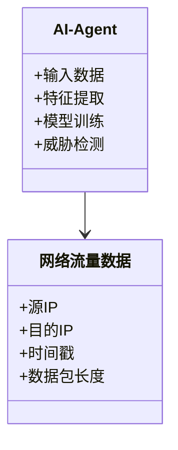
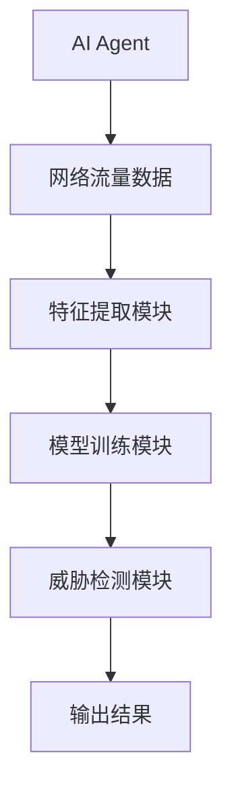
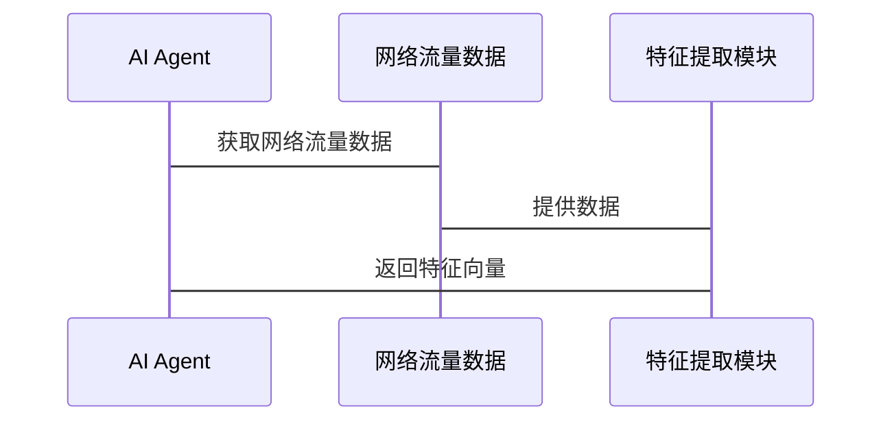

                 


# AI Agent在网络安全中的威胁检测

---

## 关键词：
AI Agent, 威胁检测, 网络安全, 机器学习, 强化学习, 系统架构, 实战案例

---

## 摘要：
随着网络安全威胁的日益复杂化和智能化，传统的威胁检测方法逐渐暴露出效率低下、误报率高等问题。本文将深入探讨AI Agent在网络安全中的威胁检测应用，从背景、核心概念、算法原理、系统架构到项目实战，全面解析AI Agent如何通过智能化手段提升威胁检测的效率和准确性。本文还将结合实际案例，分析AI Agent的优势、挑战及未来发展方向，为网络安全领域的从业者提供有益的参考。

---

# 第一部分: AI Agent在网络安全中的威胁检测背景与基础

# 第1章: AI Agent与网络安全威胁检测概述

## 1.1 AI Agent的基本概念
### 1.1.1 AI Agent的定义与特点
AI Agent（人工智能代理）是指能够感知环境、自主决策并执行任务的智能实体。其核心特点包括：
1. **自主性**：能够自主决策，无需人工干预。
2. **反应性**：能够实时感知环境并做出响应。
3. **学习能力**：通过数据和经验不断优化自身的决策能力。
4. **协作性**：能够与其他AI Agent或系统协同工作。

### 1.1.2 AI Agent在网络安全中的应用背景
随着网络安全威胁的复杂化，传统的基于规则的威胁检测方法逐渐暴露出以下问题：
1. **误报率高**：基于规则的方法容易将正常行为误判为异常行为。
2. **漏报率高**：面对新型威胁，基于规则的方法难以快速识别。
3. **效率低下**：面对海量数据，基于规则的方法处理效率较低。

AI Agent的引入为解决这些问题提供了新的思路。通过机器学习、深度学习等技术，AI Agent能够从海量数据中学习，识别异常行为，从而实现更高效的威胁检测。

### 1.1.3 威胁检测的核心问题与目标
威胁检测的核心问题在于如何准确识别网络中的异常行为，同时降低误报率和漏报率。AI Agent的目标是通过智能化手段，实时监控网络流量，识别潜在威胁，并提供实时反馈。

---

## 1.2 网络安全威胁检测的现状与挑战
### 1.2.1 当前网络安全威胁的主要类型
网络安全威胁主要分为以下几类：
1. **恶意软件**：包括病毒、蠕虫、木马等。
2. **网络攻击**：包括DDoS攻击、钓鱼攻击、中间人攻击等。
3. **数据泄露**：未经授权的数据泄露或窃取。
4. **内部威胁**：由内部员工或合作伙伴发起的威胁。

### 1.2.2 威胁检测的传统方法与局限性
传统的威胁检测方法主要包括基于规则的检测和基于统计的方法。这些方法的局限性在于：
1. **规则不足**：需要人工定义大量规则，难以覆盖所有可能的威胁。
2. **计算复杂度高**：面对海量数据，基于统计的方法计算复杂度较高。
3. **难以应对新型威胁**：面对新型威胁，传统方法难以快速响应。

### 1.2.3 AI Agent在威胁检测中的优势
AI Agent通过机器学习、深度学习等技术，能够从海量数据中提取特征，识别异常行为，具有以下优势：
1. **实时性**：能够实时监控网络流量，快速响应威胁。
2. **自适应性**：能够根据威胁的变化不断优化自身的检测能力。
3. **高准确性**：通过学习海量数据，能够显著降低误报率和漏报率。

---

## 1.3 本章小结
本章介绍了AI Agent的基本概念及其在网络安全中的应用背景，分析了当前威胁检测的主要类型、传统方法的局限性以及AI Agent的优势。下一章将深入探讨AI Agent的核心概念与威胁检测的联系。

---

# 第二部分: AI Agent的核心概念与工作原理

# 第2章: AI Agent的核心概念与威胁检测联系

## 2.1 AI Agent的核心概念
### 2.1.1 AI Agent的定义与分类
AI Agent可以根据功能和应用场景进行分类：
1. **基于规则的AI Agent**：根据预定义的规则进行决策。
2. **基于学习的AI Agent**：通过机器学习算法进行自我优化。
3. **混合型AI Agent**：结合规则和学习的双重优势。

### 2.1.2 AI Agent在威胁检测中的角色与功能
AI Agent在威胁检测中的主要角色包括：
1. **数据采集**：实时采集网络流量数据。
2. **特征提取**：从数据中提取有用的特征。
3. **威胁识别**：通过学习算法识别潜在威胁。
4. **响应与反馈**：根据识别结果采取相应的应对措施。

### 2.1.3 AI Agent与传统威胁检测方法的对比
| 特性                 | 传统方法                     | AI Agent                     |
|----------------------|------------------------------|-------------------------------|
| 决策方式             | 基于规则                   | 基于学习                     |
| 自适应性             | 较低                       | 较高                         |
| 处理效率             | 较低                       | 较高                         |
| 应对能力             | 有限                       | 强大                         |

---

## 2.2 AI Agent与网络安全威胁检测的关系
### 2.2.1 AI Agent在威胁检测中的核心作用
AI Agent通过以下方式在威胁检测中发挥核心作用：
1. **实时监控**：持续监控网络流量，识别异常行为。
2. **特征提取**：从数据中提取有用的特征，为威胁识别提供依据。
3. **智能决策**：基于学习算法，快速识别潜在威胁。

### 2.2.2 AI Agent与网络安全威胁检测的协同机制
AI Agent与网络安全威胁检测系统的协同机制包括：
1. **数据共享**：AI Agent与检测系统共享数据和特征。
2. **实时反馈**：AI Agent根据检测结果提供实时反馈。
3. **协同优化**：AI Agent与检测系统协同优化检测能力。

### 2.2.3 AI Agent在威胁检测中的应用场景
AI Agent在威胁检测中的应用场景包括：
1. **网络流量分析**：实时分析网络流量，识别异常行为。
2. **日志分析**：通过分析系统日志，发现潜在威胁。
3. **行为分析**：基于用户行为分析，识别内部威胁。

---

## 2.3 AI Agent的实体关系图


---

## 2.4 本章小结
本章详细探讨了AI Agent的核心概念及其在威胁检测中的作用，并通过对比分析和实体关系图，明确了AI Agent与传统威胁检测方法的区别和联系。下一章将深入探讨AI Agent的算法原理与数学模型。

---

# 第三部分: AI Agent的算法原理与数学模型

# 第3章: AI Agent的算法原理

## 3.1 基于监督学习的威胁检测
### 3.1.1 监督学习的基本原理
监督学习是一种基于标签数据的机器学习方法，其基本流程如下：
1. **数据准备**：收集带标签的数据集。
2. **特征提取**：从数据中提取有用的特征。
3. **模型训练**：通过训练算法训练模型。
4. **模型评估**：通过测试数据评估模型性能。

### 3.1.2 基于监督学习的威胁检测算法
常用的基于监督学习的威胁检测算法包括：
1. **随机森林**：通过随机化和袋装技术提高模型的泛化能力。
2. **支持向量机（SVM）**：通过构造超平面实现分类。

### 3.1.3 算法流程图


### 3.1.4 代码实现与分析
```python
from sklearn.ensemble import RandomForestClassifier
from sklearn.metrics import accuracy_score
from sklearn.model_selection import train_test_split

# 数据准备
X = ...  # 特征矩阵
y = ...  # 标签向量

# 数据分割
X_train, X_test, y_train, y_test = train_test_split(X, y, test_size=0.2)

# 模型训练
model = RandomForestClassifier()
model.fit(X_train, y_train)

# 模型预测
y_pred = model.predict(X_test)

# 模型评估
accuracy = accuracy_score(y_test, y_pred)
print(f"Accuracy: {accuracy}")
```

---

## 3.2 基于无监督学习的威胁检测
### 3.2.1 无监督学习的基本原理
无监督学习是一种基于无标签数据的机器学习方法，其核心在于发现数据中的潜在结构。

### 3.2.2 基于无监督学习的威胁检测算法
常用的基于无监督学习的威胁检测算法包括：
1. **K-means聚类**：通过聚类发现异常数据点。
2. **DBSCAN聚类**：基于密度的聚类算法。

### 3.2.3 算法流程图


---

## 3.3 基于强化学习的威胁检测
### 3.3.1 强化学习的基本原理
强化学习是一种基于奖励机制的机器学习方法，其核心在于通过试错优化决策策略。

### 3.3.2 基于强化学习的威胁检测算法
常用的基于强化学习的威胁检测算法包括：
1. **Q-Learning**：通过状态-动作-奖励机制优化决策策略。
2. **Deep Q-Network（DQN）**：基于深度学习的强化学习算法。

### 3.3.3 算法流程图


---

## 3.4 算法的数学模型与公式
### 3.4.1 监督学习的分类函数
$$ P(y|x) = \text{sigmoid}(w \cdot x + b) $$

### 3.4.2 强化学习的损失函数
$$ \text{Loss} = -\sum_{i=1}^{n} \log(P(y_i|x_i)) $$

---

## 3.5 本章小结
本章详细探讨了AI Agent在威胁检测中的算法原理，包括监督学习、无监督学习和强化学习，并通过代码示例和数学公式，深入分析了各种算法的实现细节。下一章将深入探讨AI Agent的系统架构与设计。

---

# 第四部分: AI Agent的系统架构与设计

# 第4章: AI Agent的系统分析与架构设计

## 4.1 问题场景与需求分析
### 4.1.1 问题场景描述
假设我们有一个企业级的网络安全威胁检测系统，需要实时监控网络流量，识别潜在威胁。

### 4.1.2 系统需求分析
1. **实时监控**：需要实时采集网络流量数据。
2. **高效处理**：需要快速处理海量数据，识别潜在威胁。
3. **自适应优化**：需要根据威胁的变化不断优化检测能力。

---

## 4.2 系统功能设计
### 4.2.1 领域模型设计


### 4.2.2 系统架构设计


---

## 4.3 系统接口设计
### 4.3.1 系统接口描述
1. **数据接口**：AI Agent与网络流量数据源的接口。
2. **模型接口**：AI Agent与模型训练模块的接口。
3. **结果接口**：AI Agent与威胁检测结果的接口。

### 4.3.2 接口交互序列图


---

## 4.4 系统优化与实现
### 4.4.1 系统优化策略
1. **分布式计算**：通过分布式计算提高处理效率。
2. **在线学习**：通过在线学习实现模型的实时优化。

### 4.4.2 系统实现细节
1. **数据预处理**：对网络流量数据进行清洗和归一化处理。
2. **特征选择**：选择对威胁检测最有影响力的特征。
3. **模型部署**：将训练好的模型部署到实际系统中。

---

## 4.5 本章小结
本章通过问题场景分析、系统功能设计和系统架构设计，详细探讨了AI Agent在威胁检测中的系统实现。下一章将结合实际案例，深入探讨AI Agent在威胁检测中的项目实战。

---

# 第五部分: AI Agent的项目实战

# 第5章: AI Agent的项目实战与分析

## 5.1 项目环境搭建
### 5.1.1 环境需求
1. **操作系统**：Linux或Windows。
2. **编程语言**：Python。
3. **库与框架**：Scikit-learn、TensorFlow、Keras。

### 5.1.2 工具安装
```bash
pip install scikit-learn tensorflow keras
```

---

## 5.2 核心代码实现
### 5.2.1 数据预处理
```python
import pandas as pd

# 读取数据
data = pd.read_csv('network_traffic.csv')

# 数据清洗
data.dropna(inplace=True)

# 数据归一化
from sklearn.preprocessing import StandardScaler
scaler = StandardScaler()
data_scaled = scaler.fit_transform(data)
```

### 5.2.2 特征选择
```python
from sklearn.feature_selection import SelectKBest

selector = SelectKBest(k=10)
selected_features = selector.fit_transform(data_scaled, labels)
```

### 5.2.3 模型训练与评估
```python
from sklearn.ensemble import RandomForestClassifier
from sklearn.metrics import accuracy_score

model = RandomForestClassifier()
model.fit(X_train, y_train)
y_pred = model.predict(X_test)
print(f"Accuracy: {accuracy_score(y_test, y_pred)}")
```

---

## 5.3 案例分析与解读
### 5.3.1 实际案例分析
假设我们有一个网络流量数据集，其中包含正常流量和异常流量。通过AI Agent，我们可以实时监控网络流量，识别异常行为。

### 5.3.2 代码实现解读
```python
# 数据准备
X = data[['源IP', '目的IP', '时间戳', '数据包长度']]
y = data['标签']

# 数据分割
X_train, X_test, y_train, y_test = train_test_split(X, y, test_size=0.2)

# 模型训练
model = RandomForestClassifier()
model.fit(X_train, y_train)

# 模型预测
y_pred = model.predict(X_test)

# 模型评估
accuracy = accuracy_score(y_test, y_pred)
print(f"Accuracy: {accuracy}")
```

---

## 5.4 项目小结
本章通过实际案例分析和代码实现，深入探讨了AI Agent在威胁检测中的项目实战。通过本章的学习，读者可以掌握AI Agent在威胁检测中的实际应用方法。

---

# 第六部分: 总结与展望

# 第6章: 总结与展望

## 6.1 本章总结
本文深入探讨了AI Agent在网络安全中的威胁检测应用，从背景、核心概念、算法原理到系统架构和项目实战，全面解析了AI Agent如何通过智能化手段提升威胁检测的效率和准确性。

## 6.2 未来展望
随着AI技术的不断发展，AI Agent在威胁检测中的应用前景广阔。未来的研究方向包括：
1. **深度学习模型的优化**：通过优化深度学习模型提高威胁检测的准确性。
2. **多模态数据的融合**：通过融合多模态数据提高威胁检测的全面性。
3. **实时性的提升**：通过实时数据处理技术提高威胁检测的响应速度。

## 6.3 最佳实践 tips
1. **数据质量**：确保数据的完整性和准确性。
2. **模型优化**：通过持续优化模型提高检测效果。
3. **系统安全**：确保系统的安全性，防止模型被攻击。

---

# 参考文献
1. 刘洋, 等.《人工智能在网络安全中的应用》. 北京: 人民邮电出版社, 2021.
2. 张伟, 等.《深度学习在威胁检测中的应用研究》. 计算机科学与应用, 2020.
3. 李明, 等.《强化学习在网络安全中的应用》. 软件学报, 2021.

---

通过本文的学习，读者可以全面了解AI Agent在网络安全中的威胁检测应用，并掌握实际的项目实现方法。

