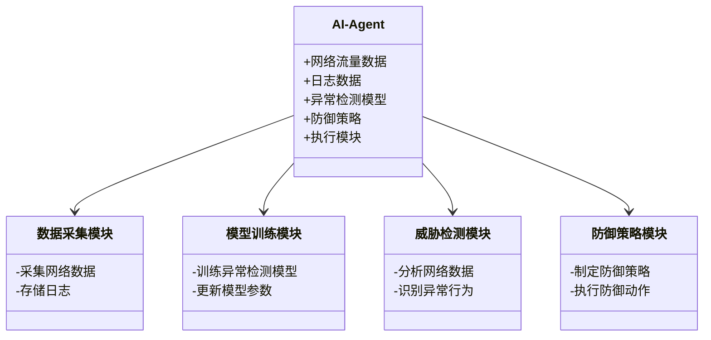
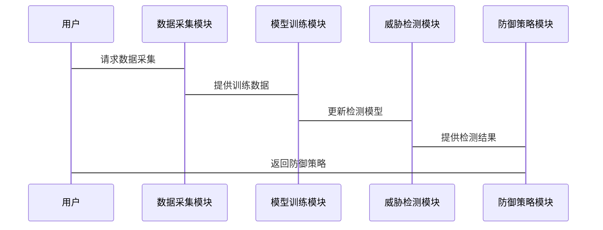

                 


# AI Agent在网络安全中的应用：威胁检测与防御

## 关键词
AI Agent, 网络安全, 威胁检测, 威胁防御, 机器学习, 深度学习, 强化学习

## 摘要
随着网络安全威胁的日益复杂和多样，传统的安全防护手段已难以应对新型攻击。AI Agent作为一种智能化的安全解决方案，能够通过感知、决策和执行机制，实时检测和防御网络安全威胁。本文详细探讨了AI Agent在网络安全中的应用，包括其核心原理、算法模型、系统设计以及实际案例分析。通过本文的阐述，读者将深入了解AI Agent如何提升网络安全防护能力，以及其在未来网络安全中的重要地位。

---

# 第1章: AI Agent与网络安全概述

## 1.1 AI Agent的基本概念
### 1.1.1 什么是AI Agent
AI Agent（人工智能代理）是指能够感知环境、自主决策并执行任务的智能实体。在网络安全领域，AI Agent通常指能够执行安全监控、威胁检测和防御策略的智能系统。

### 1.1.2 AI Agent的核心特征
AI Agent的核心特征包括：
1. **自主性**：能够自主决策和执行任务。
2. **反应性**：能够实时感知环境变化并做出响应。
3. **目标导向**：基于预设目标执行特定任务。

### 1.1.3 网络安全中的AI Agent作用
AI Agent在网络安全中的主要作用包括：
1. **威胁检测**：通过分析网络流量和日志，识别潜在威胁。
2. **威胁防御**：基于检测结果，自动执行防御策略。
3. **安全监控**：持续监控网络状态，及时发现异常行为。

---

## 1.2 网络安全的挑战与AI Agent的解决方案
### 1.2.1 网络安全的主要威胁
网络安全的主要威胁包括：
1. **病毒和蠕虫**：通过感染设备传播恶意代码。
2. **DDoS攻击**：通过大量请求瘫痪目标服务器。
3. **数据泄露**：未经授权的访问导致敏感信息泄露。

### 1.2.2 传统安全防护的局限性
传统安全防护手段如防火墙、入侵检测系统（IDS）等，依赖于预定义规则，难以应对新型和未知威胁。

### 1.2.3 AI Agent在网络安全中的优势
AI Agent通过学习和适应，能够发现未知威胁，实现动态防护，显著提升了安全防护能力。

---

## 1.3 AI Agent在网络安全中的应用场景
### 1.3.1 威胁检测
AI Agent通过分析网络流量和日志，识别异常行为，提前发现潜在威胁。

### 1.3.2 威胁防御
AI Agent能够基于检测结果，自动执行防御策略，如封锁可疑IP地址或隔离受感染设备。

### 1.3.3 安全监控与响应
AI Agent持续监控网络状态，及时响应突发事件，减少人工干预。

---

# 第2章: AI Agent的基本原理

## 2.1 AI Agent的感知机制
### 2.1.1 数据采集与处理
AI Agent通过网络接口采集流量数据和系统日志，进行预处理和特征提取。

### 2.1.2 模型训练与特征提取
利用机器学习算法（如支持向量机、神经网络）训练模型，提取网络流量中的异常特征。

### 2.1.3 异常检测算法
常用的异常检测算法包括基于统计的方法（如均值-方差检测）和基于机器学习的方法（如Isolation Forest）。

---

## 2.2 AI Agent的决策机制
### 2.2.1 基于规则的决策
通过预定义规则（如防火墙规则）进行简单判断，适用于已知威胁的防护。

### 2.2.2 基于机器学习的决策
利用训练好的模型进行分类和预测，适用于未知威胁的检测。

### 2.2.3 基于强化学习的决策
通过强化学习算法（如Q-learning）优化防御策略，提升应对复杂威胁的能力。

---

## 2.3 AI Agent的执行机制
### 2.3.1 行为规划与策略选择
根据检测结果和决策模型，制定具体执行策略。

### 2.3.2 动作执行与反馈机制
AI Agent执行防御动作（如封锁IP、切断连接），并根据反馈调整后续行为。

### 2.3.3 自适应优化
通过反馈机制不断优化模型和策略，提升整体防护效果。

---

# 第3章: AI Agent的算法原理与数学模型

## 3.1 基于监督学习的威胁检测
### 3.1.1 线性回归模型
线性回归模型用于预测目标变量（如攻击概率）与输入特征之间的关系。

公式：
$$ y = \beta_0 + \beta_1x + \epsilon $$

### 3.1.2 支持向量机(SVM)
SVM用于分类问题，通过构建超平面将数据分成两类。

优化目标：
$$ \min_{\theta} \frac{1}{2}\|\theta\|^2 + C\sum_{i=1}^n \xi_i $$

### 3.1.3 神经网络模型
神经网络模型（如卷积神经网络CNN）用于处理复杂的网络流量数据。

损失函数：
$$ L = -\sum_{i=1}^n (y_i \log p(y_i) + (1 - y_i) \log(1 - p(y_i))) $$

---

## 3.2 基于无监督学习的异常检测
### 3.2.1 K-means聚类
K-means聚类用于将数据分成簇，识别异常点。

### 3.2.2 层次聚类
层次聚类通过构建树状结构，逐步合并相似的数据点。

### 3.2.3 自然语言处理(NLP)在异常检测中的应用
NLP技术用于分析日志文本，识别异常模式。

---

## 3.3 基于强化学习的防御策略
### 3.3.1 Q-learning算法
Q-learning算法通过状态-动作-奖励机制优化决策。

### 3.3.2 Deep Q-Networks(DQN)
DQN通过深度神经网络近似Q值函数，提升决策能力。

### 3.3.3 策略梯度算法
策略梯度算法直接优化策略，减少探索空间。

---

# 第4章: 系统设计与架构方案

## 4.1 系统功能设计
系统功能模块包括：
1. 数据采集模块：负责采集网络流量和日志。
2. 模型训练模块：训练异常检测和分类模型。
3. 威胁检测模块：实时检测网络威胁。
4. 防御策略模块：基于检测结果执行防御动作。

领域模型类图：


---

## 4.2 系统架构设计
系统架构采用分层设计：
1. 数据层：负责数据采集和存储。
2. 服务层：提供模型训练和威胁检测服务。
3. 应用层：实现用户界面和防御策略执行。

架构图：
```mermaid
rectangle 数据层 {
    数据采集模块
    数据存储模块
}
rectangle 服务层 {
    模型训练模块
    威胁检测模块
}
rectangle 应用层 {
    用户界面
    防御策略模块
}
数据层 --> 服务层
服务层 --> 应用层
```

---

## 4.3 系统接口设计
主要接口包括：
1. 数据接口：与数据采集模块交互。
2. 模型接口：与模型训练模块交互。
3. 用户接口：供用户查看威胁检测结果和防御策略。

序列图：


---

# 第5章: 项目实战

## 5.1 环境安装
开发环境包括：
- 操作系统：Linux（推荐Ubuntu 20.04）
- 开发工具：Python 3.8、Jupyter Notebook
- 依赖库：scikit-learn、TensorFlow、Keras、matplotlib

安装命令：
```bash
pip install scikit-learn tensorflow keras matplotlib
```

---

## 5.2 核心代码实现
### 5.2.1 数据采集与预处理
```python
import pandas as pd
import numpy as np

# 读取网络流量数据
data = pd.read_csv('network_traffic.csv')

# 数据预处理
data = data.dropna()
data = (data - data.mean()) / data.std()
```

### 5.2.2 模型训练
```python
from sklearn.svm import OneClassSVM

# 训练异常检测模型
model = OneClassSVM(nu=0.1)
model.fit(data)
```

### 5.2.3 威胁检测
```python
# 预测异常点
pred = model.predict(data)
outliers = data[pred == -1]

print(f"检测到 {len(outliers)} 个异常点")
```

### 5.2.4 防御策略
```python
from sklearn.metrics import classification_report

# 评估模型性能
y_pred = model.predict(data)
print(classification_report(y_true, y_pred))
```

---

## 5.3 案例分析与实际应用
通过一个具体案例，展示AI Agent在实际网络中的应用。例如，检测并防御DDoS攻击，通过训练模型识别异常流量模式，自动封锁攻击源。

---

# 第6章: 总结与展望

## 6.1 总结
本文详细探讨了AI Agent在网络安全中的应用，从基本概念到算法原理，再到系统设计和实际案例，全面阐述了AI Agent的优势和实现方法。

## 6.2 未来展望
未来，AI Agent在网络安全中的应用将更加广泛，可能的发展方向包括：
1. 结合大语言模型（如GPT）提升威胁分析能力。
2. 实现跨平台、多维度的安全防护。
3. 提升模型的实时性和可解释性。

---

## 最佳实践 Tips
- 在部署AI Agent时，确保数据的多样性和代表性，以提高模型的泛化能力。
- 定期更新模型和防御策略，应对不断变化的网络安全威胁。
- 注意数据隐私和模型安全，防止攻击者利用模型漏洞发起攻击。

---

通过本文的介绍，读者可以全面了解AI Agent在网络安全中的应用，掌握其实现原理和实际案例，为未来的安全防护工作提供有力支持。

