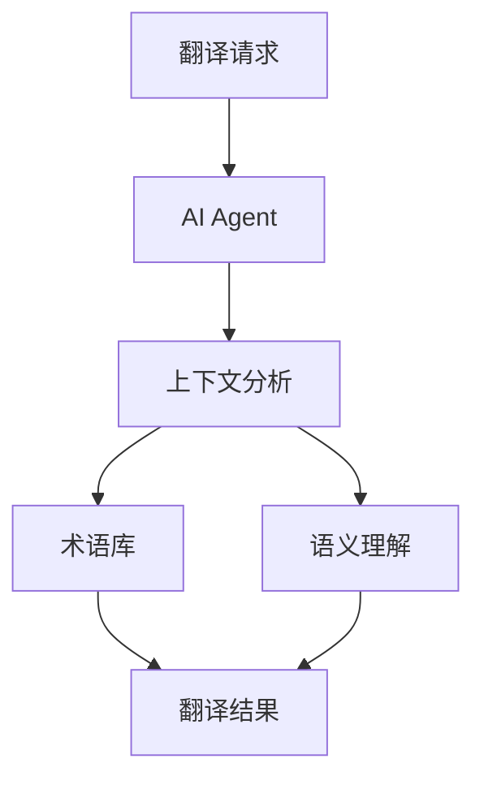
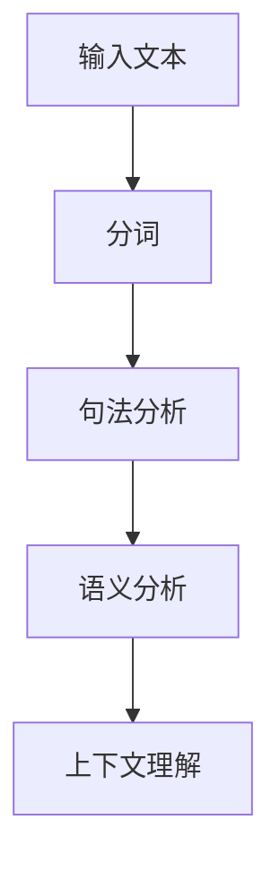
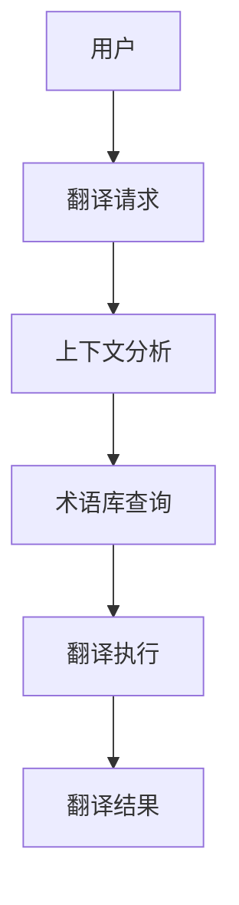

                 


# AI Agent在翻译领域的应用：上下文理解与文化适应

> 关键词：AI Agent, 翻译, 上下文理解, 文化适应, 翻译系统, 翻译模型, 翻译算法

> 摘要：本文探讨AI Agent在翻译领域的应用，重点分析上下文理解和文化适应在翻译过程中的重要性。通过深入解析AI Agent的核心概念、算法原理、系统架构以及实际应用案例，本文旨在为技术人员和翻译专业人士提供理论支持和实践指导。

---

# 第一部分: AI Agent在翻译领域的背景与核心概念

---

## 第1章: AI Agent与翻译的背景介绍

### 1.1 AI Agent的基本概念

- **1.1.1 AI Agent的定义与特点**
  - AI Agent是具有自主决策能力的智能体，能够根据输入信息执行任务。
  - 翻译的基本概念：将一种语言的文本转换为另一种语言，同时保持原意不变。

- **1.1.2 翻译的基本概念与分类**
  - 翻译类型：文本翻译、语音翻译、图像翻译等。
  - 翻译过程中的关键要素：上下文、术语、语义、文化背景。

- **1.1.3 AI Agent在翻译中的问题背景**
  - 翻译中的难点：文化差异、多义词处理、语境理解。
  - AI Agent如何解决这些问题：通过上下文分析和文化适应提高翻译质量。

---

### 1.2 上下文理解与文化适应

- **1.2.1 上下文理解的重要性**
  - 上下文分析在翻译中的作用：确保翻译的准确性和自然性。
  - 翻译错误的常见原因：忽略上下文导致的误译。

- **1.2.2 文化适应的挑战**
  - 文化差异对翻译的影响：语言习惯、文化符号的差异。
  - 如何实现文化适应：结合目标文化背景进行翻译调整。

- **1.2.3 AI Agent在翻译中的应用前景**
  - AI Agent如何提升翻译质量：通过上下文理解优化翻译结果。
  - AI Agent在文化适应中的潜力：结合文化知识库实现跨文化翻译。

---

## 1.3 本章小结

- 本章介绍了AI Agent和翻译的基本概念，分析了上下文理解与文化适应在翻译中的重要性，并展望了AI Agent在翻译领域的应用前景。

---

# 第二部分: AI Agent的核心概念与原理

---

## 第2章: AI Agent的核心概念与联系

### 2.1 AI Agent的核心原理

- **2.1.1 基于规则的AI Agent**
  - 基于规则的翻译模型：通过预定义的规则进行翻译。
  - 优缺点：规则简单，但难以处理复杂语境。

- **2.1.2 基于统计的AI Agent**
  - 统计翻译模型：通过统计语言学方法进行翻译。
  - 优缺点：能够处理一定规模的数据，但缺乏语义理解。

- **2.1.3 基于深度学习的AI Agent**
  - 深度学习翻译模型：利用神经网络进行翻译。
  - 优缺点：能够处理复杂的语境，但需要大量数据支持。

---

### 2.2 AI Agent与翻译的核心要素对比

- **2.2.1 翻译模型的属性特征对比**
  | 翻译模型 | 基于规则 | 基于统计 | 基于深度学习 |
  |----------|----------|----------|--------------|
  | 优缺点   | 简单，但缺乏灵活性 | 可处理大规模数据，但缺乏语义理解 | 高度灵活，但需要大量数据支持 |

- **2.2.2 翻译过程的实体关系图**


---

## 2.3 本章小结

- 本章分析了AI Agent的核心原理，对比了不同翻译模型的优缺点，并通过实体关系图展示了翻译过程中的关键要素。

---

# 第三部分: AI Agent的算法原理与数学模型

---

## 第3章: AI Agent的算法原理

### 3.1 上下文理解的算法流程

- **3.1.1 基于规则的上下文分析**
  - 示例：识别并处理专有名词。

- **3.1.2 基于统计的上下文分析**
  - 示例：通过统计频率分析上下文关系。

- **3.1.3 基于深度学习的上下文分析**
  - 示例：利用神经网络进行上下文理解。



---

### 3.2 翻译的数学模型

- **3.2.1 翻译的概率模型**
  $$P(f|x) = \frac{P(x|f)P(f)}{P(x)}$$
  - 其中，$P(f|x)$ 表示在输入$x$的情况下，翻译结果$f$的概率。

- **3.2.2 翻译的统计模型**
  - 统计翻译模型的核心公式：
    $$f = \arg\max P(f|x)$$

- **3.2.3 翻译的深度学习模型**
  - 神经网络翻译模型的损失函数：
    $$\mathcal{L} = -\log P(f|x)$$

---

### 3.3 示例分析

- 通过具体案例分析，展示不同算法在翻译中的应用。

---

## 3.4 本章小结

- 本章详细讲解了AI Agent的算法原理，分析了不同翻译模型的数学公式，并通过案例展示了算法的实际应用。

---

# 第四部分: 系统分析与架构设计

---

## 第4章: 系统分析与架构设计

### 4.1 翻译系统的工作场景

- **4.1.1 翻译请求的来源**
  - 用户输入、API调用等。

- **4.1.2 翻译结果的输出形式**
  - 文本形式、语音输出等。

- **4.1.3 系统的边界与外延**
  - 系统与外部接口的交互范围。

---

### 4.2 系统功能设计

- **4.2.1 系统功能模块划分**
  - 上下文分析模块、术语库管理模块、翻译执行模块等。

- **4.2.2 系统功能流程图**


---

## 4.3 本章小结

- 本章分析了翻译系统的工作场景，设计了系统的功能模块，并通过流程图展示了系统的功能流程。

---

# 第五部分: 项目实战

---

## 第5章: 项目实战

### 5.1 项目介绍

- 项目目标：实现一个基于AI Agent的翻译系统。

### 5.2 核心代码实现

```python
def translate(text, source_lang, target_lang):
    # 调用AI Agent进行翻译
    context = analyze_context(text)
    translated = model.translate(context, source_lang, target_lang)
    return translated
```

---

### 5.3 实际案例分析

- 通过具体案例展示系统的实际应用。

---

## 5.4 本章小结

- 本章通过项目实战，展示了AI Agent在翻译系统中的具体应用，并提供了代码实现和案例分析。

---

# 第六部分: 最佳实践与总结

---

## 第6章: 最佳实践与总结

### 6.1 小结

- 总结全文内容，强调AI Agent在翻译中的重要性。

### 6.2 注意事项

- 提醒读者在实际应用中需要注意的问题。

### 6.3 拓展阅读

- 推荐进一步阅读的相关书籍和资料。

---

# 附录

---

## 附录A: 常见问题解答

- 翻译系统如何处理多语言翻译？
- 如何确保翻译的准确性？

---

## 附录B: 参考文献

- 列出全文参考的文献资料。

---

## 附录C: 工具与库推荐

- 推荐常用的翻译工具和AI库。

---

# 结语

---

通过本文的详细讲解，读者可以深入了解AI Agent在翻译领域的应用，掌握上下文理解和文化适应的核心原理，并能够在实际应用中灵活运用这些知识。

