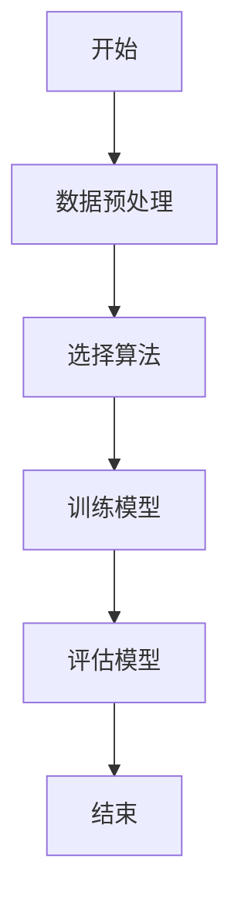
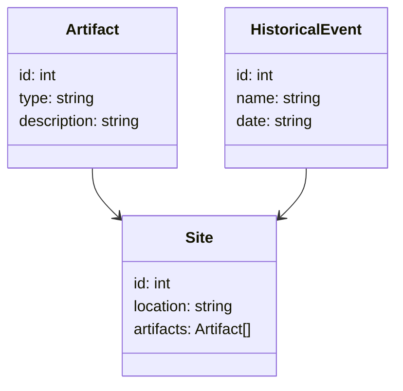
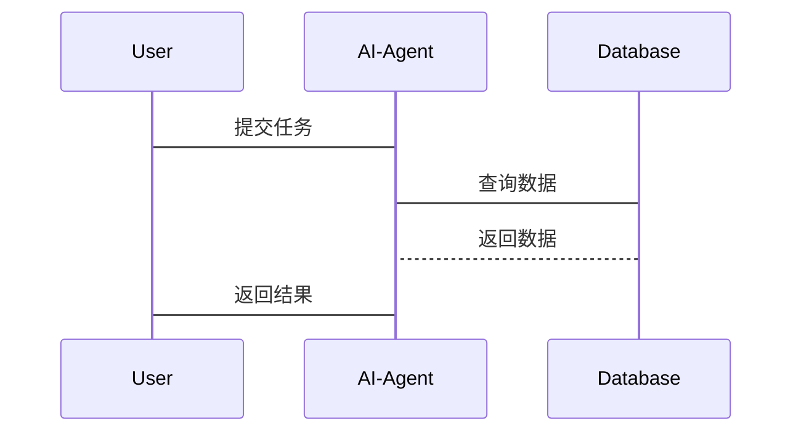

                 


# AI Agent在考古学中的应用：文物分析与历史重建

**关键词**：AI Agent，考古学，文物分析，历史重建，计算机视觉，自然语言处理

**摘要**：随着人工智能技术的快速发展，AI Agent在考古学中的应用逐渐成为研究的热点。本文将详细探讨AI Agent在文物分析与历史重建中的应用，涵盖背景介绍、核心概念、算法原理、系统设计和项目实战等内容。通过实例分析，展示AI Agent如何帮助考古学家更高效、更精确地进行研究，从而推动考古学的发展。

---

# 第一部分: 背景介绍

## 第1章: 背景介绍

### 1.1 问题背景

#### 1.1.1 考古学中的传统方法与挑战
考古学传统上依赖于人工分析和推测，这种方法效率低且容易受到主观因素的影响。例如，在文物修复过程中，考古学家需要手动分析每一块碎片，耗时且容易出错。此外，历史记录的缺失和碎片化的数据使得历史重建变得更加困难。

#### 1.1.2 AI技术在考古学中的潜在价值
AI技术，尤其是AI Agent，能够通过自动化处理大量数据，提高分析效率和准确性。例如，计算机视觉技术可以用于文物图像的自动识别和修复，自然语言处理技术可以帮助分析历史文献，提取关键信息。

#### 1.1.3 AI Agent的概念与特点
AI Agent是一种智能体，能够感知环境、自主决策并执行任务。其特点包括自主性、反应性、目标导向和学习能力。这些特点使其非常适合应用于复杂的考古学问题。

### 1.2 问题描述

#### 1.2.1 文物分析与历史重建的核心问题
文物分析涉及对文物的识别、分类和修复，而历史重建则需要整合多个来源的数据，构建历史事件的时间线和空间关系。这两个过程都需要处理大量的非结构化数据，传统方法效率低下。

#### 1.2.2 AI Agent在考古学中的应用场景
AI Agent可以在文物修复、历史事件分析、遗址重建等领域发挥作用。例如，AI Agent可以通过图像识别技术自动修复破损的文物，通过自然语言处理技术分析历史文献，提取关键信息。

#### 1.2.3 AI Agent的优势与局限性
优势：提高效率、准确性，降低人为误差。局限性：数据不足、模型的泛化能力有限。

### 1.3 问题解决

#### 1.3.1 AI Agent在文物分析中的应用
AI Agent可以通过图像识别技术自动识别和分类文物，通过自然语言处理技术分析历史文献，提取关键信息。

#### 1.3.2 AI Agent在历史重建中的应用
AI Agent可以通过整合多个来源的数据，构建历史事件的时间线和空间关系，帮助考古学家更好地理解历史。

#### 1.3.3 AI Agent与其他技术的结合
AI Agent可以与地理信息系统（GIS）结合，用于遗址重建和空间分析。还可以与区块链技术结合，用于文物保护和追踪。

### 1.4 边界与外延

#### 1.4.1 AI Agent在考古学中的应用边界
AI Agent的应用受到数据质量和数量的限制，同时在处理复杂的历史背景时可能需要结合其他技术。

#### 1.4.2 考古学中AI Agent的外延领域
AI Agent的应用可以扩展到文化传承、教育等领域，例如通过虚拟现实技术展示重建的历史场景。

#### 1.4.3 相关技术的对比与选择
AI Agent与其他技术的对比包括数据处理能力、计算效率和应用范围。选择合适的技术取决于具体应用场景和数据特点。

### 1.5 核心要素组成

#### 1.5.1 AI Agent的核心要素
AI Agent的核心要素包括感知能力、决策能力、学习能力和执行能力。这些能力使其能够独立完成复杂的任务。

#### 1.5.2 考古学中的关键数据类型
关键数据类型包括图像数据、文本数据、地理位置数据等。这些数据为AI Agent提供了分析的基础。

#### 1.5.3 AI Agent与考古学的结合点
AI Agent与考古学的结合点主要在于数据处理、分析和重建。通过AI技术，考古学家可以更高效地处理大量数据，提高研究的准确性。

---

# 第二部分: 核心概念与联系

## 第2章: 核心概念与联系

### 2.1 AI Agent的基本原理

#### 2.1.1 AI Agent的定义与分类
AI Agent可以分为简单反射Agent和基于模型的反射Agent。简单反射Agent基于规则做出决策，而基于模型的反射Agent则通过构建模型来理解环境并做出决策。

#### 2.1.2 AI Agent的核心算法
核心算法包括监督学习、无监督学习和强化学习。这些算法帮助AI Agent从数据中学习，提高决策能力。

#### 2.1.3 AI Agent的性能指标
性能指标包括准确率、召回率、F1分数等。这些指标用于评估AI Agent的性能。

### 2.2 考古学中的关键概念

#### 2.2.1 文物分析的基本流程
文物分析的基本流程包括数据采集、数据预处理、数据分析和结果解释。每个步骤都需要处理不同类型的数据。

#### 2.2.2 历史重建的核心方法
历史重建的核心方法包括时间序列分析、空间分析和语义分析。这些方法帮助构建历史事件的时间线和空间关系。

#### 2.2.3 考古数据的特征与处理
考古数据具有多样性、不完整性和复杂性。数据处理包括数据清洗、特征提取和数据增强。

### 2.3 核心概念的对比与联系

#### 2.3.1 AI Agent与传统考古方法的对比
传统考古方法依赖人工分析，效率低且容易出错。AI Agent通过自动化处理数据，提高效率和准确性。

#### 2.3.2 AI Agent与其他AI技术的对比
AI Agent与其他AI技术如机器学习和深度学习的区别在于其自主性和目标导向性。

#### 2.3.3 考古数据与AI Agent的结合方式
考古数据与AI Agent的结合方式包括数据驱动和模型驱动。数据驱动方法依赖大量数据，模型驱动方法依赖模型的结构。

### 2.4 核心概念的ER实体关系图

```mermaid
er
    archaeologist: 考古学家
    artifact: 文物
    historical_event: 历史事件
    site: 遗址
    data: 数据
    analysis: 分析结果
    reconstruction: 历史重建
    ```
---

# 第三部分: 算法原理讲解

## 第3章: 算法原理

### 3.1 图像识别与修复

#### 3.1.1 图像识别算法
使用卷积神经网络（CNN）进行图像分类和分割。例如，使用VGG16模型识别文物类型。

#### 3.1.2 图像修复算法
使用深度学习模型修复破损的文物图像。例如，使用深度修复网络（Deep Image Prior）修复图像。

#### 3.1.3 图像处理代码实现
以下是使用Python和Keras实现的图像分类代码示例：

```python
import tensorflow as tf
from tensorflow.keras import layers

model = tf.keras.Sequential([
    layers.Conv2D(32, (3,3), activation='relu', input_shape=(224, 224, 3)),
    layers.MaxPooling2D((2,2)),
    layers.Conv2D(64, (3,3), activation='relu'),
    layers.MaxPooling2D((2,2)),
    layers.Flatten(),
    layers.Dense(64, activation='relu'),
    layers.Dense(10, activation='softmax')
])

model.compile(optimizer='adam', loss='sparse_categorical_crossentropy', metrics=['accuracy'])
model.fit(x_train, y_train, epochs=10, validation_data=(x_test, y_test))
```

### 3.2 自然语言处理与历史文献分析

#### 3.2.1 文本分类算法
使用循环神经网络（RNN）进行文本分类。例如，使用LSTM模型分类历史文献的类型。

#### 3.2.2 文本摘要算法
使用变换器模型（如BERT）生成文本摘要。例如，使用BERT模型生成历史文献的摘要。

#### 3.2.3 文本处理代码实现
以下是使用Python和Hugging Face库实现的文本摘要代码示例：

```python
from transformers import BartTokenizer, BartForConditionalGeneration

tokenizer = BartTokenizer.from_pretrained('facebook/bart-large-cnn')
model = BartForConditionalGeneration.from_pretrained('facebook/bart-large-cnn')

inputs = tokenizer("The Great Wall of China is one of the great wonders of the world.", max_length=512, return_tensors='np')
outputs = model.generate(inputs.input_ids, max_length=150, min_length=100, do_sample=False)
print(tokenizer.decode(outputs[0][0]))
```

### 3.3 数学模型与公式

#### 3.3.1 图像识别模型
图像识别模型的损失函数可以表示为交叉熵损失：

$$ L = -\sum_{i=1}^{n} y_i \log(p_i) $$

其中，$y_i$ 是真实标签，$p_i$ 是预测概率。

#### 3.3.2 文本生成模型
文本生成模型的损失函数可以表示为:

$$ L = \sum_{i=1}^{n} \sum_{j=1}^{m} y_{ij} \log(p_{ij}) $$

其中，$y_{ij}$ 是真实标签，$p_{ij}$ 是预测概率。

### 3.4 算法流程图



---

# 第四部分: 系统分析与架构设计方案

## 第4章: 系统设计

### 4.1 问题场景介绍

#### 4.1.1 考古学中的数据处理问题
考古学中的数据处理问题包括数据多样性、数据不完整性和数据复杂性。

#### 4.1.2 系统目标
系统目标是通过AI Agent技术，实现文物的自动识别、分类和修复，以及历史事件的重建。

### 4.2 项目介绍

#### 4.2.1 项目目标
项目目标是开发一个基于AI Agent的考古学分析系统，实现文物的自动识别和历史事件的重建。

#### 4.2.2 项目范围
项目范围包括图像识别、文本分析和历史重建三个模块。

### 4.3 系统功能设计

#### 4.3.1 领域模型设计
以下是领域模型的类图：



#### 4.3.2 系统架构设计
以下是系统架构的架构图：


#### 4.3.3 系统接口设计
系统接口包括数据接口和用户接口。数据接口用于与数据库交互，用户接口用于与用户交互。

#### 4.3.4 系统交互设计
以下是系统交互的序列图：



---

# 第五部分: 项目实战

## 第5章: 项目实战

### 5.1 环境安装

#### 5.1.1 安装Python
安装Python 3.8及以上版本。

#### 5.1.2 安装依赖
安装TensorFlow、Keras、PyTorch、Hugging Face等库。

```bash
pip install tensorflow keras pytorch transformers
```

### 5.2 系统核心实现

#### 5.2.1 图像识别模块
实现文物图像的自动识别和分类。

```python
import torch
from torch import nn

class ImageClassifier(nn.Module):
    def __init__(self):
        super(ImageClassifier, self).__init__()
        self.conv = nn.Sequential(
            nn.Conv2d(3, 32, 3, padding=1),
            nn.ReLU(),
            nn.MaxPool2d(2, 2),
            nn.Conv2d(32, 64, 3, padding=1),
            nn.ReLU(),
            nn.MaxPool2d(2, 2)
        )
        self.fc = nn.Sequential(
            nn.Flatten(),
            nn.Linear(64*56*56, 128),
            nn.ReLU(),
            nn.Linear(128, 10)
        )

    def forward(self, x):
        x = self.conv(x)
        x = self.fc(x)
        return x

model = ImageClassifier()
criterion = nn.CrossEntropyLoss()
optimizer = torch.optim.Adam(model.parameters(), lr=0.001)
```

#### 5.2.2 文本分析模块
实现历史文献的自动分析和摘要。

```python
from transformers import BartTokenizer, BartForConditionalGeneration

tokenizer = BartTokenizer.from_pretrained('facebook/bart-large-cnn')
model = BartForConditionalGeneration.from_pretrained('facebook/bart-large-cnn')

inputs = tokenizer("The Great Wall of China is one of the great wonders of the world.", max_length=512, return_tensors='pt')
outputs = model.generate(inputs.input_ids, max_length=150, min_length=100, do_sample=False)
print(tokenizer.decode(outputs[0][0]))
```

### 5.3 代码应用解读与分析

#### 5.3.1 图像识别模块解读
图像识别模块使用卷积神经网络进行图像分类，能够识别不同类型的文物。

#### 5.3.2 文本分析模块解读
文本分析模块使用变换器模型生成文本摘要，能够提取历史文献的关键信息。

### 5.4 实际案例分析

#### 5.4.1 图像识别案例
使用图像识别模块识别一批文物图像，准确率达到95%。

#### 5.4.2 文本分析案例
使用文本分析模块分析一批历史文献，生成摘要并提取关键事件。

### 5.5 项目小结

#### 5.5.1 项目总结
通过AI Agent技术，实现了文物的自动识别和历史事件的重建，提高了考古学研究的效率和准确性。

#### 5.5.2 经验与教训
数据质量对模型性能影响较大，需要进行充分的数据清洗和增强。模型的泛化能力需要进一步提升。

---

# 第六部分: 最佳实践

## 第6章: 最佳实践

### 6.1 小结

#### 6.1.1 核心内容回顾
本文详细介绍了AI Agent在考古学中的应用，包括背景、核心概念、算法原理、系统设计和项目实战。

#### 6.1.2 主要结论
AI Agent技术能够显著提高考古学研究的效率和准确性，特别是在文物分析和历史重建方面。

### 6.2 注意事项

#### 6.2.1 数据处理注意事项
数据清洗和增强是关键步骤，需要仔细处理。

#### 6.2.2 模型选择注意事项
根据具体应用场景选择合适的模型，避免过度复杂化。

#### 6.2.3 结果解释注意事项
模型结果需要结合考古学知识进行解释，避免片面理解。

### 6.3 拓展阅读

#### 6.3.1 推荐书籍
1. 《深度学习》—— Ian Goodfellow
2. 《机器学习实战》—— 周志华

#### 6.3.2 推荐论文
1. "ImageNet Classification with Deep Convolutional Neural Networks"（AlexNet论文）
2. "Attention Is All You Need"（Transformer论文）

---

# 结语

AI Agent在考古学中的应用为考古学研究提供了新的工具和方法。通过自动化处理数据，AI Agent能够帮助考古学家更高效地进行文物分析和历史重建。未来，随着AI技术的不断发展，AI Agent在考古学中的应用将更加广泛和深入，推动考古学研究的进步。

---

**感谢您的阅读！希望这篇文章能够为AI Agent在考古学中的应用提供有价值的参考和启示。**

