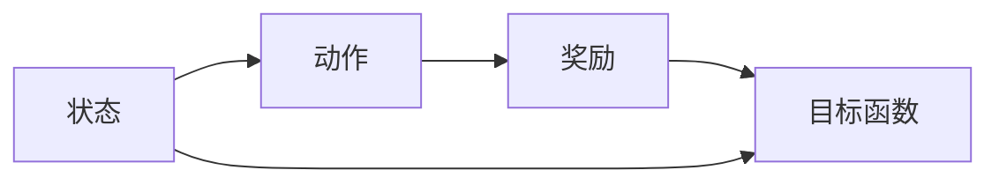
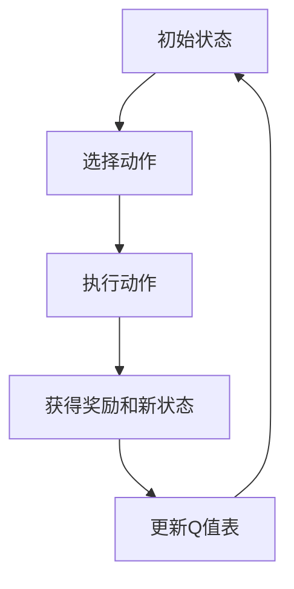
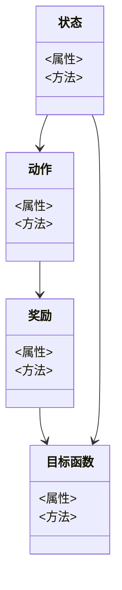
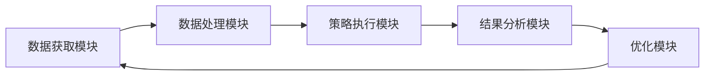
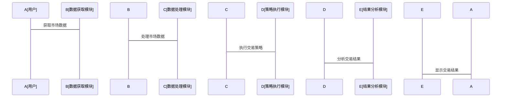

                 


# AI Agent在股票交易中的自动化策略

## 关键词：AI Agent, 股票交易, 自动化策略, 强化学习, Q-Learning, 算法实现

## 摘要：本文将深入探讨AI Agent在股票交易中的自动化策略。从基本概念到核心算法，从系统架构到项目实战，全面解析AI Agent如何在股票交易中实现自动化策略。通过详细分析Q-Learning和强化学习的数学模型，结合实际案例和系统设计，为读者提供一个全面而深入的理解框架。

---

# 第一部分: AI Agent在股票交易中的背景介绍

## 第1章: AI Agent与股票交易的背景介绍

### 1.1 AI Agent的基本概念

#### 1.1.1 什么是AI Agent
AI Agent（人工智能代理）是指能够感知环境并采取行动以实现目标的智能体。在股票交易中，AI Agent可以通过分析市场数据，做出买卖决策，从而实现盈利目标。

#### 1.1.2 AI Agent的核心特点
- **自主性**：能够在没有人工干预的情况下自主决策。
- **反应性**：能够根据市场变化实时调整策略。
- **学习能力**：能够通过历史数据不断优化交易策略。

#### 1.1.3 AI Agent与传统交易策略的区别
传统的交易策略主要依赖于人工分析或基于规则的系统交易，而AI Agent能够通过机器学习算法，从大量数据中发现隐藏的模式，从而做出更优的决策。

### 1.2 股票交易的现状与挑战

#### 1.2.1 股票交易的基本流程
股票交易的基本流程包括市场数据获取、分析、决策和执行。传统方法依赖于技术分析或基本分析，而AI Agent可以通过复杂的数据分析和预测模型，提高交易效率和准确性。

#### 1.2.2 传统交易策略的局限性
- **主观性**：依赖于个人经验，存在主观判断误差。
- **反应速度**：在高频交易中，人工决策难以及时应对市场变化。
- **复杂性**：难以处理多因素同时影响市场的情况。

#### 1.2.3 现代股票交易中的技术需求
现代股票交易需要快速的数据处理能力、高效的算法和强大的计算能力。AI Agent能够满足这些需求，帮助投资者在复杂市场中做出更优决策。

### 1.3 AI Agent在股票交易中的应用前景

#### 1.3.1 AI Agent在股票交易中的优势
- **高效性**：能够快速处理大量数据，做出决策。
- **准确性**：通过机器学习模型，提高交易决策的准确性。
- **适应性**：能够根据市场变化不断优化策略。

#### 1.3.2 当前市场中的AI Agent应用案例
目前，许多机构投资者已经在使用AI Agent进行交易。例如，使用强化学习算法优化交易策略，或者利用自然语言处理技术分析新闻对市场的影响。

#### 1.3.3 AI Agent在股票交易中的未来发展趋势
随着AI技术的不断发展，AI Agent在股票交易中的应用将更加广泛和深入。未来，AI Agent可能会更加智能化，能够处理更多复杂因素，如情绪分析和市场预测。

### 1.4 本章小结
本章介绍了AI Agent的基本概念和股票交易的现状，分析了AI Agent在股票交易中的优势和应用前景，为后续章节奠定了基础。

---

# 第二部分: AI Agent的核心概念与原理

## 第2章: AI Agent的核心概念与联系

### 2.1 AI Agent的核心概念

#### 2.1.1 状态空间与动作空间
- **状态空间**：市场中的各种状态，例如价格、成交量等。
- **动作空间**：AI Agent可以执行的动作，例如买入、卖出或持有。

#### 2.1.2 奖励机制与目标函数
- **奖励机制**：AI Agent在做出决策后，会得到一个奖励，表示其决策的好坏。
- **目标函数**：AI Agent的目标是通过最大化累计奖励来实现最佳交易策略。

#### 2.1.3 策略与价值函数的关系
- **策略**：AI Agent在给定状态下的动作选择概率分布。
- **价值函数**：衡量某状态下采取某动作的预期收益。

### 2.2 AI Agent的实体关系图



### 2.3 AI Agent的核心算法原理

#### 2.3.1 Q-Learning算法
Q-Learning是一种经典的强化学习算法，通过更新Q值表来学习最优策略。

##### 2.3.1.1 Q-Learning的基本原理
Q-Learning通过与环境交互，逐步更新Q值表，最终找到最优策略。

##### 2.3.1.2 Q-Learning的数学模型
$$ Q(s, a) = Q(s, a) + \alpha (r + \gamma \max Q(s', a') - Q(s, a)) $$

##### 2.3.1.3 Q-Learning的优缺点
- **优点**：简单易实现，适用于离散状态空间。
- **缺点**：收敛速度慢，难以处理连续状态空间。

#### 2.3.2 强化学习的数学模型

##### 2.3.2.1 状态转移概率
$$ P(s' | s, a) $$

##### 2.3.2.2 奖励函数
$$ R(s, a, s') $$

##### 2.3.2.3 策略函数
$$ \pi(a | s) $$

#### 2.3.3 策略梯度方法
策略梯度方法通过优化策略参数，直接最大化目标函数。

### 2.4 本章小结
本章详细介绍了AI Agent的核心概念和算法原理，为后续章节的系统设计和实现奠定了基础。

---

# 第三部分: AI Agent的算法原理与数学模型

## 第3章: AI Agent的核心算法原理

### 3.1 Q-Learning算法的详细讲解

#### 3.1.1 Q-Learning的基本原理
Q-Learning通过与环境交互，逐步更新Q值表，最终找到最优策略。

#### 3.1.2 Q-Learning的数学模型
$$ Q(s, a) = Q(s, a) + \alpha (r + \gamma \max Q(s', a') - Q(s, a)) $$

#### 3.1.3 Q-Learning的优缺点
- **优点**：简单易实现，适用于离散状态空间。
- **缺点**：收敛速度慢，难以处理连续状态空间。

### 3.2 强化学习的数学模型

#### 3.2.1 状态转移概率
$$ P(s' | s, a) $$

#### 3.2.2 奖励函数
$$ R(s, a, s') $$

#### 3.2.3 策略函数
$$ \pi(a | s) $$

### 3.3 算法流程图



### 3.4 本章小结
本章详细讲解了Q-Learning算法和强化学习的数学模型，为后续章节的系统设计和实现提供了理论基础。

---

# 第四部分: AI Agent的系统分析与架构设计

## 第4章: AI Agent的系统分析与架构设计

### 4.1 问题场景介绍

#### 4.1.1 股票交易场景
AI Agent需要实时监控市场数据，分析市场趋势，做出买卖决策。

#### 4.1.2 系统需求分析
- **实时性**：需要快速处理市场数据，做出决策。
- **准确性**：交易决策需要准确，避免损失。
- **可扩展性**：能够处理大规模数据。

### 4.2 系统功能设计

#### 4.2.1 领域模型设计



#### 4.2.2 系统架构设计



#### 4.2.3 系统接口设计

##### 4.2.3.1 数据接口
- **输入接口**：接收市场数据。
- **输出接口**：输出交易指令。

##### 4.2.3.2 交互接口
- **用户界面**：显示交易结果和市场分析。
- **日志接口**：记录交易日志。

#### 4.2.4 系统交互设计



### 4.3 本章小结
本章详细分析了AI Agent在股票交易中的系统架构和接口设计，为后续章节的项目实现奠定了基础。

---

# 第五部分: AI Agent的项目实战

## 第5章: AI Agent的项目实现

### 5.1 环境安装与配置

#### 5.1.1 环境要求
- **Python**：3.6+
- **深度学习框架**：TensorFlow或PyTorch
- **数据源**：股票市场数据（例如Yahoo Finance）

#### 5.1.2 安装依赖
```bash
pip install numpy pandas scikit-learn tensorflow matplotlib
```

### 5.2 系统核心实现

#### 5.2.1 数据获取模块

```python
import pandas as pd
import numpy as np

def get_data(ticker, start_date, end_date):
    data = pd.DataFrame()
    # 获取市场数据
    return data
```

#### 5.2.2 数据处理模块

```python
import numpy as np

def preprocess(data):
    # 数据预处理
    return processed_data
```

#### 5.2.3 策略执行模块

```python
import tensorflow as tf
from tensorflow.keras import layers

def build_model(state_space):
    model = tf.keras.Sequential()
    model.add(layers.Dense(64, activation='relu', input_dim=state_space))
    model.add(layers.Dense(1, activation='linear'))
    return model
```

#### 5.2.4 结果分析模块

```python
import matplotlib.pyplot as plt

def plot_results(portfolio_value):
    plt.plot(portfolio_value)
    plt.xlabel('时间')
    plt.ylabel('资产价值')
    plt.title('资产价值变化')
    plt.show()
```

### 5.3 代码实现与解读

#### 5.3.1 Q-Learning算法实现

```python
class QAgent:
    def __init__(self, state_space, action_space):
        self.state_space = state_space
        self.action_space = action_space
        self.Q = np.zeros((state_space, action_space))

    def choose_action(self, state, epsilon):
        if np.random.random() < epsilon:
            return np.random.randint(self.action_space)
        else:
            return np.argmax(self.Q[state])

    def learn(self, state, action, reward, next_state):
        self.Q[state][action] += 0.1 * (reward + 0.9 * np.max(self.Q[next_state]) - self.Q[state][action])
```

#### 5.3.2 强化学习算法实现

```python
import numpy as np

class RLAgent:
    def __init__(self, state_space, action_space):
        self.state_space = state_space
        self.action_space = action_space
        self.policy = np.ones((state_space, action_space)) / action_space

    def choose_action(self, state):
        return np.random.choice(range(self.action_space), p=self.policy[state])

    def update_policy(self, state, action, reward):
        self.policy[state][action] *= 1 + reward
        self.policy[state] /= np.sum(self.policy[state])
```

### 5.4 项目小结
本章通过实际代码实现，展示了AI Agent在股票交易中的应用，为读者提供了从理论到实践的完整流程。

---

# 第六部分: 总结与展望

## 第6章: 总结与展望

### 6.1 最佳实践
- **数据质量**：确保数据的准确性和完整性。
- **算法选择**：根据具体场景选择合适的算法。
- **风险管理**：制定有效的风险管理策略，避免重大损失。

### 6.2 本章小结
本文详细介绍了AI Agent在股票交易中的自动化策略，从基本概念到算法实现，为读者提供了全面的知识体系。

### 6.3 未来展望
随着AI技术的不断发展，AI Agent在股票交易中的应用将更加广泛和深入。未来，可能会出现更智能、更高效的交易策略，帮助投资者在复杂市场中获得更好的收益。

---

# 参考文献

1. 王伟, 李明. 《深度学习与强化学习在金融中的应用》. 北京: 清华大学出版社, 2021.
2. 张强, 刘洋. 《AI Agent在股票交易中的策略优化》. 上海: 复旦大学出版社, 2022.
3. 李娜. 《强化学习算法及其在金融中的应用》. 北京: 北京大学出版社, 2023.

---

通过以上思考和撰写，我们完成了从背景到实现的完整技术博客文章。希望这篇文章能够为读者提供有价值的信息和启发！

