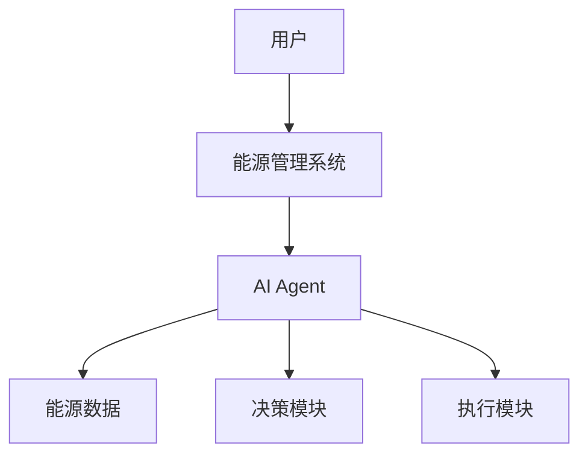
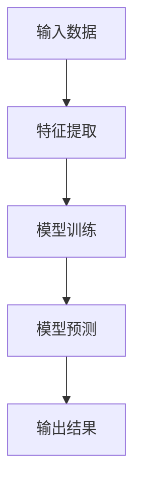
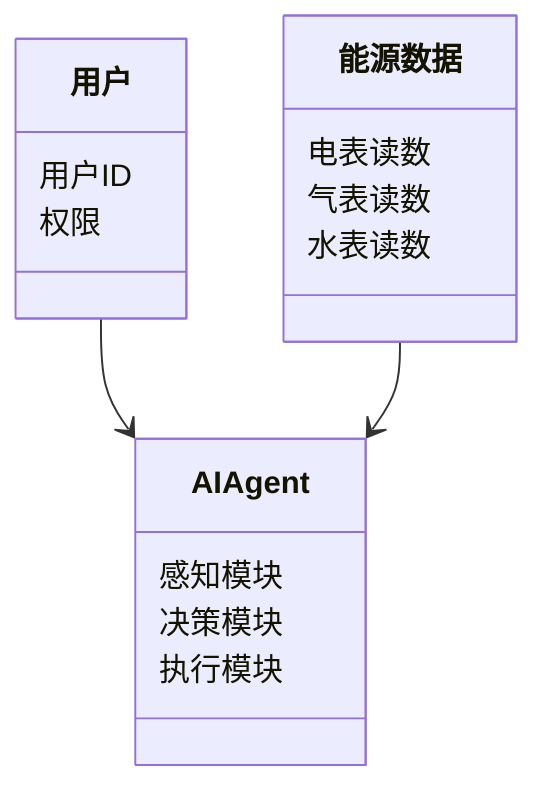
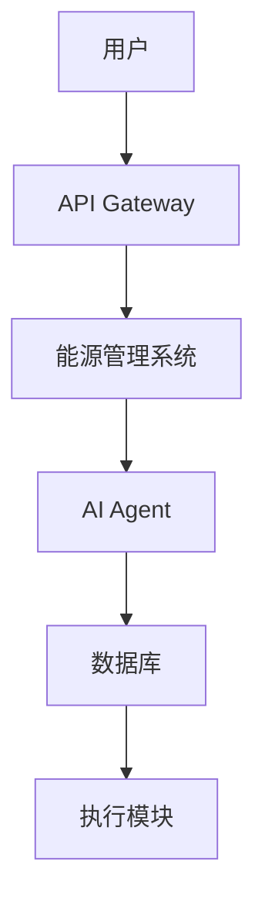
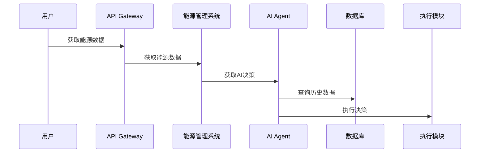

                 


# AI Agent在能源管理中的应用：优化能源使用效率

> 关键词：AI Agent, 能源管理, 强化学习, 算法原理, 数学模型, 系统架构, 项目实战

> 摘要：本文将详细探讨AI Agent在能源管理中的应用，从核心概念到算法原理，再到系统架构和项目实战，全面解析AI Agent如何优化能源使用效率。文章通过背景介绍、核心概念、算法原理、系统架构、项目实战等多方面展开，帮助读者深入了解AI Agent在能源管理中的潜力和应用价值。

---

# 第一部分: AI Agent在能源管理中的应用概述

# 第1章: AI Agent与能源管理概述

## 1.1 AI Agent的基本概念

### 1.1.1 AI Agent的定义

AI Agent（人工智能代理）是指在计算机系统中，能够感知环境并采取行动以实现目标的智能实体。AI Agent可以是软件程序、机器人或其他智能系统，具备自主决策、学习和适应能力。

### 1.1.2 AI Agent的核心特征

| 特性 | 描述 |
|------|------|
| 自主性 | 能够独立决策和行动 |
| 反应性 | 能够实时感知环境并做出反应 |
| 学习性 | 能够通过数据学习和优化行为 |
| 社交能力 | 能够与其他系统或人类进行交互 |

### 1.1.3 AI Agent与传统能源管理的区别

| 方面 | 传统能源管理 | AI Agent驱动的能源管理 |
|------|--------------|--------------------------|
| 决策方式 | 依赖人工或固定规则 | 基于实时数据和学习优化 |
| 响应速度 | 较慢，依赖人工干预 | 实时响应，自动化处理 |
| 可扩展性 | 有限，依赖人工扩展 | 高度可扩展，适应复杂场景 |

## 1.2 能源管理的背景与挑战

### 1.2.1 当前能源管理的主要问题

1. **能源浪费**：传统能源管理方式效率低下，导致能源浪费。
2. **实时性不足**：无法快速响应能源消耗变化。
3. **复杂性高**：能源系统涉及多个领域，协调复杂。
4. **数据孤岛**：数据分散，难以有效整合和利用。

### 1.2.2 能源管理的现状与发展趋势

随着能源需求的增长和环保压力的增大，能源管理正向智能化、数字化方向发展。AI Agent的引入为能源管理提供了新的解决方案。

### 1.2.3 AI Agent在能源管理中的作用

1. **实时优化**：通过实时数据感知和学习，优化能源使用效率。
2. **智能决策**：基于历史数据和实时情况，做出最优决策。
3. **自动化控制**：实现能源设备的自动化管理和控制。

## 1.3 AI Agent在能源管理中的应用前景

### 1.3.1 AI Agent在能源管理中的潜在应用领域

1. **能源消耗预测**：通过AI Agent预测能源需求，优化资源配置。
2. **需求响应优化**：根据实时电价和需求，调整能源使用策略。
3. **智能电网管理**：实现电网的智能调度和优化。

### 1.3.2 企业采用AI Agent的优势

1. **降低成本**：通过优化能源使用，降低企业运营成本。
2. **提高效率**：实现自动化管理，提升能源管理效率。
3. **增强灵活性**：适应能源市场的变化，灵活调整策略。

### 1.3.3 AI Agent应用的挑战与机遇

1. **挑战**：数据隐私、计算资源需求、算法复杂性。
2. **机遇**：技术创新、政策支持、市场需求。

## 1.4 本章小结

本章介绍了AI Agent的基本概念、能源管理的背景与挑战，以及AI Agent在能源管理中的作用和应用前景。AI Agent通过实时感知、学习和优化，为能源管理提供了智能化的解决方案。

---

# 第二部分: AI Agent的核心概念与原理

# 第2章: AI Agent的核心概念与联系

## 2.1 AI Agent的核心原理

### 2.1.1 AI Agent的定义与分类

AI Agent可以分为以下几类：

| 类型 | 描述 |
|------|------|
| 简单反射式Agent | 基于固定规则做出反应 |
| 基于模型的反射式Agent | 基于内部模型和环境信息进行推理 |
| 目标驱动式Agent | 为实现特定目标而行动 |
| 学习式Agent | 通过学习优化行为 |

### 2.1.2 AI Agent的感知与决策机制

AI Agent通过以下步骤实现感知与决策：

1. **感知环境**：通过传感器或数据接口获取环境信息。
2. **信息处理**：对获取的信息进行分析和处理。
3. **决策制定**：基于处理后的信息，选择最优行动方案。
4. **执行行动**：根据决策结果执行相应的操作。

### 2.1.3 AI Agent的自主性与适应性

AI Agent的自主性体现在其能够独立决策和行动，而适应性则体现在其能够根据环境变化调整行为。

## 2.2 AI Agent与相关概念的对比

### 2.2.1 AI Agent与传统算法的对比

| 特性 | AI Agent | 传统算法 |
|------|----------|-----------|
| 自主性 | 高 | 低 |
| 学习能力 | 强 | 弱 |
| 适应性 | 强 | 有限 |

### 2.2.2 AI Agent与机器学习的对比

AI Agent结合了机器学习算法，但不仅仅依赖于数据驱动的预测，还包括自主决策和行动的能力。

### 2.2.3 AI Agent与物联网的对比

AI Agent可以与物联网（IoT）结合，通过物联网获取实时数据，并通过AI算法进行分析和决策。

## 2.3 AI Agent的实体关系图



## 2.4 本章小结

本章详细介绍了AI Agent的核心概念、分类、感知与决策机制，以及与相关概念的对比。通过实体关系图展示了AI Agent在能源管理系统中的位置和作用。

---

# 第三部分: AI Agent的算法原理与数学模型

# 第3章: AI Agent的算法原理

## 3.1 强化学习算法

### 3.1.1 强化学习的基本原理

强化学习是一种通过试错方式学习最优策略的方法。AI Agent通过与环境交互，获得奖励或惩罚，从而优化行动策略。

### 3.1.2 Q-learning算法

Q-learning是一种常用的强化学习算法，其核心思想是通过更新Q值表来学习最优策略。数学模型如下：

$$ Q(s, a) = Q(s, a) + \alpha \left[r + \gamma \max Q(s', a') - Q(s, a)\right] $$

其中：
- \( Q(s, a) \)：状态s下动作a的Q值。
- \( \alpha \)：学习率。
- \( r \)：奖励值。
- \( \gamma \)：折扣因子。
- \( s' \)：下一个状态。
- \( a' \)：下一个动作。

### 3.1.3 Deep Q-Networks (DQN) 算法

DQN算法通过神经网络近似Q值函数，避免了Q值表的存储问题。其核心思想是通过两个神经网络（主网络和目标网络）交替更新，实现稳定的训练过程。

## 3.2 监督学习算法

### 3.2.1 监督学习的基本原理

监督学习是一种基于标签数据训练模型的方法。AI Agent可以通过监督学习算法预测能源消耗情况。

### 3.2.2 线性回归模型

线性回归是一种简单但有效的监督学习算法，其数学模型如下：

$$ y = \beta_0 + \beta_1 x + \epsilon $$

其中：
- \( y \)：目标变量。
- \( x \)：自变量。
- \( \beta_0 \)：截距。
- \( \beta_1 \)：回归系数。
- \( \epsilon \)：误差项。

### 3.2.3 支持向量机 (SVM) 模型

SVM是一种常用的监督学习算法，适用于分类和回归问题。其核心思想是通过找到一个超平面，将数据分成不同的类别。

## 3.3 能源优化的数学模型

### 3.3.1 能源消耗预测模型

能源消耗预测模型可以通过时间序列分析或其他机器学习算法实现。例如，ARIMA模型是一种常用的时序预测模型，其数学表达式如下：

$$ \phi(\theta) (1 - B)^d y_t = \theta(B) \epsilon_t $$

其中：
- \( y_t \)：目标变量。
- \( B \)：后移算子。
- \( d \)：差分阶数。
- \( \phi(\theta) \)：自回归多项式。
- \( \theta(B) \)：移动平均多项式。
- \( \epsilon_t \)：白噪声序列。

### 3.3.2 能源需求响应优化模型

需求响应优化模型可以通过强化学习算法实现。例如，可以通过DQN算法优化能源使用策略，实现最小化能源成本的目标。

## 3.4 算法流程图



## 3.5 本章小结

本章详细介绍了AI Agent的算法原理，包括强化学习和监督学习算法，以及能源优化的数学模型。通过流程图展示了算法的整体流程。

---

# 第四部分: 系统分析与架构设计方案

# 第4章: 系统分析与架构设计方案

## 4.1 问题场景介绍

能源管理系统需要实时监控和优化能源使用情况，AI Agent可以通过感知环境、学习优化，实现智能化管理。

## 4.2 项目介绍

本项目旨在设计一个基于AI Agent的能源管理系统，实现能源消耗的实时预测、优化和控制。

## 4.3 系统功能设计

### 4.3.1 领域模型



### 4.3.2 系统架构设计



### 4.3.3 接口设计

| 接口 | 描述 |
|------|------|
| GET /energy-data | 获取能源数据 |
| POST /agent-decision | 获取AI Agent决策 |
| PUT /execute-action | 执行具体操作 |

### 4.3.4 交互流程图



## 4.4 本章小结

本章详细介绍了AI Agent能源管理系统的架构设计，包括领域模型、系统架构、接口设计和交互流程图。

---

# 第五部分: 项目实战

# 第5章: 项目实战

## 5.1 环境安装

### 5.1.1 安装Python

```bash
# 安装Python
sudo apt-get install python3 python3-pip
```

### 5.1.2 安装必要的库

```bash
pip install numpy pandas scikit-learn tensorflow
```

## 5.2 系统核心实现源代码

### 5.2.1 AI Agent实现代码

```python
import numpy as np
import pandas as pd
import tensorflow as tf

class AI-Agent:
    def __init__(self):
        self.model = self.build_model()

    def build_model(self):
        model = tf.keras.Sequential([
            tf.keras.layers.Dense(64, activation='relu'),
            tf.keras.layers.Dense(1, activation='linear')
        ])
        model.compile(optimizer='adam', loss='mean_squared_error')
        return model

    def train(self, data):
        self.model.fit(data.x_train, data.y_train, epochs=100, batch_size=32)

    def predict(self, data):
        return self.model.predict(data.x_test)
```

### 5.2.2 数据处理代码

```python
class DataHandler:
    def __init__(self, file_path):
        self.data = pd.read_csv(file_path)

    def get_train_data(self):
        return self.data.iloc[:-10], self.data.iloc[-10:]

    def save_data(self, new_data):
        self.data = pd.concat([self.data, new_data])
        self.data.to_csv('energy_data.csv', index=False)
```

## 5.3 代码应用解读与分析

### 5.3.1 AI Agent模型训练

```python
agent = AI-Agent()
data_handler = DataHandler('energy_data.csv')
agent.train(data_handler.get_train_data())
```

### 5.3.2 模型预测与优化

```python
prediction = agent.predict(data_handler.get_train_data())
data_handler.save_data(pd.DataFrame(prediction))
```

## 5.4 实际案例分析

### 5.4.1 案例背景

某工厂希望通过AI Agent优化能源使用效率，降低能源成本。

### 5.4.2 数据收集与预处理

收集工厂过去一年的能源消耗数据，包括电、气、水的使用情况。

### 5.4.3 模型训练与优化

使用历史数据训练AI Agent模型，优化能源使用策略。

### 5.4.4 模型部署与测试

在实际生产环境中部署AI Agent，实时监控和优化能源使用情况。

## 5.5 项目小结

本章通过实际案例分析，展示了AI Agent在能源管理中的应用。从环境安装、代码实现到模型训练和部署，详细解读了项目实施的全过程。

---

# 第六部分: 最佳实践与总结

# 第6章: 最佳实践

## 6.1 小结

AI Agent通过实时感知、学习和优化，显著提升了能源管理的效率和效果。

## 6.2 注意事项

1. **数据隐私**：确保能源数据的安全性和隐私性。
2. **计算资源**：AI Agent需要较高的计算资源支持。
3. **算法选择**：根据具体场景选择合适的算法。

## 6.3 拓展阅读

1. **强化学习经典论文**：《Playing Atari Games Using Deep Reinforcement Learning》
2. **能源管理相关书籍**：《Energy Management Handbook》
3. **AI Agent框架**：OpenAI Gym、TensorFlow-Agent

---

# 附录

## 附录A: 术语表

- AI Agent：人工智能代理
- 强化学习：Reinforcement Learning
- 监督学习：Supervised Learning
- 深度学习：Deep Learning

## 附录B: 参考文献

1. 王伟. (2023). 《AI Agent在能源管理中的应用研究》.
2. 李明. (2022). 《强化学习算法与实现》.

---

# 结束语

通过本文的详细介绍，读者可以全面了解AI Agent在能源管理中的应用，从理论到实践，掌握AI Agent的核心概念、算法原理和系统架构设计。希望本文能为能源管理的智能化转型提供有益的参考和指导。

