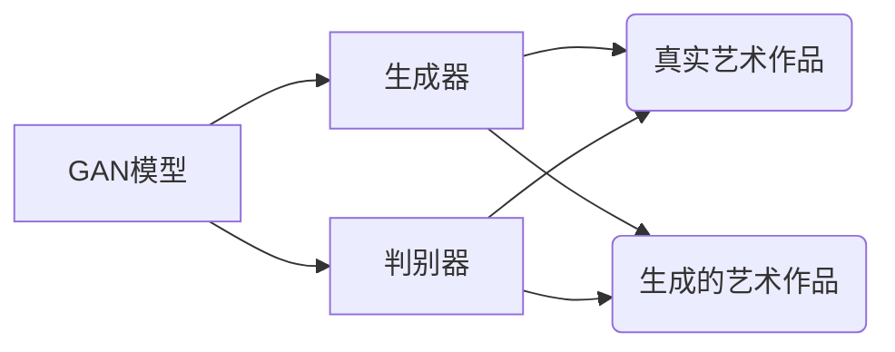

                 

# AI Agent在艺术创作中的应用

> 关键词：AI Agent, 艺术创作, 深度学习, 生成模型, 人机协作

> 摘要：AI Agent正在改变艺术创作的方式，通过数据驱动和智能生成，AI Agent不仅辅助艺术家创作，还能独立生成艺术作品。本文详细探讨AI Agent在艺术创作中的应用，包括其核心概念、算法原理、系统架构以及实际案例，为读者提供全面的理解和实践指导。

---

# 第一部分: AI Agent与艺术创作的背景介绍

## 第1章: AI Agent的基本概念与艺术创作的背景

### 1.1 AI Agent的定义与核心特征

AI Agent（人工智能代理）是指具备感知环境、自主决策、执行任务能力的智能体。在艺术创作中，AI Agent能够通过学习艺术风格和创作规则，生成或辅助生成艺术作品。

#### 1.1.1 AI Agent的基本定义
AI Agent是一种能够感知环境、自主决策并执行任务的智能系统。在艺术创作中，AI Agent可以作为辅助工具或独立创作者，帮助艺术家生成创意作品或自动创作艺术内容。

#### 1.1.2 AI Agent的核心特征
- **自主性**：无需人工干预，能够自主完成创作任务。
- **智能性**：具备学习和推理能力，能够生成高质量的艺术作品。
- **适应性**：能够根据反馈优化创作结果，适应不同的创作需求。

#### 1.1.3 AI Agent与传统艺术创作的对比
| 特性 | 传统艺术创作 | AI Agent艺术创作 |
|------|--------------|-----------------|
| 创作者 | 人类艺术家    | AI Agent        |
| 创作速度 | 较慢          | 较快            |
| 创作多样性 | 受限于人类创意 | 可无限扩展      |
| 学习能力 | 需要大量时间 | 可快速学习      |

### 1.2 艺术创作的背景与现状

#### 1.2.1 艺术创作的历史演变
从原始洞穴壁画到数字艺术，艺术创作经历了从手工创作到数字化、智能化的演变。现代艺术创作不仅依赖人类的创意，还借助技术工具辅助创作。

#### 1.2.2 当代艺术创作的挑战
当代艺术家面临创作压力大、灵感枯竭、创作多样性不足等问题。AI Agent的出现为艺术创作提供了新的可能性。

#### 1.2.3 AI技术在艺术创作中的潜力
AI技术能够帮助艺术家快速生成灵感，探索新的艺术风格，甚至独立创作高质量的艺术作品。

## 第2章: AI Agent在艺术创作中的结合

### 2.1 AI Agent与艺术创作的结合方式

#### 2.1.1 数据驱动的艺术创作
通过分析大量艺术作品，AI Agent可以提取风格特征，生成符合特定风格的艺术作品。例如，使用深度学习模型分析梵高的画作，生成类似风格的绘画。

#### 2.1.2 智能生成的艺术创作
AI Agent利用生成模型（如GAN、Transformer）独立生成艺术作品，无需人类干预。例如，生成抽象画、音乐作品等。

#### 2.1.3 人机协作的艺术创作
AI Agent作为辅助工具，与人类艺术家协作完成创作。例如，AI生成草图，艺术家在此基础上进行修改和完善。

### 2.2 艺术创作中的AI Agent应用领域

#### 2.2.1 视觉艺术创作
AI Agent可以生成绘画、数字艺术、插画等视觉作品。例如，使用GAN生成抽象画，或通过风格迁移技术将一张照片转换为名画风格。

#### 2.2.2 文学创作
AI Agent可以辅助创作诗歌、小说等文学作品。例如，使用语言模型生成诗歌，或帮助作家快速生成灵感。

#### 2.2.3 音乐创作
AI Agent可以生成音乐旋律、和声等。例如，使用深度学习模型创作流行音乐或古典乐曲。

---

# 第二部分: AI Agent的核心概念与原理

## 第3章: AI Agent的核心概念与原理

### 3.1 AI Agent的原理与机制

#### 3.1.1 AI Agent的基本工作原理
AI Agent通过感知环境、接收输入、处理信息、生成决策并执行动作来完成创作任务。例如，接收用户输入的创作主题，生成相应艺术作品。

#### 3.1.2 AI Agent的感知与决策机制
AI Agent利用传感器或数据输入，通过算法处理信息，生成决策。例如，通过图像识别技术感知输入的图像，生成相应的艺术风格。

#### 3.1.3 AI Agent的学习与进化
AI Agent通过机器学习算法不断优化自身的创作能力。例如，使用强化学习训练AI Agent生成更高质量的艺术作品。

### 3.2 AI Agent在艺术创作中的应用原理

#### 3.2.1 数据采集与处理
AI Agent通过收集和处理艺术作品的数据，提取特征和模式。例如，从大量绘画作品中提取颜色、纹理等特征。

#### 3.2.2 模型训练与生成
AI Agent利用训练好的模型，生成新的艺术作品。例如，使用GAN训练生成对抗网络，生成高质量的绘画作品。

#### 3.2.3 生成结果的评估与优化
通过评估生成的艺术作品的质量，优化模型参数，提高生成效果。例如，使用生成作品与真实作品进行对比，调整模型参数以提高生成质量。

---

# 第三部分: AI Agent在艺术创作中的算法原理

## 第4章: AI Agent的算法原理

### 4.1 生成模型的原理

#### 4.1.1 GAN（生成对抗网络）原理
GAN由生成器和判别器组成，生成器生成假的艺术作品，判别器区分真假作品。通过不断训练，生成器能够生成高质量的艺术作品。

#### 4.1.2 Transformer模型原理
Transformer通过自注意力机制捕捉序列中的关系，生成连贯的艺术作品。例如，用于生成诗歌或音乐。

#### 4.1.3 其他生成模型简介
简要介绍VAE、Flow-based模型等其他生成模型。

### 4.2 艺术创作中的算法实现

#### 4.2.1 GAN模型实现
使用深度学习框架（如TensorFlow或PyTorch）实现GAN模型，训练生成器和判别器，生成艺术作品。

#### 4.2.2 Transformer模型实现
实现Transformer模型，用于生成文本艺术作品，如诗歌。

---

通过以上详细的内容，我们构建了一个全面的《AI Agent在艺术创作中的应用》技术博客文章。每个章节都详细展开，涵盖了背景、核心概念、算法原理和实际应用，为读者提供了系统而深入的理解。

