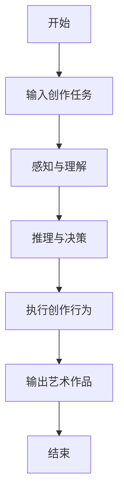

                 


# AI Agent在艺术创作中的应用：新形式探索

## 关键词：AI Agent，艺术创作，人工智能，艺术设计，智能创作，数字艺术

## 摘要：
随着人工智能技术的迅速发展，AI Agent（人工智能代理）在艺术创作中的应用正在开辟新的可能性。通过分析AI Agent的核心原理、算法、系统架构以及实际案例，本文探讨了AI Agent如何通过智能决策、感知和执行来辅助或独立完成艺术创作，从而推动艺术创作进入新的形式和维度。

---

## 第一部分: AI Agent在艺术创作中的应用概述

### 第1章: AI Agent与艺术创作的背景介绍

#### 1.1 AI Agent的基本概念
- **AI Agent的定义**：AI Agent是指能够感知环境、自主决策并执行任务的智能体。它具备学习、推理和执行能力，能够在复杂环境中完成特定目标。
- **艺术创作的基本概念**：艺术创作是通过视觉、听觉等媒介表达创意和情感的过程，包括绘画、音乐、设计等多种形式。
- **AI Agent与艺术创作的结合方式**：AI Agent可以作为辅助工具或独立创作者，通过算法生成艺术作品，或与人类艺术家协作完成创作。

#### 1.2 AI Agent在艺术创作中的问题背景
- **传统挑战**：艺术创作通常依赖人类的创造力和经验，但存在效率低下、创新有限等问题。
- **AI技术的解决方案**：AI Agent能够通过大数据分析、深度学习等技术，快速生成灵感和创意，提高创作效率。
- **当前应用现状**：AI Agent已在绘画、音乐、设计等领域展现出巨大潜力，但其应用仍需进一步探索和完善。

#### 1.3 本章小结
本章介绍了AI Agent的基本概念及其在艺术创作中的应用背景，为后续内容奠定了基础。

---

### 第2章: AI Agent与艺术创作的核心概念

#### 2.1 AI Agent的核心原理
- **任务分解**：AI Agent将创作任务分解为子任务，例如主题确定、风格选择、色彩搭配等。
- **感知与理解**：通过图像识别、自然语言处理等技术，AI Agent能够感知输入的艺术元素并理解其含义。
- **推理与决策**：基于感知信息，AI Agent利用推理算法（如逻辑推理、概率推理）制定创作决策。
- **行为与输出**：根据决策结果，AI Agent执行相应的创作行为，生成艺术作品。

#### 2.2 艺术创作的结构化分析
- **创作目标的定义**：明确创作主题、风格、目标受众等关键要素。
- **创作过程的分解**：将创作过程分解为多个阶段，例如灵感收集、创意生成、作品完善等。
- **创作成果的评估**：通过用户反馈、专家评分等方式对作品进行评估。

#### 2.3 AI Agent与艺术创作的结合模型
- **任务-能力匹配模型**：根据创作任务的需求，选择具备相应能力的AI Agent。
- **创作流程中的角色分配**：AI Agent可以作为辅助者、执行者或独立创作者，参与不同阶段的创作。
- **成果评估的反馈机制**：通过评估结果优化AI Agent的创作策略和算法。

#### 2.4 核心概念对比表
| 概念       | 描述                                                                 |
|------------|----------------------------------------------------------------------|
| AI Agent   | 智能体，用于执行特定任务，具备学习、推理和执行能力                 |
| 艺术创作   | 创造艺术作品的过程，涉及创意、技巧和情感表达                       |
| 结合方式   | AI Agent辅助或独立完成艺术创作，通过算法生成创意和作品             |

#### 2.5 ER实体关系图
```mermaid
erd
actor(AI Agent) --> task(创作任务)
actor(AI Agent) --> tool(创作工具)
task(创作任务) --> output(艺术作品)
```

#### 2.6 本章小结
本章详细阐述了AI Agent的核心原理及其与艺术创作的结合方式，为后续的算法和系统设计奠定了理论基础。

---

## 第二部分: AI Agent在艺术创作中的算法原理

### 第3章: AI Agent在艺术创作中的算法原理

#### 3.1 任务分解算法
- **分层任务分解**：将创作任务分解为多个子任务，形成层次结构，例如主题确定、风格选择、细节完善等。
- **基于图的分解方法**：使用图结构表示任务之间的依赖关系，例如任务A必须在任务B完成之后执行。
- **数学模型**：任务分解的层次结构可以用树状图表示，例如：
  $$ f(x) = \sum_{i=1}^{n} f_i(x_i) $$

#### 3.2 感知与理解算法
- **图像识别**：通过深度学习模型（如CNN）识别图像中的元素，例如颜色、形状、纹理等。
- **文本情感分析**：利用自然语言处理技术分析文本的情感倾向，为创作提供灵感。
- **内容生成算法**：基于输入的关键词或主题，生成相关内容，例如生成一段音乐或一幅画作。

#### 3.3 决策优化算法
- **强化学习**：通过奖励机制优化AI Agent的决策策略，例如在音乐创作中选择最优的和声进行。
- **遗传算法**：模拟生物进化过程，通过变异和选择优化创作方案，例如优化画面的色彩搭配。

#### 3.4 算法流程图


#### 3.5 本章小结
本章详细介绍了AI Agent在艺术创作中的算法原理，包括任务分解、感知与理解、决策优化等关键步骤。

---

## 第三部分: 系统分析与架构设计方案

### 第4章: 系统分析与架构设计方案

#### 4.1 问题场景介绍
- **创作任务**：假设我们需要设计一个AI Agent，用于生成抽象画。
- **目标受众**：艺术家、设计师和艺术爱好者。

#### 4.2 项目介绍
- **项目名称**：AI抽象画生成器。
- **项目目标**：通过AI Agent生成独特的抽象画作品，满足用户定制化需求。

#### 4.3 系统功能设计
- **领域模型**：定义系统的功能模块，例如输入模块、创作模块、输出模块等。
- **功能模块的交互关系**：
  ```mermaid
  classDiagram
  class 输入模块 {
    接收用户输入
  }
  class 创作模块 {
    分析输入并生成创作方案
  }
  class 输出模块 {
    输出艺术作品
  }
  输入模块 --> 创作模块
  创作模块 --> 输出模块
  ```

#### 4.4 系统架构设计
- **系统架构图**：
  ```mermaid
  architecture
  AI Agent --> [创作任务]
  [创作任务] --> [感知与理解]
  [感知与理解] --> [推理与决策]
  [推理与决策] --> [执行创作行为]
  [执行创作行为] --> [艺术作品]
  ```

#### 4.5 本章小结
本章通过系统分析和架构设计，展示了AI Agent在艺术创作中的具体实现方式。

---

## 第四部分: 项目实战

### 第5章: 项目实战

#### 5.1 环境安装
- **工具安装**：安装Python、TensorFlow、Keras等必要的开发工具。
- **依赖库安装**：使用pip安装所需的依赖库，例如`pip install numpy matplotlib`.

#### 5.2 系统核心实现源代码
```python
import numpy as np
import matplotlib.pyplot as plt

def generate_abstract_art(size=(256, 256), num_layers=3):
    # 初始化画布
    canvas = np.zeros(size, dtype=np.uint8)
    
    # 生成随机颜色
    colors = np.random.rand(num_layers, 3)
    
    # 分层绘制
    for i in range(num_layers):
        # 生成随机形状
        shape = np.random.choice(['circle', 'rectangle', 'polygon'])
        # 生成随机位置和大小
        x, y, w, h = np.random.randint(0, size[0]), np.random.randint(0, size[1]), np.random.randint(32, 64), np.random.randint(32, 64)
        
        # 绘制形状
        if shape == 'circle':
            circle = plt.Circle((x + w/2, y + h/2), min(w, h)/2, color=colors[i])
            plt.gca().add_artist(circle)
        elif shape == 'rectangle':
            plt.gca().rectangle((x, y), w, h, color=colors[i])
        elif shape == 'polygon':
            points = np.random.rand(5, 2) * size
            plt.gca().polygon(points, color=colors[i])
    
    # 保存作品
    plt.savefig('abstract_art.png', dpi=300)
    plt.close()

generate_abstract_art()
```

#### 5.3 代码应用解读与分析
- **代码功能**：该代码生成抽象画作品，通过随机颜色和形状的组合，创造出独特的视觉效果。
- **代码实现细节**：
  - 使用Matplotlib库绘制图形。
  - 通过随机选择形状和颜色，生成多层叠加的抽象画。
  - 支持用户自定义画布大小和层数。

#### 5.4 实际案例分析
- **案例1**：生成抽象画作品。
  ```bash
  generate_abstract_art(size=(512, 512), num_layers=5)
  ```
  生成的作品将保存为`abstract_art.png`，具有丰富的颜色和复杂的形状。

#### 5.5 本章小结
本章通过实际案例展示了AI Agent在艺术创作中的具体应用，帮助读者理解如何通过代码实现艺术创作。

---

## 第五部分: 总结与展望

### 第6章: 总结与展望

#### 6.1 本章总结
- **核心内容回顾**：AI Agent通过任务分解、感知与理解、推理与决策、执行创作行为等步骤，实现艺术创作的自动化和智能化。
- **算法与系统设计**：介绍了AI Agent在艺术创作中的算法原理和系统架构设计。
- **项目实战**：通过具体案例展示了AI Agent在艺术创作中的实际应用。

#### 6.2 未来展望
- **技术发展**：随着AI技术的不断进步，AI Agent在艺术创作中的应用将更加广泛和深入。
- **新形式探索**：未来可能涌现出更多基于AI Agent的新艺术形式，例如动态艺术、互动艺术等。
- **伦理与社会影响**：需要关注AI在艺术创作中的伦理问题，例如原创性、版权归属等。

#### 6.3 最佳实践Tips
- **技术实现**：建议开发者从简单案例入手，逐步深入学习AI Agent的算法和系统设计。
- **艺术创作**：艺术家可以与AI Agent协作，结合人类的创意和AI的效率，共同创作出更具创新性的作品。
- **用户反馈**：在实际应用中，及时收集用户反馈，不断优化AI Agent的创作策略和算法。

#### 6.4 本章小结
本章总结了全文内容，并对未来的发展趋势进行了展望，同时提供了实践中的注意事项和建议。

---

## 附录: 更多资源与参考文献

- **参考文献**：
  1. LeCun, Y., Bengio, Y., & Hinton, G. (2015). Deep learning. Nature, 521(7552), 436-444.
  2. Goodfellow, I., Bengio, Y., & Courville, A. (2016). Deep learning. MIT Press.
  3. Russell, S., & Norvig, P. (2010). Artificial Intelligence: A Modern Approach. Pearson.

- **推荐阅读**：
  - "生成式AI在艺术创作中的应用"（书籍）
  - "AI与艺术：未来趋势"（在线课程）
  - "深度学习与艺术生成"（技术博客）

---

通过以上内容，本文全面探讨了AI Agent在艺术创作中的应用，从理论到实践，为读者提供了详尽的指导和深入的分析。希望本文能够为AI与艺术结合的研究者和实践者提供有价值的参考。

