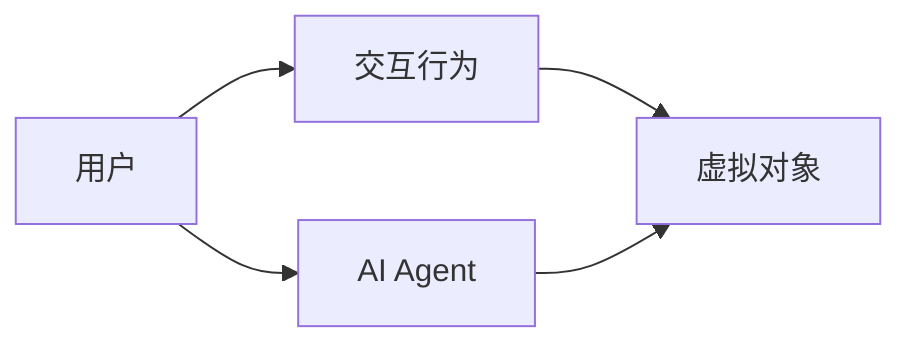
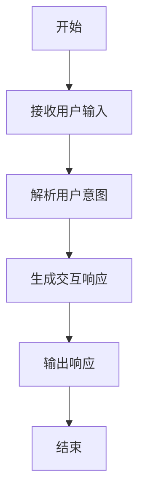
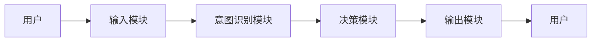
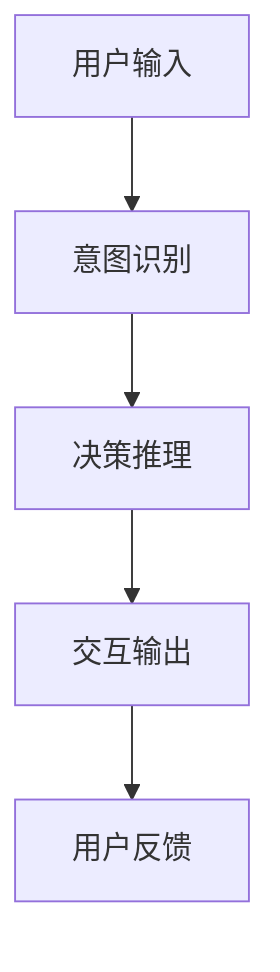
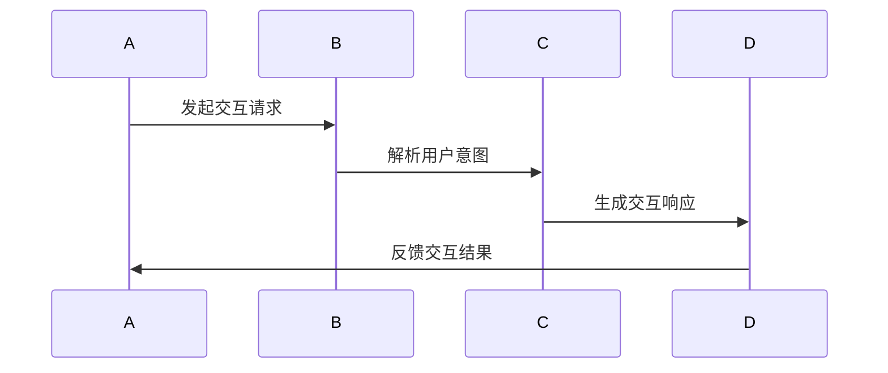

                 


# AI Agent在虚拟现实中的交互设计

## 关键词：虚拟现实、人工智能、交互设计、AI Agent、系统架构

## 摘要：  
随着虚拟现实技术的快速发展，AI Agent在虚拟现实中的交互设计成为了一个新兴且重要的研究方向。本文系统地探讨了AI Agent在虚拟现实中的交互设计的核心概念、算法原理、系统架构以及实际应用。通过分析AI Agent与传统交互设计的差异，结合具体的项目案例，深入剖析了AI Agent在虚拟现实中的独特需求和实现路径，为相关领域的研究和实践提供了理论支持和实践指导。

---

# 第一章: 背景介绍

## 1.1 问题背景

### 1.1.1 虚拟现实技术的发展与应用  
虚拟现实（Virtual Reality，VR）技术近年来取得了显著进展，广泛应用于游戏、教育、医疗、娱乐等领域。随着硬件设备的成熟和软件技术的提升，虚拟现实的沉浸式体验已成为用户需求的重要方向。然而，现有的虚拟现实系统在交互设计上仍存在诸多不足，用户与虚拟环境之间的互动方式单一，缺乏智能化和个性化。

### 1.1.2 AI Agent与虚拟现实的结合  
AI Agent（人工智能代理）是一种能够感知环境、自主决策并执行任务的智能体。将AI Agent引入虚拟现实系统，可以显著提升交互的智能化水平。例如，在虚拟现实教育场景中，AI Agent可以作为虚拟助手，根据用户的实时需求提供个性化的学习指导；在虚拟现实游戏场景中，AI Agent可以作为智能NPC（非玩家角色），增强游戏的互动性和趣味性。

### 1.1.3 当前存在的问题与挑战  
尽管AI Agent在虚拟现实中的应用前景广阔，但其交互设计仍面临诸多挑战。例如，如何实现高效的用户意图识别，如何设计高效的多模态交互方式，如何解决实时性与计算资源的矛盾等。这些问题需要从技术原理、系统架构和实际应用等多个层面进行深入研究。

## 1.2 问题描述

### 1.2.1 AI Agent与虚拟现实交互的核心问题  
AI Agent在虚拟现实中的交互设计需要解决的核心问题是：如何实现智能化、个性化的用户交互体验，同时保证系统的实时性和稳定性。具体来说，需要解决以下问题：  
1. 用户意图的准确识别与理解。  
2. 多模态交互方式的设计与实现。  
3. AI Agent的实时决策与反馈机制。

### 1.2.2 用户需求与技术实现的矛盾  
用户的交互需求往往是动态且多样化的，而技术实现需要在硬件性能、算法复杂度和系统稳定性之间找到平衡。例如，高精度的语音识别和实时的视觉反馈可能会占用大量的计算资源，导致系统性能下降。

### 1.2.3 界定问题的边界与外延  
本文研究的范围限定在虚拟现实环境中的AI Agent交互设计，重点关注以下方面：  
1. 用户与AI Agent之间的多模态交互设计。  
2. AI Agent的实时决策与反馈机制。  
3. 系统架构与实现技术的选择与优化。

## 1.3 问题解决

### 1.3.1 AI Agent在虚拟现实中的解决方案  
为了解决上述问题，本文提出以下解决方案：  
1. 基于深度学习的用户意图识别模型，提升交互的智能化水平。  
2. 设计多模态交互界面，支持语音、手势和表情等多种交互方式。  
3. 优化AI Agent的决策算法，确保其实时性和稳定性。

### 1.3.2 核心概念与技术实现路径  
本文的核心概念包括：  
1. 用户意图识别：通过自然语言处理和计算机视觉技术，准确理解用户的交互需求。  
2. 多模态交互设计：结合语音、手势和表情等多种交互方式，提升用户体验。  
3. AI Agent决策模型：基于强化学习和知识图谱，实现智能化的决策与反馈。

## 1.4 核心概念结构与组成

### 1.4.1 AI Agent的基本组成  
AI Agent在虚拟现实中的交互系统主要包括以下组成部分：  
1. **用户输入模块**：负责接收用户的多模态输入，如语音、手势和表情。  
2. **意图识别模块**：基于机器学习模型，解析用户的交互需求。  
3. **决策模块**：根据用户的意图和虚拟环境的状态，生成交互响应。  
4. **输出模块**：将决策结果反馈给用户，如语音回答、动画效果等。

### 1.4.2 虚拟现实交互的核心要素  
虚拟现实交互的核心要素包括：  
1. **沉浸式体验**：通过高精度的图形渲染和实时反馈，增强用户的沉浸感。  
2. **智能化交互**：通过AI Agent实现个性化的用户互动。  
3. **实时性与稳定性**：确保系统的实时响应和稳定运行。

### 1.4.3 交互设计的系统架构  
AI Agent在虚拟现实中的交互设计系统架构如下：  
1. **用户输入层**：接收用户的多模态输入，如语音指令、手势操作等。  
2. **意图识别层**：解析用户的交互需求，生成相应的决策指令。  
3. **决策与执行层**：基于AI Agent的决策模型，生成交互响应，并驱动虚拟环境的动态变化。  
4. **输出与反馈层**：将交互结果反馈给用户，如语音回答、动画效果等。

---

# 第二章: AI Agent的核心概念与联系

## 2.1 核心概念原理

### 2.1.1 AI Agent的基本原理  
AI Agent是一种能够感知环境、自主决策并执行任务的智能体。其核心原理包括以下几点：  
1. **感知环境**：通过传感器或用户输入获取环境信息。  
2. **理解需求**：基于机器学习模型，解析用户的交互需求。  
3. **决策与执行**：根据理解和环境状态，生成交互响应并执行任务。  

### 2.1.2 虚拟现实交互的核心机制  
虚拟现实交互的核心机制包括：  
1. **实时反馈**：用户的行为需要实时反映在虚拟环境中。  
2. **沉浸式体验**：通过高精度的图形渲染和音效设计，增强用户的沉浸感。  
3. **智能化互动**：通过AI Agent实现个性化的用户互动。

### 2.1.3 交互设计的理论基础  
交互设计的理论基础包括：  
1. **用户中心设计**：以用户需求为核心，设计交互流程。  
2. **多模态交互理论**：支持多种交互方式，提升用户体验。  
3. **认知科学**：研究用户的认知过程，优化交互设计。

## 2.2 核心概念对比表

| **对比维度**       | **传统交互设计**                   | **AI Agent交互设计**                  |
|--------------------|------------------------------------|---------------------------------------|
| **交互主体**       | 用户与虚拟环境                    | 用户与AI Agent                        |
| **交互方式**       | 单一模态（如按钮、键盘）            | 多模态（如语音、手势、表情）          |
| **交互逻辑**       | 预定义的规则驱动                  | AI Agent自主决策驱动                |
| **灵活性**         | 较低，依赖预定义的交互规则          | 较高，AI Agent可根据上下文动态调整    |

## 2.3 ER实体关系图



---

# 第三章: AI Agent的算法原理

## 3.1 算法原理概述

### 3.1.1 AI Agent的决策机制  
AI Agent的决策机制基于强化学习和知识图谱。其核心步骤包括：  
1. **状态感知**：通过传感器或用户输入获取当前环境状态。  
2. **意图识别**：基于机器学习模型，解析用户的交互需求。  
3. **决策推理**：结合环境状态和用户需求，生成交互响应。  
4. **执行与反馈**：将决策结果反馈给用户，并根据用户反馈优化决策模型。

### 3.1.2 交互模型的构建  
交互模型的构建需要考虑以下因素：  
1. **用户特征**：如用户的兴趣、偏好和行为习惯。  
2. **环境特征**：如虚拟环境的动态变化和空间布局。  
3. **交互历史**：如用户的历史行为和交互记录。

### 3.1.3 算法实现的关键步骤  
算法实现的关键步骤包括：  
1. **数据采集**：收集用户的多模态输入数据。  
2. **特征提取**：对数据进行特征提取，生成可供模型处理的特征向量。  
3. **模型训练**：基于深度学习模型（如Transformer、LSTM）训练意图识别模型。  
4. **决策推理**：基于强化学习算法（如Q-Learning、DQN）生成交互响应。

## 3.2 算法流程图



## 3.3 算法实现代码

```python
import numpy as np
from sklearn.neural_network import MLPClassifier

# 示例：基于MLP的意图识别模型
def train_model(X_train, y_train):
    model = MLPClassifier(hidden_layer_sizes=(100, 50), max_iter=1000)
    model.fit(X_train, y_train)
    return model

def predict_model(model, X_test):
    y_pred = model.predict(X_test)
    return y_pred

# 示例数据
X_train = np.random.rand(100, 10)
y_train = np.random.randint(0, 5, 100)

model = train_model(X_train, y_train)
X_test = np.random.rand(10, 10)
y_pred = predict_model(model, X_test)
print(y_pred)
```

---

# 第四章: 系统架构与设计

## 4.1 系统功能设计

### 4.1.1 系统功能模块  
系统功能模块包括：  
1. **用户输入模块**：支持语音、手势和表情等多种交互方式。  
2. **意图识别模块**：基于机器学习模型，解析用户的交互需求。  
3. **决策模块**：基于强化学习算法，生成交互响应。  
4. **输出模块**：将交互结果反馈给用户，如语音回答、动画效果等。

### 4.1.2 系统功能流程  
系统功能流程如下：  
1. 用户通过多模态输入发起交互请求。  
2. 系统解析用户的交互需求，生成决策指令。  
3. AI Agent根据决策指令，生成交互响应。  
4. 系统将交互结果反馈给用户，完成一次完整的交互循环。

## 4.2 系统架构设计

### 4.2.1 系统架构图



### 4.2.2 系统接口设计  
系统接口设计包括：  
1. **输入接口**：支持语音、手势和表情等多种交互方式的输入接口。  
2. **输出接口**：支持语音、文本和动画等多种交互结果的输出接口。  
3. **数据接口**：支持与虚拟环境的实时数据交互，如三维空间数据和用户行为数据。

## 4.3 交互设计

### 4.3.1 交互流程图



### 4.3.2 交互序列图



---

# 第五章: 项目实战

## 5.1 环境安装与配置

### 5.1.1 系统要求  
1. **硬件要求**：高性能PC或虚拟现实设备。  
2. **软件要求**：安装Python、TensorFlow、OpenCV等开发工具。

### 5.1.2 环境配置  
```bash
# 示例：安装Python依赖
pip install numpy
pip install scikit-learn
pip install matplotlib
```

## 5.2 核心代码实现

### 5.2.1 意图识别模块

```python
from sklearn.feature_extraction.text import TfidfVectorizer
from sklearn.svm import SVC

# 示例：基于SVM的意图识别模型
def train_model(X_train, y_train):
    vectorizer = TfidfVectorizer()
    X_vec = vectorizer.fit_transform(X_train).toarray()
    model = SVC(C=1.0, kernel='rb

