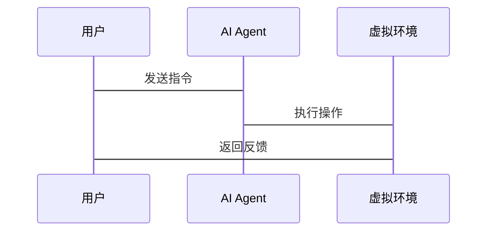

                 


# AI Agent在虚拟现实中的应用

## 关键词：AI Agent，虚拟现实，人工智能，智能交互，多智能体协作，强化学习，系统架构设计

## 摘要：  
AI Agent（人工智能代理）与虚拟现实（Virtual Reality，VR）的结合为现代信息技术的发展带来了新的机遇。随着人工智能和虚拟现实技术的不断进步，AI Agent在虚拟现实中的应用逐渐展现出其强大的潜力和广阔的应用前景。本文将从AI Agent的基本概念、算法原理、系统架构设计、项目实战等多个维度，深入探讨AI Agent在虚拟现实中的应用。通过分析AI Agent在虚拟现实中的核心算法、系统设计和实际案例，本文旨在为读者提供一个全面且系统的理解，帮助其掌握AI Agent在虚拟现实中的应用原理和实践方法。

---

## 第1章: AI Agent与虚拟现实的基本概念

### 1.1 AI Agent的基本概念

AI Agent，即人工智能代理，是指能够感知环境并采取相应行动以实现目标的智能实体。AI Agent可以是软件程序、机器人或其他智能系统，其核心能力包括感知、推理、决策和执行。

#### 1.1.1 AI Agent的定义与特点
- **定义**：AI Agent是一个智能实体，能够通过感知环境信息，采取自主行动以实现预定目标。
- **特点**：
  1. **自主性**：AI Agent能够在没有外部干预的情况下自主决策。
  2. **反应性**：能够实时感知环境变化并做出反应。
  3. **目标导向性**：所有行动都围绕实现特定目标展开。
  4. **学习能力**：通过经验或数据不断优化自身行为。

#### 1.1.2 虚拟现实的基本概念与技术
- **定义**：虚拟现实是一种利用计算机技术生成的三维虚拟环境，用户可以通过特定设备（如头显、手套等）与虚拟环境进行交互。
- **核心技术**：
  1. **计算机图形学**：用于生成虚拟环境的三维图像。
  2. **人机交互技术**：实现用户与虚拟环境之间的互动。
  3. **传感器技术**：采集用户的动作和环境信息。

#### 1.1.3 AI Agent与虚拟现实的关系
AI Agent在虚拟现实中扮演着“智能交互中枢”的角色，负责处理用户的输入、分析环境信息并生成相应的输出，从而实现智能化的虚拟环境交互。

---

### 1.2 AI Agent在虚拟现实中的应用背景

#### 1.2.1 虚拟现实的发展历程
虚拟现实技术起源于20世纪60年代，经历了从简单图形到高精度渲染的演变。近年来，随着计算机性能的提升和人工智能技术的发展，虚拟现实的应用场景不断扩展。

#### 1.2.2 AI Agent在虚拟现实中的作用
AI Agent在虚拟现实中主要用于实现智能交互、环境感知和任务执行，例如：
- **智能助手**：为用户提供实时的语音交互和信息查询。
- **虚拟角色**：在虚拟环境中扮演NPC（非玩家角色），提供互动体验。
- **任务管理**：协助用户完成复杂任务，如虚拟会议中的日程管理。

#### 1.2.3 当前技术背景与趋势
- **技术背景**：AI Agent与虚拟现实的结合已成为当前研究热点，尤其是在游戏开发、教育培训和工业仿真等领域。
- **发展趋势**：随着5G、云计算和边缘计算的发展，AI Agent在虚拟现实中的应用将更加智能化和实时化。

---

## 第2章: AI Agent与虚拟现实的核心概念

### 2.1 AI Agent的核心原理

#### 2.1.1 AI Agent的感知与决策机制
AI Agent通过多种传感器（如视觉、听觉、触觉）感知环境信息，并利用算法（如强化学习、决策树）进行分析和决策。

#### 2.1.2 AI Agent的行为规划算法
行为规划算法是AI Agent的核心，常用的算法包括：
- **强化学习**：通过奖励机制优化行动策略。
- **A*算法**：用于路径规划和任务调度。

#### 2.1.3 AI Agent的学习与优化
AI Agent可以通过监督学习、无监督学习和强化学习不断优化自身的决策能力。

### 2.2 虚拟现实的核心技术

#### 2.2.1 虚拟现实的硬件技术
- **头戴式显示器（HMD）**：如 Oculus Rift、HTC Vive 等。
- **位置追踪技术**：如激光定位、惯性传感器。

#### 2.2.2 虚拟现实的软件技术
- **渲染引擎**：如 Unity、Unreal Engine。
- **物理模拟**：模拟虚拟环境中的物理交互。

#### 2.2.3 虚拟现实中的交互技术
- **手部追踪**：通过手套或传感器实现手部动作捕捉。
- **语音交互**：通过自然语言处理实现语音控制。

### 2.3 AI Agent与虚拟现实的结合模型

#### 2.3.1 AI Agent在虚拟现实中的角色定位
AI Agent可以作为虚拟环境中的“智能服务提供者”，为用户提供智能化的交互体验。

#### 2.3.2 虚拟现实环境中的AI Agent行为模型
- **状态机模型**：描述AI Agent在不同状态下的行为模式。
- **事件驱动模型**：基于环境中的事件触发AI Agent的行动。

#### 2.3.3 AI Agent与虚拟现实的交互流程
1. 用户通过HMD或手部设备发送输入指令。
2. AI Agent接收指令并解析用户的意图。
3. AI Agent根据当前环境状态生成响应。
4. AI Agent通过虚拟环境的渲染引擎输出结果。

### 2.4 核心概念对比表

| **核心概念** | **AI Agent**                  | **虚拟现实**                  |
|--------------|-------------------------------|------------------------------|
| **核心功能** | 感知环境、决策、执行          | 渲染环境、交互、显示          |
| **输入方式** | 用户指令、环境传感器信号      | 用户动作、语音、手势         |
| **输出方式** | 虚拟环境中的动作、信息反馈    | 图形渲染、语音反馈           |

### 2.5 ER实体关系图

```mermaid
erDiagram
    actor 用户
    actor AI Agent
    actor 虚拟环境
    用户 --> AI Agent : 发送指令
    AI Agent --> 虚拟环境 : 执行操作
    虚拟环境 --> 用户 : 返回反馈
```

---

## 第3章: AI Agent在虚拟现实中的算法原理

### 3.1 AI Agent的核心算法

#### 3.1.1 强化学习算法
强化学习是一种通过奖励机制优化AI Agent行为的算法，常用在路径规划和任务调度中。

#### 3.1.2 深度学习算法
深度学习用于处理复杂的环境信息，如图像识别和语音识别。

#### 3.1.3 自然语言处理算法
自然语言处理用于实现AI Agent的语音交互能力。

### 3.2 算法原理的数学模型

#### 强化学习的数学模型
强化学习的目标是通过最大化累积奖励来优化策略。其数学模型如下：

$$ Q(s, a) = Q(s, a) + \alpha (r + \gamma \max Q(s', a') - Q(s, a)) $$

其中：
- \( Q(s, a) \) 表示状态 \( s \) 下采取行动 \( a \) 的价值。
- \( \alpha \) 表示学习率。
- \( \gamma \) 表示折扣因子。

### 3.3 算法在虚拟现实中的应用

#### 3.3.1 AI Agent的路径规划算法
路径规划算法用于AI Agent在虚拟环境中导航。

#### 3.3.2 虚拟现实中的目标识别算法
目标识别算法用于AI Agent识别虚拟环境中的物体和人物。

#### 3.3.3 多智能体协作算法
多智能体协作算法用于多个AI Agent在虚拟环境中的协同工作。

### 3.4 本章小结

---

## 第4章: 系统分析与架构设计

### 4.1 问题场景介绍

#### 4.1.1 虚拟现实中的AI Agent应用案例
例如，在虚拟会议中，AI Agent可以作为智能助手，帮助用户管理日程和协调任务。

#### 4.1.2 系统目标与需求分析
- **系统目标**：实现AI Agent在虚拟环境中的智能化交互。
- **系统需求**：支持多种交互方式、具备实时反馈能力。

### 4.2 系统功能设计

#### 4.2.1 用户交互功能
- **语音交互**：支持用户的语音输入和AI Agent的语音反馈。
- **手势交互**：支持用户的手部动作捕捉和AI Agent的响应。

#### 4.2.2 AI Agent的智能决策功能
- **环境感知**：实时感知虚拟环境中的变化。
- **行为规划**：根据感知信息生成行动方案。

#### 4.2.3 虚拟环境的渲染功能
- **三维建模**：生成高质量的虚拟环境。
- **动态渲染**：根据AI Agent的决策实时更新虚拟环境。

### 4.3 系统架构设计

#### 4.3.1 分层架构设计
- **感知层**：负责环境信息的采集和处理。
- **决策层**：负责AI Agent的决策和行为规划。
- **执行层**：负责将决策转化为具体的行动。

#### 4.3.2 模块化设计
- **用户交互模块**：负责与用户的互动。
- **环境渲染模块**：负责虚拟环境的渲染。
- **AI Agent模块**：负责智能决策和行为规划。

### 4.4 系统接口设计

#### 4.4.1 AI Agent与虚拟环境的接口
- **输入接口**：接收用户的输入指令。
- **输出接口**：输出AI Agent的决策结果。

#### 4.4.2 用户与系统的交互接口
- **语音接口**：支持语音输入和输出。
- **手势接口**：支持手势输入和输出。

#### 4.4.3 后台管理接口
- **日志管理**：记录系统运行状态。
- **参数配置**：配置系统的运行参数。

### 4.5 系统交互流程



### 4.6 本章小结

---

## 第5章: 项目实战

### 5.1 环境安装与配置

#### 5.1.1 开发环境
- **操作系统**：Windows 10 或更高版本。
- **开发工具**：Visual Studio、IntelliJ IDEA。
- **虚拟现实框架**：Unity、Unreal Engine。

### 5.2 系统核心实现源代码

#### 5.2.1 强化学习算法实现
以下是一个强化学习算法的Python代码示例：

```python
class AI_Agent:
    def __init__(self):
        self.Q_table = {}

    def perceive(self, state):
        # 获取当前状态的感知信息
        pass

    def decide(self, state):
        # 根据当前状态选择最优动作
        if state not in self.Q_table:
            self.Q_table[state] = 0
        return self.Q_table[state]

    def learn(self, state, action, reward):
        # 通过强化学习更新Q值
        self.Q_table[state] = self.Q_table[state] + 0.1 * (reward + 0.9 * max(self.Q_table.get(next_state, 0)) - self.Q_table[state])
```

#### 5.2.2 虚拟环境渲染实现
以下是一个简单的虚拟环境渲染代码示例：

```python
import pygame

class Virtual_Environment:
    def __init__(self, width, height):
        self.width = width
        self.height = height
        self.screen = pygame.display.set_mode((width, height))

    def render(self):
        # 渲染虚拟环境
        self.screen.fill((0, 0, 0))
        pygame.display.flip()
```

### 5.3 案例分析与详细解读

#### 5.3.1 案例分析
在虚拟会议场景中，AI Agent可以帮助用户管理日程、提醒会议时间，并提供实时翻译服务。

#### 5.3.2 代码实现解读
通过强化学习算法实现AI Agent的路径规划功能，通过虚拟环境渲染实现三维会议场景的实时渲染。

### 5.4 项目总结

---

## 第6章: 最佳实践与未来展望

### 6.1 最佳实践

#### 6.1.1 开发建议
- **模块化设计**：确保系统的可扩展性和可维护性。
- **性能优化**：在虚拟环境渲染和AI Agent决策过程中进行性能优化。

#### 6.1.2 注意事项
- **数据安全**：确保用户的隐私数据不被泄露。
- **系统稳定性**：确保AI Agent在虚拟环境中的稳定运行。

### 6.2 未来展望

#### 6.2.1 技术发展趋势
- **实时性优化**：提升AI Agent在虚拟环境中的实时响应能力。
- **多模态交互**：支持更丰富的交互方式，如情感识别和面部表情识别。

#### 6.2.2 应用前景
- **教育培训**：在虚拟教室中实现智能化的教学辅助。
- **医疗健康**：在虚拟医疗环境中实现智能化的患者护理。

### 6.3 小结

---

## 结语

通过本文的详细讲解，我们深入探讨了AI Agent在虚拟现实中的应用，从基本概念到算法原理，从系统设计到项目实战，为读者提供了全面的理论和实践指导。随着技术的不断进步，AI Agent在虚拟现实中的应用前景将更加广阔，我们期待这一领域的进一步发展。

---

## 拓展阅读

- 《强化学习：算法与应用》
- 《虚拟现实技术与实现》
- 《人工智能与虚拟现实的结合》

