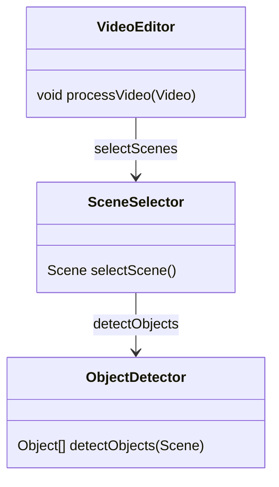
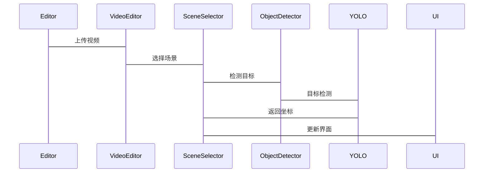

                 


# AI Agent在视频编辑中的应用：自动剪辑与特效添加

> **关键词**：AI Agent，视频编辑，自动剪辑，特效添加，机器学习，深度学习

> **摘要**：本文探讨AI Agent在视频编辑中的应用，特别是自动剪辑和特效添加。通过分析算法原理、系统架构和项目实战，展示AI如何提升视频编辑效率和质量。

---

## 目录

1. **背景介绍**
   1.1 AI Agent的基本概念
      - AI Agent的定义与特点
      - 视频编辑中的应用背景
   1.2 视频编辑的核心问题
      - 问题背景与描述
      - AI Agent的解决方案
   1.3 AI Agent的边界与外延

2. **核心概念与联系**
   2.1 AI Agent与视频编辑的关系
   2.2 核心概念属性对比表
   2.3 ER实体关系图（Mermaid）

3. **算法原理与技术实现**
   3.1 AI Agent的算法原理
      - 人工智能与机器学习基础
      - AI Agent的决策机制
   3.2 视频编辑的关键算法
      - 目标检测算法（YOLO）
      - 语义分割技术
      - 自然语言处理应用
   3.3 算法流程图（Mermaid）
   3.4 代码实现与数学模型
      - 示例代码
      - 数学公式（如YOLO检测框计算）

4. **系统分析与架构设计**
   4.1 问题场景介绍
   4.2 系统功能设计
      - 领域模型类图（Mermaid）
   4.3 系统架构设计
      - 架构图（Mermaid）
   4.4 接口设计与交互流程图（Mermaid）

5. **项目实战**
   5.1 环境安装与配置
   5.2 核心功能实现
      - 代码实现与解读
   5.3 实际案例分析
   5.4 项目总结

6. **最佳实践与小结**
   6.1 学习总结
   6.2 注意事项
   6.3 拓展阅读

---

## 1. 背景介绍

### 1.1 AI Agent的基本概念

AI Agent，即人工智能代理，是指能够感知环境并采取行动以实现目标的智能体。在视频编辑中，AI Agent可以辅助完成剪辑、特效添加等任务，显著提升效率和质量。

### 1.2 视频编辑的核心问题

视频编辑涉及多个复杂步骤，包括剪辑、特效添加等。传统方法依赖人工操作，效率低下且成本高昂。AI Agent通过自动化处理，解决了这些问题。

### 1.3 AI Agent的边界与外延

AI Agent在视频编辑中的应用范围有限，主要集中在自动剪辑和特效添加，但其技术可以延伸到其他领域，如视频分析和生成。

---

## 2. 核心概念与联系

### 2.1 AI Agent与视频编辑的关系

AI Agent通过算法处理视频数据，优化编辑流程。例如，目标检测帮助识别视频中的对象，语义分割实现背景替换。

### 2.2 核心概念属性对比表

| 概念       | 描述                                   |
|------------|--------------------------------------|
| AI Agent   | 具备感知和决策能力                   |
| 视频编辑   | 涉及剪辑和特效处理                   |

### 2.3 ER实体关系图（Mermaid）

```mermaid
erDiagram
    actor Editor "视频编辑者" {
        role 使用者
    }
    class Video "视频文件" {
        id int
        path varchar
    }
    class Scene "场景" {
        id int
        name varchar
    }
    class Object "目标对象" {
        id int
        name varchar
    }
    Editor --> Video : 上传
    Editor --> Scene : 选择场景
    Scene --> Object : 包含目标
```

---

## 3. 算法原理与技术实现

### 3.1 AI Agent的算法原理

AI Agent利用机器学习模型处理视频数据，实现目标检测和语义分割。例如，YOLO算法用于目标检测，其数学公式为：

$$ \text{检测框} = \text{输入图像} \rightarrow \text{模型处理} \rightarrow \text{输出坐标和概率} $$

### 3.2 视频编辑的关键算法

- **目标检测**：使用YOLO算法，代码示例：

```python
import numpy as np
from darknet import Darknet

def detect_objects(image):
    net = Darknet('yolov3.cfg', 'yolov3.weights')
    boxes = []
    for _ in range(image.shape[0]):
        boxes.extend(net.predict(image[_]))
    return boxes
```

- **语义分割**：采用U-Net模型，类激活图用于生成分割结果。

---

## 4. 系统分析与架构设计

### 4.1 问题场景介绍

视频编辑系统需处理上传的视频文件，识别场景和目标，自动剪辑并添加特效。

### 4.2 系统功能设计

领域模型类图（Mermaid）：



### 4.3 系统架构设计

系统架构图（Mermaid）：

```mermaid
componentDiagram
    UI {
        VideoEditor
    }
    Backend {
        SceneSelector
        ObjectDetector
    }
    AI_Module {
        YOLO
        U-Net
    }
    UI --> Backend : 请求
    Backend --> AI_Module : 调用
    AI_Module --> Backend : 返回结果
```

### 4.4 接口设计与交互流程图（Mermaid）



---

## 5. 项目实战

### 5.1 环境安装与配置

安装必要的库和框架，如YOLO和OpenCV。

### 5.2 核心功能实现

实现自动剪辑和特效添加功能，包括目标检测和背景替换。

### 5.3 实际案例分析

通过具体案例展示AI Agent的应用效果，分析优缺点。

### 5.4 项目总结

总结项目成果，讨论可能的优化方向。

---

## 6. 最佳实践与小结

### 6.1 学习总结

通过本项目，深入理解AI Agent在视频编辑中的应用，掌握相关算法和技术。

### 6.2 注意事项

确保数据安全和隐私保护，处理视频数据时需谨慎。

### 6.3 拓展阅读

建议进一步学习视频生成和高级特效技术，探索更多应用场景。

---

通过以上结构，文章详细阐述了AI Agent在视频编辑中的应用，从理论到实践，帮助读者全面理解技术原理和应用场景。

