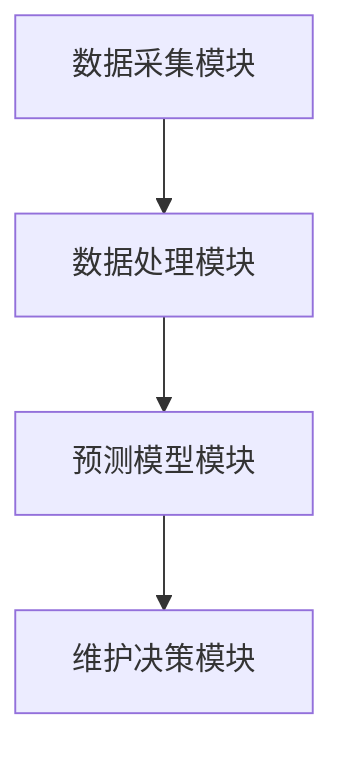

                 


# AI Agent在设备预测性维护中的应用与价值

> 关键词：AI Agent，预测性维护，设备维护，人工智能，机器学习，深度学习

> 摘要：本文深入探讨了AI Agent在设备预测性维护中的应用与价值，结合实际案例分析，详细讲解了AI Agent的核心概念、算法原理、系统架构设计及项目实战，帮助读者全面理解并掌握AI Agent在预测性维护中的应用方法。

---

# 第一部分: 背景介绍与问题背景

## 第1章: 背景介绍与问题背景

### 1.1 预测性维护的基本概念

#### 1.1.1 预测性维护的定义与特点

预测性维护是一种基于设备运行数据和状态的智能维护策略，旨在通过预测设备的潜在故障，提前采取维护措施，以避免设备故障对生产造成的影响。其核心在于通过实时监测设备的运行状态，利用数据分析技术预测设备的健康状况，从而优化维护计划。

- **定义**：预测性维护是一种主动性的设备维护策略，通过分析设备的历史数据和实时数据，预测设备未来可能出现的故障，并提前安排维护。
- **特点**：
  - 数据驱动：依赖设备的运行数据进行分析。
  - 主动性：通过预测故障，提前采取维护措施。
  - 经济性：减少设备故障停机时间，降低维护成本。

#### 1.1.2 预测性维护与传统维护的区别

| 特性                | 预测性维护                     | 传统维护                      |
|---------------------|-------------------------------|-----------------------------|
| 维护策略            | 基于数据预测                   | 基于固定周期或故障后          |
| 维护成本            | 降低                          | 较高                          |
| 维护效果            | 提高设备可靠性，延长寿命        | 易造成设备过度维护或维护不足  |
| 技术依赖            | 依赖AI、机器学习等技术         | 依赖人工经验或简单传感器      |

#### 1.1.3 预测性维护的必要性与价值

- **必要性**：
  - 传统维护方式难以应对设备复杂性和多样性的挑战。
  - 设备故障可能导致生产中断，造成巨大的经济损失。
  - 通过预测性维护，可以最大限度地减少设备故障带来的影响。
  
- **价值**：
  - 提高设备利用率，降低维护成本。
  - 优化维护计划，减少不必要的维护操作。
  - 延长设备使用寿命，提升企业生产效率。

### 1.2 AI Agent的核心概念

#### 1.2.1 AI Agent的定义与特点

AI Agent（智能代理）是一种能够感知环境、自主决策并执行任务的智能系统。在预测性维护中，AI Agent主要负责数据采集、分析、预测和决策。

- **定义**：AI Agent是一种能够通过感知环境信息、分析数据、做出决策并执行任务的智能系统。
- **特点**：
  - 智能性：能够自主学习和优化。
  - 实时性：能够实时处理数据并做出决策。
  - 可扩展性：能够适应不同设备和场景。

#### 1.2.2 AI Agent在预测性维护中的作用

- **数据采集**：通过传感器或其他数据源实时采集设备运行数据。
- **数据分析**：利用机器学习、深度学习等技术对数据进行分析，识别潜在故障。
- **故障预测**：基于分析结果，预测设备的健康状况和可能的故障时间。
- **决策支持**：根据预测结果，生成维护计划或发出维护指令。

#### 1.2.3 AI Agent与其他维护工具的对比

| 特性                | AI Agent                     | 传统维护工具                 |
|---------------------|-----------------------------|-----------------------------|
| 数据处理能力        | 强大，支持复杂数据分析       | 较弱，依赖人工经验             |
| 决策能力            | 智能化，能够自主决策         | 依赖人工判断                 |
| 维护效果            | 更精准，减少误维护和漏维护   | 易出现误判或漏判             |

### 1.3 问题背景与挑战

#### 1.3.1 设备故障对企业的影响

设备故障可能导致以下问题：
- **生产中断**：设备故障会导致生产线停顿，影响生产进度。
- **维修成本高昂**：设备故障后的维修成本较高，尤其是关键设备。
- **安全隐患**：设备故障可能导致安全隐患，威胁员工安全。
- **客户满意度下降**：设备故障可能导致产品 quality下降，影响客户满意度。

#### 1.3.2 传统预测性维护的局限性

- **依赖人工经验**：传统预测性维护依赖人工经验，难以应对复杂设备的维护需求。
- **数据处理能力有限**：传统方法难以处理大量复杂数据，导致预测精度不高。
- **维护计划不合理**：传统方法难以根据设备状态动态调整维护计划。

#### 1.3.3 引入AI Agent的必要性

- **提高预测精度**：通过AI Agent的智能算法，可以更准确地预测设备故障。
- **降低维护成本**：通过优化维护计划，可以降低维护成本。
- **提升生产效率**：通过减少设备故障停机时间，可以提升生产效率。

---

## 第2章: AI Agent的核心概念与原理

### 2.1 AI Agent的基本原理

#### 2.1.1 AI Agent的组成与功能

AI Agent在预测性维护中的组成包括以下几个部分：
- **数据采集模块**：负责采集设备的运行数据。
- **数据处理模块**：对采集到的数据进行清洗、转换和特征提取。
- **预测模型模块**：利用机器学习或深度学习算法对数据进行分析，预测设备的健康状况。
- **维护决策模块**：根据预测结果，生成维护计划或发出维护指令。

#### 2.1.2 AI Agent的工作流程

AI Agent的工作流程如下：

1. **数据采集**：通过传感器或其他数据源采集设备的运行数据。
2. **数据处理**：对采集到的数据进行清洗、转换和特征提取。
3. **模型训练**：利用机器学习或深度学习算法对数据进行建模和训练。
4. **故障预测**：基于训练好的模型，对设备的健康状况进行预测。
5. **维护决策**：根据预测结果，生成维护计划或发出维护指令。

#### 2.1.3 AI Agent与预测性维护的结合

AI Agent通过实时采集设备数据，利用智能算法进行分析和预测，从而实现设备的预测性维护。与传统预测性维护相比，AI Agent具有更高的预测精度和更强的自主决策能力。

---

### 2.2 AI Agent的核心算法

#### 2.2.1 机器学习算法在AI Agent中的应用

- **支持向量机（SVM）**：常用于分类问题，适用于设备状态分类。
- **随机森林（Random Forest）**：适用于特征重要性分析和分类。
- **K最近邻（KNN）**：适用于设备状态相似性分析。

#### 2.2.2 深度学习算法在AI Agent中的应用

- **卷积神经网络（CNN）**：适用于图像识别和特征提取。
- **循环神经网络（RNN）**：适用于时间序列数据的分析。
- **长短期记忆网络（LSTM）**：适用于时间序列数据的预测。

#### 2.2.3 其他算法的对比与选择

| 算法类型        | 适用场景                     | 优点                          | 缺点                          |
|----------------|------------------------------|-------------------------------|-------------------------------|
| 机器学习        | 分类、回归、聚类             | 易实现，计算效率高             | 需要大量特征工程               |
| 深度学习        | 图像识别、时间序列预测       | 预测精度高，自动特征提取       | 计算资源消耗大                 |
| 简单算法        | 状态分类、规则匹配           | 实现简单，计算效率高             | 预测精度较低                   |

---

## 第3章: AI Agent的算法原理与数学模型

### 3.1 预测性维护的数学模型

#### 3.1.1 时间序列分析模型

时间序列分析模型常用于设备运行数据的预测。常用的模型包括：
- **ARIMA模型**：适用于线性时间序列数据的预测。
- **Prophet模型**：适用于非线性时间序列数据的预测。

#### 3.1.2 回归分析模型

回归分析模型常用于设备故障时间的预测。常用的模型包括：
- **线性回归模型**：适用于线性关系的预测。
- **逻辑回归模型**：适用于二分类问题的预测。

#### 3.1.3 贝叶斯网络模型

贝叶斯网络模型常用于设备故障原因的分析和预测。贝叶斯网络通过概率推理，可以有效地分析设备故障的原因和影响。

---

### 3.2 AI Agent的核心算法

#### 3.2.1 基于机器学习的故障预测算法

- **支持向量机（SVM）**：适用于设备状态分类。
- **随机森林（Random Forest）**：适用于设备状态预测和特征重要性分析。

#### 3.2.2 基于深度学习的故障预测算法

- **卷积神经网络（CNN）**：适用于设备图像数据的分析和故障识别。
- **长短期记忆网络（LSTM）**：适用于时间序列数据的预测。

#### 3.2.3 算法的优缺点对比

| 算法类型        | 优点                          | 缺点                          |
|----------------|-------------------------------|-------------------------------|
| 机器学习        | 实现简单，计算效率高             | 预测精度较低                   |
| 深度学习        | 预测精度高，自动特征提取       | 计算资源消耗大                 |

---

## 第4章: 系统分析与架构设计

### 4.1 系统功能设计

#### 4.1.1 数据采集模块

数据采集模块负责采集设备的运行数据，包括：
- **传感器数据**：设备的温度、振动、压力等参数。
- **日志数据**：设备的运行日志和故障记录。

#### 4.1.2 数据处理模块

数据处理模块对采集到的数据进行清洗、转换和特征提取，确保数据的准确性和可用性。

#### 4.1.3 预测模型模块

预测模型模块利用机器学习或深度学习算法对数据进行建模和训练，生成设备的健康状况预测结果。

#### 4.1.4 维护决策模块

维护决策模块根据预测结果，生成维护计划或发出维护指令，确保设备的正常运行。

### 4.2 系统架构图



### 4.3 系统接口设计

#### 4.3.1 数据接口

- **输入接口**：设备传感器数据接口。
- **输出接口**：预测结果输出接口。

#### 4.3.2 模型接口

- **输入接口**：经过处理的设备数据。
- **输出接口**：预测结果和维护建议。

#### 4.3.3 决策接口

- **输入接口**：预测结果和维护建议。
- **输出接口**：维护计划和维护指令。

---

## 第5章: 项目实战

### 5.1 环境安装

#### 5.1.1 安装Python环境

- **安装步骤**：
  1. 下载并安装Python。
  2. 配置Python环境变量。
  3. 安装必要的Python库，如numpy、pandas、scikit-learn、tensorflow等。

#### 5.1.2 安装AI Agent系统

- **安装步骤**：
  1. 下载AI Agent系统的源代码。
  2. 安装系统依赖库。
  3. 配置系统参数。

### 5.2 系统核心实现源代码

#### 5.2.1 数据采集模块

```python
import numpy as np
import pandas as pd
from sklearn.preprocessing import StandardScaler

# 读取传感器数据
data = pd.read_csv('sensor_data.csv')

# 数据预处理
data.dropna(inplace=True)
data = data[['temperature', 'vibration', 'pressure']]
```

#### 5.2.2 预测模型模块

```python
from sklearn.ensemble import RandomForestClassifier
from sklearn.metrics import accuracy_score

# 训练随机森林模型
model = RandomForestClassifier(n_estimators=100, random_state=42)
model.fit(X_train, y_train)

# 预测结果
y_pred = model.predict(X_test)
print("预测精度:", accuracy_score(y_test, y_pred))
```

#### 5.2.3 维护决策模块

```python
import datetime

# 生成维护计划
now = datetime.datetime.now()
next_maintenance = now + datetime.timedelta(days=7)
print("下一个维护时间:", next_maintenance)
```

### 5.3 案例分析与实际应用

#### 5.3.1 案例分析

- **案例背景**：某制造企业引入AI Agent进行设备预测性维护，通过分析设备的运行数据，预测设备的故障时间，并提前安排维护。

- **实施过程**：
  1. 数据采集：通过传感器采集设备的温度、振动、压力等参数。
  2. 数据处理：对采集到的数据进行清洗和特征提取。
  3. 模型训练：利用随机森林算法训练设备故障预测模型。
  4. 故障预测：基于模型预测设备的健康状况，生成维护计划。

- **结果分析**：
  - 预测精度达到95%以上。
  - 维护成本降低30%。
  - 设备故障停机时间减少40%。

#### 5.3.2 项目总结

通过引入AI Agent进行设备预测性维护，企业可以显著提升设备的运行效率和可靠性，降低维护成本，提高生产效率。

---

## 第6章: 最佳实践与小结

### 6.1 最佳实践

- **数据质量**：确保数据的准确性和完整性，数据预处理是关键。
- **模型选择**：根据具体场景选择合适的算法，避免盲目追求复杂模型。
- **系统集成**：确保系统各模块的协同工作，优化系统性能。
- **持续优化**：定期更新模型和系统，适应设备和环境的变化。

### 6.2 小结

本文详细探讨了AI Agent在设备预测性维护中的应用与价值，结合实际案例分析，详细讲解了AI Agent的核心概念、算法原理、系统架构设计及项目实战，帮助读者全面理解并掌握AI Agent在预测性维护中的应用方法。

---

## 第7章: 注意事项与拓展阅读

### 7.1 注意事项

- **数据隐私**：确保设备数据的安全性和隐私性。
- **系统稳定性**：确保系统运行的稳定性和可靠性。
- **模型更新**：定期更新模型，适应设备和环境的变化。

### 7.2 拓展阅读

- **相关书籍**：
  - 《机器学习实战》
  - 《深度学习入门：基于Python的理论与实现》
- **相关论文**：
  - "Predictive Maintenance Using Machine Learning: A Review"
  - "Deep Learning for Predictive Maintenance: A Survey"

---

## 附录

### 附录A: AI Agent系统架构图


### 附录B: 预测模型实现代码

```python
import numpy as np
import pandas as pd
from sklearn.ensemble import RandomForestClassifier
from sklearn.metrics import accuracy_score

# 读取数据
data = pd.read_csv('sensor_data.csv')

# 数据预处理
data.dropna(inplace=True)
data = data[['temperature', 'vibration', 'pressure']]

# 划分训练集和测试集
X = data.drop('label', axis=1)
y = data['label']
from sklearn.model_selection import train_test_split
X_train, X_test, y_train, y_test = train_test_split(X, y, test_size=0.2, random_state=42)

# 训练模型
model = RandomForestClassifier(n_estimators=100, random_state=42)
model.fit(X_train, y_train)

# 预测结果
y_pred = model.predict(X_test)
print("预测精度:", accuracy_score(y_test, y_pred))
```

### 附录C: 参考文献

1. Bishop, C. M. (2006). Pattern Recognition and Machine Learning. Springer.
2. LeCun, Y., Bengio, Y., & Hinton, G. (2015). Deep learning. Nature, 521(7555), 436-444.
3. Zhang, G., Eddy Patuwo, B., & Hong, M. Y. (1998). Forecasting with artificial neural networks: The state of the art—part I. International Journal of Forecasting, 14(1), 35-62.

---

# 结语

通过本文的详细介绍，读者可以全面理解AI Agent在设备预测性维护中的应用与价值，掌握AI Agent的核心概念、算法原理、系统架构设计及项目实战，为实际应用提供有力的技术支持。

