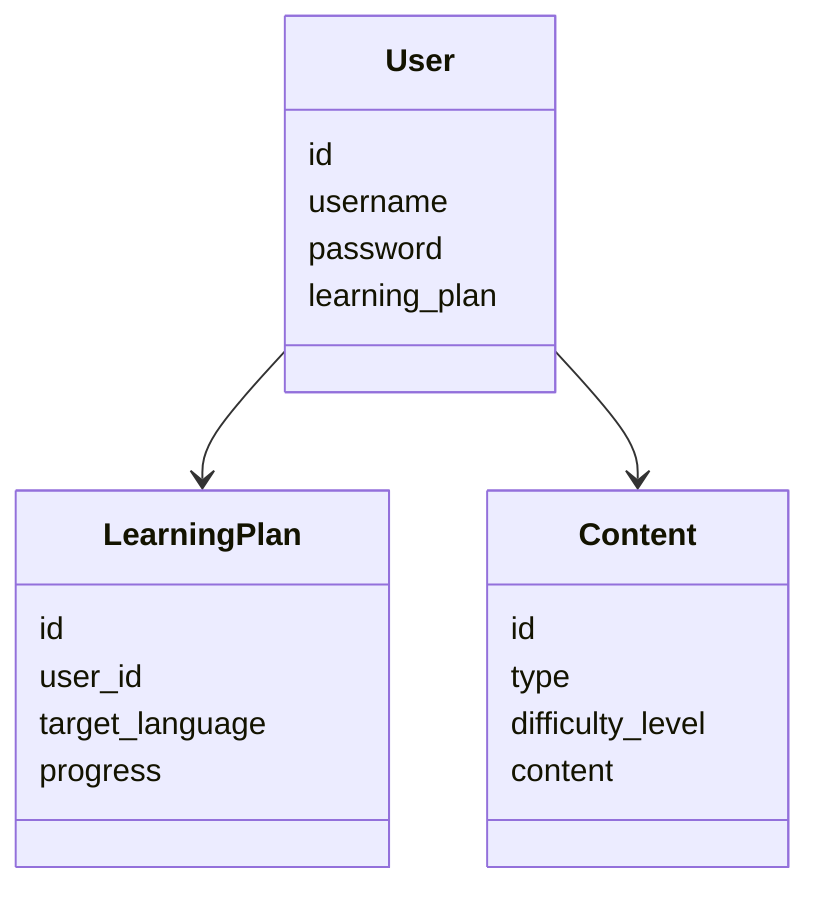
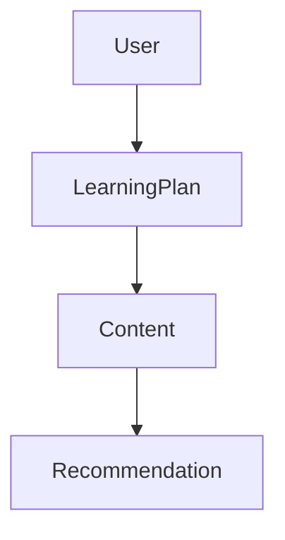

                 


# AI Agent在语言学习中的个性化教学

> 关键词：AI Agent，个性化教学，语言学习，自然语言处理，机器学习

> 摘要：本文探讨了AI Agent在语言学习中的应用，特别是在个性化教学方面。通过分析AI Agent的核心原理、NLP技术、系统架构设计以及实际项目案例，本文详细阐述了如何利用AI Agent实现精准、高效的个性化语言学习。文章内容涵盖AI Agent的基本概念、算法原理、系统设计、项目实战以及优化建议，为教育技术领域提供了有价值的参考。

---

## 第1章: AI Agent与语言学习概述

### 1.1 AI Agent的基本概念

#### 1.1.1 AI Agent的定义与特点
AI Agent（人工智能代理）是指能够感知环境、执行任务并做出决策的智能实体。其特点包括：
- **自主性**：能够独立决策和行动。
- **反应性**：能够实时感知并响应环境变化。
- **目标导向**：以特定目标为导向，优化行动。
- **学习能力**：能够通过数据学习和优化。

#### 1.1.2 AI Agent在教育领域的应用
AI Agent在教育领域的应用广泛，包括：
- **智能辅导系统**：为学生提供个性化学习支持。
- **自动化评估**：实时评估学生的学习情况。
- **个性化推荐**：根据学生需求推荐学习资源。

#### 1.1.3 语言学习中的个性化需求
语言学习者的需求多样化，包括：
- **不同语言水平**：从初级到高级的学习者。
- **不同学习风格**：视觉、听觉、动觉学习者。
- **不同学习目标**：考试准备、工作需求、兴趣学习。

### 1.2 语言学习的现状与挑战

#### 1.2.1 当前语言学习的主要方式
当前语言学习方式主要包括：
- **传统课堂学习**：教师主导，学生被动接受。
- **在线学习平台**：提供在线课程和资源。
- **移动应用**：随时随地学习。

#### 1.2.2 传统教学模式的局限性
传统教学模式的局限性包括：
- **一刀切的教学方式**：无法满足个性化需求。
- **缺乏实时反馈**：学生无法及时得到指导。
- **资源分配不均**：优秀教师资源有限，难以覆盖所有学生。

#### 1.2.3 学生个性化学习需求的多样性
学生个性化学习需求的多样性体现在：
- **学习速度差异**：不同学生的学习速度不同。
- **学习内容偏好**：不同学生对学习内容的兴趣不同。
- **学习方法差异**：不同学生适合不同的学习方法。

### 1.3 AI Agent在语言学习中的作用

#### 1.3.1 提供个性化学习路径
AI Agent能够根据学生的学习情况和需求，制定个性化的学习计划，包括学习目标、学习内容和学习进度。

#### 1.3.2 实现精准教学反馈
AI Agent能够实时分析学生的学习行为和结果，提供精准的反馈和建议，帮助学生快速改进。

#### 1.3.3 优化学习资源分配
AI Agent能够根据学生的需求和学习进度，优化学习资源的分配，确保资源利用最大化。

### 1.4 本章小结
本章介绍了AI Agent的基本概念、在教育领域的应用以及在语言学习中的具体作用，为后续章节奠定了基础。

---

## 第2章: AI Agent的核心原理与技术

### 2.1 AI Agent的核心原理

#### 2.1.1 自然语言处理（NLP）基础
NLP是AI Agent实现语言交互的核心技术，主要包括：
- **分词**：将连续的文本分割成有意义的词汇或短语。
- **词性标注**：为每个词标注其词性（名词、动词、形容词等）。
- **句法分析**：分析句子的语法结构。
- **语义理解**：理解文本的语义含义。

#### 2.1.2 机器学习与深度学习
机器学习和深度学习是AI Agent实现个性化推荐和决策的基础，常用算法包括：
- **监督学习**：根据标注数据进行训练，预测新的数据。
- **无监督学习**：从无标签数据中发现模式。
- **强化学习**：通过与环境互动，学习最优策略。

#### 2.1.3 知识图谱与推理机制
知识图谱是AI Agent实现推理和决策的关键，主要包括：
- **知识表示**：将知识以图结构表示，节点表示实体，边表示关系。
- **推理机制**：通过图结构进行逻辑推理，得出结论。

### 2.2 AI Agent的算法与模型

#### 2.2.1 基于规则的对话系统
基于规则的对话系统通过预定义的规则进行对话生成，适用于简单场景，如FAQ问答。

#### 2.2.2 基于深度学习的对话模型
基于深度学习的对话模型（如GPT、BERT）能够生成更自然的对话，适用于复杂场景。

#### 2.2.3 混合型AI Agent架构
混合型架构结合了基于规则和深度学习的优势，适用于复杂的语言学习场景。

### 2.3 个性化推荐算法

#### 2.3.1 基于协同过滤的推荐
基于协同过滤的推荐算法通过分析用户行为，推荐相似用户的偏好内容。

#### 2.3.2 基于内容的推荐
基于内容的推荐算法通过分析内容特征，推荐与用户兴趣相符的内容。

#### 2.3.3 基于深度学习的推荐模型
基于深度学习的推荐模型（如BERT）能够捕捉复杂的内容特征和用户行为模式。

### 2.4 本章小结
本章详细介绍了AI Agent的核心原理和相关技术，为后续章节的系统设计奠定了基础。

---

## 第3章: AI Agent在语言学习中的NLP技术

### 3.1 自然语言处理（NLP）基础

#### 3.1.1 分词与词性标注
分词和词性标注是NLP的基础任务，例如将“Hello, world!”分词为“Hello”和“world!”，并标注词性。

#### 3.1.2 句法分析与语义理解
句法分析通过构建语法树分析句子结构，语义理解则通过词向量或上下文表示理解句子含义。

#### 3.1.3 命名实体识别
命名实体识别（NER）用于识别文本中的实体，如人名、地名、组织名等。

### 3.2 基于Transformer的模型

#### 3.2.1 Transformer模型简介
Transformer模型由编码器和解码器组成，广泛应用于NLP任务，如机器翻译和文本生成。

#### 3.2.2 BERT与GPT模型在语言学习中的应用
BERT和GPT模型在语言学习中的应用包括：
- **文本生成**：生成练习题目或范文。
- **文本摘要**：摘要学习材料。
- **问答系统**：回答学生问题。

#### 3.2.3 多语言模型的应用
多语言模型（如Marian）能够处理多种语言，适用于多语言学习场景。

### 3.3 对话系统的实现

#### 3.3.1 对话系统的流程
对话系统的流程包括：
1. 接收用户输入。
2. 分析输入并生成响应。
3. 输出响应。

#### 3.3.2 基于预训练模型的对话生成
基于预训练模型（如GPT）的对话生成能够生成自然且相关的回复。

#### 3.3.3 对话系统的评估指标
对话系统的评估指标包括：
- **BLEU**：基于编辑距离的评估指标。
- **ROUGE**：基于召回率的评估指标。
- **Human Evaluation**：人工评估。

### 3.4 本章小结
本章详细介绍了NLP技术在AI Agent中的应用，特别是Transformer模型和预训练模型在语言学习中的应用。

---

## 第4章: AI Agent的系统架构与设计

### 4.1 系统架构设计

#### 4.1.1 分层架构
分层架构将系统分为数据层、业务逻辑层和表现层，便于模块化开发和维护。

#### 4.1.2 微服务架构
微服务架构将系统功能分解为多个独立的服务，每个服务负责特定的功能，如用户管理、内容管理等。

### 4.2 系统功能设计

#### 4.2.1 领域模型
领域模型是系统功能设计的核心，通常以类图表示。例如：



#### 4.2.2 系统架构
系统架构通常采用分层架构或微服务架构。例如：



#### 4.2.3 接口设计
接口设计通常采用RESTful API，例如：
- `GET /users/{id}`
- `POST /learning_plans`

#### 4.2.4 交互流程
交互流程通常包括：
1. 用户登录。
2. 系统生成个性化学习计划。
3. 用户进行学习任务。
4. 系统提供反馈和建议。

### 4.2.5 本章小结
本章详细介绍了AI Agent的系统架构设计，包括分层架构、微服务架构、领域模型和交互流程。

---

## 第5章: 项目实战

### 5.1 环境搭建

#### 5.1.1 安装Python
安装Python 3.x及以上版本。

#### 5.1.2 安装依赖
安装必要的依赖库，如`transformers`, `pytorch`, `flask`等。

### 5.2 核心代码实现

#### 5.2.1 对话系统实现
```python
from transformers import GPT2LMHeadModel, GPT2Tokenizer

model_name = "gpt2"
tokenizer = GPT2Tokenizer.from_pretrained(model_name)
model = GPT2LMHeadModel.from_pretrained(model_name)

def generate_response(input_text):
    inputs = tokenizer.encode(input_text, return_tensors="pt")
    outputs = model.generate(inputs, max_length=50, do_sample=True)
    response = tokenizer.decode(outputs[0], skip_special_tokens=True)
    return response
```

#### 5.2.2 个性化推荐实现
```python
import numpy as np

def calculate_similarity(user_vector, content_vector):
    return np.dot(user_vector, content_vector)

user_profile = np.array([0.8, 0.2, 0.5])
content_vector = np.array([0.7, 0.3, 0.6])

similarity = calculate_similarity(user_profile, content_vector)
print(similarity)
```

#### 5.2.3 案例分析
以一个语言学习者为例，展示如何根据其学习需求生成个性化学习计划。

### 5.3 本章小结
本章通过具体代码实现展示了AI Agent在语言学习中的应用，为读者提供了实际操作的参考。

---

## 第6章: 优化与挑战

### 6.1 模型优化

#### 6.1.1 参数优化
通过调整模型参数（如学习率、批次大小）优化模型性能。

#### 6.1.2 模型压缩
通过剪枝、量化等技术优化模型大小，降低计算成本。

### 6.2 评估指标

#### 6.2.1 精准度
精准度是指模型预测正确的比例。

#### 6.2.2 召回率
召回率是指模型预测出所有正确结果的比例。

#### 6.2.3 F1分数
F1分数是精准度和召回率的调和平均数。

### 6.3 应用中的挑战

#### 6.3.1 数据隐私
如何保护学生的学习数据隐私。

#### 6.3.2 技术限制
当前技术在某些复杂场景下的局限性。

#### 6.3.3 用户接受度
用户对AI Agent的接受度和信任度问题。

### 6.4 本章小结
本章讨论了AI Agent在语言学习中的优化方法和应用挑战。

---

## 第7章: 未来趋势与最佳实践

### 7.1 未来趋势

#### 7.1.1 多模态学习
结合视觉、听觉等多种模态信息，提升学习效果。

#### 7.1.2 自适应学习
通过实时反馈和动态调整，实现真正的自适应学习。

#### 7.1.3 区块链技术
利用区块链技术保障数据安全和透明性。

### 7.2 最佳实践

#### 7.2.1 数据安全
确保学生数据的安全和隐私。

#### 7.2.2 技术与教育的结合
将技术与教育理念深度融合，避免技术化简教育本质。

#### 7.2.3 用户体验
注重用户体验设计，提升用户对AI Agent的接受度和满意度。

### 7.3 本章小结
本章展望了AI Agent在语言学习中的未来趋势，并提出了实际应用中的最佳实践建议。

---

## 附录: 工具与资源

### 附录A: 开发工具
推荐的开发工具包括：
- **PyCharm**：Python开发工具。
- **Jupyter Notebook**：数据科学常用的交互式笔记本。
- **Hugging Face**：提供丰富的预训练模型和工具。

### 附录B: 数据资源
推荐的数据资源包括：
- **Common Crawl**：大规模网页语料库。
- **Wikidata**：知识图谱数据。
- **OpenAI API**：提供强大的AI模型调用接口。

### 附录C: 代码仓库
推荐的代码仓库包括：
- **GitHub**：开源代码仓库。
- **GitLab**：企业级代码管理平台。

---

通过以上内容，我们可以看到，AI Agent在语言学习中的个性化教学具有巨大的潜力和应用前景。随着技术的不断发展，AI Agent将为语言学习者提供更加精准、高效的学习支持，推动语言教育进入一个新的时代。

