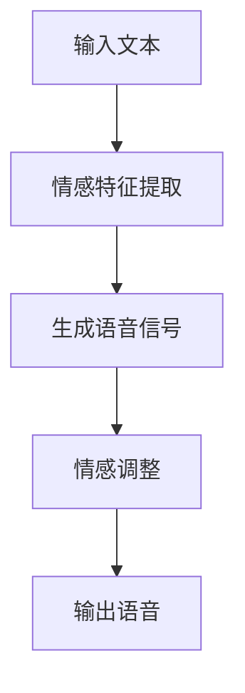
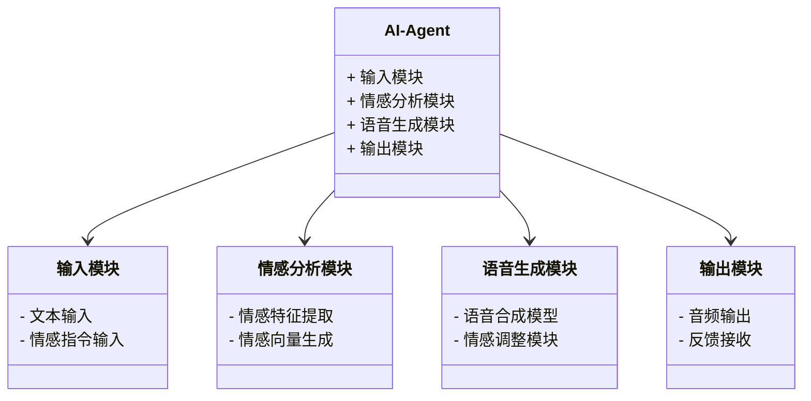

                 


# AI Agent在语音合成中的情感表达

> 关键词：AI Agent，语音合成，情感表达，生成式模型，深度学习，自然语言处理，情感语音

> 摘要：本文深入探讨了AI Agent在语音合成中的情感表达问题，分析了情感语音合成的核心技术与实现方法，结合实际案例，详细讲解了AI Agent如何通过生成式模型实现情感语音合成，并提出了在实际应用中的注意事项与优化建议。

---

## 第一章：背景介绍

### 1.1 AI Agent的基本概念与应用
- **AI Agent的定义**：AI Agent（人工智能代理）是一种能够感知环境、自主决策并执行任务的智能实体。它可以是一个软件程序或物理设备，具备学习、推理和自适应能力。
- **AI Agent的特点**：
  - **自主性**：能够独立执行任务。
  - **反应性**：能够实时感知并响应环境变化。
  - **目标导向**：基于目标进行决策和行动。
  - **社交能力**：能够与其他系统或人类进行交互。
- **AI Agent的应用场景**：
  - 智能助手（如Siri、Alexa）。
  - 自动交易系统。
  - 智慧城市中的设备控制。

---

### 1.2 语音合成技术的发展与现状
- **语音合成技术概述**：
  - 语音合成是将文本转换为语音的过程。
  - 常见技术包括基于规则的语音合成（Text-to-Speech，TTS）和基于深度学习的语音合成。
- **传统语音合成技术的优缺点**：
  - 优点：实现简单，适合标准化语音。
  - 缺点：缺乏情感表达，难以应对复杂场景。
- **当前语音合成技术的发展趋势**：
  - 基于深度学习的语音合成逐渐成为主流。
  - 情感语音合成技术快速发展，能够模拟不同情感的语音输出。

---

### 1.3 情感表达在语音合成中的重要性
- **情感表达的基本概念**：
  - 情感表达是通过语音传递情感信息的过程。
  - 包括语调、语速、音量、音高等特征。
- **情感语音合成的应用场景**：
  - **智能客服**：通过情感语音提升用户体验。
  - **教育领域**：个性化语音教学工具。
  - **娱乐领域**：虚拟助手和游戏中的情感语音应用。

---

## 第二章：AI Agent与情感语音合成的核心概念与联系

### 2.1 AI Agent与情感语音合成的核心概念
- **AI Agent在情感语音合成中的角色**：
  - AI Agent负责接收输入、分析情感特征、生成目标语音。
  - 通过自然语言处理技术理解输入文本的情感信息。
- **情感语音合成的核心技术**：
  - 情感特征提取：从文本或语料中提取情感特征。
  - 语音生成：基于情感特征生成相应的语音信号。
  - 情感调整：根据需求优化语音的情感表达。

---

### 2.2 AI Agent与情感语音合成的联系
- **AI Agent与情感语音合成的关系**：
  - AI Agent作为控制层，负责协调情感特征提取和语音生成的整个流程。
  - 情感语音合成是AI Agent实现人机交互的重要方式之一。
- **AI Agent在情感语音合成中的优势**：
  - 能够理解上下文，生成更自然的情感语音。
  - 可以根据用户反馈实时调整情感表达。

---

## 第三章：AI Agent实现情感语音合成的算法原理

### 3.1 生成式模型在情感语音合成中的应用
- **生成式模型的基本原理**：
  - 基于深度学习的生成式模型，如GPT、Transformer等。
  - 通过训练大量数据，生成符合目标情感的语音信号。
- **情感特征提取与生成流程**：
  1. **输入文本处理**：将输入文本转换为情感特征向量。
  2. **语音生成**：基于情感特征向量，生成对应的语音信号。
  3. **情感调整**：根据需求优化语音的情感表达。

---

### 3.2 情感语音合成的算法流程


---

### 3.3 情感特征提取与语音生成的数学模型
- **情感特征提取的数学模型**：
  - 使用词嵌入（Word Embedding）技术提取文本的情感特征。
  - 例如，使用Word2Vec或BERT模型提取情感向量。
- **语音生成的数学模型**：
  - 基于生成对抗网络（GAN）的语音合成模型。
  - 使用判别器和生成器，分别优化语音的真实性和情感准确性。

---

## 第四章：AI Agent实现情感语音合成的系统分析与架构设计

### 4.1 情感语音合成系统的功能设计
- **系统功能模块**：
  - **输入模块**：接收用户输入的文本或情感指令。
  - **情感分析模块**：分析输入的情感特征。
  - **语音生成模块**：基于情感特征生成语音信号。
  - **输出模块**：将生成的语音信号输出到目标设备。

---

### 4.2 情感语音合成系统的架构设计


---

## 第五章：AI Agent实现情感语音合成的项目实战

### 5.1 项目环境与工具安装
- **开发环境**：Python 3.8以上版本。
- **依赖库安装**：
  ```bash
  pip install numpy
  pip install tensorflow
  pip install pydub
  pip install librosa
  ```

---

### 5.2 情感语音生成的代码实现
```python
import numpy as np
import tensorflow as tf
from tensorflow.keras import layers

# 情感特征提取模块
def extract_emotion_features(text):
    # 假设使用BERT模型提取情感特征
    # 返回一个情感向量
    pass

# 语音生成模块
def generate_voice(emotion_vector):
    model = tf.keras.Sequential([
        layers.Dense(256, activation='relu'),
        layers.Dense(128, activation='relu'),
        layers.Dense(8000, activation='linear')
    ])
    audio = model.predict(emotion_vector)
    return audio

# 主函数
def main():
    text = "I'm happy!"
    emotion_vector = extract_emotion_features(text)
    audio = generate_voice(emotion_vector)
    # 输出音频
    return audio

if __name__ == "__main__":
    main()
```

---

### 5.3 项目实战分析
- **实际案例分析**：
  - 使用上述代码实现一个简单的AI Agent情感语音合成系统。
  - 通过训练数据优化情感特征提取和语音生成模型。
- **代码功能解读**：
  - `extract_emotion_features`：从输入文本中提取情感特征向量。
  - `generate_voice`：基于情感向量生成语音信号。
  - `main`：主函数，协调各模块完成情感语音合成。

---

## 第六章：AI Agent实现情感语音合成的最佳实践

### 6.1 小结
- AI Agent在情感语音合成中的应用前景广阔。
- 情感语音合成的核心技术包括情感特征提取和语音生成。
- 通过深度学习模型可以实现高质量的情感语音合成。

---

### 6.2 注意事项
- **数据质量**：情感语音合成的效果依赖于训练数据的质量和多样性。
- **模型优化**：需要不断优化生成模型，提高情感表达的准确性。
- **用户体验**：在实际应用中，需要考虑用户的反馈并实时调整情感表达。

---

### 6.3 拓展阅读
- **推荐阅读书籍**：
  - 《深度学习入门：基于Python和TensorFlow》。
  - 《自然语言处理实战：基于Python的机器学习和深度学习》。
- **推荐阅读论文**：
  - "Generating Text with GANs"（生成对抗网络在文本生成中的应用）。
  - "Deep Voice Conversion"（深度语音转换技术）。

---

## 总结
AI Agent在情感语音合成中的应用为语音交互带来了更高的智能化和人性化。通过本文的详细讲解，读者可以深入了解情感语音合成的核心技术与实现方法，并在实际项目中灵活应用这些知识。未来，随着深度学习技术的不断发展，AI Agent在情感语音合成中的应用将更加广泛和智能化。

