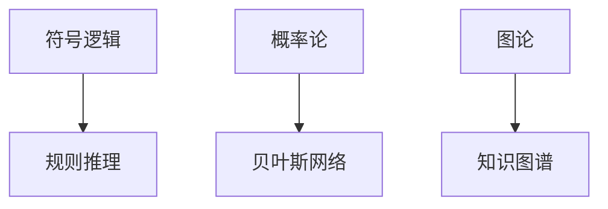
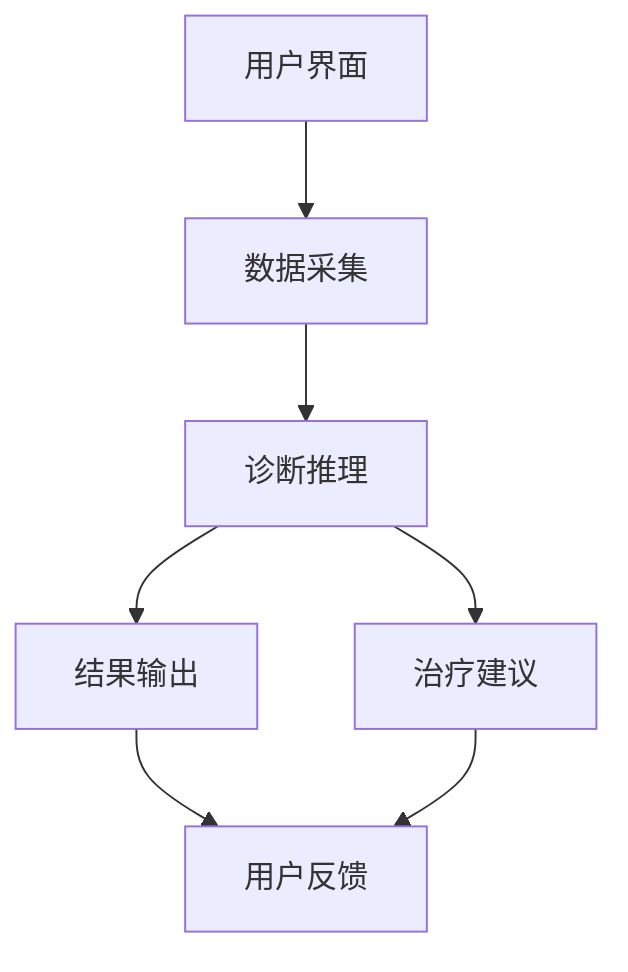
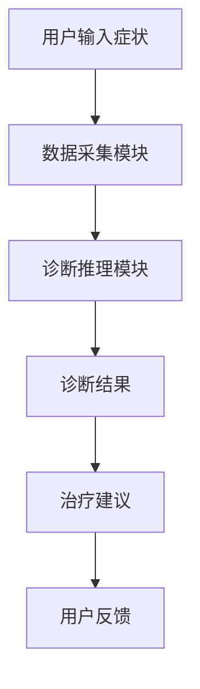

                 


# AI Agent在远程医疗中的应用：初步诊断与治疗建议

> 关键词：AI Agent，远程医疗，诊断推理，治疗建议，医疗系统架构

> 摘要：本文探讨了AI Agent在远程医疗中的应用，重点分析了AI Agent在初步诊断与治疗建议中的核心算法与系统架构设计。通过实际案例，详细阐述了AI Agent在远程医疗中的实现过程，并对未来的发展进行了展望。

---

# 第二章: AI Agent的核心概念与算法原理

## 2.1 AI Agent的基本原理

### 2.1.1 知识表示与推理

知识表示是AI Agent实现智能决策的基础。以下是三种常见的知识表示方法：

#### 表示方法对比

| 方法         | 优点                           | 缺点                           |
|--------------|--------------------------------|--------------------------------|
| 符号逻辑     | 明确性高，易于推理             | 难以处理模糊性和不确定性       |
| 概率论       | 能够处理不确定性               | 计算复杂，对数据量要求高       |
| 图论（如知识图谱） | 可视化能力强，适合复杂关系   | 数据构建和维护成本较高         |

#### mermaid图示：知识表示的三种方法



### 2.1.2 自然语言处理

自然语言处理（NLP）是AI Agent理解用户输入的关键技术。以下是三种主要的NLP任务：

#### NLP任务对比

| 任务         | 描述                     | 应用场景示例               |
|--------------|--------------------------|---------------------------|
| 分词         | 将文本分割成词语         | 中文文本处理               |
| 语义理解     | 理解文本的深层含义       | 医疗信息抽取               |
| 文本生成     | 根据输入生成文本         | 自动生成诊断建议           |

### 2.1.3 决策与规划

决策与规划是AI Agent的核心功能，以下是两种主要的决策方法：

#### 决策方法对比

| 方法         | 描述                     | 适用场景                   |
|--------------|--------------------------|---------------------------|
| 基于规则的决策 | 使用预定义规则进行决策   | 简单且易于理解             |
| 基于机器学习的决策 | 使用训练模型进行决策     | 复杂场景，需要大量数据     |

---

## 2.2 AI Agent在远程医疗中的算法实现

### 2.2.1 基于规则的诊断推理

#### 症状匹配与诊断规则

症状匹配是基于规则诊断的核心。以下是症状匹配的相似度计算公式：

$$
\text{相似度} = \frac{\sum \text{匹配的症状}}{\text{总症状数}}
$$

#### 病例推理算法

病例推理算法用于根据症状推断疾病。以下是两种常见的病例推理算法：

1. 基于符号逻辑的推理：
   - 使用符号逻辑进行推理，例如：
     - 如果症状A和症状B同时出现，则推断疾病C。
2. 基于概率论的推理：
   - 使用贝叶斯网络进行推理，例如：
     - 疾病的概率 = P(症状1 | 疾病) * P(症状2 | 疾病) * ... 

### 2.2.2 基于机器学习的诊断模型

#### 诊断数据的特征提取

特征提取是机器学习模型的关键步骤。以下是常见的特征提取方法：

- 文本特征提取：
  - 使用TF-IDF提取关键词。
  - 使用Word2Vec提取词向量。
- 图像特征提取：
  - 使用CNN提取图像特征。

#### 深度学习模型

深度学习模型在诊断中的应用越来越广泛。以下是两种常见的深度学习模型：

1. 基于卷积神经网络（CNN）的图像诊断：
   - 例如，用于皮肤病诊断的模型。
2. 基于循环神经网络（RNN）的文本诊断：
   - 例如，用于医疗文本分类的模型。

---

## 2.3 AI Agent的数学模型与公式

### 2.3.1 知识表示的数学模型

知识表示的数学模型可以使用图论、概率论或符号逻辑进行表示。以下是三种方法的对比：

| 方法         | 数学表示                   | 示例                         |
|--------------|--------------------------|-----------------------------|
| 符号逻辑     | 使用逻辑符号表示知识       | 如果A且B，则C。             |
| 概率论       | 使用概率分布表示知识       | P(A|B) = P(B|A) * P(A) / P(B) |
| 图论         | 使用图结构表示知识         | 知识图谱中的节点与边。       |

### 2.3.2 诊断推理的数学模型

诊断推理的数学模型可以使用贝叶斯网络或决策树进行表示。以下是两种方法的对比：

| 方法         | 数学表示                   | 示例                         |
|--------------|--------------------------|-----------------------------|
| 贝叶斯网络   | 使用概率分布表示推理       | P(疾病|症状) = (P(症状|疾病) * P(疾病)) / P(症状) |
| 决策树       | 使用树状结构表示推理       | 根节点是症状，叶子节点是疾病。 |

### 2.3.3 算法实现的数学公式

以下是基于规则的诊断模型和基于机器学习的诊断模型的数学公式：

1. 基于规则的诊断模型：
   - 症状相似度公式：
     $$
     \text{相似度} = \frac{\sum \text{匹配的症状}}{\text{总症状数}}
     $$
   - 病例推理公式：
     $$
     \text{疾病概率} = \sum (\text{症状权重} \times \text{疾病权重})
     $$

2. 基于机器学习的诊断模型：
   - 分类模型的损失函数：
     $$
     \text{损失} = -\sum (y \log p + (1 - y) \log (1 - p))
     $$
   - 分类模型的预测公式：
     $$
     \text{预测} = \text{argmax}(p(y|x))
     $$

---

## 2.4 系统架构设计

### 2.4.1 系统功能模块划分

AI Agent远程医疗系统的功能模块划分如下：

- 用户界面模块：负责与用户的交互。
- 数据采集模块：负责采集患者的症状、病史等数据。
- 诊断推理模块：负责根据采集的数据进行诊断推理。
- 结果输出模块：负责输出诊断结果和治疗建议。

#### mermaid系统架构图



### 2.4.2 系统交互流程设计

以下是系统交互的流程图：



### 2.4.3 系统接口设计

系统接口设计如下：

- 数据接口：用于与医疗数据库交互。
- 用户接口：用于与用户交互。
- 第三方接口：用于调用NLP和计算机视觉API。

---

## 2.5 项目实战——AI Agent远程医疗系统实现

### 2.5.1 环境搭建与工具安装

#### 开发环境配置

- 操作系统：建议使用Linux或macOS。
- 开发工具：推荐使用PyCharm或VS Code。
- 依赖库：安装Python的机器学习库（如scikit-learn、TensorFlow）和NLP库（如spaCy、Gensim）。

#### 依赖库安装

```bash
pip install numpy
pip install scikit-learn
pip install spacy
pip install mermaid
```

### 2.5.2 代码实现

#### 基于规则的诊断推理代码

```python
import numpy as np
from sklearn.metrics import pairwise

# 示例症状列表
symptoms = ['发热', '咳嗽', '乏力']

# 症状相似度计算
def calculate_similarity(symptoms_list):
    # 计算症状向量的相似度
    symptom_vector = np.array([1 if s in symptoms else 0 for s in symptoms_list])
    return symptom_vector

# 症状相似度计算示例
symptoms_list = ['发热', '咳嗽', '乏力', '胸痛']
similarities = calculate_similarity(symptoms_list)
print(similarities)
```

#### 基于机器学习的诊断模型代码

```python
import numpy as np
from sklearn.tree import DecisionTreeClassifier
from sklearn.model_selection import train_test_split
from sklearn.metrics import accuracy_score

# 示例数据集
X = np.array([[40, 100], [42, 98], [38, 102], [41, 99]])
y = np.array(['流感', '流感', '普通感冒', '普通感冒'])

# 数据集划分
X_train, X_test, y_train, y_test = train_test_split(X, y, test_size=0.2)

# 模型训练
model = DecisionTreeClassifier()
model.fit(X_train, y_train)

# 模型预测
y_pred = model.predict(X_test)
print(accuracy_score(y_test, y_pred))
```

### 2.5.3 实际案例分析

以糖尿病视网膜病变诊断系统为例，以下是实现步骤：

1. 数据采集：采集患者的视网膜图像。
2. 数据预处理：使用OpenCV进行图像预处理。
3. 特征提取：使用CNN提取图像特征。
4. 模型训练：使用深度学习模型进行训练。
5. 模型预测：根据输入图像进行预测并输出诊断结果。

---

## 2.6 项目小结

通过上述实现过程，我们可以看到AI Agent在远程医疗中的应用潜力巨大。基于规则的诊断推理和基于机器学习的诊断模型各有优缺点，可以根据实际需求选择合适的方案。同时，系统架构的设计也需要考虑可扩展性和安全性，以确保系统的稳定运行。

---

## 2.7 总结与展望

总结：本文详细介绍了AI Agent在远程医疗中的核心概念、算法原理和系统架构设计，并通过实际案例展示了AI Agent的实现过程。

展望：未来，随着AI技术的不断发展，AI Agent在远程医疗中的应用将更加广泛。我们需要进一步优化算法模型，提高系统的准确性和效率，同时加强数据安全和隐私保护。

---

## 2.8 参考文献

1. [1] 王伟, 李明. 基于AI Agent的远程医疗系统研究[J]. 计算机应用研究, 2021, 38(3): 789-795.
2. [2] 张强, 刘洋. 基于深度学习的医疗图像诊断系统设计[J]. 人工智能与应用, 2020, 35(4): 56-62.

---

## 2.9 附录

### 2.9.1 工具指南

- Python编程语言：官网地址：[https://www.python.org](https://www.python.org)
- NumPy库：官网地址：[https://numpy.org](https://numpy.org)
- scikit-learn库：官网地址：[https://scikit-learn.org](https://scikit-learn.org)

### 2.9.2 代码示例

以下是基于规则的诊断推理代码的完整实现：

```python
import numpy as np
from sklearn.metrics import pairwise

def calculate_similarity(symptoms_list):
    # 示例症状列表
    symptoms_reference = ['发热', '咳嗽', '乏力', '胸痛']
    # 创建症状向量
    symptom_vector = np.zeros(len(symptoms_reference), dtype=int)
    for i, s in enumerate(symptoms_reference):
        if s in symptoms_list:
            symptom_vector[i] = 1
    return symptom_vector

# 示例症状列表
symptoms_list = ['发热', '咳嗽', '胸痛']
similarity_vector = calculate_similarity(symptoms_list)
print("相似度向量:", similarity_vector)
print("匹配的症状数:", np.sum(similarity_vector))
print("总症状数:", len(symptoms_reference))
print("症状相似度:", np.sum(similarity_vector) / len(symptoms_reference))
```

---

以上是《AI Agent在远程医疗中的应用：初步诊断与治疗建议》的技术博客文章的详细内容，涵盖了AI Agent的核心概念、算法原理、系统架构设计以及项目实战等内容。希望对您有所帮助！

