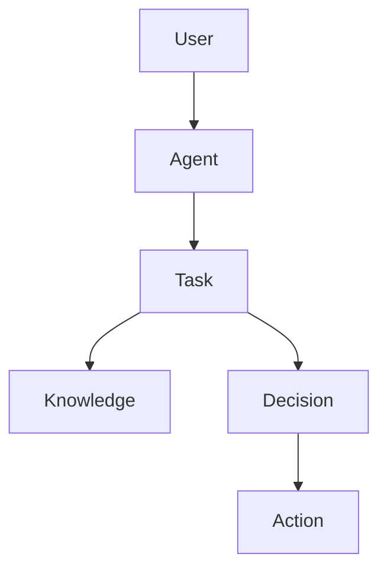
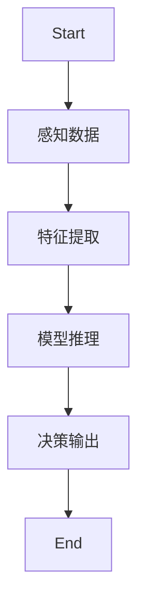
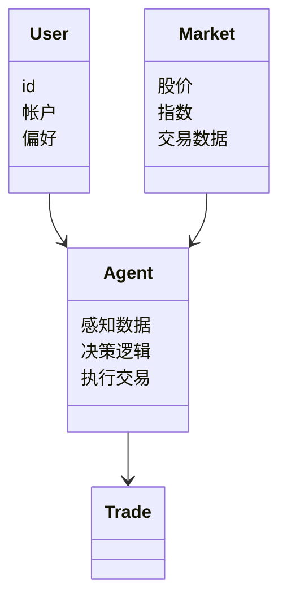
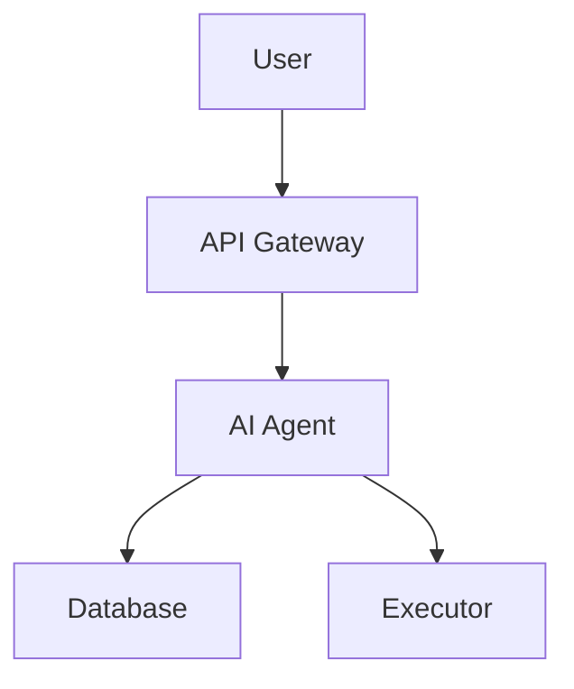
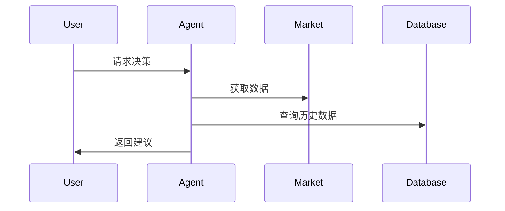

                 


# AI Agent在金融、医疗、制造业等领域的应用场景

## 关键词

- AI Agent
- 人工智能
- 金融
- 医疗
- 制造业
- 算法原理
- 系统架构

## 摘要

AI Agent（人工智能代理）是一种能够感知环境、自主决策并执行任务的智能系统。在金融、医疗和制造业等领域，AI Agent通过其强大的数据处理能力和智能决策能力，正在改变传统行业的工作方式。本文将从AI Agent的核心概念出发，详细讲解其算法原理、系统架构，并通过实际案例分析其在金融、医疗和制造业中的应用场景，最后总结其未来发展趋势和应用前景。

---

## 第一部分: AI Agent 的基础与核心概念

### 第1章: AI Agent 的背景与问题背景

#### 1.1 问题背景

##### 1.1.1 从传统系统到智能系统的发展

在传统系统中，计算机主要通过预设的规则和程序执行任务，缺乏灵活性和自主性。随着人工智能技术的快速发展，AI Agent作为一种能够感知环境、自主决策并执行任务的智能系统，逐渐成为各行业的核心技术。

##### 1.1.2 AI Agent 的定义与核心问题

AI Agent 是一个智能体，能够感知环境、理解需求、做出决策并执行任务。其核心问题包括：

- **感知问题**：如何从环境中获取有效信息？
- **决策问题**：如何根据信息做出最优决策？
- **执行问题**：如何将决策转化为具体行动？

##### 1.1.3 AI Agent 的边界与外延

AI Agent 的边界在于其智能性和自主性，而外延则涉及多智能体协作、人机交互等领域。

#### 1.2 问题描述

##### 1.2.1 传统系统在智能决策中的局限性

传统系统依赖固定规则，无法应对复杂多变的环境，缺乏灵活性和适应性。

##### 1.2.2 AI Agent 的目标与应用场景

AI Agent的目标是通过智能化决策和自主执行，提升效率、降低成本、优化体验。其应用场景包括金融投资、医疗诊断、智能制造等。

##### 1.2.3 AI Agent 的核心问题与挑战

- 数据获取与处理的复杂性
- 决策算法的准确性和可靠性
- 多智能体协作的协调性

### 第2章: AI Agent 的核心概念与联系

#### 2.1 核心概念原理

##### 2.1.1 AI Agent 的感知、决策与执行模块

AI Agent 的核心模块包括：

- **感知模块**：通过传感器或数据源获取环境信息。
- **决策模块**：基于感知信息进行推理和决策。
- **执行模块**：将决策转化为具体行动。

##### 2.1.2 多智能体系统与单智能体系统的对比

| 对比维度 | 单智能体系统 | 多智能体系统 |
|----------|--------------|--------------|
| 系统复杂性 | 简单 | 复杂 |
| 任务协作性 | 无 | 高 |
| 通信需求 | 低 | 高 |

##### 2.1.3 AI Agent 的知识表示与推理机制

知识表示是AI Agent理解环境的基础，常见的表示方法包括规则表示、语义网络和概率图模型。

#### 2.2 核心概念属性特征对比

##### 2.2.1 基于规则的AI Agent与基于模型的AI Agent对比

| 对比维度 | 基于规则的AI Agent | 基于模型的AI Agent |
|----------|--------------------|--------------------|
| 决策方式 | 预设规则 | 基于模型推理 |
| 灵活性 | 低 | 高 |

#### 2.2.2 基于监督学习的AI Agent与基于强化学习的AI Agent对比

| 对比维度 | 监督学习AI Agent | 强化学习AI Agent |
|----------|--------------------|--------------------|
| 学习方式 | 标签数据 | 奖励反馈 |
| 应用场景 | 分类、回归 | 控制、游戏 |

#### 2.2.3 基于决策树的AI Agent与基于神经网络的AI Agent对比

| 对比维度 | 决策树AI Agent | 神经网络AI Agent |
|----------|----------------|------------------|
| 可解释性 | 高 | 低 |
| 复杂性 | 低 | 高 |

#### 2.3 ER实体关系图架构



---

## 第二部分: AI Agent 的算法原理与数学模型

### 第3章: AI Agent 的算法原理

#### 3.1 算法原理讲解

##### 3.1.1 决策树算法

决策树是一种基于树状结构的分类方法，通过特征选择和剪枝优化构建最优决策树。

##### 3.1.2 随机森林算法

随机森林通过集成学习提升决策树的准确性和鲁棒性。

##### 3.1.3 神经网络算法

神经网络通过多层感知机模拟人脑神经网络，实现非线性分类和回归。

#### 3.2 算法流程图



#### 3.3 数学模型与公式

##### 3.3.1 决策树模型

$$
Gini系数 = \sum_{i=1}^{n} p_i (1 - p_i)
$$

##### 3.3.2 神经网络模型

$$
y = \sigma(\sum_{i=1}^{n} w_i x_i + b)
$$

其中，$\sigma$ 是sigmoid函数，$w_i$ 是权重，$x_i$ 是输入，$b$ 是偏置。

### 第4章: AI Agent 的系统分析与架构设计

#### 4.1 系统分析

##### 4.1.1 问题场景介绍

以金融投资为例，AI Agent需要实时监控市场数据，分析趋势并做出交易决策。

##### 4.1.2 项目介绍

设计一个基于AI Agent的智能投顾系统，帮助用户优化投资组合。

#### 4.2 系统功能设计

##### 4.2.1 领域模型



##### 4.2.2 系统架构设计



#### 4.3 系统接口设计

##### 4.3.1 API接口

```python
class Agent:
    def感知环境(self, 数据源):
        pass

    def决策(self, 数据):
        pass

    def执行(self, 决策):
        pass
```

#### 4.4 系统交互

##### 4.4.1 序列图



---

## 第三部分: AI Agent 的项目实战

### 第5章: 项目实战

#### 5.1 环境安装

##### 5.1.1 安装依赖

```bash
pip install numpy scikit-learn tensorflow
```

#### 5.2 系统核心实现源代码

##### 5.2.1 核心代码

```python
import numpy as np
from sklearn.tree import DecisionTreeClassifier
from tensorflow.keras import layers

class AI_Agent:
    def __init__(self):
        self.model = self.build_model()

    def build_model(self):
        model = Sequential()
        model.add(layers.Dense(64, activation='relu', input_dim=64))
        model.add(layers.Dense(1, activation='sigmoid'))
        model.compile(optimizer='adam', loss='binary_crossentropy', metrics=['accuracy'])
        return model

    def感知环境(self, data):
        return data

    def决策(self, data):
        return self.model.predict(data)

    def执行(self, 决策):
        return 决策
```

##### 5.2.2 代码应用解读与分析

- `build_model` 方法构建了一个简单的神经网络模型。
- `感知环境` 方法接收环境数据。
- `决策` 方法基于模型预测决策结果。
- `执行` 方法将决策结果转化为具体行动。

#### 5.3 实际案例分析

##### 5.3.1 金融投资案例

设计一个基于AI Agent的智能投顾系统，实时监控市场数据，分析趋势并做出交易决策。

##### 5.3.2 医疗诊断案例

设计一个基于AI Agent的医疗诊断系统，辅助医生进行疾病诊断和治疗方案推荐。

##### 5.3.3 制造业优化案例

设计一个基于AI Agent的生产优化系统，实时监控生产线状态，优化生产流程。

#### 5.4 项目小结

通过实际案例分析，展示了AI Agent在不同领域的应用场景和实现方法。

---

## 第四部分: 总结与展望

### 第6章: 总结与展望

#### 6.1 最佳实践 tips

- 选择合适的算法和模型
- 确保数据质量和多样性
- 注重系统的可解释性和可维护性

#### 6.2 小结

AI Agent作为一种智能系统，正在改变传统行业的工作方式。通过本文的讲解，读者可以深入了解AI Agent的核心概念、算法原理和系统架构，并通过实际案例了解其在金融、医疗和制造业中的应用场景。

#### 6.3 注意事项

- 数据隐私和安全问题
- 系统的稳定性和可靠性
- 多智能体协作的复杂性

#### 6.4 拓展阅读

- 《机器学习实战》
- 《深度学习》
- 《多智能体系统》

---

## 附录

### 附录A: 相关术语解释

- AI Agent：人工智能代理，能够感知环境、自主决策并执行任务的智能系统。

- 决策树：一种基于树状结构的分类方法，通过特征选择和剪枝优化构建最优决策树。

- 神经网络：一种通过多层感知机模拟人脑神经网络的算法，实现非线性分类和回归。

### 附录B: 工具安装指南

- 安装Python环境：推荐使用Anaconda
- 安装依赖库：`pip install numpy scikit-learn tensorflow`

### 附录C: 参考文献

- 《机器学习实战》
- 《深度学习》
- 《多智能体系统》

