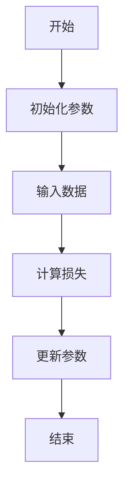
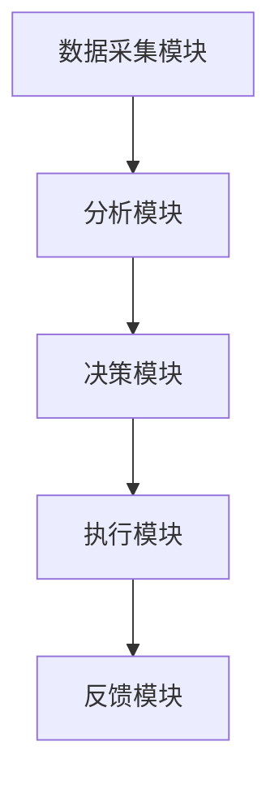
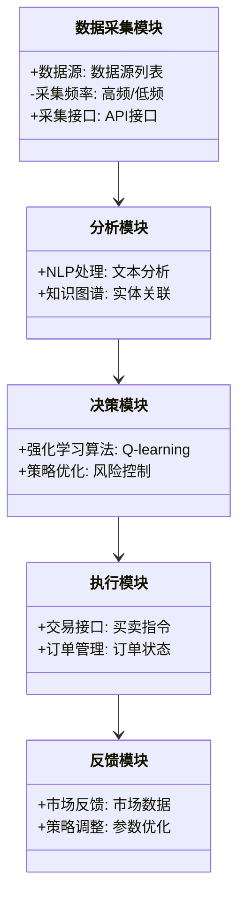
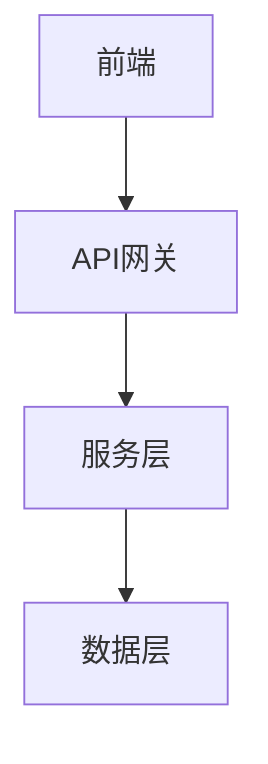
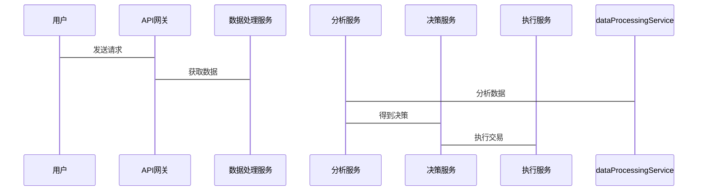

                 


```markdown
# 《AI Agent在金融行业的创新应用》

> 关键词：AI Agent, 人工智能, 金融行业, 创新应用, 技术博客

> 摘要：本文详细探讨了AI Agent在金融行业的创新应用，从背景介绍到核心技术，再到系统架构和项目实战，结合具体案例分析，深入剖析了AI Agent在金融行业的潜力和价值。

---

# 第一部分: AI Agent在金融行业的背景介绍

## 第1章: AI Agent与金融行业的背景介绍

### 1.1 AI Agent的定义与核心概念

#### 1.1.1 从传统金融到智能金融的演进
传统金融行业依赖人工操作和经验判断，效率低下且容易出错。随着AI技术的发展，智能金融逐渐成为趋势，AI Agent作为智能金融的核心技术之一，正在改变金融行业的运作方式。

#### 1.1.2 AI Agent的核心概念与属性
- **AI Agent**：指具备自主决策、学习和执行任务能力的智能体。
- **智能性**：能够理解、推理和优化决策。
- **适应性**：能够根据环境变化调整策略。
- **交互性**：能够与人类或其他系统进行有效沟通和协作。

#### 1.1.3 金融行业中的问题背景与需求
- 传统金融业务效率低，人工操作成本高。
- 金融数据复杂，需要高效的分析工具。
- 客户需求多样化，需要个性化的服务。

### 1.2 AI Agent在金融行业的应用前景

#### 1.2.1 金融行业的痛点与挑战
- 数据量大且复杂，人工难以处理。
- 交易速度要求高，人工难以实时响应。
- 风险控制难度大，需要智能化手段。

#### 1.2.2 AI Agent的潜在价值与优势
- 提高交易效率，降低成本。
- 提供精准的客户画像和个性化服务。
- 实现智能化的风险控制和投资决策。

#### 1.2.3 未来发展趋势与创新方向
- AI Agent与区块链结合，提升金融安全。
- AI Agent与物联网结合，推动智能投顾。
- AI Agent与云计算结合，增强数据分析能力。

### 1.3 本章小结
本章介绍了AI Agent的核心概念和在金融行业的应用前景，为后续章节的深入探讨奠定了基础。

---

# 第二部分: AI Agent的核心技术与原理

## 第2章: AI Agent的核心技术解析

### 2.1 自然语言处理（NLP）技术

#### 2.1.1 NLP的基本原理与应用
- **分词**：将文本分割成词语。
- **实体识别**：识别文本中的实体（如人名、地名、公司名）。
- **情感分析**：判断文本的情感倾向。

#### 2.1.2 在金融文本分析中的应用
- **财务报告分析**：识别财务报告中的关键信息。
- **新闻情感分析**：根据新闻情绪影响投资决策。

#### 2.1.3 实体识别与情感分析在金融中的案例
- 案例1：使用NLP技术分析公司财报，识别潜在投资机会。
- 案例2：通过社交媒体情感分析预测市场情绪。

### 2.2 强化学习（Reinforcement Learning）技术

#### 2.2.1 强化学习的基本原理
- **智能体**：在环境中通过试错学习，最大化累积奖励。
- **状态**：环境反馈给智能体的当前情况。
- **动作**：智能体根据状态做出的行为。

#### 2.2.2 在金融交易中的应用
- **股票交易**：智能体通过历史数据学习交易策略。
- **风险管理**：智能体学习如何在风险可控范围内最大化收益。

#### 2.2.3 策略优化与风险控制
- **策略优化**：通过强化学习不断优化交易策略。
- **风险控制**：智能体学习在市场波动中保持稳健。

### 2.3 知识图谱（Knowledge Graph）技术

#### 2.3.1 知识图谱的构建与应用
- **构建方法**：通过爬取和解析金融数据，构建实体间的关系网络。
- **应用领域**：用于风险评估、关联交易识别。

#### 2.3.2 在金融风险控制中的应用
- **风险传播分析**：通过知识图谱识别风险在不同实体间的传播路径。
- **异常检测**：通过图结构发现异常交易行为。

#### 2.3.3 实体关联与关系推理
- **关系推理**：基于知识图谱推理实体之间的隐含关系。
- **案例分析**：识别同一实际控制人控制的多家公司，发现潜在关联风险。

### 2.4 本章小结
本章详细介绍了AI Agent在金融行业中的核心技术，包括NLP、强化学习和知识图谱，并通过具体案例展示了它们的应用场景。

---

# 第三部分: AI Agent的数学模型与算法原理

## 第3章: AI Agent的数学模型与算法

### 3.1 概率论基础

#### 3.1.1 概率分布与贝叶斯定理
- **概率分布**：描述随机变量可能取值及其概率。
- **贝叶斯定理**：用于根据先验概率计算条件概率，常用于分类问题。

#### 3.1.2 马尔可夫链与隐马尔可夫模型
- **马尔可夫链**：描述系统随时间变化的状态序列。
- **隐马尔可夫模型**：用于处理序列数据，常用于时间序列分析。

#### 3.1.3 贝叶斯网络在金融中的应用
- **贝叶斯网络**：用于建模变量之间的概率关系，常用于风险评估和信用评分。

### 3.2 优化算法

#### 3.2.1 线性规划与非线性优化
- **线性规划**：在约束条件下寻找最优解，常用于资源分配问题。
- **非线性优化**：处理目标函数或约束条件为非线性的情况，常用于投资组合优化。

#### 3.2.2 虚拟梯度下降与Adam优化器
- **虚拟梯度下降**：优化算法，用于更新模型参数。
- **Adam优化器**：结合动量和自适应学习率的优化算法，常用于深度学习训练。

#### 3.2.3 算法在金融组合优化中的应用
- **投资组合优化**：使用优化算法在风险可控的前提下最大化收益。
- **案例分析**：使用Adam优化器训练投资策略模型。

### 3.3 强化学习算法

#### 3.3.1 Q-learning与Deep Q-Network
- **Q-learning**：通过试错学习，更新策略函数。
- **Deep Q-Network**：使用深度神经网络近似Q值函数，常用于复杂环境。

#### 3.3.2 策略梯度与Actor-Critic方法
- **策略梯度**：直接优化策略函数，最大化期望收益。
- **Actor-Critic方法**：同时学习策略和价值函数，提高学习效率。

#### 3.3.3 算法在金融交易中的实现
- **案例分析**：使用强化学习算法训练股票交易策略。

### 3.4 算法流程图（使用mermaid）



### 3.5 本章小结
本章详细介绍了AI Agent在金融行业中的数学模型与算法，包括概率论、优化算法和强化学习，并通过流程图展示了算法的执行流程。

---

# 第四部分: AI Agent的系统架构与设计

## 第4章: AI Agent的系统架构设计

### 4.1 系统功能

#### 4.1.1 问题场景介绍
- **目标**：设计一个AI Agent系统，用于金融市场的实时分析和交易决策。
- **核心功能**：数据采集、分析、决策、执行和反馈。

#### 4.1.2 系统功能设计
- **数据采集模块**：实时采集金融数据。
- **分析模块**：使用NLP和知识图谱进行数据处理。
- **决策模块**：基于强化学习算法做出交易决策。
- **执行模块**：将决策转化为具体操作。
- **反馈模块**：根据市场反馈调整策略。

#### 4.1.3 系统架构设计（使用mermaid）



### 4.2 系统设计与实现

#### 4.2.1 系统功能设计（领域模型 mermaid 类图）



#### 4.2.2 系统架构设计（mermaid架构图）



#### 4.2.3 系统接口设计
- **前端**：用户交互界面。
- **API网关**：处理前端请求，路由到后端服务。
- **服务层**：包括数据处理、分析和决策服务。
- **数据层**：存储金融数据和模型参数。

#### 4.2.4 系统交互（mermaid序列图）



### 4.3 本章小结
本章详细介绍了AI Agent系统的架构设计，包括功能设计、系统架构和接口设计，并通过mermaid图展示了系统的整体结构。

---

# 第五部分: AI Agent的项目实战

## 第5章: AI Agent的项目实战

### 5.1 环境安装与配置

#### 5.1.1 环境需求
- **操作系统**：Linux/Windows/MacOS
- **Python版本**：3.6+
- **依赖库**：numpy, pandas, scikit-learn, tensorflow, gym

#### 5.1.2 安装步骤
1. 安装Python和必要的依赖库。
2. 安装强化学习框架（如TensorFlow、Keras）。
3. 安装NLP库（如spaCy、NLTK）。
4. 安装知识图谱库（如NetworkX、Ubergraph）。

### 5.2 系统核心实现源代码

#### 5.2.1 数据采集模块（Python代码）

```python
import requests
import json

def fetch_data(api_key, symbol):
    url = f"https://api.example.com/v1/quote/{symbol}"
    headers = {'Authorization': f'Bearer {api_key}'}
    response = requests.get(url, headers=headers)
    return json.loads(response.text)
```

#### 5.2.2 强化学习算法实现（Python代码）

```python
import gym
import numpy as np

class Agent:
    def __init__(self, env):
        self.env = env
        self.state_space = env.observation_space.shape[0]
        self.action_space = env.action_space.n
        self.learning_rate = 0.01
        self.gamma = 0.99
        self.model = self.build_model()

    def build_model(self):
        # 构建神经网络模型
        pass

    def act(self, state):
        # 根据状态选择动作
        pass

    def learn(self, state, action, reward, next_state):
        # 更新模型参数
        pass

def main():
    env = gym.make('StockTrading-v0')
    agent = Agent(env)
    for episode in range(1000):
        state = env.reset()
        total_reward = 0
        while True:
            action = agent.act(state)
            next_state, reward, done, _ = env.step(action)
            agent.learn(state, action, reward, next_state)
            total_reward += reward
            if done:
                break
        print(f'Episode {episode}, Total Reward: {total_reward}')

if __name__ == '__main__':
    main()
```

#### 5.2.3 案例分析与解读
- **案例分析**：使用上述代码实现一个股票交易的AI Agent，训练其在不同市场环境下的交易策略。
- **代码解读**：解释代码的结构和功能，说明每部分代码的作用。

### 5.3 实际案例分析与详细讲解

#### 5.3.1 案例背景
- **目标**：训练一个AI Agent进行股票交易。
- **数据集**：使用历史股票数据进行训练。
- **环境设置**：模拟股票交易环境，设置不同的市场场景。

#### 5.3.2 算法实现与优化
- **算法选择**：选择强化学习中的Deep Q-Network算法。
- **模型优化**：调整学习率、折扣因子等参数，优化模型性能。
- **训练过程**：记录训练过程中的损失值和奖励值，分析模型收敛情况。

#### 5.3.3 性能评估与结果分析
- **评估指标**：使用回测收益、最大回撤、夏普比率等指标评估模型性能。
- **结果分析**：对比不同策略的收益与风险，选择最优策略。

### 5.4 本章小结
本章通过实际案例展示了AI Agent在金融行业中的应用，从环境配置到代码实现，再到案例分析，详细讲解了整个过程。

---

# 第六部分: 最佳实践与总结

## 第6章: 最佳实践与总结

### 6.1 最佳实践 tips
- **数据质量**：确保数据的完整性和准确性。
- **模型调优**：通过网格搜索等方法优化模型参数。
- **风险管理**：设置止损和止盈机制，控制投资风险。
- **持续学习**：根据市场变化不断更新模型和策略。

### 6.2 小结
AI Agent在金融行业的应用前景广阔，通过本文的探讨，读者可以深入了解其核心技术、系统架构和实际应用。

### 6.3 注意事项
- **数据隐私**：注意保护用户数据隐私，遵守相关法律法规。
- **系统稳定性**：确保系统在高并发和复杂环境下的稳定性。
- **模型解释性**：选择具有可解释性的模型，便于分析和调整。

### 6.4 拓展阅读
- **推荐书籍**：《机器学习实战》、《深度学习》。
- **推荐论文**：Nature和Science期刊上的相关研究。
- **在线课程**：Coursera和edX上的相关课程。

### 6.5 本章小结
本章总结了AI Agent在金融行业中的最佳实践，给出了注意事项和拓展阅读建议，帮助读者进一步深入学习和应用。

---

# 结语

通过本文的详细探讨，读者可以全面了解AI Agent在金融行业中的创新应用，从理论到实践，从系统设计到项目实现，为未来的金融智能化发展提供了有价值的参考。

---

# 参考文献

（此处列出本文参考的相关书籍、论文、技术文档等）

---

# 附录

（此处可以添加代码示例、数据表格、补充资料等）
```

---

以上是《AI Agent在金融行业的创新应用》的完整目录和内容框架，涵盖了从背景介绍到系统实现的各个方面，结合实际案例和详细的技术分析，为读者提供了全面而深入的技术指导。

