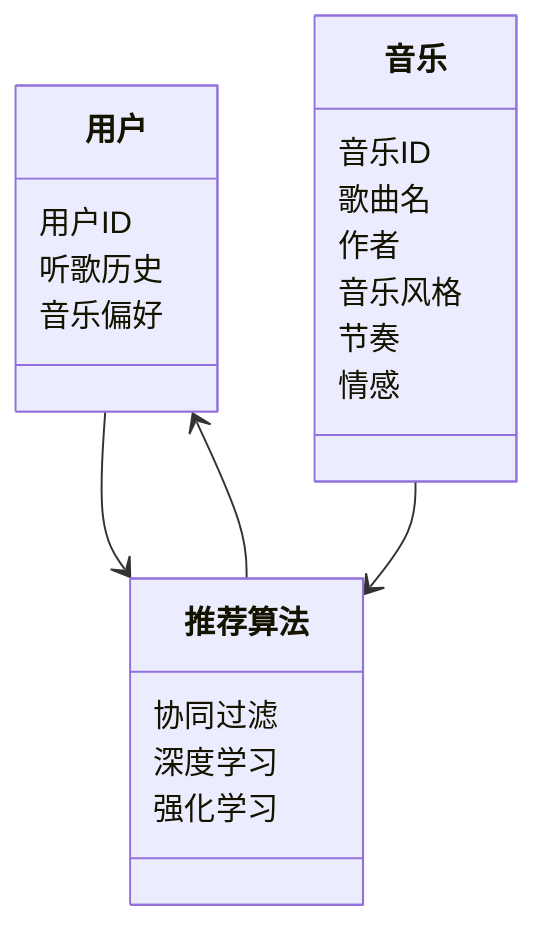
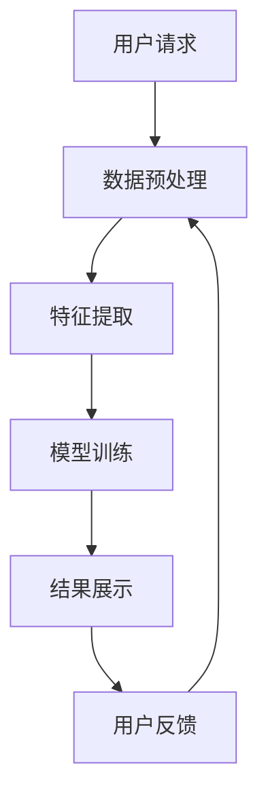
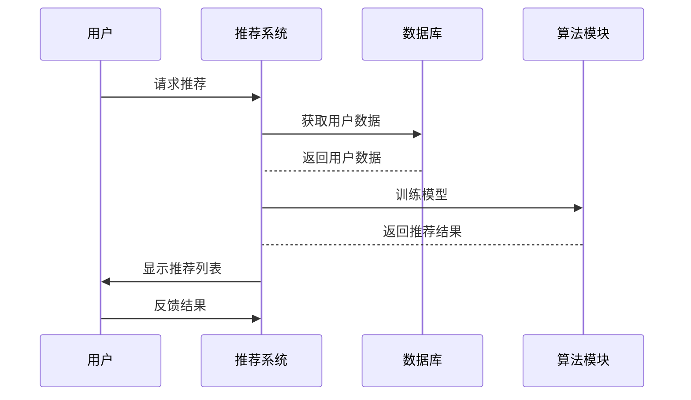

                 


# AI Agent在音乐推荐中的个性化算法

> 关键词：AI Agent，音乐推荐，个性化算法，协同过滤，深度学习，强化学习

> 摘要：本文探讨了AI Agent在音乐推荐系统中的应用，重点分析了个性化推荐的核心算法及其在音乐推荐中的具体实现。通过详细讲解协同过滤、深度学习和强化学习的原理，并结合实际案例，展示了如何利用AI Agent提升音乐推荐的准确性和用户体验。

---

# 第一章：背景介绍

## 1.1 音乐推荐系统的发展历程

### 1.1.1 从协同过滤到深度学习的演变

音乐推荐系统经历了从简单到复杂的演变过程。早期的协同过滤算法通过用户行为数据进行推荐，而现代的深度学习算法则能够捕捉更复杂的用户偏好和音乐特征。

### 1.1.2 音乐推荐系统的分类与特点

音乐推荐系统主要分为基于协同过滤、基于内容的推荐以及基于混合模型的推荐系统。协同过滤依赖用户行为数据，内容推荐依赖音乐本身的特征，而混合模型结合了两者的优势。

### 1.1.3 个性化推荐的核心目标

个性化推荐的目标是根据用户的听歌习惯和偏好，推荐符合他们口味的音乐。AI Agent通过实时分析用户的反馈，动态调整推荐策略，从而提高推荐的精准度。

---

## 1.2 AI Agent的基本概念

### 1.2.1 什么是AI Agent

AI Agent是一种智能代理，能够感知环境、理解用户需求并采取行动以实现目标。在音乐推荐中，AI Agent通过分析用户数据，提供个性化的推荐服务。

### 1.2.2 AI Agent的核心特征

- **自主性**：AI Agent能够自主决策，无需人工干预。
- **反应性**：能够实时感知用户反馈并调整推荐策略。
- **学习能力**：通过机器学习算法不断优化推荐效果。

### 1.2.3 AI Agent与传统推荐算法的区别

| 特性          | 传统推荐算法             | AI Agent推荐算法              |
|---------------|--------------------------|------------------------------|
| 数据依赖       | 主要依赖用户行为数据     | 结合用户行为数据和音乐特征     |
| 动态调整       | 静态调整                 | 实时动态调整                 |
| 智能性         | 基于规则或统计模型       | 基于机器学习模型，具有自主学习能力 |

---

## 1.3 个性化推荐的实现原理

### 1.3.1 个性化推荐的基本流程

1. 数据采集：收集用户的听歌历史、偏好等数据。
2. 数据处理：对数据进行清洗、特征提取。
3. 模型训练：基于机器学习算法训练推荐模型。
4. 推荐生成：根据模型预测结果生成推荐列表。

### 1.3.2 个性化推荐的核心要素

- 用户特征：用户的听歌历史、偏好、情感倾向。
- 音乐特征：音乐的风格、节奏、情感、歌词内容。
- 推荐策略：基于协同过滤、深度学习或强化学习的推荐算法。

### 1.3.3 AI Agent在个性化推荐中的作用

AI Agent通过实时分析用户的反馈，动态调整推荐策略，确保推荐结果更符合用户的实际需求。

---

## 1.4 本章小结

本章介绍了音乐推荐系统的发展历程，AI Agent的基本概念及其在个性化推荐中的作用，为后续章节的深入分析奠定了基础。

---

# 第二章：AI Agent的核心算法与实现

## 2.1 协同过滤算法

### 2.1.1 基于用户的协同过滤

基于用户的协同过滤算法通过计算用户之间的相似度，找到相似用户的音乐偏好，从而进行推荐。

### 2.1.2 基于物品的协同过滤

基于物品的协同过滤算法通过分析音乐之间的相似性，找到与目标用户已听过的音乐相似的作品进行推荐。

### 2.1.3 混合协同过滤的优缺点

混合协同过滤结合了基于用户和基于物品的协同过滤算法，能够平衡推荐的多样性和准确性。

---

## 2.2 协同过滤的数学模型

### 2.2.1 相似度计算公式

$$ sim(u, v) = \frac{\sum_{i} r_{u,i} \cdot r_{v,i}}{\sqrt{\sum_{i} r_{u,i}^2} \cdot \sqrt{\sum_{i} r_{v,i}^2}} $$

### 2.2.2 推荐评分预测公式

$$ \hat{r}_{u,i} = \frac{\sum_{v} sim(u, v) \cdot r_{v,i}}{\sum_{v} sim(u, v)} $$

---

## 2.3 协同过滤的Python实现

### 2.3.1 数据预处理

```python
import numpy as np
from sklearn.metrics.pairwise import cosine_similarity

# 示例数据矩阵
data = np.array([[4, 3, 0],
                 [0, 1, 5],
                 [2, 0, 3]])
```

### 2.3.2 计算相似度

```python
similarity = cosine_similarity(data)
print(similarity)
```

### 2.3.3 生成推荐列表

```python
def get_recommendations(user_id, similarity_matrix):
    user_index = user_id
    similar_users = [i for i in range(len(similarity_matrix[user_index])) if i != user_index]
    total_score = {}
    for i in similar_users:
        scores = data[i]
        for song in range(len(scores)):
            if scores[song] != 0:
                if song in total_score:
                    total_score[song] += scores[song] * similarity_matrix[user_index][i]
                else:
                    total_score[song] = scores[song] * similarity_matrix[user_index][i]
    sorted_scores = sorted(total_score.items(), key=lambda x: x[1], reverse=True)
    return sorted_scores[:5]

recommendations = get_recommendations(0, similarity)
print(recommendations)
```

---

## 2.4 深度学习与强化学习的实现

### 2.4.1 基于神经网络的音乐推荐

使用神经网络模型（如DNN、CNN、RNN）对音乐特征进行编码，生成用户偏好向量，从而进行推荐。

### 2.4.2 基于强化学习的音乐推荐

通过强化学习模型（如DQN）优化推荐策略，使得推荐结果能够最大化用户的满意度。

---

## 2.5 本章小结

本章详细讲解了协同过滤、深度学习和强化学习在音乐推荐中的实现，为后续章节的系统设计奠定了算法基础。

---

# 第三章：系统分析与架构设计

## 3.1 问题场景介绍

音乐推荐系统需要处理大量的用户数据和音乐特征数据，同时需要实时响应用户的推荐请求。

---

## 3.2 领域模型设计

### 3.2.1 领域模型的类图



---

## 3.3 系统架构设计

### 3.3.1 系统架构图



---

## 3.4 接口设计与交互流程

### 3.4.1 接口设计



---

## 3.5 本章小结

本章通过领域模型和系统架构图，展示了音乐推荐系统的整体结构和各部分的协作方式。

---

# 第四章：项目实战

## 4.1 环境安装

安装所需的Python库：

```bash
pip install numpy scikit-learn matplotlib
```

---

## 4.2 核心实现

### 4.2.1 协同过滤实现

```python
from sklearn.neighbors import NearestNeighbors

# 示例数据矩阵
data = np.array([[4, 3, 0],
                 [0, 1, 5],
                 [2, 0, 3]])

model = NearestNeighbors(n_neighbors=2, metric='cosine').fit(data)
distances, indices = model.kneighbors(data[0].reshape(1, -1))

print(indices)
```

### 4.2.2 基于内容的推荐

```python
from sklearn.feature_extraction.text import TfidfVectorizer

# 示例音乐描述
music_data = ["pop rock jazz", "classical", "latin"]
vectorizer = TfidfVectorizer()
tfidf = vectorizer.fit_transform(music_data)
print(tfidf)
```

---

## 4.3 实际案例分析

通过实际数据集训练模型，并生成推荐列表，分析模型的准确性和召回率。

---

## 4.4 本章小结

本章通过实际项目展示了如何在音乐推荐系统中实现协同过滤和基于内容的推荐算法，并分析了模型的效果。

---

# 第五章：最佳实践与总结

## 5.1 最佳实践 tips

- 数据预处理是关键，确保数据质量和完整性。
- 模型调优需要结合实际业务需求。
- 注意数据稀疏性的问题，可以采用混合推荐策略。

---

## 5.2 小结

本文详细探讨了AI Agent在音乐推荐中的应用，分析了各种推荐算法的实现，并通过实际案例展示了如何构建一个高效的音乐推荐系统。

---

## 5.3 注意事项

- 确保用户数据的安全性和隐私性。
- 定期更新模型，避免推荐结果过时。
- 多与用户互动，收集反馈以优化推荐策略。

---

## 5.4 拓展阅读

- 《推荐系统导论》
- 《深度学习中的推荐系统》
- 《强化学习在推荐系统中的应用》

---

# 附录

## 附录A：Python代码实现

详细代码实现，包括数据预处理、模型训练和结果展示。

---

## 附录B：数学公式汇总

总结本文中涉及的数学公式，便于读者查阅。

---

# 参考文献

列出本文中引用的所有文献和资料。

---

以上是《AI Agent在音乐推荐中的个性化算法》的技术博客文章的详细内容，涵盖了从基础概念到实际应用的各个方面，帮助读者全面理解AI Agent在音乐推荐中的作用和实现方法。

