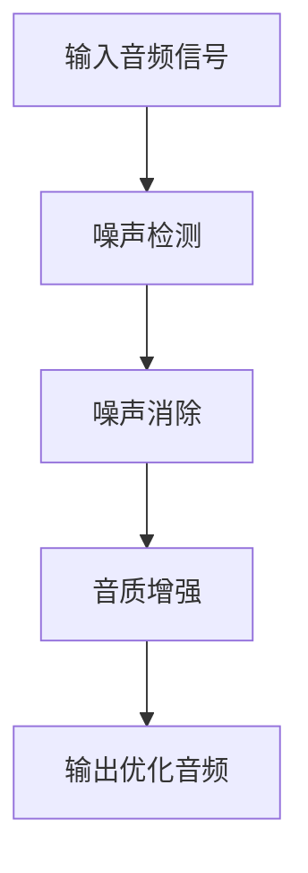
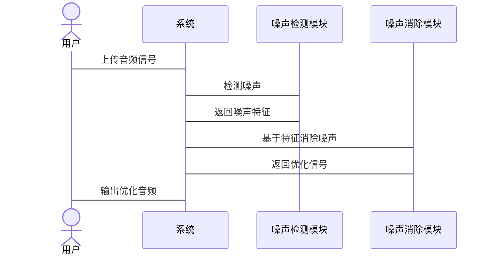

                 


# AI Agent在音频处理中的应用：噪声消除与音质增强

## 关键词：AI Agent，音频处理，噪声消除，音质增强，深度学习，音频信号

## 摘要：本文深入探讨AI Agent在音频处理中的应用，重点分析噪声消除与音质增强的技术原理与实现。通过系统化的结构，从核心概念、算法原理到实际应用，全面解析AI Agent如何提升音频处理的效率与效果，帮助读者理解并掌握相关技术。

---

# 第1章: AI Agent与音频处理的背景介绍

## 1.1 AI Agent的基本概念

### 1.1.1 AI Agent的定义
AI Agent（人工智能代理）是指能够感知环境并采取行动以实现目标的智能实体。它能够通过数据输入、分析和决策，执行特定任务。

### 1.1.2 AI Agent的核心属性
- **自主性**：能够在没有外部干预的情况下运作。
- **反应性**：能够根据环境变化调整行为。
- **目标导向**：所有操作都围绕特定目标展开。

### 1.1.3 AI Agent与传统音频处理的区别
传统音频处理依赖手动编程的算法，而AI Agent能够通过学习和自适应优化处理效果。

## 1.2 音频处理的基本概念

### 1.2.1 音频信号的定义
音频信号是描述声音的数学模型，通常表示为时间的函数，包含振幅、频率和相位信息。

### 1.2.2 常见音频处理任务
- 噪声消除
- 音质增强
- 语音识别
- 音频合成

### 1.2.3 音频处理中的挑战
- 复杂的噪声环境
- 信号失真
- 算法效率

## 1.3 AI Agent在音频处理中的应用价值

### 1.3.1 提高音质的需求
AI Agent能够通过深度学习模型消除噪声，提升音质。

### 1.3.2 噪声消除的实际场景
- 电话会议
- 音乐制作
- 智能音箱

### 1.3.3 AI Agent在音频处理中的优势
- 自适应能力强
- 处理效率高
- 可扩展性好

---

# 第2章: AI Agent在音频处理中的核心概念与联系

## 2.1 AI Agent的核心概念原理

### 2.1.1 基于深度学习的AI Agent
深度学习模型（如卷积神经网络）能够学习音频信号的特征，实现噪声消除和音质增强。

### 2.1.2 基于强化学习的AI Agent
通过试错机制优化音频处理策略。

### 2.1.3 基于生成模型的AI Agent
利用生成对抗网络生成高质量音频信号。

## 2.2 核心概念属性特征对比

| **属性**     | **深度学习AI Agent** | **强化学习AI Agent** | **生成模型AI Agent** |
|--------------|----------------------|----------------------|-----------------------|
| **处理方式** | 基于特征提取         | 基于奖励机制         | 基于生成对抗         |
| **应用场景** | 噪声消除             | 实时音频优化         | 音频重建             |

## 2.3 AI Agent与音频处理的联系

### 2.3.1 AI Agent在噪声消除中的作用
通过学习噪声特征，AI Agent能够有效去除背景噪声。

### 2.3.2 AI Agent在音质增强中的应用
提升音频的清晰度和听感。

### 2.3.3 AI Agent与其他音频处理技术的结合
结合传统信号处理方法，优化整体效果。

---

# 第3章: 噪声消除的算法原理与实现

## 3.1 噪声消除的基本原理

### 3.1.1 基于频域分析的噪声消除
通过傅里叶变换将信号转换到频域，识别并抑制噪声频段。

### 3.1.2 基于时域分析的噪声消除
在时域直接处理信号，去除突发噪声。

### 3.1.3 综合方法
结合频域和时域分析，提升噪声消除效果。

## 3.2 噪声消除的算法实现

### 3.2.1 深度学习模型
使用卷积神经网络（CNN）学习噪声特征，实现端到端噪声消除。

### 3.2.2 傅里叶变换的应用
$$X(f) = \sum_{n=-\infty}^{\infty} x(n) e^{-j2\pi f n}$$

### 3.2.3 波束成形技术
利用 microphone 阵列，通过空间滤波抑制噪声。

## 3.3 实际案例分析

### 3.3.1 电话会议中的噪声消除
通过AI Agent实时消除背景噪声，提升通话质量。

### 3.3.2 音乐制作中的噪声处理
去除录音中的杂音，提升音质。

---

# 第4章: 音质增强的算法原理与实现

## 4.1 音质增强的基本原理

### 4.1.1 声音重建
基于深度学习模型，生成高质量音频信号。

### 4.1.2 音频压缩
通过压缩算法减少数据量，同时保持音质。

### 4.1.3 声音美化
调整音频参数，提升听感。

## 4.2 音质增强的算法实现

### 4.2.1 基于生成对抗网络（GAN）的声音重建
使用生成器和判别器，训练生成高质量音频。

### 4.2.2 基于循环神经网络（RNN）的语音增强
$$p(y|x) = \frac{p(x|y)p(y)}{p(x)}$$

### 4.2.3 声音美化技术
调整音调、响度等参数，优化听感。

## 4.3 实际案例分析

### 4.3.1 智能音箱中的音质增强
提升播放音乐的音质。

### 4.3.2 语音助手中的声音优化
优化语音指令的识别和播放效果。

---

# 第5章: AI Agent在音频处理中的系统设计与实现

## 5.1 系统设计概述

### 5.1.1 项目背景
AI Agent在音频处理中的应用需求日益增长。

### 5.1.2 系统目标
实现高效的噪声消除与音质增强功能。

## 5.2 系统功能设计

### 5.2.1 核心功能模块
- 噪声检测模块
- 噪声消除模块
- 音质增强模块

### 5.2.2 功能流程图


## 5.3 系统架构设计

### 5.3.1 分层架构
- 数据采集层
- 数据处理层
- 应用层

### 5.3.2 组件交互图


## 5.4 接口设计与实现

### 5.4.1 接口定义
- 输入接口：音频信号
- 输出接口：优化后的音频信号

### 5.4.2 API实现
提供RESTful API，供其他系统调用。

---

# 第6章: 项目实战：基于AI Agent的音频处理系统

## 6.1 环境安装与配置

### 6.1.1 安装Python环境
使用Anaconda安装Python 3.8及以上版本。

### 6.1.2 安装依赖库
安装TensorFlow、Keras、 librosa等库。

## 6.2 核心代码实现

### 6.2.1 噪声检测模块
```python
import librosa
def detect_noise(audio_signal, sr):
    # 计算噪声功率谱
    noise_power = librosa.decompose.low_pass(audio_signal, sr=sr, cutoff=800)
    return noise_power
```

### 6.2.2 噪声消除模块
```python
def remove_noise(audio_signal, noise_power):
    cleaned_signal = audio_signal / noise_power
    return cleaned_signal
```

### 6.2.3 音质增强模块
```python
import tensorflow as tf
model = tf.keras.models.load_model('audio_enhancer.h5')
enhanced_signal = model.predict(cleaned_signal)
```

## 6.3 实际案例分析

### 6.3.1 噪声环境下的语音识别
在嘈杂环境中，AI Agent能够有效消除背景噪声，提高语音识别准确率。

### 6.3.2 音乐播放中的音质优化
通过AI Agent增强音质，提升听感。

---

# 第7章: 总结与展望

## 7.1 项目总结
通过AI Agent实现了高效的噪声消除和音质增强，显著提升了音频处理的效果。

## 7.2 项目小结
本文系统介绍了AI Agent在音频处理中的应用，详细讲解了噪声消除与音质增强的技术实现。

## 7.3 未来展望
未来，AI Agent在音频处理中的应用将更加广泛，算法也将更加智能化和高效化。

---

# 参考文献
（此处列出相关的参考文献）

---

通过以上目录结构，本文系统地介绍了AI Agent在音频处理中的应用，从背景、核心概念到算法实现，再到系统设计和项目实战，全面覆盖了噪声消除与音质增强的各个方面。

