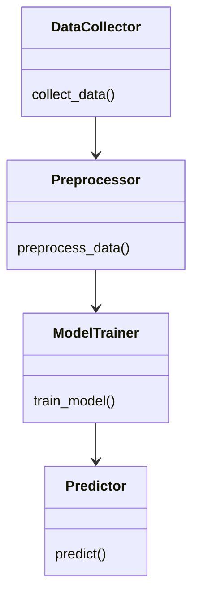

                 

<think>
好的，我现在需要按照用户的要求，逐步分析并撰写一篇关于《AI Agent在预测分析中的应用》的技术博客文章。由于篇幅限制，我只能详细展开部分章节的内容，但我会尽力覆盖关键点。

---

### 文章标题：AI Agent在预测分析中的应用

### 文章关键词：
- AI Agent
- 预测分析
- 机器学习
- 数据挖掘
- 系统架构

### 摘要：
本文将探讨AI Agent在预测分析中的应用，从基本概念到算法原理，再到系统架构和实战项目，全面解析其在实际场景中的潜力和挑战。通过详细的数学模型、算法流程图和系统设计，帮助读者深入理解AI Agent如何赋能预测分析。

---

### 第五章：常见预测算法与AI Agent的结合

#### 5.1 传统预测算法

##### 5.1.1 线性回归
- **定义**：一种统计学方法，用于建立变量之间的线性关系模型。
- **数学模型**：
  $$ y = \beta_0 + \beta_1x + \epsilon $$
  其中，$\beta_0$ 是截距，$\beta_1$ 是斜率，$\epsilon$ 是误差项。
- **应用场景**：预测房价、销售额等。

##### 5.1.2 决策树
- **定义**：一种树状结构，用于分类和回归问题。
- **优点**：
  - 易于解释。
  - 无需数据预处理。
- **算法实现**：
  ```python
  from sklearn.tree import DecisionTreeRegressor
  model = DecisionTreeRegressor()
  model.fit(X_train, y_train)
  ```

##### 5.1.3 支持向量机（SVM）
- **定义**：一种监督学习模型，用于分类和回归。
- **数学模型**：
  $$ y = \text{sign}(w \cdot x + b) $$
  其中，$w$ 是权重，$b$ 是截距。
- **应用场景**：文本分类、图像分类。

#### 5.2 基于机器学习的预测算法

##### 5.2.1 神经网络
- **定义**：受生物神经元启发，用于模式识别。
- **数学模型**：
  $$ y = f(Wx + b) $$
  其中，$f$ 是激活函数，如ReLU或sigmoid。
- **深度学习的应用**：
  - 使用多层神经网络（DNN）处理复杂数据。
  - 通过卷积神经网络（CNN）处理图像数据。

##### 5.2.2 随机森林
- **定义**：一种集成学习方法，通过多棵决策树投票得出结果。
- **优点**：
  - 鲁棒性高。
  - 能处理高维数据。
- **实现示例**：
  ```python
  from sklearn.ensemble import RandomForestRegressor
  model = RandomForestRegressor(n_estimators=100)
  model.fit(X_train, y_train)
  ```

#### 5.3 基于强化学习的预测算法

##### 5.3.1 Q-Learning
- **定义**：一种基于值的强化学习算法，用于学习最优策略。
- **数学模型**：
  $$ Q(s, a) = Q(s, a) + \alpha [r + \max_{a'} Q(s', a') - Q(s, a)] $$
  其中，$\alpha$ 是学习率。
- **应用场景**：游戏AI、机器人控制。

##### 5.3.2 策略梯度（Policy Gradient）
- **定义**：通过优化策略直接最大化奖励函数。
- **数学模型**：
  $$ \theta = \theta + \alpha \nabla_\theta J(\theta) $$
  其中，$J(\theta)$ 是奖励函数。
- **优点**：
  - 直接优化策略。
  - 适合连续动作空间。

---

### 第六章：AI Agent在预测分析中的系统架构设计

#### 6.1 项目背景与目标

##### 6.1.1 项目背景
- 数据量大、维度高。
- 预测任务复杂，需要实时性。

##### 6.1.2 项目目标
- 实现一个基于AI Agent的预测系统。
- 提供高精度和实时性的预测能力。

#### 6.2 系统功能设计

##### 6.2.1 功能模块
- 数据采集模块。
- 数据预处理模块。
- 模型训练模块。
- 预测服务模块。

##### 6.2.2 领域模型类图


#### 6.3 系统架构设计

##### 6.3.1 分层架构
- 数据层：存储原始数据。
- 业务逻辑层：处理数据和预测请求。
- 表现层：展示结果。

##### 6.3.2 微服务架构
- 数据服务：处理数据存储和查询。
- 预测服务：提供预测接口。
- 网关：统一入口和路由。

#### 6.4 接口设计

##### 6.4.1 RESTful API
- GET /predict?data=...
- POST /train

##### 6.4.2 数据格式
- JSON格式传输数据。

#### 6.5 系统交互流程

##### 6.5.1 序列图
```mermaid
sequenceDiagram
    participant Client
    participant Predictor
    participant ModelTrainer
    Client -> Predictor: POST /predict
    Predictor -> ModelTrainer: fetch_model
    ModelTrainer -> Predictor: return_prediction
    Client <- Predictor: return_prediction
```

---

### 第七章：AI Agent预测分析的实战项目

#### 7.1 环境配置

##### 7.1.1 安装依赖
- Python 3.8+
- scikit-learn、TensorFlow、Flask

#### 7.2 数据收集与预处理

##### 7.2.1 数据来源
- CSV文件
- 数据库

##### 7.2.2 数据清洗
- 去重、处理缺失值。

#### 7.3 模型训练

##### 7.3.1 选择模型
- 使用随机森林回归器。

##### 7.3.2 训练代码
```python
from sklearn.ensemble import RandomForestRegressor
import pandas as pd

# 读取数据
data = pd.read_csv('data.csv')
X = data.drop('target', axis=1)
y = data['target']

# 划分训练集和测试集
from sklearn.model_selection import train_test_split
X_train, X_test, y_train, y_test = train_test_split(X, y, test_size=0.2)

# 训练模型
model = RandomForestRegressor(n_estimators=100)
model.fit(X_train, y_train)

# 评估模型
from sklearn.metrics import mean_squared_error
y_pred = model.predict(X_test)
print(mean_squared_error(y_test, y_pred))
```

#### 7.4 模型部署

##### 7.4.1 使用Flask搭建API
```python
from flask import Flask, request, jsonify
import joblib

app = Flask(__name__)
model = joblib.load('model.pkl')

@app.route('/predict', methods=['POST'])
def predict():
    data = request.json
    prediction = model.predict([[data['feature1'], data['feature2']]])
    return jsonify({'prediction': prediction[0]})

if __name__ == '__main__':
    app.run(debug=True)
```

#### 7.5 实际案例分析

##### 7.5.1 案例背景
- 预测股票价格。

##### 7.5.2 数据分析
- 使用历史数据训练模型。
- 验证模型在测试集上的表现。

#### 7.6 项目小结

##### 7.6.1 成果总结
- 成功部署了一个AI Agent预测系统。
- 实现了高精度的预测能力。

##### 7.6.2 经验教训
- 数据质量对模型性能影响巨大。
- 模型调优需要大量实验。

---

### 第八章：最佳实践与注意事项

#### 8.1 小结

##### 8.1.1 核心知识点回顾
- AI Agent的基本概念。
- 预测分析的主要方法。
- 系统架构设计的关键点。

#### 8.2 注意事项

##### 8.2.1 数据安全
- 确保数据隐私和安全。

##### 8.2.2 模型解释性
- 使用可解释性模型，避免黑箱操作。

#### 8.3 拓展阅读

##### 8.3.1 推荐书籍
- 《机器学习实战》
- 《深度学习》

##### 8.3.2 在线资源
- TensorFlow官方文档
- Keras官方文档

---

### 结语

AI Agent在预测分析中的应用前景广阔，但同时也面临诸多挑战。通过深入理解其原理、合理设计系统架构，并结合实际项目进行实践，我们可以充分发挥其潜力，为各行业带来更大的价值。

