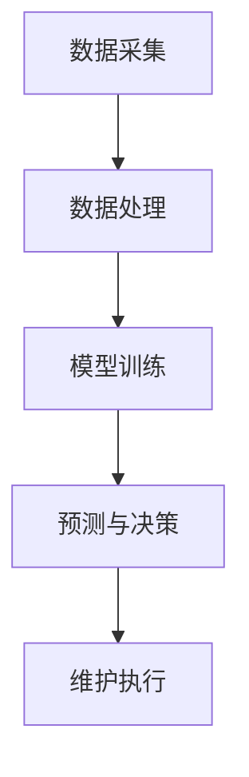

                 


# AI Agent在预测性维护中的实践

> 关键词：AI Agent, 预测性维护, 机器学习, 系统架构, 工业物联网

> 摘要：本文详细探讨了AI Agent在预测性维护中的实践应用，从背景介绍、核心概念、算法原理、系统架构到项目实战，结合具体案例和代码实现，深入分析了AI Agent如何赋能预测性维护，帮助读者理解其技术原理和实际应用价值。

---

# 第一部分: 背景与核心概念

## 第1章: 预测性维护的背景与意义

### 1.1 预测性维护的基本概念
预测性维护是一种基于设备运行数据的预测技术，旨在通过分析设备状态数据，预测设备可能出现的故障，从而提前采取维护措施，避免设备停机或故障的发生。

### 1.2 AI Agent在预测性维护中的作用
AI Agent（智能代理）是一种能够感知环境、自主决策并采取行动的智能系统。在预测性维护中，AI Agent可以通过实时数据分析、模型推理和自主决策，实现设备故障的早期预警和维护策略的优化。

### 1.3 预测性维护与传统维护的区别
- **传统维护**：基于固定的维护周期或被动响应故障。
- **预测性维护**：基于实时数据和模型预测，主动采取维护措施。

### 1.4 预测性维护的核心价值
- **降低维护成本**：通过预测故障，减少非计划停机时间。
- **提高设备利用率**：延长设备寿命，提高生产效率。
- **优化维护资源**：通过精准预测，合理分配维护资源。

---

## 第2章: AI Agent与预测性维护的核心概念

### 2.1 AI Agent的核心属性
- **感知能力**：通过传感器数据感知设备状态。
- **决策能力**：基于数据和模型进行决策。
- **自主性**：能够自主执行维护任务。

### 2.2 预测性维护的核心要素
- **数据采集**：从设备中获取运行数据。
- **数据预处理**：清洗和特征提取。
- **模型训练**：建立故障预测模型。
- **预测与决策**：基于模型输出维护策略。

### 2.3 AI Agent与预测性维护的关系
- **数据流**：设备数据 → 数据预处理 → 模型输入 → 预测结果 → 决策输出。
- **模型训练**：通过历史数据训练模型，优化预测精度。
- **决策机制**：基于预测结果，AI Agent自主决定是否需要维护。

---

# 第二部分: AI Agent的算法原理与数学模型

## 第3章: 机器学习算法在预测性维护中的应用

### 3.1 线性回归模型
- **基本原理**：通过最小化预测值与实际值的平方差之和，建立线性关系模型。
- **数学公式**：$$ y = \beta_0 + \beta_1x + \epsilon $$

### 3.2 支持向量机（SVM）
- **基本原理**：通过构建超平面，将数据点分到不同的类别中。
- **数学公式**：$$ \text{目标函数} = \frac{1}{2}\|\omega\|^2 + C\sum_{i=1}^n \xi_i $$

### 3.3 随机森林
- **基本原理**：通过构建多个决策树，集成学习提高预测精度。

## 第4章: 深度学习算法在预测性维护中的应用

### 4.1 卷积神经网络（CNN）
- **基本原理**：通过卷积操作提取设备状态的特征信息。
- **数学公式**：$$ \text{卷积操作} = \sum_{i=j}^{n} w_{i}x_{i} $$

### 4.2 循环神经网络（RNN）
- **基本原理**：通过循环结构处理序列数据，预测设备状态的变化趋势。

## 第5章: 强化学习算法在预测性维护中的应用

### 5.1 Q-learning算法
- **基本原理**：通过状态-动作-奖励的循环，优化决策策略。
- **数学公式**：$$ Q(s, a) = Q(s, a) + \alpha [r + \max Q(s', a) - Q(s, a)] $$

---

# 第三部分: 系统架构与项目实战

## 第6章: 系统架构设计

### 6.1 系统功能设计
- **数据采集模块**：负责采集设备运行数据。
- **数据处理模块**：对数据进行清洗和特征提取。
- **模型训练模块**：基于历史数据训练预测模型。
- **预测与决策模块**：实时预测设备状态并输出维护策略。

### 6.2 系统架构图


## 第7章: 项目实战

### 7.1 环境安装
- **工具安装**：安装Python、TensorFlow、Keras等工具。
- **数据准备**：收集设备运行数据并进行预处理。

### 7.2 核心代码实现
```python
import numpy as np
from sklearn.model_selection import train_test_split
from sklearn.metrics import accuracy_score

# 数据预处理
X = np.load('data.npy')
y = np.load('labels.npy')

# 划分训练集和测试集
X_train, X_test, y_train, y_test = train_test_split(X, y, test_size=0.2)

# 模型训练
model = build_model()  # 自定义模型
model.fit(X_train, y_train, epochs=100, batch_size=32)

# 模型预测
y_pred = model.predict(X_test)
print("预测准确率:", accuracy_score(y_test, y_pred))
```

---

# 第四部分: 总结与展望

## 第8章: 总结与注意事项

### 8.1 本章总结
- AI Agent通过实时数据分析和模型预测，能够显著提升预测性维护的效率和准确性。
- 在实际应用中，需要结合具体场景选择合适的算法，并不断优化模型性能。

### 8.2 注意事项
- 数据质量对模型性能影响重大，需确保数据采集和预处理的准确性。
- 模型部署后需持续监控和优化，以应对设备状态的变化。

## 第9章: 未来展望

### 9.1 技术发展
- 结合边缘计算和物联网技术，进一步提升预测性维护的实时性和准确性。

### 9.2 应用场景拓展
- 将AI Agent应用于更多领域，如智慧城市、医疗设备维护等。

---

# 附录

## 附录A: 相关工具与库

- **Python**：数据处理与模型训练。
- **TensorFlow/Keras**：深度学习框架。
- **Mermaid**：图表绘制工具。

## 附录B: 代码示例

```python
import numpy as np
from tensorflow.keras import layers

def build_model():
    model = layers.Sequential()
    model.add(layers.Dense(64, activation='relu', input_shape=(input_dim,)))
    model.add(layers.Dense(1, activation='sigmoid'))
    model.compile(optimizer='adam', loss='binary_crossentropy', metrics=['accuracy'])
    return model
```

---

通过本文的系统阐述，读者可以全面理解AI Agent在预测性维护中的应用价值和技术实现，同时能够通过代码实现和案例分析，掌握实际操作方法。

