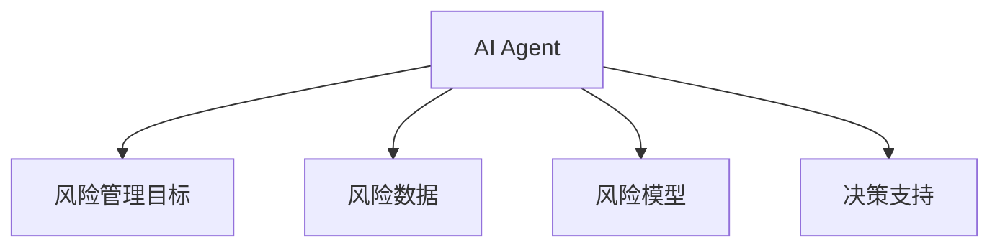
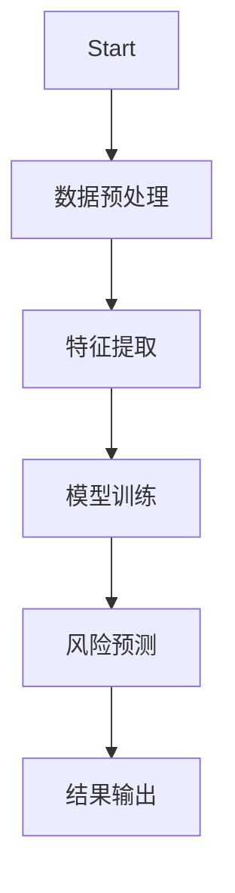
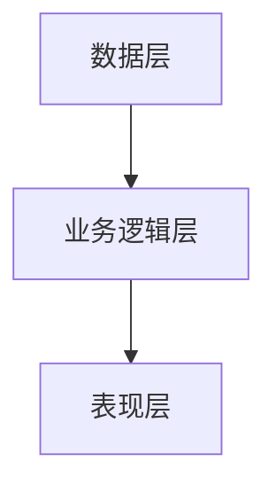
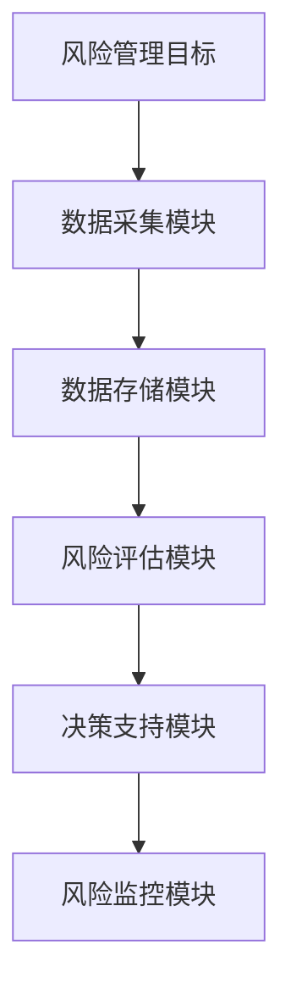

                 


# AI Agent在风险管理中的应用

## 关键词：AI Agent, 风险管理, 机器学习, 概率论, 系统架构

## 摘要：  
本文详细探讨了AI Agent在风险管理中的应用，从基本概念到核心算法，从系统架构到实际案例，全面分析了AI Agent如何提升风险管理的效率与精度。文章结合理论与实践，通过具体案例和详细解读，展示了AI Agent在风险管理中的独特优势和未来发展趋势。

---

## 第一部分: AI Agent在风险管理中的应用概述

### 第1章: AI Agent与风险管理的背景介绍

#### 1.1 AI Agent的基本概念
##### 1.1.1 AI Agent的定义与特点
AI Agent（人工智能代理）是指能够感知环境、自主决策并执行任务的智能实体。其特点包括：
- **自主性**：无需外部干预，自主完成任务。
- **反应性**：能够实时感知环境变化并做出反应。
- **目标导向性**：基于预设目标或动态目标进行决策。
- **学习能力**：通过数据和经验不断优化自身性能。

##### 1.1.2 AI Agent的核心要素与组成
AI Agent的核心要素包括：
1. **感知模块**：负责收集环境数据，如传感器输入或日志数据。
2. **决策模块**：基于感知数据进行分析和决策，可能采用监督学习或无监督学习算法。
3. **执行模块**：根据决策结果执行操作，如触发警报或调整策略。
4. **学习模块**：通过反馈机制优化模型性能。

##### 1.1.3 AI Agent与传统风险管理工具的对比
| 对比维度 | AI Agent | 传统风险管理工具 |
|----------|-----------|------------------|
| 数据处理能力 | 高度智能化，支持实时处理 | 依赖人工分析，处理能力有限 |
| 决策速度 | 快速响应，实时决策 | 延迟较高，依赖人工判断 |
| 自适应能力 | 能够动态优化策略 | 策略固定，调整周期长 |

#### 1.2 风险管理的背景与挑战
##### 1.2.1 风险管理的基本概念
风险管理是指通过识别、评估和应对潜在风险，以最小化其对组织目标的影响。传统的风险管理方法依赖人工分析，效率低下且容易遗漏关键风险点。

##### 1.2.2 传统风险管理的局限性
- **信息处理能力有限**：人工难以处理海量数据。
- **决策滞后**：传统方法依赖定期报告，无法实时应对风险。
- **模型固定**：传统模型缺乏灵活性，难以适应复杂多变的环境。

##### 1.2.3 现代风险管理的需求与趋势
现代风险管理需要更加智能化、自动化和动态化的解决方案。AI Agent的引入为风险管理提供了新的可能性，能够实时监控、快速响应和持续优化。

#### 1.3 AI Agent在风险管理中的应用前景
##### 1.3.1 AI Agent在风险管理中的优势
- **高效性**：AI Agent能够快速处理海量数据，提供实时风险评估。
- **准确性**：通过机器学习算法，AI Agent能够提高风险预测的准确性。
- **适应性**：AI Agent能够根据环境变化动态调整策略。

##### 1.3.2 风险管理领域的AI Agent应用案例
- **金融领域**：AI Agent用于实时监控市场波动，预测股票风险。
- **保险领域**：AI Agent用于评估保险产品的风险，并优化定价策略。
- **企业风险管理**：AI Agent用于实时监控企业运营中的潜在风险。

##### 1.3.3 未来发展趋势与挑战
- **趋势**：AI Agent在风险管理中的应用将更加普及，尤其是在金融、保险和企业风险管理领域。
- **挑战**：如何确保AI Agent的决策透明性和可解释性是一个重要问题。

---

### 第2章: AI Agent在风险管理中的核心概念与联系

#### 2.1 AI Agent的核心原理
##### 2.1.1 AI Agent的基本工作原理
AI Agent通过感知环境、分析数据、制定决策并执行操作来实现风险管理目标。其工作流程如下：
1. **感知环境**：AI Agent通过传感器或日志数据收集环境信息。
2. **分析数据**：利用机器学习算法对数据进行分析，识别潜在风险。
3. **制定决策**：基于分析结果，AI Agent制定应对策略。
4. **执行操作**：根据决策结果执行操作，如触发警报或调整策略。

##### 2.1.2 AI Agent的感知与决策机制
AI Agent的感知机制包括数据采集、特征提取和数据预处理。决策机制则依赖于监督学习、无监督学习或强化学习算法。

##### 2.1.3 AI Agent的自适应与优化能力
AI Agent能够通过反馈机制不断优化自身的模型参数，提高风险预测的准确性和决策的合理性。

#### 2.2 风险管理中的关键概念
##### 2.2.1 风险识别与评估
风险识别是通过数据分析发现潜在风险的过程。风险评估则是对风险的可能性和影响程度进行量化。

##### 2.2.2 风险量化与定价
通过概率论和统计学方法，AI Agent能够量化风险并为其定价。

##### 2.2.3 风险监控与预警
AI Agent能够实时监控风险指标，并在风险超过阈值时触发预警。

#### 2.3 AI Agent与风险管理的实体关系图


---

### 第3章: AI Agent在风险管理中的算法原理

#### 3.1 基于概率论的风险评估算法
##### 3.1.1 概率论的基本原理
概率论是风险评估的基础。通过概率分布模型，可以量化风险发生的可能性。

##### 3.1.2 风险概率计算公式
$$ P = \frac{N}{T} $$
其中，$P$ 是风险发生的概率，$N$ 是风险发生的次数，$T$ 是总次数。

##### 3.1.3 风险影响评估模型
$$ I = f(P, V) $$
其中，$I$ 是风险的影响程度，$P$ 是风险发生的概率，$V$ 是风险的影响范围。

#### 3.2 基于机器学习的AI Agent算法
##### 3.2.1 监督学习与无监督学习的对比
- **监督学习**：基于标记数据进行训练，适用于分类和回归任务。
- **无监督学习**：基于未标记数据进行训练，适用于聚类和异常检测任务。

##### 3.2.2 基于深度学习的风险预测模型
深度学习模型（如LSTM）能够捕捉时间序列数据中的复杂模式，适用于风险预测。

##### 3.2.3 算法流程图


---

### 第4章: 风险管理系统的分析与架构设计

#### 4.1 系统功能设计
##### 4.1.1 风险数据采集模块
负责采集风险相关的数据，如市场数据、交易数据等。

##### 4.1.2 风险评估模块
基于采集的数据，利用AI Agent进行风险评估。

##### 4.1.3 决策支持模块
根据风险评估结果，提供决策支持。

##### 4.1.4 风险监控模块
实时监控风险指标，并在风险超过阈值时触发预警。

#### 4.2 系统架构设计
##### 4.2.1 分层架构设计


##### 4.2.2 系统架构图


---

### 第5章: AI Agent在风险管理中的项目实战

#### 5.1 环境安装
需要安装Python、TensorFlow、Keras等工具。

#### 5.2 核心代码实现
以下是基于Python的风险管理AI Agent的实现代码：

```python
import numpy as np
from tensorflow.keras.models import Sequential
from tensorflow.keras.layers import Dense

# 数据预处理
data = np.random.rand(1000, 10)
labels = np.random.randint(2, size=1000)

# 构建模型
model = Sequential()
model.add(Dense(64, activation='relu', input_dim=10))
model.add(Dense(1, activation='sigmoid'))

model.compile(optimizer='adam', loss='binary_crossentropy', metrics=['accuracy'])

# 训练模型
model.fit(data, labels, epochs=10, batch_size=32)

# 预测结果
predictions = model.predict(data)
```

#### 5.3 案例分析
以金融市场的风险管理为例，AI Agent能够实时监控市场波动，预测股票风险，并在风险超过阈值时触发警报。

#### 5.4 项目小结
通过实际案例分析，展示了AI Agent在风险管理中的强大能力。

---

### 第6章: 最佳实践与总结

#### 6.1 小结
AI Agent在风险管理中的应用前景广阔，能够显著提高风险管理的效率和准确性。

#### 6.2 注意事项
- **数据质量**：确保数据的准确性和完整性。
- **模型解释性**：确保AI Agent的决策透明。
- **伦理与法律**：遵守相关法律法规，确保AI Agent的使用符合伦理标准。

#### 6.3 拓展阅读
推荐阅读《机器学习实战》和《风险管理与金融创新》等书籍，深入了解AI Agent在风险管理中的更多应用。

---

通过以上内容，我们可以看到，AI Agent在风险管理中的应用具有巨大的潜力。随着技术的不断进步，AI Agent将为风险管理领域带来更多的创新和突破。

