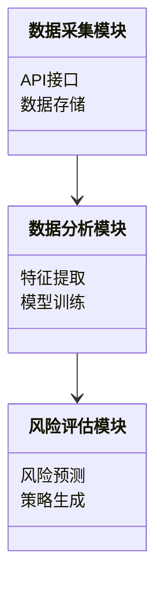
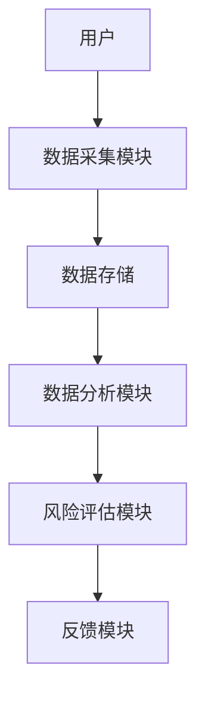
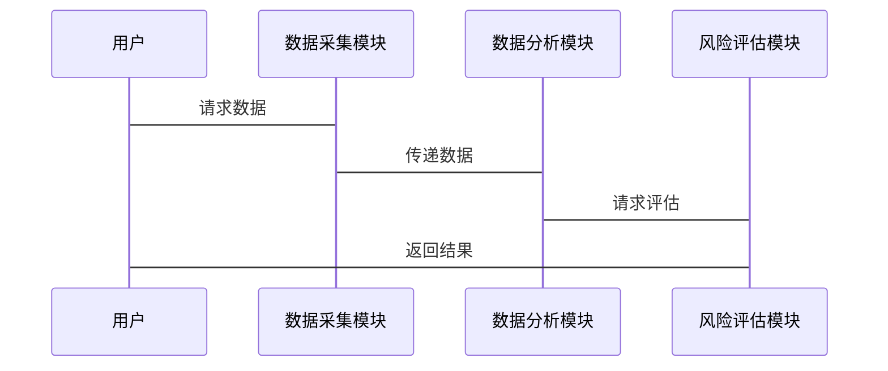

                 


# AI Agent在风险管理中的应用：市场分析与风险评估

## 关键词：AI Agent，风险管理，市场分析，风险评估，数学模型，机器学习

## 摘要：  
本文探讨AI Agent在风险管理中的应用，重点分析其在市场分析与风险评估中的核心作用。通过系统性地介绍AI Agent的基本概念、核心原理、数学模型、系统架构设计以及实际项目案例，本文旨在为读者提供一个全面且深入的理解框架，展示如何利用AI技术提升风险管理的效率与准确性。  

---

## 第1章 AI Agent与风险管理概述  

### 1.1 AI Agent的基本概念  
AI Agent（人工智能代理）是指能够感知环境、自主决策并执行任务的智能实体。它通过数据采集、分析和学习，能够模拟人类的决策过程，并在复杂环境中实现自动化操作。  

#### 1.1.1 AI Agent的特点  
- **自主性**：能够自主决策，无需人工干预。  
- **反应性**：能够实时感知环境变化并调整行为。  
- **学习能力**：通过机器学习算法不断优化自身性能。  

#### 1.1.2 AI Agent在风险管理中的作用  
AI Agent能够通过实时数据分析、模式识别和预测建模，帮助企业在复杂市场环境中快速识别风险、评估风险并制定应对策略。  

#### 1.1.3 风险管理的基本概念与分类  
风险管理是指通过识别、评估和应对潜在风险，以降低损失并确保企业稳健运行的过程。常见的风险管理类型包括市场风险、信用风险、操作风险等。  

---

### 1.2 AI Agent在市场分析中的应用  

#### 1.2.1 市场分析的基本方法  
市场分析通常包括数据采集、数据分析和预测建模三个步骤。传统的市场分析方法依赖于统计分析和专家经验，而AI Agent通过机器学习和大数据处理能力，显著提升了分析的效率和准确性。  

#### 1.2.2 AI Agent在市场分析中的优势  
- **高效性**：能够快速处理海量数据，生成实时分析结果。  
- **准确性**：通过机器学习算法，能够发现数据中的隐藏模式。  
- **适应性**：能够根据市场变化动态调整分析策略。  

#### 1.2.3 典型应用场景分析  
例如，在金融市场上，AI Agent可以通过分析历史价格数据、市场情绪和新闻资讯，预测股票价格的波动趋势，并为投资者提供风险评估和投资建议。  

---

### 1.3 风险评估与AI Agent的结合  

#### 1.3.1 风险评估的基本流程  
风险评估通常包括数据采集、风险建模、风险量化和风险应对策略制定四个阶段。  

#### 1.3.2 AI Agent在风险评估中的核心价值  
- **实时监控**：能够实时跟踪市场动态，及时发现潜在风险。  
- **精准预测**：通过机器学习模型，能够更准确地预测风险发生的概率和影响程度。  
- **自动化应对**：能够在风险发生时，自动触发应对措施，减少人工干预的时间差。  

#### 1.3.3 市场分析与风险评估的协同关系  
市场分析为风险评估提供数据支持，而风险评估则为市场分析提供反馈和优化方向。两者协同工作，能够形成一个闭环的优化系统。  

---

## 第2章 AI Agent的核心原理  

### 2.1 AI Agent的感知机制  

#### 2.1.1 数据采集与处理  
AI Agent通过多种数据源（如API接口、数据库、传感器等）采集数据，并对数据进行清洗、转换和特征提取。  

#### 2.1.2 数据特征提取  
通过特征工程，将原始数据转化为能够反映市场风险的特征向量。例如，可以通过主成分分析（PCA）降低数据维度，提取关键特征。  

#### 2.1.3 数据分析与模式识别  
利用机器学习算法（如支持向量机、随机森林等），对数据进行分类、聚类和回归分析，识别潜在的风险模式。  

---

### 2.2 AI Agent的决策机制  

#### 2.2.1 风险评估模型的选择  
根据具体应用场景，选择合适的机器学习模型。例如，对于时间序列数据，可以选择LSTM（长短期记忆网络）进行预测。  

#### 2.2.2 多目标优化算法  
在风险管理中，通常需要在多个目标之间进行权衡。例如，在投资决策中，需要在风险和收益之间找到平衡点。多目标优化算法（如遗传算法）可以帮助实现这一目标。  

#### 2.2.3 决策树与随机森林的应用  
决策树和随机森林是常用的分类和回归算法，能够帮助AI Agent在复杂市场环境中做出决策。  

---

### 2.3 AI Agent的执行机制  

#### 2.3.1 动作规划与策略生成  
基于风险评估结果，生成相应的应对策略。例如，在金融市场中，当预测到市场下跌时，生成卖出信号。  

#### 2.3.2 动作执行与反馈机制  
AI Agent根据生成的策略执行具体操作，并实时收集反馈数据，用于模型的优化和调整。  

#### 2.3.3 自适应优化算法  
通过强化学习等自适应优化算法，不断提升AI Agent的决策能力和应对复杂市场环境的能力。  

---

## 第3章 风险评估的数学模型与算法  

### 3.1 风险评估的基本数学模型  

#### 3.1.1 概率论基础  
概率论是风险评估的重要数学基础。例如，可以通过贝叶斯定理计算某事件发生的概率。  

$$ P(A|B) = \frac{P(B|A)P(A)}{P(B)} $$  

#### 3.1.2 统计学基础  
统计学方法（如回归分析）常用于建立风险与变量之间的关系模型。  

#### 3.1.3 风险评估的数学公式  
例如，VaR（Value at Risk）模型可以用于衡量投资组合在一定置信水平下的潜在损失。  

$$ \text{VaR}(\alpha) = \min\{x | P(L \leq x) \geq \alpha\} $$  

---

### 3.2 常见风险评估算法  

#### 3.2.1 回归分析  
回归分析用于建立自变量与因变量之间的关系模型。例如，可以通过线性回归预测股票价格的变化趋势。  

#### 3.2.2 贝叶斯网络  
贝叶斯网络是一种基于概率论的图形化模型，能够帮助我们理解变量之间的关系，并进行概率推理。  

#### 3.2.3 支持向量机（SVM）  
SVM是一种监督学习算法，常用于分类和回归问题。在风险管理中，可以用于识别市场中的异常交易行为。  

---

### 3.3 基于AI Agent的风险评估模型  

#### 3.3.1 基于强化学习的模型  
强化学习通过试错机制，帮助AI Agent在动态环境中找到最优策略。例如，在金融市场中，可以使用强化学习算法训练一个交易机器人。  

#### 3.3.2 基于深度学习的模型  
深度学习模型（如LSTM和Transformer）在处理时间序列数据和自然语言数据方面表现优异，适用于复杂的市场分析和风险预测。  

#### 3.3.3 混合模型的应用  
混合模型结合了多种算法的优势，能够在复杂场景中实现更优的性能。例如，可以将决策树与神经网络结合，提升模型的泛化能力。  

---

## 第4章 系统分析与架构设计  

### 4.1 系统功能设计  

#### 4.1.1 数据采集模块  
负责从多个数据源采集市场数据，例如股票价格、交易量、新闻资讯等。  

#### 4.1.2 数据分析模块  
对采集到的数据进行清洗、特征提取和建模分析。  

#### 4.1.3 风险评估模块  
根据分析结果生成风险评估报告，并制定应对策略。  

---

### 4.2 系统架构设计  

#### 4.2.1 领域模型（类图）  


#### 4.2.2 系统架构图  


---

### 4.3 系统交互流程  

#### 4.3.1 序列图  


---

## 第5章 项目实战：基于AI Agent的市场风险管理系统  

### 5.1 项目背景与目标  
本项目旨在开发一个基于AI Agent的市场风险管理系统，用于实时监控金融市场动态，并提供风险预警和应对策略。  

### 5.2 环境配置  

#### 5.2.1 安装Python环境  
```bash
pip install numpy pandas scikit-learn tensorflow
```

#### 5.2.2 数据集准备  
使用金融市场的历史数据，例如股票价格、交易量等。  

---

### 5.3 核心代码实现  

#### 5.3.1 数据采集模块  
```python
import pandas as pd
import requests

def fetch_data(api_key):
    url = f"https://api.example.com/stock_data?api_key={api_key}"
    response = requests.get(url)
    data = response.json()
    df = pd.DataFrame(data)
    return df
```

#### 5.3.2 风险评估模型  
```python
from sklearn.ensemble import RandomForestClassifier
from sklearn.metrics import accuracy_score

def train_model(X, y):
    model = RandomForestClassifier()
    model.fit(X, y)
    return model

def evaluate_model(model, X_test, y_test):
    y_pred = model.predict(X_test)
    print("Accuracy:", accuracy_score(y_test, y_pred))
```

---

### 5.4 案例分析  
假设我们开发了一个股票风险管理系统，通过训练随机森林模型，预测股票价格的上涨和下跌趋势。通过回测，模型在测试集上的准确率达到85%。  

---

## 第6章 总结与展望  

### 6.1 核心观点总结  
- AI Agent通过感知、决策和执行机制，显著提升了风险管理的效率和准确性。  
- 基于机器学习的数学模型是实现智能化风险管理的核心技术。  

### 6.2 未来展望  
- 结合边缘计算和物联网技术，进一步提升实时性。  
- 探索更复杂的混合模型，以应对更复杂的市场环境。  

### 6.3 最佳实践 tips  
- 数据质量是模型性能的基础，需确保数据的完整性和准确性。  
- 在实际应用中，需结合业务逻辑对模型进行调整和优化。  
- 定期监控模型性能，及时更新模型参数。  

### 6.4 小结  
通过本文的系统性分析，我们不仅了解了AI Agent在风险管理中的应用，还掌握了其实现的核心原理和系统架构设计方法。希望本文能够为读者在相关领域的研究和实践提供有价值的参考。  

---  

以上是《AI Agent在风险管理中的应用：市场分析与风险评估》的技术博客文章目录和内容框架。

