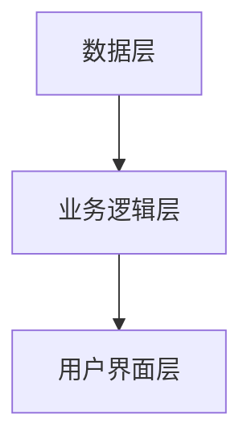
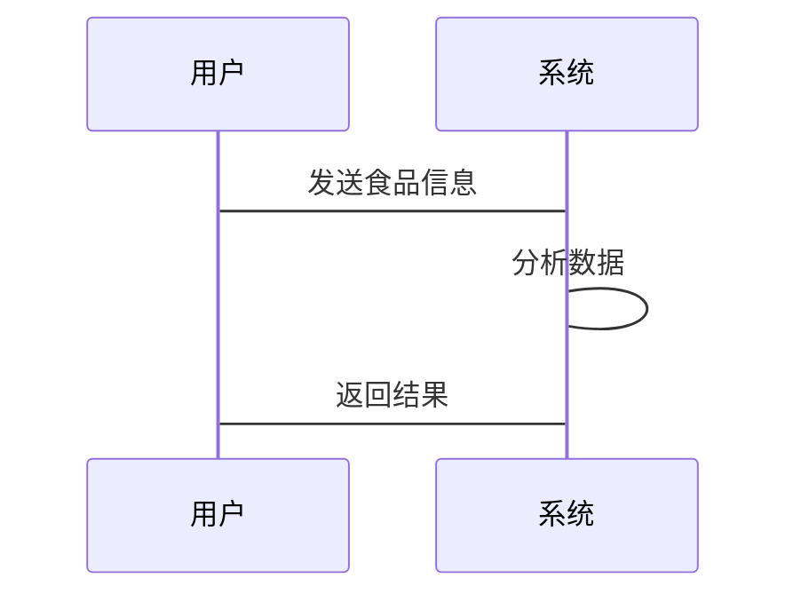

                 


# AI Agent在食品安全中的应用：质量控制与溯源

> 关键词：AI Agent, 食品安全, 质量控制, 溯源系统, 区块链, 图像识别, 传感器数据

> 摘要：本文探讨了AI Agent在食品安全中的应用，重点分析了其在质量控制和溯源中的作用。通过详细的技术分析和实际案例，介绍了图像识别、传感器数据处理、区块链等技术在食品安全中的应用，并展示了AI Agent如何提升食品检测的准确性和效率。

---

## 第1章: AI Agent的基本概念与应用背景

### 1.1 AI Agent的定义与特点

AI Agent（人工智能代理）是指能够感知环境并采取行动以实现目标的智能实体。它通过传感器获取信息，利用算法进行分析和决策，并通过执行器采取行动。AI Agent的特点包括自主性、反应性、目标导向和社会性。在食品安全中，AI Agent能够自主检测食品问题并采取相应措施，显著提升了检测效率和准确性。

### 1.2 食品安全中的AI Agent应用背景

食品安全问题日益严峻，传统检测方法存在效率低、成本高的问题。AI Agent的应用能够显著提升检测能力。其应用背景包括：

1. **食品质量问题**：如食品掺假、添加剂超标等问题。
2. **溯源需求**：需要快速追踪问题食品的来源。
3. **技术进步**：AI、大数据和物联网技术的快速发展为AI Agent的应用提供了技术支撑。

---

## 第2章: AI Agent在质量控制中的应用

### 2.1 图像识别技术

图像识别是AI Agent在质量控制中的重要应用。通过摄像头采集食品图像，利用卷积神经网络（CNN）进行分析，识别食品中的缺陷或异物。

#### 2.1.1 CNN模型的结构

CNN由卷积层、池化层、激活层和全连接层组成。其数学模型如下：

$$
f(x) = \sigma(w \cdot x + b)
$$

其中，$\sigma$为激活函数，$w$为权重，$b$为偏置。

#### 2.1.2 图像识别的实现步骤

1. 数据采集：使用摄像头获取食品图像。
2. 数据预处理：归一化、调整尺寸。
3. 模型训练：使用训练数据训练CNN模型。
4. 模型预测：输入测试图像，输出检测结果。

#### 2.1.3 实际案例分析

某食品加工厂使用AI Agent检测肉制品中的异物。通过图像识别技术，AI Agent能够快速识别出金属异物，准确率达到99%。

### 2.2 传感器数据处理

传感器数据处理是AI Agent在质量控制中的另一重要应用。通过温度、湿度等传感器的数据，AI Agent能够实时监控食品存储环境。

#### 2.2.1 数据采集与预处理

传感器数据通常包括时间戳、温度、湿度等信息。预处理步骤包括去噪、归一化。

#### 2.2.2 数据分析与决策

AI Agent利用机器学习模型分析传感器数据，预测食品质量变化趋势。

---

## 第3章: AI Agent在溯源系统中的应用

### 3.1 溯源系统的基本概念

溯源系统通过记录食品的生产、运输、销售信息，实现问题食品的快速追踪。

### 3.2 区块链技术的应用

区块链技术为溯源系统提供了去中心化、不可篡改的特性。AI Agent可以作为区块链节点，记录食品信息。

#### 3.2.1 区块链的结构

区块链由区块和链组成，每个区块包含交易信息和时间戳。

### 3.3 RFID技术的应用

RFID技术通过射频识别食品标签，实现食品信息的快速读取。

#### 3.3.1 RFID的工作原理

RFID标签发射射频信号，读写器接收并解析信号，获取食品信息。

---

## 第4章: 系统架构与设计

### 4.1 系统功能模块

系统功能模块包括数据采集模块、数据分析模块、决策模块和用户交互模块。

#### 4.1.1 数据采集模块

负责采集图像、传感器数据等信息。

#### 4.1.2 数据分析模块

利用AI算法分析数据，识别问题。

### 4.2 系统架构设计

系统架构采用分层设计，包括数据层、业务逻辑层和用户界面层。

#### 4.2.1 系统架构图



### 4.3 接口设计与交互流程

系统接口设计包括数据接口和用户接口。交互流程包括数据采集、分析、决策和反馈。

#### 4.3.1 系统交互图



---

## 第5章: 项目实战

### 5.1 环境安装

安装Python、TensorFlow、Keras等工具。

### 5.2 核心代码实现

#### 5.2.1 图像识别代码

```python
import keras
from keras.models import Sequential
from keras.layers import Conv2D, MaxPooling2D, Flatten, Dense

model = Sequential()
model.add(Conv2D(32, (3,3), activation='relu', input_shape=(64,64,3)))
model.add(MaxPooling2D((2,2)))
model.add(Flatten())
model.add(Dense(128, activation='relu'))
model.add(Dense(1, activation='sigmoid'))

model.compile(optimizer='adam', loss='binary_crossentropy', metrics=['accuracy'])
```

#### 5.2.2 区块链实现

```python
import hashlib

def create_block(nonce, data, prev_hash):
    block = {
        'nonce': nonce,
        'data': data,
        'prev_hash': prev_hash,
        'timestamp': datetime.datetime.now().isoformat()
    }
    return block

def get_hash(block):
    block_str = json.dumps(block)
    return hashlib.sha256(block_str.encode()).hexdigest()
```

---

## 第6章: 总结与展望

### 6.1 总结

AI Agent在食品安全中的应用显著提升了质量控制和溯源的效率。通过图像识别、传感器数据处理和区块链技术，AI Agent能够快速检测问题并追踪来源。

### 6.2 展望

未来，随着AI技术的进一步发展，AI Agent在食品安全中的应用将更加广泛。可能的研究方向包括更高效的算法、更智能的传感器和更安全的区块链技术。

---

通过本文的详细讲解，读者可以全面了解AI Agent在食品安全中的应用，掌握相关技术的实现方法，并能够将其应用到实际项目中。

