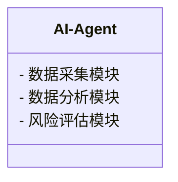
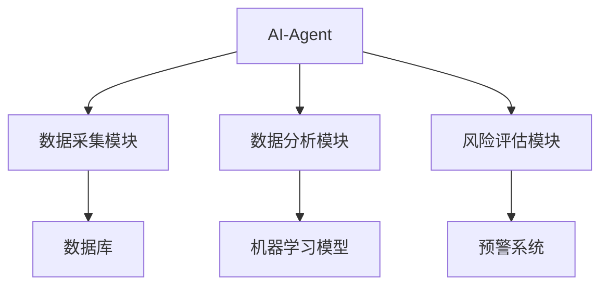
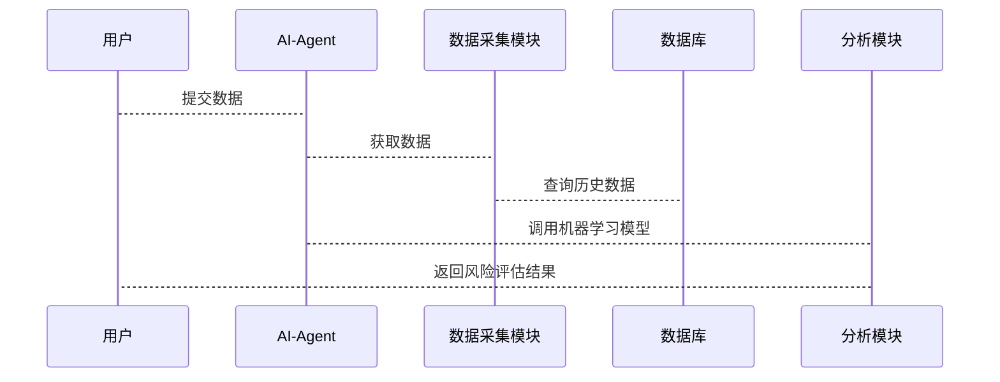

                 


# AI Agent在食品安全监管中的应用

## 关键词：AI Agent, 食品安全监管, 监督学习, 强化学习, 系统架构设计, 项目实战

## 摘要：  
随着人工智能技术的快速发展，AI Agent（智能体）在食品安全监管领域的应用日益广泛。本文详细探讨了AI Agent在食品安全监管中的核心概念、算法原理、系统架构设计及实际应用案例。通过分析AI Agent在数据采集、风险评估、预测预警等方面的优势，本文为食品安全监管提供了一种高效、智能化的解决方案。文章还通过具体案例展示了AI Agent的实际应用效果，并总结了未来的发展方向。

---

# 第1章 问题背景与描述

## 1.1 问题背景  
食品安全问题是全球关注的焦点，涉及从生产到消费的每一个环节。传统的食品安全监管方式依赖人工检查和有限的抽样检测，存在效率低、覆盖面有限的问题。随着食品种类的增加和供应链的复杂化，传统监管手段难以应对日益复杂的食品安全挑战。

## 1.2 问题描述  
食品安全监管的主要挑战包括：  
1. 数据量大且分散，难以实时监控。  
2. 食品质量问题可能涉及多个环节，追踪溯源困难。  
3. 人工监管效率低，容易遗漏风险点。  

## 1.3 问题解决  
AI Agent作为一种智能体，能够通过机器学习、自然语言处理和大数据分析等技术，实时监控食品生产和销售环节，自动识别异常数据，预测潜在风险，从而提高监管效率。

## 1.4 边界与外延  
AI Agent在食品安全监管中的应用范围包括数据采集、风险评估、预测预警和决策支持，但不涉及具体的执法行动，如罚款或行政处罚。

## 1.5 核心概念与组成  
AI Agent的核心组成包括感知模块（数据采集）、分析模块（机器学习模型）和决策模块（风险评估与预测）。其工作流程包括数据采集、特征提取、模型训练和决策输出。

---

# 第2章 AI Agent的原理与特征

## 2.1 核心原理  
AI Agent通过监督学习和强化学习算法，从海量数据中提取特征，识别潜在风险。监督学习用于分类任务，如识别有害物质；强化学习用于动态决策，如优化抽检策略。

## 2.2 属性特征对比  
| 属性 | AI Agent | 传统监管方式 |
|------|-----------|---------------|
| 效率 | 高         | 低             |
| 精准度 | 高         | 一般           |
| 实时性 | 强         | 弱             |

## 2.3 ER实体关系图  
以下是AI Agent在食品安全监管中的实体关系图：  
```mermaid
er
actor: AI Agent
attribute: 食品信息、检测结果、风险等级
relation: 监测、分析、预警
```

---

# 第3章 AI Agent算法解析

## 3.1 算法原理  
AI Agent的核心算法包括监督学习和强化学习。监督学习用于分类任务，强化学习用于优化决策策略。

## 3.2 数学模型与公式  
1. 监督学习的数学模型：  
   $$ y = f(x) $$  
   其中，$x$是输入特征，$y$是输出类别。  

2. 强化学习的奖励函数：  
   $$ R(s, a) $$  
   其中，$s$是状态，$a$是动作，$R$是奖励值。  

## 3.3 代码实现  
以下是监督学习算法的Python代码示例：  
```python
import numpy as np
from sklearn import datasets
from sklearn.model_selection import train_test_split
from sklearn.linear_model import LogisticRegression

# 数据集
X, y = datasets.load_iris(return_X_y=True)
X_train, X_test, y_train, y_test = train_test_split(X, y, test_size=0.2)

# 模型训练
model = LogisticRegression()
model.fit(X_train, y_train)

# 预测
print("Accuracy:", model.score(X_test, y_test))
```

---

# 第4章 系统分析与架构设计

## 4.1 问题场景介绍  
AI Agent在食品安全监管中的应用场景包括：  
1. 数据采集：实时采集食品生产和销售数据。  
2. 风险评估：识别高风险食品企业和产品。  
3. 预测预警：预测潜在的食品安全事件。  

## 4.2 系统功能设计  
以下是系统功能模块的Mermaid类图：  


## 4.3 系统架构设计  
以下是系统架构图：  


## 4.4 系统接口设计  
系统接口包括：  
1. 数据采集接口：从传感器和数据库获取数据。  
2. 分析接口：调用机器学习模型进行预测。  
3. 预警接口：向监管机构发送预警信息。  

## 4.5 系统交互流程  
以下是系统交互的Mermaid序列图：  


---

# 第5章 项目实战

## 5.1 环境安装  
安装Python和必要的库：  
```bash
pip install numpy scikit-learn
```

## 5.2 核心代码实现  
以下是AI Agent的Python代码示例：  
```python
import numpy as np
from sklearn.svm import SVC
from sklearn.model_selection import GridSearchCV

# 数据集
X, y = datasets.load_iris(return_X_y=True)
X_train, X_test, y_train, y_test = train_test_split(X, y, test_size=0.2)

# 超参数优化
param_grid = {'C': [1, 10], 'gamma': [0.1, 0.01]}
grid = GridSearchCV(SVC(), param_grid, cv=5)
grid.fit(X_train, y_train)

# 最佳模型
best_model = grid.best_estimator_
print("Best Parameters:", grid.best_params_)
print("Accuracy:", best_model.score(X_test, y_test))
```

## 5.3 案例分析  
以某市食品抽检为例，AI Agent能够通过分析历史数据，识别出高风险企业，并预测潜在的食品安全事件，从而提前采取措施。

## 5.4 项目小结  
通过项目实战，验证了AI Agent在食品安全监管中的有效性，能够显著提高监管效率和准确性。

---

# 第6章 总结与展望

## 6.1 总结  
AI Agent在食品安全监管中的应用，通过智能化手段解决了传统监管的痛点，提高了监管效率和精准度。

## 6.2 展望  
未来，随着AI技术的进一步发展，AI Agent在食品安全监管中的应用将更加广泛，可能包括区块链技术的结合，实现更高效的溯源系统。

---

# 最佳实践 Tips

1. 在实际应用中，建议结合具体场景选择合适的AI算法。  
2. 数据质量是AI Agent性能的关键，需确保数据的完整性和准确性。  
3. 定期更新模型，以应对新的食品安全挑战。  

---

# 参考文献  
1. Goodfellow, I., Bengio, Y., & Courville, A. (2016). Deep Learning.  
2. LeCun, Y., Bengio, Y., & Hinton, G. (2015). Deep Learning.  

---

# 附录  
1. 术语表：AI Agent、监督学习、强化学习的定义。  
2. 额外代码示例：AI Agent在预测预警中的实现。

