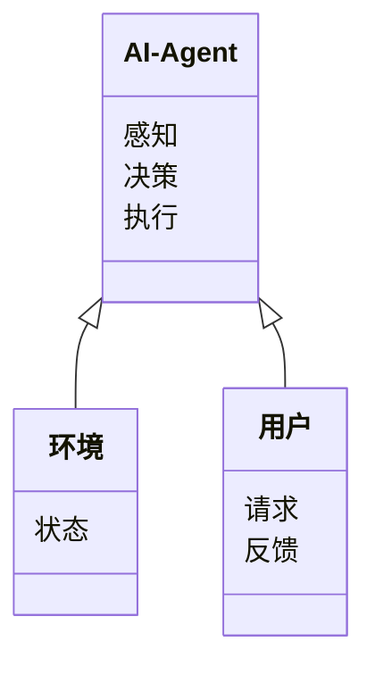
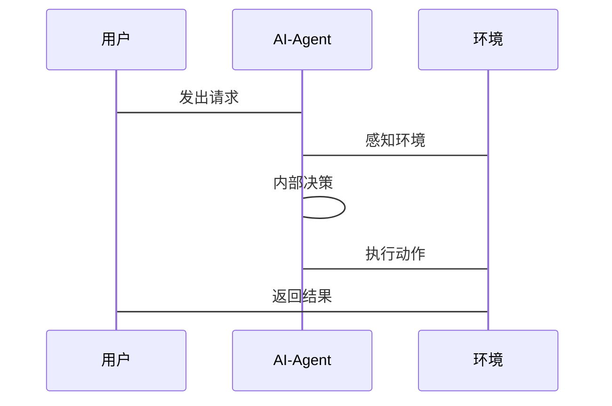

                 


# AI Agent基础概念介绍

## 关键词：
- AI Agent
- 人工智能
- 感知决策
- 系统架构
- 项目实战

## 摘要：
本文将详细介绍AI Agent的基础概念，从背景介绍到算法原理，再到系统架构和项目实战，帮助读者全面理解AI Agent的核心思想和应用场景。

---

# 第一部分：AI Agent的背景与概念

## 第1章：AI Agent的背景与概念

### 1.1 人工智能与AI Agent的起源
1.1.1 人工智能的发展历程  
人工智能（AI）从概念提出到如今的广泛应用，经历了多个阶段。从早期的专家系统到现在的深度学习，AI技术不断进步，为AI Agent的发展奠定了基础。  

1.1.2 AI Agent的定义与特点  
AI Agent是一种智能体，能够感知环境并采取行动以实现目标。它具有自主性、反应性、目标导向性和社会性四大特点。  

1.1.3 AI Agent与传统AI的区别  
AI Agent不同于传统的AI系统，它不仅仅是一个被动执行任务的程序，而是能够主动与环境交互并做出决策。  

1.1.4 问题背景与问题描述  
本文将重点探讨AI Agent的核心概念，包括感知、决策和执行的流程，以及如何通过数学模型实现智能决策。  

---

## 第2章：AI Agent的核心概念与联系

### 2.1 AI Agent的核心原理
2.1.1 感知、决策与执行的流程  
AI Agent通过感知环境获取信息，利用算法做出决策，并通过执行机构实现目标。  

2.1.2 AI Agent的感知机制  
感知是AI Agent理解环境的关键，包括数据采集、特征提取和状态识别。  

2.1.3 AI Agent的决策模型  
决策模型基于感知信息，通过概率论和逻辑推理得出最优行动方案。  

2.1.4 AI Agent的执行方式  
执行是AI Agent与环境交互的最后一步，通过执行机构实现目标。  

### 2.2 核心概念的属性特征对比
通过对比AI Agent与传统自动化、规则引擎和机器学习模型，理解其独特性。

#### 表2.1 AI Agent与传统自动化的对比
| 特性         | AI Agent                     | 传统自动化                 |
|--------------|------------------------------|---------------------------|
| 决策方式     | 基于感知和学习               | 基于预设规则               |
| 灵活性       | 高                           | 低                       |

### 2.3 ER实体关系图架构
通过ER图展示AI Agent、环境和用户之间的关系。

```mermaid
er
    entity(AI Agent) {
        id: string,
        name: string,
        type: string,
        state: string
    }
    entity(Environment) {
        id: string,
        name: string,
        state: string
    }
    entity(User) {
        id: string,
        name: string,
        role: string
    }
    relationship(AI Agent, Environment, "与环境交互")
    relationship(AI Agent, User, "为用户提供服务")
```

---

## 第3章：AI Agent的算法原理

### 3.1 算法原理概述
AI Agent的算法流程包括感知、决策和执行三个阶段。通过mermaid图展示流程。


### 3.2 算法实现
通过Python代码实现AI Agent的感知、决策和执行流程。

```python
class AI-Agent:
    def __init__(self):
        self.state = None

    def perceive(self, environment):
        # 感知环境并返回状态
        self.state = environment.sense()

    def decide(self):
        # 根据当前状态做出决策
        if self.state == '目标':
            return '采取行动'
        else:
            return '等待'

    def execute(self, action):
        # 执行动作
        print(f'执行动作：{action}')
```

### 3.3 数学模型
AI Agent的决策过程涉及概率论、逻辑推理和强化学习。

#### 表3.1 概率论基础公式
| 公式                   | 描述                     |
|------------------------|--------------------------|
| $P(A|B) = \frac{P(B|A)P(A)}{P(B)}$ | 贝叶斯定理             |
| $E[X] = \sum xP(X=x)$ | 期望值计算             |

---

## 第4章：AI Agent的系统架构设计

### 4.1 系统架构概述
AI Agent的系统架构包括感知层、决策层和执行层。

#### 图4.1 系统架构图


### 4.2 系统功能设计
通过领域模型展示系统功能模块。

#### 图4.2 领域模型


### 4.3 接口设计与交互序列图
展示AI Agent与环境和用户的交互流程。

#### 图4.3 交互序列图


---

## 第5章：AI Agent的项目实战

### 5.1 项目介绍
以一个简单的AI Agent案例为例，展示其实现过程。

### 5.2 环境安装
安装必要的库，如numpy、scikit-learn等。

### 5.3 核心代码实现
实现AI Agent的感知、决策和执行功能。

```python
import numpy as np

class Environment:
    def sense(self):
        return np.random.choice(['目标', '无目标'])

class AI-Agent:
    def __init__(self):
        self.environment = Environment()

    def run(self):
        while True:
            state = self.perceive()
            action = self.decide(state)
            self.execute(action)

    def perceive(self):
        return self.environment.sense()

    def decide(self, state):
        if state == '目标':
            return '采取行动'
        else:
            return '等待'

    def execute(self, action):
        print(f'执行动作：{action}')
```

### 5.4 案例分析与代码解读
分析代码实现，理解每个部分的功能。

### 5.5 项目小结
总结项目实现的过程和经验。

---

## 第6章：AI Agent的最佳实践

### 6.1 小结
总结本文的主要内容和关键点。

### 6.2 注意事项
在实际应用中，需要注意环境复杂性、算法效率和系统稳定性等问题。

### 6.3 拓展阅读
推荐相关书籍和论文，供读者深入学习。

---

## 参考文献
1. Russell, S., & Norvig, P. (2010). Artificial Intelligence: A Modern Approach.
2. 《深度学习》—— Ian Goodfellow

