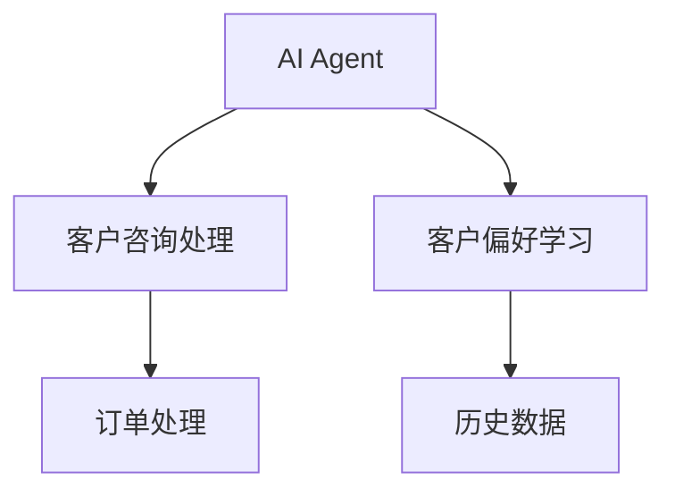
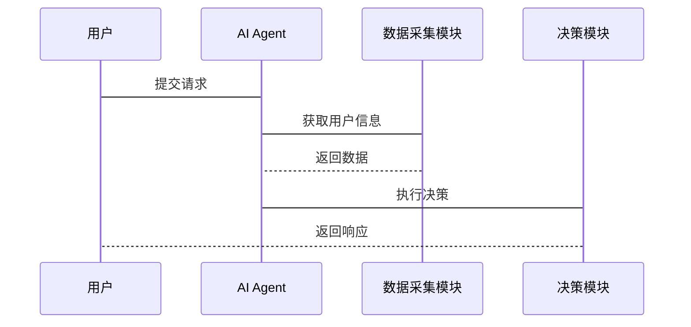

                 


# AI Agent基础：企业应用中的核心概念与重要性

---

## 关键词：AI Agent, 人工智能, 企业应用, 核心概念, 重要性

---

## 摘要：AI Agent作为一种新兴的人工智能技术，在企业应用中扮演着越来越重要的角色。本文从AI Agent的基本概念出发，深入探讨其核心原理、算法实现、系统设计以及实际应用场景。通过对比分析和案例解读，帮助读者理解AI Agent在企业中的核心价值和应用潜力。

---

## 第1章: AI Agent概述

### 1.1 AI Agent的背景与概念

#### 1.1.1 人工智能的发展历程

人工智能（AI）经历了从规则驱动到数据驱动的转变，逐步从单一任务处理向通用智能迈进。AI Agent作为人工智能的重要分支，专注于构建能够感知环境、自主决策并执行任务的智能体。

#### 1.1.2 AI Agent的定义与特点

AI Agent是指具备感知能力、决策能力和行动能力的智能体，能够在特定环境下完成复杂任务。其特点包括：

- **自主性**：无需外部干预，自主完成任务。
- **反应性**：能够实时感知环境变化并做出反应。
- **目标导向性**：基于目标驱动行为。
- **可扩展性**：适用于多种应用场景。

#### 1.1.3 AI Agent与传统AI的区别

| 特性         | AI Agent                      | 传统AI                      |
|--------------|-----------------------------|-----------------------------|
| 自主性       | 高                           | 低                           |
| 可交互性     | 高                           | 低                           |
| 适应性       | 强                           | 弱                           |
| 应用场景     | 多样化，如企业自动化、智能助手 | 有限，如特定任务处理         |

---

## 第2章: AI Agent的核心概念与联系

### 2.1 AI Agent的核心原理

#### 2.1.1 感知与决策机制

AI Agent通过传感器或数据接口感知环境信息，利用算法进行分析和决策。例如，在企业应用中，AI Agent可以通过分析市场数据，自主决策投资策略。

#### 2.1.2 行为与交互方式

AI Agent通过执行动作（如发送邮件、调整参数）与环境交互。例如，在智能客服系统中，AI Agent可以自动响应客户咨询。

#### 2.1.3 学习与优化算法

AI Agent通过机器学习算法不断优化自身的决策模型。例如，使用强化学习算法优化投资组合的收益。

### 2.2 核心概念对比分析

#### 2.2.1 AI Agent与传统算法的对比

| 方面         | AI Agent                     | 传统算法                     |
|--------------|-----------------------------|-----------------------------|
| 决策方式     | 基于环境反馈动态调整         | 固定规则或静态数据处理       |
| 适应性       | 强                           | 低                           |
| 应用场景     | 多样化，复杂动态环境         | 简单、静态环境               |

#### 2.2.2 不同AI Agent模型的对比

| 模型         | 基础思路                   | 适用场景                     |
|--------------|---------------------------|-----------------------------|
| 基于规则的AI Agent | 通过预定义规则执行任务     | 简单、规则明确的任务           |
| 基于学习的AI Agent | 通过机器学习模型决策       | 复杂、动态变化的任务           |
| 基于强化学习的AI Agent | 通过奖励机制优化决策       | 需要长期策略优化的任务         |

### 2.3 ER实体关系图架构

```mermaid
erDiagram
    actor 用户 {
        string 用户ID
        string 用户名
        string 密码
    }
    agent AI {
        string 唯一标识符
        string 状态
        string 当前任务
    }
    environment 环境 {
        string 感知数据
        string 执行结果
    }
    用户 --> 环境 : 提供输入
    环境 --> AI : 提供感知数据
    AI --> 环境 : 执行操作
    用户 <-- 环境 : 反馈结果
```

---

## 第3章: AI Agent的算法原理

### 3.1 算法原理概述

#### 3.1.1 AI Agent的基本算法

AI Agent的核心算法包括：

- **强化学习（Reinforcement Learning）**：通过试错机制优化决策策略。
- **监督学习（Supervised Learning）**：基于标注数据进行预测和分类。
- **无监督学习（Unsupervised Learning）**：发现数据中的隐含结构。

#### 3.1.2 算法的优化与改进

通过引入元学习（Meta-Learning）和迁移学习（Transfer Learning）技术，提升AI Agent的泛化能力和适应性。

#### 3.1.3 算法的适用场景

根据任务需求选择合适的算法，例如在动态环境中使用强化学习，在数据充分的情况下使用监督学习。

### 3.2 算法原理的数学模型

#### 3.2.1 基本数学模型

强化学习中的Q-learning算法：

$$ Q(s, a) = r + \gamma \max Q(s', a') $$

其中：
- \( s \) 是当前状态，
- \( a \) 是动作，
- \( r \) 是奖励，
- \( \gamma \) 是折扣因子，
- \( s' \) 是下一个状态。

#### 3.2.2 算法优化的数学推导

通过梯度下降优化Q值函数：

$$ \Delta Q = \alpha (r + \gamma Q(s', a') - Q(s, a)) $$

其中：
- \( \alpha \) 是学习率。

#### 3.2.3 算法的实例分析

以下是一个简单的Q-learning实现：

```python
class AI-Agent:
    def __init__(self, state_space, action_space):
        self.state_space = state_space
        self.action_space = action_space
        self.Q = np.zeros((state_space, action_space))

    def take_action(self, state):
        return np.argmax(self.Q[state])

    def update_Q(self, state, action, reward, next_state):
        self.Q[state][action] += self.alpha * (reward + self.gamma * np.max(self.Q[next_state]) - self.Q[state][action])
```

---

## 第4章: AI Agent的系统分析与架构设计

### 4.1 系统分析

#### 4.1.1 问题场景介绍

假设我们正在开发一个智能客服系统，AI Agent需要实时响应客户咨询并处理订单。

#### 4.1.2 项目需求分析

- 实时响应客户需求
- 自动处理订单
- 学习客户偏好

#### 4.1.3 系统功能设计

| 功能模块       | 功能描述                   |
|----------------|---------------------------|
| 客户咨询处理   | 自动回答客户问题           |
| 订单处理       | 自动创建并跟踪订单         |
| 客户偏好学习   | 基于历史数据优化服务策略   |

### 4.2 系统架构设计

#### 4.2.1 系统架构图



#### 4.2.2 系统模块划分

- **AI Agent模块**：核心决策模块
- **数据采集模块**：采集客户数据
- **交互模块**：与客户进行交互

#### 4.2.3 系统接口设计

- `process_request(request)`：处理客户请求
- `update_policy(policy)`：更新决策策略

### 4.3 系统交互设计

#### 4.3.1 系统交互流程



---

## 第5章: AI Agent的项目实战

### 5.1 环境安装与配置

#### 5.1.1 开发环境的选择

推荐使用Python 3.8及以上版本，安装必要的库如TensorFlow、Keras和OpenAI库。

#### 5.1.2 开发工具的安装

```bash
pip install numpy tensorflow keras openai
```

#### 5.1.3 环境配置的注意事项

确保安装相应的依赖项，并配置好开发环境的路径。

### 5.2 系统核心实现

#### 5.2.1 核心算法的实现

```python
def process_request(request):
    state = get_state(request)
    action = agent.take_action(state)
    reward = evaluate_response(request, action)
    agent.update_Q(state, action, reward, next_state)
    return get_response(action)
```

#### 5.2.2 系统功能的实现

实现客户咨询处理和订单处理功能，确保模块之间的通信顺畅。

#### 5.2.3 系统接口的实现

定义接口函数，如`process_request`和`update_policy`，确保模块间交互正确。

### 5.3 代码应用与分析

#### 5.3.1 代码的解读

解读核心代码的功能和作用，确保每个函数的逻辑清晰。

#### 5.3.2 代码的优化

基于实际运行情况，优化代码性能和可读性。

#### 5.3.3 代码的扩展

根据需求扩展功能，例如增加新的决策算法。

---

## 第6章: AI Agent的最佳实践与总结

### 6.1 最佳实践

#### 6.1.1 开发中的注意事项

- 确保数据质量，避免噪声干扰。
- 定期更新模型，保持决策的准确性。
- 设计合理的奖励机制，提升学习效果。

#### 6.1.2 实际应用中的技巧

- 结合领域知识，优化模型表现。
- 使用监控工具，实时跟踪系统状态。
- 建立反馈机制，及时修正错误。

#### 6.1.3 常见问题的解决方法

- 数据不足时，使用迁移学习。
- 模型过拟合时，采用正则化技术。
- 系统延迟时，优化算法复杂度。

### 6.2 项目总结

#### 6.2.1 项目的成果与收获

通过本项目，我们成功实现了智能客服系统的核心功能，验证了AI Agent在企业应用中的潜力。

#### 6.2.2 项目的经验与教训

- **经验**：合理的系统设计和高效的算法实现是项目成功的关键。
- **教训**：忽视数据质量可能导致模型表现不佳。

#### 6.2.3 项目的未来改进方向

- 引入更先进的强化学习算法。
- 增加多模态数据的处理能力。
- 提升系统的实时响应能力。

### 6.3 未来展望

随着AI技术的不断发展，AI Agent将在企业应用中发挥更大的作用，特别是在动态复杂环境中，其自主决策和适应能力将为企业带来更大的竞争优势。

---

## 总结

通过本文的详细讲解，我们深入探讨了AI Agent的核心概念、算法实现、系统设计和实际应用。AI Agent作为一种强大的工具，正在帮助企业实现智能化转型，未来其应用前景将更加广阔。

