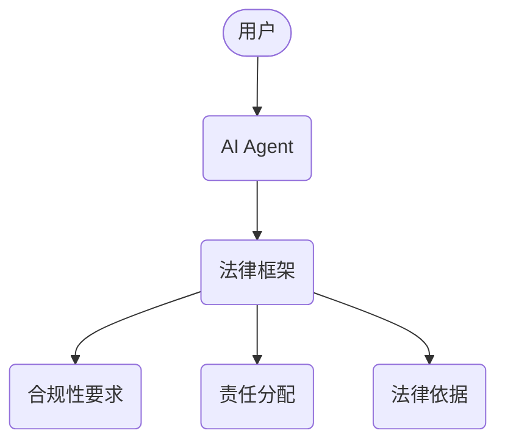
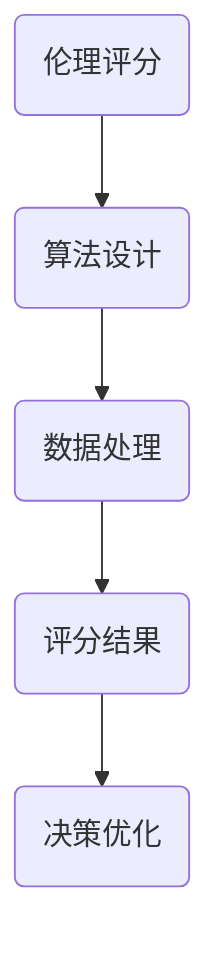
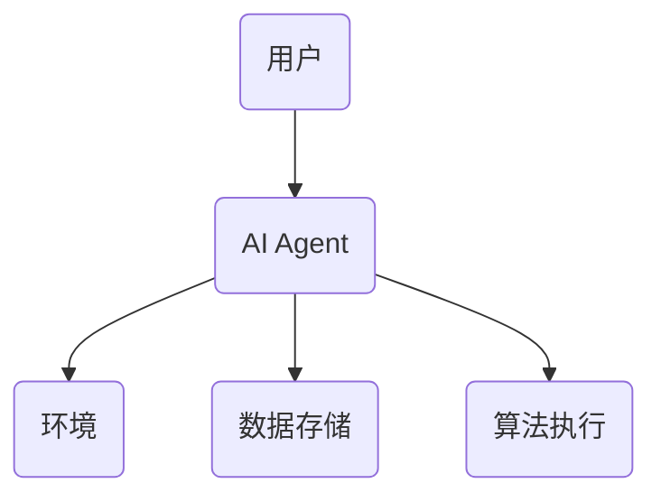
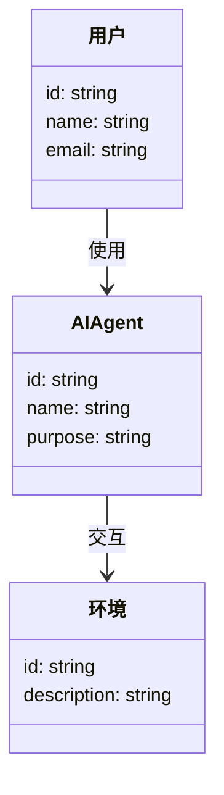

                 


# AI Agent开发中的伦理考量与法律风险

## 关键词：AI Agent、伦理考量、法律风险、系统架构、算法设计、数据隐私

## 摘要：
本文从AI Agent开发的角度，系统性地探讨了其中涉及的伦理考量与法律风险。通过分析伦理与法律的背景、AI Agent的核心概念、技术实现中的伦理考量、法律风险与合规性、风险管理与应对策略、系统架构与开发实践，以及项目实战，本文为AI Agent的开发提供了全面的伦理与法律视角。文章结合理论与实践，为开发者提供了规避风险、确保合规的开发策略。

---

## 第一部分：引言

### 1.1 AI Agent的基本概念与重要性

#### 1.1.1 AI Agent的定义与核心特征
AI Agent（人工智能代理）是一种能够感知环境、自主决策并执行任务的智能实体。其核心特征包括：
- **自主性**：能够在没有外部干预的情况下自主运行。
- **反应性**：能够根据环境变化调整行为。
- **目标导向**：为了实现特定目标而行动。
- **学习能力**：通过数据和经验不断优化自身行为。

#### 1.1.2 AI Agent在现代社会中的作用
AI Agent广泛应用于自动驾驶、智能客服、机器人助手、金融交易等领域。它们能够提高效率、降低成本，但也带来了伦理与法律上的挑战。

#### 1.1.3 伦理与法律在AI Agent开发中的重要性
AI Agent的决策可能对人类生命、财产和社会秩序产生重大影响。因此，开发过程中必须考虑伦理与法律问题，以确保技术的合规性和社会接受度。

---

## 第二部分：伦理与法律的背景

### 2.1 伦理学基础

#### 2.1.1 伦理学的基本概念
伦理学是研究道德原则和行为准则的学科。在AI Agent开发中，伦理学主要关注如何确保AI行为符合人类社会的道德规范。

#### 2.1.2 AI Agent开发中的伦理问题
- **隐私保护**：AI Agent可能收集大量用户数据，如何保护隐私是一个重要问题。
- **公平性**：算法可能存在的偏见可能导致不公平的结果。
- **责任归属**：当AI Agent引发问题时，责任应由谁承担？

#### 2.1.3 伦理决策的复杂性
AI Agent需要在复杂的情境中做出决策，而这些决策可能涉及多个伦理维度。例如，在自动驾驶汽车中，如何在紧急情况下做出最优决策是一个典型的伦理问题。

### 2.2 法律基础

#### 2.2.1 法律的基本原则
法律是社会行为的规范，AI Agent的开发和应用必须遵守相关法律法规。

#### 2.2.2 AI Agent开发中的法律风险
- **责任问题**：当AI Agent的行为引发法律纠纷时，开发者可能面临法律责任。
- **数据安全**：AI Agent可能处理大量敏感数据，如何确保数据安全是一个法律问题。
- **合规性**：AI Agent的设计和应用必须符合相关法律法规。

#### 2.2.3 法律与伦理的交叉影响
法律和伦理是相互关联的。例如，隐私保护既是法律问题，也是伦理问题。

---

## 第三部分：AI Agent的核心概念与伦理框架

### 3.1 AI Agent的伦理框架

#### 3.1.1 伦理框架的构建原则
- **透明性**：AI Agent的行为应透明，便于人类理解和监督。
- **可解释性**：AI Agent的决策过程应可解释，以便人类能够理解其行为。
- **公平性**：AI Agent的决策不应存在不公平的偏见。

#### 3.1.2 AI Agent的伦理维度分析
AI Agent的伦理问题可以分为以下几个维度：
- **个体层面**：AI Agent对个体的影响。
- **社会层面**：AI Agent对社会的影响。
- **环境层面**：AI Agent对环境的影响。

#### 3.1.3 伦理框架的实体关系图（ER图）

```mermaid
erd
    entity(用户) {
        id: string
        name: string
        role: string
    }
    entity(AI Agent) {
        id: string
        name: string
        purpose: string
    }
    entity(环境) {
        id: string
        description: string
    }
    relation(使用) {
        用户 --> AI Agent
        AI Agent --> 环境
    }
```

### 3.2 AI Agent的法律框架

#### 3.2.1 法律框架的核心要素
- **法律依据**：AI Agent开发和应用的相关法律法规。
- **责任分配**：明确AI Agent行为的责任归属。
- **合规性要求**：确保AI Agent的行为符合法律法规。

#### 3.2.2 AI Agent开发中的法律风险
- **法律责任**：当AI Agent引发法律问题时，开发者可能面临法律责任。
- **数据合规性**：AI Agent的数据处理必须符合相关法律法规。

#### 3.2.3 法律框架的系统架构图



---

## 第四部分：AI Agent开发中的伦理考量

### 4.1 算法的伦理问题

#### 4.1.1 算法偏见的成因与影响
算法偏见是由于训练数据中的偏差导致的。例如，招聘系统中可能存在的性别偏见。

#### 4.1.2 算法决策的公平性
如何确保AI Agent的决策公平是伦理考量的重要内容。

#### 4.1.3 伦理评分模型的设计



### 4.2 数据的伦理问题

#### 4.2.1 数据隐私与个人权利
AI Agent可能收集大量用户数据，如何保护隐私是一个重要问题。

#### 4.2.2 数据使用的边界
AI Agent的数据使用必须符合伦理和法律要求。

#### 4.2.3 数据共享的伦理规范
数据共享需要确保数据安全和隐私保护。

---

## 第五部分：AI Agent开发中的法律风险

### 5.1 法律风险的识别与评估

#### 5.1.1 法律风险的分类
- **合规性风险**：AI Agent的行为不符合法律法规。
- **责任风险**：AI Agent的行为导致法律责任。
- **数据风险**：AI Agent的数据处理存在法律问题。

#### 5.1.2 法律风险的评估方法
- **法律审查**：对AI Agent的行为进行全面法律审查。
- **风险矩阵**：评估法律风险的严重性和可能性。

#### 5.1.3 法律风险的应对策略
- **合规性优化**：确保AI Agent的行为符合法律法规。
- **责任分配**：明确AI Agent行为的责任归属。
- **数据保护**：采取措施保护用户数据安全。

### 5.2 法律风险的应对策略

#### 5.2.1 合规性优化
确保AI Agent的行为符合相关法律法规。

#### 5.2.2 责任分配
明确AI Agent行为的责任归属，避免法律纠纷。

#### 5.2.3 数据保护
采取措施保护用户数据安全，防止数据泄露。

---

## 第六部分：风险管理与应对策略

### 6.1 风险管理的核心原则

#### 6.1.1 风险识别
识别AI Agent开发和应用中的潜在风险。

#### 6.1.2 风险评估
评估风险的严重性和可能性。

#### 6.1.3 风险缓解
采取措施降低风险的影响。

### 6.2 应对策略的制定

#### 6.2.1 风险缓解技术
- **算法优化**：减少算法偏见。
- **数据加密**：保护用户数据安全。
- **日志记录**：记录AI Agent的行为，便于追溯。

#### 6.2.2 风险监控
实时监控AI Agent的行为，及时发现和处理风险。

#### 6.2.3 应急预案
制定应急预案，应对突发法律风险。

---

## 第七部分：系统架构与开发实践

### 7.1 系统架构的核心要素

#### 7.1.1 系统设计原则
- **模块化设计**：确保系统模块化，便于管理和维护。
- **可扩展性**：系统应具备良好的扩展性。
- **安全性**：确保系统安全，防止数据泄露。

#### 7.1.2 开发指南
- **遵循伦理规范**：在开发过程中遵循伦理规范。
- **符合法律法规**：确保系统符合相关法律法规。
- **注重隐私保护**：采取措施保护用户隐私。

### 7.2 系统架构的优化

#### 7.2.1 模块化设计



#### 7.2.2 可扩展性设计
确保系统能够适应未来的发展需求。

#### 7.2.3 安全性设计
采取多重安全措施，确保系统安全。

---

## 第八部分：项目实战

### 8.1 项目背景与需求分析

#### 8.1.1 项目背景
以开发一个智能客服AI Agent为例。

#### 8.1.2 需求分析
- **功能需求**：提供24/7客户服务。
- **伦理需求**：保护用户隐私，确保数据安全。
- **法律需求**：符合相关法律法规。

### 8.2 系统设计与实现

#### 8.2.1 系统功能设计



#### 8.2.2 系统实现
- **用户界面**：提供友好的用户界面。
- **AI Agent核心算法**：实现智能对话功能。
- **数据存储**：确保数据安全和隐私保护。

### 8.3 项目小结

#### 8.3.1 成功经验
- **模块化设计**：确保系统易于管理和维护。
- **数据安全**：采取多重措施保护用户隐私。
- **法律合规**：确保系统符合相关法律法规。

#### 8.3.2 改进方向
- **算法优化**：进一步减少算法偏见。
- **系统扩展**：增强系统的可扩展性。

---

## 第九部分：结论与展望

### 9.1 全文总结
本文从伦理和法律的角度，系统性地探讨了AI Agent开发中的问题。通过分析伦理与法律的背景、核心概念、技术实现、法律风险、风险管理、系统架构与开发实践，以及项目实战，本文为AI Agent的开发提供了全面的伦理与法律视角。

### 9.2 未来展望
随着AI技术的不断发展，AI Agent的伦理与法律问题将更加复杂。未来的研究可以进一步探索如何在AI Agent开发中实现伦理与法律的动态平衡，同时推动相关法律法规的完善。

---

## 小结与注意事项

- **伦理与法律的动态平衡**：AI Agent的开发需要在伦理与法律之间找到动态平衡点。
- **技术与伦理的结合**：AI Agent的开发不仅需要技术能力，还需要考虑伦理与法律问题。
- **持续学习与更新**：AI Agent的伦理与法律问题将随着技术的发展而不断变化，需要持续学习与更新。

---

## 拓展阅读

- **推荐书籍**：
  - 《AI Ethics in Practice》
  - 《Artificial Intelligence: Law and Ethics》
- **推荐论文**：
  - "Ethical Considerations in AI Development"
  - "Legal Aspects of AI Technology"

---

通过本文的分析，读者可以全面了解AI Agent开发中的伦理考量与法律风险，并在实际开发中规避相关问题，确保技术的合规性和社会接受度。

