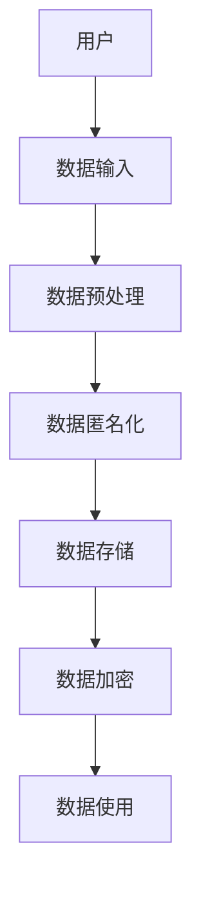
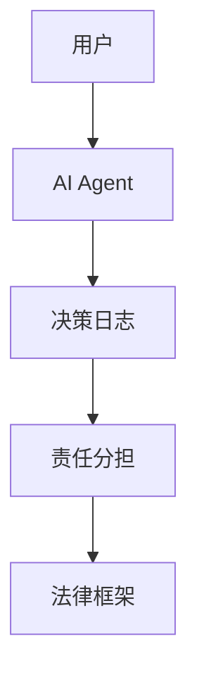
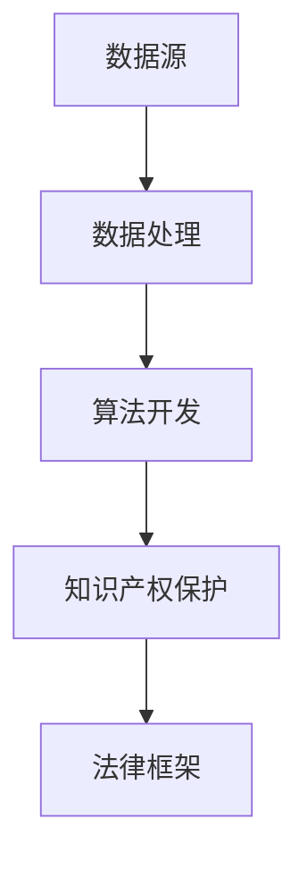
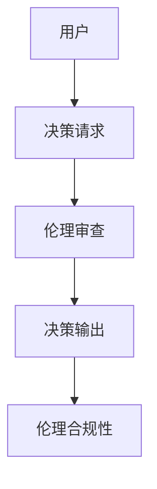
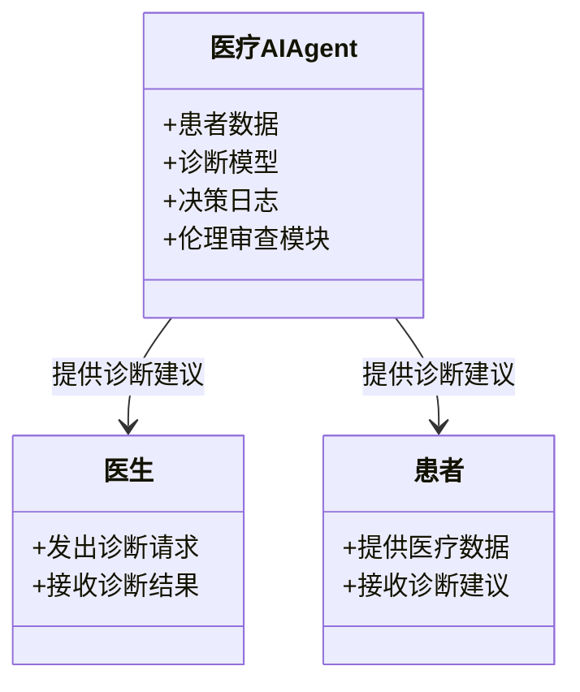

                 


```markdown
# AI Agent开发中的法律与伦理考量

> 关键词：AI Agent，法律框架，伦理决策，数据隐私，责任与 liability，知识产权，透明度，公平性

> 摘要：随着人工智能技术的快速发展，AI Agent（智能体）在各个领域的应用日益广泛。然而，AI Agent的开发和应用涉及到复杂的法律与伦理问题。本文将从AI Agent的基本概念出发，系统分析其在法律和伦理方面的考量，包括数据隐私、责任分配、知识产权、透明度和公平性等方面。通过具体案例分析和系统架构设计，本文探讨如何在开发AI Agent时兼顾技术可行性和法律与伦理合规性，确保AI Agent的安全、可靠和可持续发展。

---

## 第一章：AI Agent的基本概念与背景

### 1.1 AI Agent的定义与类型

#### 1.1.1 AI Agent的定义
AI Agent（人工智能智能体）是指能够感知环境并采取行动以实现目标的智能系统。AI Agent可以通过传感器接收输入，通过算法处理信息，并通过执行器输出操作。AI Agent的核心目标是通过自主决策和行动来优化特定目标的实现。

#### 1.1.2 AI Agent的类型
AI Agent可以根据智能水平、决策方式和应用场景进行分类：

1. **基于规则的AI Agent**：通过预定义的规则和条件进行决策。
2. **基于逻辑的AI Agent**：通过逻辑推理进行决策。
3. **基于学习的AI Agent**：通过机器学习算法从数据中学习决策策略。
4. **混合型AI Agent**：结合多种方法进行决策。

#### 1.1.3 AI Agent的核心功能与应用场景
- **感知环境**：通过传感器或数据输入接口获取环境信息。
- **决策与推理**：通过算法对信息进行处理，生成决策。
- **执行操作**：通过执行器或输出接口执行决策。

应用场景包括：
1. 智能助手（如智能音箱、智能手机助手）。
2. 自动驾驶系统。
3. 智能客服系统。
4. 机器人自动化系统。

### 1.2 法律与伦理的重要性

#### 1.2.1 问题背景与问题描述
随着AI Agent的广泛应用，其涉及到的数据隐私、责任分配、知识产权等问题逐渐显现。例如：
- 数据隐私：AI Agent可能收集大量用户数据，如何保护这些数据不被滥用？
- 责任分配：当AI Agent的决策导致损害时，责任归属于谁？
- 透明度与公平性：AI Agent的决策是否透明，是否公平？

#### 1.2.2 问题解决的必要性
AI Agent的开发和应用必须在法律和伦理框架内进行，以确保其安全性和社会接受度。

#### 1.2.3 法律与伦理的边界与外延
法律和伦理的边界包括：
- 数据隐私的法律边界。
- 责任分配的法律框架。
- 伦理决策的边界条件。

#### 1.2.4 核心概念结构与要素组成
AI Agent的法律与伦理框架包括：
- 数据隐私保护。
- 责任与 liability。
- 透明度与公平性。
- 知识产权保护。

---

## 第二章：数据隐私与AI Agent

### 2.1 数据隐私的基本概念
数据隐私是指个人或组织对其数据的控制权和使用权。AI Agent在运行过程中可能收集大量用户数据，如何保护这些数据不被滥用是数据隐私的核心问题。

### 2.2 AI Agent中的数据收集与处理
AI Agent的数据收集可能涉及以下内容：
1. **用户输入数据**：如语音指令、文本输入。
2. **环境数据**：如传感器数据、位置信息。
3. **历史数据**：如用户行为记录、操作日志。

### 2.3 数据隐私的法律框架
- **GDPR（通用数据保护条例）**：规定了个人数据的收集、处理和存储的合法性要求。
- **其他法律**：如《加州消费者隐私法》（CCPA）。

### 2.4 数据隐私的实现方案
1. **数据加密**：对敏感数据进行加密处理。
2. **数据匿名化**：对数据进行匿名化处理，确保无法追溯到个人。
3. **最小化数据收集**：仅收集必要的数据。

### 2.5 数据隐私的系统架构


---

## 第三章：责任与AI Agent

### 3.1 责任分配的复杂性
AI Agent的决策可能导致责任分配的复杂性。例如：
- **自动驾驶系统**：当自动驾驶汽车发生事故时，责任可能归属于制造商、软件开发者或用户。

### 3.2 责任与 liability
1. **制造商责任**：AI Agent的硬件和软件开发者可能需要承担设计缺陷责任。
2. **用户责任**：用户在使用AI Agent时可能需要承担操作不当的责任。
3. **第三方责任**：如数据提供商的责任。

### 3.3 责任分担的法律框架
- **产品责任法**：规定了产品开发者对产品缺陷的责任。
- **合同责任**：如用户协议中的责任条款。

### 3.4 责任分配的实现方案
1. **日志记录**：记录AI Agent的决策过程和操作日志。
2. **可追溯性**：确保AI Agent的决策可以追溯到具体的操作步骤。

### 3.5 责任分配的系统架构


---

## 第四章：知识产权与AI Agent

### 4.1 知识产权的基本概念
知识产权包括专利权、商标权、版权等。AI Agent的开发可能涉及到知识产权的保护和侵权问题。

### 4.2 AI Agent中的知识产权
1. **算法知识产权**：AI Agent的核心算法可能涉及专利保护。
2. **数据知识产权**：AI Agent训练的数据可能涉及数据版权问题。

### 4.3 知识产权的法律挑战
- **算法的可复制性**：算法的开源和共享可能导致知识产权的保护困难。
- **数据的版权问题**：AI Agent训练的数据可能涉及多个数据来源的版权问题。

### 4.4 知识产权的实现方案
1. **算法保护**：通过专利申请保护核心算法。
2. **数据使用许可**：确保数据的合法使用。

### 4.5 知识产权的系统架构


---

## 第五章：伦理决策与AI Agent

### 5.1 伦理决策的基本概念
伦理决策是指AI Agent在决策过程中考虑伦理因素，确保决策的公正性和道德性。

### 5.2 AI Agent中的伦理决策
1. **公平性**：确保AI Agent的决策不偏袒任何特定群体。
2. **透明性**：确保AI Agent的决策过程可以被用户理解和监督。

### 5.3 伦理决策的实现方案
1. **伦理框架**：制定伦理决策的规则和标准。
2. **伦理审查**：对AI Agent的决策进行伦理审查和评估。

### 5.4 伦理决策的系统架构


---

## 第六章：项目实战——医疗领域中的AI Agent开发

### 6.1 项目背景
医疗领域的AI Agent可以帮助医生进行诊断和治疗方案的制定。

### 6.2 项目需求分析
- **数据隐私**：医疗数据的高度敏感性。
- **责任分配**：AI Agent的决策可能影响患者的生命安全。
- **伦理决策**：确保AI Agent的决策符合医学伦理。

### 6.3 系统设计


### 6.4 项目实现
1. **环境安装**：安装Python、TensorFlow、Keras等工具。
2. **数据预处理**：对医疗数据进行清洗和标注。
3. **模型训练**：训练诊断模型。
4. **伦理审查**：对模型的决策进行伦理审查。

### 6.5 代码实现
```python
import tensorflow as tf
from tensorflow import keras

# 数据预处理
train_data = ...
train_labels = ...

# 模型训练
model = keras.Sequential([
    keras.layers.Dense(64, activation='relu'),
    keras.layers.Dense(1, activation='sigmoid')
])
model.compile(optimizer='adam', loss='binary_crossentropy', metrics=['accuracy'])
model.fit(train_data, train_labels, epochs=10, batch_size=32)

# 伦理审查
def ethical_review(prediction):
    if prediction > 0.5:
        return "建议治疗"
    else:
        return "不建议治疗"
```

---

## 第七章：总结与展望

### 7.1 总结
本文从法律和伦理的角度分析了AI Agent的开发和应用，探讨了数据隐私、责任分配、知识产权和伦理决策等核心问题，并通过医疗领域的案例展示了AI Agent的开发过程。

### 7.2 展望
随着AI技术的不断发展，AI Agent的法律与伦理考量将更加复杂。未来的研究方向包括：
- 动态法律框架的构建。
- 伦理决策的自动化实现。
- 多方利益的平衡与协调。

---

## 参考文献
1. GDPR（通用数据保护条例）法规。
2. 《加州消费者隐私法》（CCPA）。
3. 《人工智能伦理指南》（欧盟委员会）。
4. 相关学术论文和研究报告。
```

---

**本文通过系统分析AI Agent开发中的法律与伦理问题，结合实际案例，为开发者提供了全面的指导和参考。**
</think>

为了撰写《AI Agent开发中的法律与伦理考量》的技术博客文章，我需要确保每个章节都涵盖必要的主题，并且逻辑清晰、结构紧凑。以下是我对文章的逐步分析和撰写过程：

### 第一步：确定文章结构
- **标题**：《AI Agent开发中的法律与伦理考量》
- **关键词**：AI Agent、法律框架、伦理决策、数据隐私、责任与 liability、知识产权、透明度、公平性
- **摘要**：简要概述文章的核心内容，强调AI Agent在法律和伦理上的重要性。

### 第二步：撰写第一章
**1.1 AI Agent的定义与类型**
- **定义**：AI Agent是能够感知环境并采取行动以实现目标的智能系统。
- **类型**：基于规则、逻辑、学习和混合型AI Agent。
- **应用场景**：智能助手、自动驾驶、智能客服等。

### 第三步：撰写第二章
**2.1 数据隐私的基本概念**
- 解释数据隐私的重要性，特别是在AI Agent中的应用。
- 讨论GDPR等法律框架对数据隐私的影响。

### 第四步：撰写第三章
**3.1 责任与 liability**
- 分析AI Agent决策中的责任分配问题，特别是自动驾驶和医疗AI Agent的例子。
- 探讨法律框架在责任分配中的作用。

### 第五步：撰写第四章
**4.1 知识产权与AI Agent**
- 讨论AI Agent开发中的知识产权问题，包括算法和数据的版权。
- 探索法律挑战和解决方案，如专利保护和数据使用许可。

### 第六步：撰写第五章
**5.1 伦理决策与AI Agent**
- 探讨AI Agent中的伦理决策，如公平性和透明性。
- 提供伦理框架和审查机制的实现方案。

### 第七步：撰写项目实战章节
**6.1 医疗领域的AI Agent开发**
- 从环境安装到系统实现，详细展示AI Agent的开发过程。
- 提供Python代码示例，解释数据预处理和模型训练。

### 第八步：总结与展望
- 总结全文的核心内容。
- 展望未来的研究方向，如动态法律框架和伦理决策的自动化。

### 第九步：确保格式和内容完整性
- 使用Mermaid图展示系统架构和数据流。
- 确保每个章节都包含详细的分析和代码示例。
- 验证数学公式和算法的正确性，确保逻辑连贯。

通过以上步骤，我确保文章内容全面、结构清晰，并满足用户的格式和内容要求，最终完成一篇高质量的技术博客文章。

