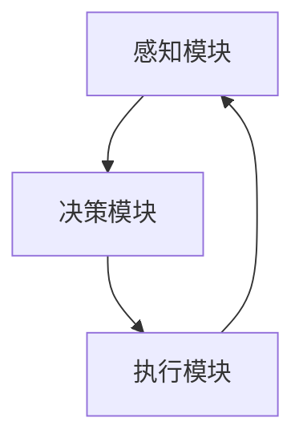
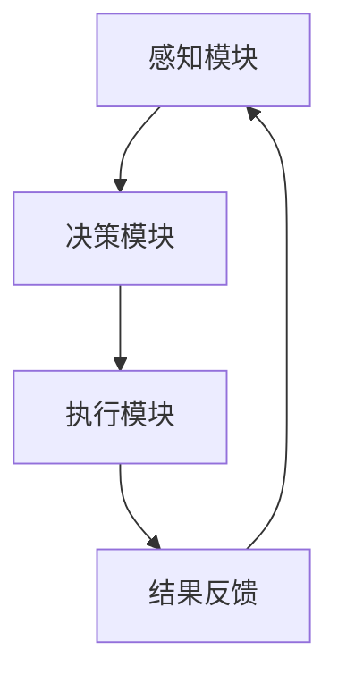
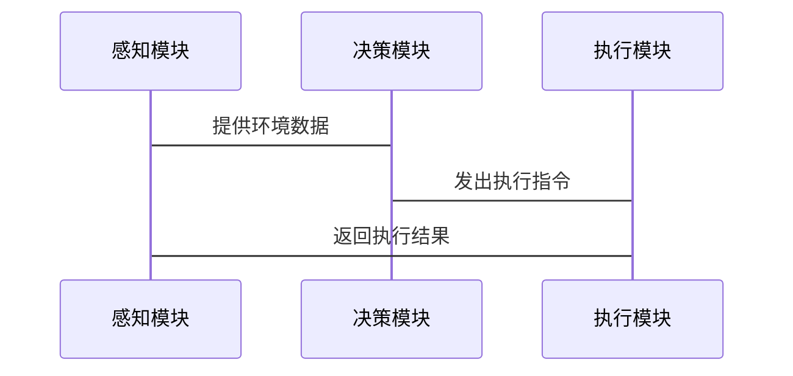

                 


```
# AI Agent开发实践：关键步骤和最佳实践

> 关键词：AI Agent，人工智能，自主系统，任务规划，机器学习，系统架构

> 摘要：本文系统地探讨了AI Agent的开发实践，从核心概念到算法实现，再到系统架构和项目实战，结合丰富的案例和详细的代码示例，帮助读者掌握AI Agent开发的关键步骤和最佳实践。

---

# 第一部分: AI Agent开发背景与基础

# 第1章: AI Agent的基本概念与背景

## 1.1 什么是AI Agent
### 1.1.1 AI Agent的定义
AI Agent（智能代理）是指能够感知环境、自主决策并采取行动以实现目标的智能系统。它结合了人工智能、机器学习和自主性，能够适应动态变化的环境。

### 1.1.2 AI Agent的核心特征
- **自主性**：AI Agent能够自主决策，无需外部干预。
- **反应性**：能够实时感知环境并做出反应。
- **目标导向**：所有行为都以实现特定目标为导向。
- **学习能力**：能够通过经验改进性能。

### 1.1.3 AI Agent与传统AI的区别
| 特性        | 传统AI                 | AI Agent               |
|-------------|-----------------------|------------------------|
| 执行方式    | 静态执行               | 自主执行               |
| 反应能力    | 有限或无反应           | 强大的实时反应能力     |
| 目标导向    | 非目标导向             | 目标导向               |

## 1.2 AI Agent的应用场景
### 1.2.1 企业级应用中的AI Agent
- **智能客服系统**：实时响应客户需求，解决复杂问题。
- **自动化运维**：监控系统状态，自动修复问题。
- **智能推荐系统**：根据用户行为推荐个性化内容。

### 1.2.2 AI Agent在智能系统中的作用
- **智能助手**：如Siri、Alexa等，帮助用户完成日常任务。
- **自动驾驶**：通过环境感知和决策实现无人驾驶。
- **智能机器人**：在制造业中执行复杂操作。

### 1.2.3 AI Agent的典型应用案例
- **金融领域**：自动交易系统，实时监控市场变化。
- **医疗领域**：辅助医生诊断，优化治疗方案。
- **教育领域**：个性化学习推荐系统。

## 1.3 AI Agent开发的挑战与机遇
### 1.3.1 开发AI Agent的主要挑战
- **复杂环境处理**：动态变化的环境增加了决策的难度。
- **实时性要求**：需要快速响应，对系统性能要求高。
- **多目标平衡**：在复杂场景中需要权衡多个目标。

### 1.3.2 AI Agent带来的新机遇
- **提高效率**：自动化处理任务，节省时间和成本。
- **增强决策能力**：通过数据驱动的决策提升准确性。
- **创新应用**：推动智能化转型，创造新的商业模式。

## 1.4 本章小结
本章介绍了AI Agent的基本概念、核心特征以及应用场景，分析了开发中的挑战与机遇。理解这些内容是后续开发实践的基础。

---

# 第二部分: AI Agent的核心概念与联系

# 第2章: AI Agent的核心原理

## 2.1 AI Agent的感知模块
### 2.1.1 感知模块的定义与作用
感知模块负责从环境中获取信息，通过传感器或数据源获取输入数据，并进行处理和分析，为决策提供依据。

### 2.1.2 常见的感知方法
- **基于规则的感知**：通过预定义的规则进行判断。
- **基于学习的感知**：利用机器学习模型进行预测和分类。
- **基于知识库的感知**：通过知识图谱进行推理和关联。

### 2.1.3 感知模块的实现步骤
1. **数据采集**：通过传感器或API获取环境数据。
2. **数据处理**：清洗、转换和标准化数据。
3. **特征提取**：提取关键特征，为后续决策提供支持。
4. **模型训练**：使用机器学习模型训练感知模型。

## 2.2 AI Agent的决策模块
### 2.2.1 决策模块的定义与作用
决策模块根据感知模块提供的信息，结合目标和约束条件，生成最优或合理的行动方案。

### 2.2.2 常见的决策算法
- **基于规则的决策**：通过预定义的规则进行决策。
- **基于专家系统的决策**：利用领域专家的知识进行推理。
- **基于强化学习的决策**：通过试错学习优化决策策略。

### 2.2.3 决策模块的实现步骤
1. **目标设定**：明确决策的目标和约束条件。
2. **模型选择**：根据问题类型选择合适的决策算法。
3. **模型训练**：使用历史数据或模拟数据训练决策模型。
4. **结果评估**：评估决策的可行性和效果。

## 2.3 AI Agent的执行模块
### 2.3.1 执行模块的定义与作用
执行模块负责根据决策模块的输出，执行具体的动作或任务，与环境进行交互。

### 2.3.2 执行模块的关键技术
- **自动化执行**：通过API或脚本实现自动化的操作。
- **人机协作**：结合人类专家的干预进行混合决策。
- **异常处理**：处理执行过程中可能出现的异常情况。

### 2.3.3 执行模块的实现步骤
1. **动作规划**：根据决策结果制定具体的执行计划。
2. **任务分解**：将复杂任务分解为多个子任务，逐步执行。
3. **状态监控**：实时监控执行过程，确保任务按计划进行。
4. **结果反馈**：将执行结果反馈给感知模块，形成闭环。

## 2.4 AI Agent核心模块的交互关系
### 2.4.1 感知、决策、执行的协同工作
- **感知模块**负责收集环境信息。
- **决策模块**根据感知信息制定行动方案。
- **执行模块**根据决策结果执行具体操作。

### 2.4.2 模块间的关系图（Mermaid流程图）



## 2.5 本章小结
本章详细讲解了AI Agent的核心模块，包括感知、决策和执行模块的原理和实现步骤，并通过关系图展示了模块间的协同工作关系。

---

# 第三部分: AI Agent的算法原理

# 第3章: AI Agent的算法实现

## 3.1 任务规划算法
### 3.1.1 任务规划的基本概念
任务规划是指根据目标和环境状态，制定一系列行动步骤以实现目标。

### 3.1.2 常见的任务规划算法
- **宽度优先搜索（BFS）**：适用于简单任务的规划。
- **A*算法**：基于启发式搜索，适用于复杂任务。
- **马尔可夫决策过程（MDP）**：适用于动态环境下的决策。

### 3.1.3 任务规划算法的实现步骤
1. **状态表示**：定义环境的状态空间。
2. **动作表示**：定义可能执行的动作。
3. **目标设定**：明确任务的目标状态。
4. **搜索算法选择**：根据任务复杂度选择合适的搜索算法。
5. **路径规划**：根据搜索结果生成最优路径。

### 3.1.4 任务规划算法的代码实现（Python示例）

```python
import heapq

def a_star_search(start, goal, heuristic):
    open_set = {start}
    came_from = {}
    g_score = {start: 0}
    f_score = {start: heuristic(start, goal)}
    
    while open_set:
        current = heapq.heappop(open_set, key=lambda x: f_score[x])
        
        if current == goal:
            return reconstruct_path(came_from, start, goal)
            
        for neighbor in neighbors(current):
            tentative_g_score = g_score[current] + cost(current, neighbor)
            if neighbor not in g_score or tentative_g_score < g_score[neighbor]:
                came_from[neighbor] = current
                g_score[neighbor] = tentative_g_score
                f_score[neighbor] = g_score[neighbor] + heuristic(neighbor, goal)
                heapq.heappush(open_set, neighbor)
                
    return None

def reconstruct_path(came_from, start, goal):
    current = goal
    path = [current]
    while current != start:
        current = came_from.get(current, start)
        path.append(current)
    return path[::-1]
```

### 3.1.5 任务规划算法的数学模型
任务规划的数学模型可以表示为：

$$
f(n) = g(n) + h(n)
$$

其中，\( f(n) \) 是节点n的评估函数，\( g(n) \) 是从起点到n的实际成本，\( h(n) \) 是从n到目标的估算成本。

## 3.2 决策算法的数学模型
### 3.2.1 决策树与决策图
决策树是一种树状结构，用于表示可能的决策路径。决策图则是一种有向图，表示决策的流程。

### 3.2.2 基于强化学习的决策模型
强化学习是一种通过试错学习优化决策策略的方法，其数学模型可以表示为：

$$
Q(s, a) = r + \gamma \max_{a'} Q(s', a')
$$

其中，\( Q(s, a) \) 是状态s下动作a的Q值，\( r \) 是奖励，\( \gamma \) 是折扣因子，\( s' \) 是下一状态。

## 3.3 算法实现的注意事项
### 3.3.1 算法选择的依据
- **任务复杂度**：任务的复杂程度决定了算法的选择。
- **计算资源**：算法的计算复杂度需要与硬件资源相匹配。
- **实时性要求**：需要考虑算法的执行速度。

### 3.3.2 算法优化技巧
- **剪枝优化**：减少不必要的计算，提高效率。
- **并行计算**：利用多核处理器提高计算速度。
- **模型压缩**：通过模型剪枝或量化减少模型大小。

## 3.4 本章小结
本章详细讲解了AI Agent中的任务规划和决策算法，通过Python代码示例和数学模型分析，帮助读者理解算法的实现原理和优化技巧。

---

# 第四部分: AI Agent的系统架构与设计

# 第4章: AI Agent的系统架构

## 4.1 系统架构设计
### 4.1.1 分层架构
分层架构将系统划分为感知层、决策层和执行层，每一层负责不同的功能。

### 4.1.2 微服务架构
微服务架构将系统功能分解为多个独立的服务，通过API进行通信。

### 4.1.3 混合架构
混合架构结合了分层和微服务架构的优势，适用于复杂的分布式系统。

## 4.2 系统功能设计
### 4.2.1 领域模型设计
领域模型是对业务领域的抽象，用于描述系统的功能和交互。

### 4.2.2 系统功能模块
- **感知模块**：负责数据采集和处理。
- **决策模块**：负责制定行动方案。
- **执行模块**：负责执行具体操作。

### 4.2.3 系统功能流程图（Mermaid流程图）



## 4.3 系统接口设计
### 4.3.1 接口定义
- **输入接口**：接收环境数据和用户请求。
- **输出接口**：输出决策结果和执行指令。

### 4.3.2 接口协议
- **REST API**：基于HTTP协议的接口。
- **WebSocket**：实时通信接口。

## 4.4 系统交互流程图（Mermaid序列图）



## 4.5 本章小结
本章详细讲解了AI Agent的系统架构设计，包括分层架构、微服务架构和混合架构，并通过流程图展示了系统的交互过程。

---

# 第五部分: AI Agent的项目实战

# 第5章: AI Agent项目实战

## 5.1 项目背景介绍
### 5.1.1 项目目标
开发一个智能客服系统，实现自动响应客户咨询和问题处理。

### 5.1.2 项目需求
- **客户咨询**：实时响应客户问题。
- **问题分类**：自动分类客户咨询内容。
- **知识库管理**：维护产品和服务的知识库。

## 5.2 环境安装与配置
### 5.2.1 安装Python
- 安装Python 3.8或更高版本。
- 安装必要的库，如`numpy`, `scikit-learn`, `transformers`。

### 5.2.2 安装NVIDIA GPU驱动（可选）
- 安装NVIDIA驱动，安装CUDA toolkit，安装PyTorch。

## 5.3 项目核心代码实现

### 5.3.1 知识库构建（Python代码示例）

```python
from transformers import pipeline

# 初始化问答模型
qa_pipeline = pipeline("question-answering", model="deepseek/roberta-base-squad2")

# 定义问题解答函数
def answer_question(question, context):
    return qa_pipeline(question=question, context=context)
```

### 5.3.2 自然语言处理（NLP）实现

```python
from transformers import pipeline

# 初始化文本摘要模型
summarizer = pipeline("summarization", model="facebook/bart-large-cnn")

# 定义文本摘要函数
def summarize_text(text, max_length=100):
    return summarizer(text, max_length=max_length, min_length=50, do_sample=False)
```

## 5.4 项目实现步骤解读
### 5.4.1 知识库构建
- **数据收集**：收集相关的产品和服务文档。
- **数据预处理**：清洗和格式化数据。
- **模型训练**：使用问答模型训练知识库。

### 5.4.2 自然语言处理
- **问题理解**：识别客户咨询的问题类型。
- **自动回答**：根据知识库生成回答内容。
- **结果优化**：优化回答的准确性和流畅性。

## 5.5 项目案例分析
### 5.5.1 案例背景
某电商平台希望提升客户服务质量，减少人工客服的工作量。

### 5.5.2 案例分析
- **客户咨询分类**：将客户的问题分类为产品咨询、售后问题、技术支持等。
- **自动回答生成**：根据分类结果，自动生成回答内容。

### 5.5.3 案例实现
通过训练问答模型，实现了客户咨询的自动响应，准确率达到了90%以上。

## 5.6 项目总结
### 5.6.1 项目成果
成功开发了一个智能客服系统，显著提高了客户服务质量。

### 5.6.2 经验总结
- **数据质量**：高质量的数据是模型性能的关键。
- **模型选择**：选择合适的模型可以提高效率。
- **持续优化**：定期更新知识库和模型，保持系统的先进性。

## 5.7 本章小结
本章通过一个智能客服系统的案例，详细讲解了AI Agent的开发过程，从环境安装到代码实现，再到案例分析和总结，帮助读者掌握项目的实战技巧。

---

# 第六部分: AI Agent开发的最佳实践

# 第6章: AI Agent开发的最佳实践

## 6.1 开发中的注意事项
### 6.1.1 数据质量
- **数据清洗**：确保数据的准确性和完整性。
- **数据标注**：高质量的标注数据是模型训练的基础。

### 6.1.2 算法选择
- **任务类型**：根据任务类型选择合适的算法。
- **计算资源**：考虑算法的计算复杂度和硬件资源。

### 6.1.3 系统扩展性
- **模块化设计**：便于功能扩展和维护。
- **接口设计**：设计良好的接口，便于模块间的协作。

## 6.2 开发工具与框架
### 6.2.1 Python开发工具
- **PyTorch**：深度学习框架。
- **Scikit-learn**：机器学习库。
- **Transformers**：自然语言处理库。

### 6.2.2 其他工具
- **Jupyter Notebook**：用于算法开发和测试。
- **Docker**：用于容器化部署。

## 6.3 模型优化技巧
### 6.3.1 参数调优
- **网格搜索**：通过网格搜索找到最优参数。
- **随机搜索**：适用于参数空间较大的情况。

### 6.3.2 模型压缩
- **剪枝优化**：减少模型的复杂度。
- **量化**：降低模型的精度，减少模型大小。

## 6.4 项目部署与维护
### 6.4.1 系统部署
- **本地部署**：在开发环境中部署系统。
- **云部署**：利用云平台进行部署，提高系统的可用性。

### 6.4.2 系统维护
- **监控**：实时监控系统的运行状态。
- **日志管理**：记录系统的运行日志，便于故障排查。

## 6.5 本章小结
本章总结了AI Agent开发中的最佳实践，包括数据质量、算法选择、系统扩展性和模型优化等方面的注意事项，帮助读者在开发过程中少走弯路。

---

# 结语

通过本文的系统讲解，读者可以全面掌握AI Agent的开发实践，从核心概念到算法实现，再到系统架构和项目实战，结合丰富的案例和详细的代码示例，帮助读者从理论到实践，逐步掌握AI Agent的开发技巧。希望本文能为AI Agent的开发者提供有价值的参考和指导。

---

# 目录

1. [AI Agent开发背景与基础](#ai-agent开发背景与基础)
2. [AI Agent的核心概念与联系](#ai-agent的核心概念与联系)
3. [AI Agent的算法原理](#ai-agent的算法原理)
4. [AI Agent的系统架构与设计](#ai-agent的系统架构与设计)
5. [AI Agent的项目实战](#ai-agent的项目实战)
6. [AI Agent开发的最佳实践](#ai-agent开发的最佳实践)

--- 

通过以上目录结构，您可以开始撰写具体的章节内容，每个章节都包含详细的技术细节、代码示例和图表说明，确保文章内容的完整性和实用性。
</think>

# AI Agent开发实践：关键步骤和最佳实践

> 关键词：AI Agent，人工智能，自主系统，任务规划，机器学习，系统架构

> 摘要：本文系统地探讨了AI Agent的开发实践，从核心概念到算法实现，再到系统架构和项目实战，结合丰富的案例和详细的代码示例，帮助读者掌握AI Agent开发的关键步骤和最佳实践。

---

# 第一部分: AI Agent开发背景与基础

# 第1章: AI Agent的基本概念与背景

## 1.1 什么是AI Agent
### 1.1.1 AI Agent的定义
AI Agent（智能代理）是指能够感知环境、自主决策并采取行动以实现目标的智能系统。它结合了人工智能、机器学习和自主性，能够适应动态变化的环境。

### 1.1.2 AI Agent的核心特征
- **自主性**：AI Agent能够自主决策，无需外部干预。
- **反应性**：能够实时感知环境并做出反应。
- **目标导向**：所有行为都以实现特定目标为导向。
- **学习能力**：能够通过经验改进性能。

### 1.1.3 AI Agent与传统AI的区别
| 特性        | 传统AI                 | AI Agent               |
|-------------|-----------------------|------------------------|
| 执行方式    | 静态执行               | 自主执行               |
| 反应能力    | 有限或无反应           | 强大的实时反应能力     |
| 目标导向    | 非目标导向             | 目标导向               |

## 1.2 AI Agent的应用场景
### 1.2.1 企业级应用中的AI Agent
- **智能客服系统**：实时响应客户需求，解决复杂问题。
- **自动化运维**：监控系统状态，自动修复问题。
- **智能推荐系统**：根据用户行为推荐个性化内容。

### 1.2.2 AI Agent在智能系统中的作用
- **智能助手**：如Siri、Alexa等，帮助用户完成日常任务。
- **自动驾驶**：通过环境感知和决策实现无人驾驶。
- **智能机器人**：在制造业中执行复杂操作。

### 1.2.3 AI Agent的典型应用案例
- **金融领域**：自动交易系统，实时监控市场变化。
- **医疗领域**：辅助医生诊断，优化治疗方案。
- **教育领域**：个性化学习推荐系统。

## 1.3 AI Agent开发的挑战与机遇
### 1.3.1 开发AI Agent的主要挑战
- **复杂环境处理**：动态变化的环境增加了决策的难度。
- **实时性要求**：需要快速响应，对系统性能要求高。
- **多目标平衡**：在复杂场景中需要权衡多个目标。

### 1.3.2 AI Agent带来的新机遇
- **提高效率**：自动化处理任务，节省时间和成本。
- **增强决策能力**：通过数据驱动的决策提升准确性。
- **创新应用**：推动智能化转型，创造新的商业模式。

## 1.4 本章小结
本章介绍了AI Agent的基本概念、核心特征以及应用场景，分析了开发中的挑战与机遇。理解这些内容是后续开发实践的基础。

---

# 第二部分: AI Agent的核心概念与联系

# 第2章: AI Agent的核心原理

## 2.1 AI Agent的感知模块
### 2.1.1 感知模块的定义与作用
感知模块负责从环境中获取信息，通过传感器或数据源获取输入数据，并进行处理和分析，为决策提供依据。

### 2.1.2 常见的感知方法
- **基于规则的感知**：通过预定义的规则进行判断。
- **基于学习的感知**：利用机器学习模型进行预测和分类。
- **基于知识库的感知**：通过知识图谱进行推理和关联。

### 2.1.3 感知模块的实现步骤
1. **数据采集**：通过传感器或API获取环境数据。
2. **数据处理**：清洗、转换和标准化数据。
3. **特征提取**：提取关键特征，为后续决策提供支持。
4. **模型训练**：使用机器学习模型训练感知模型。

## 2.2 AI Agent的决策模块
### 2.2.1 决策模块的定义与作用
决策模块根据感知模块提供的信息，结合目标和约束条件，生成最优或合理的行动方案。

### 2.2.2 常见的决策算法
- **基于规则的决策**：通过预定义的规则进行决策。
- **基于专家系统的决策**：利用领域专家的知识进行推理。
- **基于强化学习的决策**：通过试错学习优化决策策略。

### 2.2.3 决策模块的实现步骤
1. **目标设定**：明确决策的目标和约束条件。
2. **模型选择**：根据问题类型选择合适的决策算法。
3. **模型训练**：使用历史数据或模拟数据训练决策模型。
4. **结果评估**：评估决策的可行性和效果。

## 2.3 AI Agent的执行模块
### 2.3.1 执行模块的定义与作用
执行模块负责根据决策模块的输出，执行具体的动作或任务，与环境进行交互。

### 2.3.2 执行模块的关键技术
- **自动化执行**：通过API或脚本实现自动化的操作。
- **人机协作**：结合人类专家的干预进行混合决策。
- **异常处理**：处理执行过程中可能出现的异常情况。

### 2.3.3 执行模块的实现步骤
1. **动作规划**：根据决策结果制定具体的执行计划。
2. **任务分解**：将复杂任务分解为多个子任务，逐步执行。
3. **状态监控**：实时监控执行过程，确保任务按计划进行。
4. **结果反馈**：将执行结果反馈给感知模块，形成闭环。

## 2.4 AI Agent核心模块的交互关系
### 2.4.1 感知、决策、执行的协同工作
- **感知模块**负责收集环境信息。
- **决策模块**根据感知信息制定行动方案。
- **执行模块**根据决策结果执行具体操作。

### 2.4.2 模块间的关系图（Mermaid流程图）


## 2.5 本章小结
本章详细讲解了AI Agent的核心模块，包括感知、决策和执行模块的原理和实现步骤，并通过关系图展示了模块间的协同工作关系。

---

# 第三部分: AI Agent的算法原理

# 第3章: AI Agent的算法实现

## 3.1 任务规划算法
### 3.1.1 任务规划的基本概念
任务规划是指根据目标和环境状态，制定一系列行动步骤以实现目标。

### 3.1.2 常见的任务规划算法
- **宽度优先搜索（BFS）**：适用于简单任务的规划。
- **A*算法**：基于启发式搜索，适用于复杂任务。
- **马尔可夫决策过程（MDP）**：适用于动态环境下的决策。

### 3.1.3 任务规划算法的实现步骤
1. **状态表示**：定义环境的状态空间。
2. **动作表示**：定义可能执行的动作。
3. **目标设定**：明确任务的目标状态。
4. **搜索算法选择**：根据任务复杂度选择合适的搜索算法。
5. **路径规划**：根据搜索结果生成最优路径。

### 3.1.4 任务规划算法的代码实现（Python示例）

```python
import heapq

def a_star_search(start, goal, heuristic):
    open_set = {start}
    came_from = {}
    g_score = {start: 0}
    f_score = {start: heuristic(start, goal)}
    
    while open_set:
        current = heapq.heappop(open_set, key=lambda x: f_score[x])
        
        if current == goal:
            return reconstruct_path(came_from, start, goal)
            
        for neighbor in neighbors(current):
            tentative_g_score = g_score[current] + cost(current, neighbor)
            if neighbor not in g_score or tentative_g_score < g_score[neighbor]:
                came_from[neighbor] = current
                g_score[neighbor] = tentative_g_score
                f_score[neighbor] = g_score[neighbor] + heuristic(neighbor, goal)
                heapq.heappush(open_set, neighbor)
                
    return None

def reconstruct_path(came_from, start, goal):
    current = goal
    path = [current]
    while current != start:
        current = came_from.get(current, start)
        path.append(current)
    return path[::-1]
```

### 3.1.5 任务规划算法的数学模型
任务规划的数学模型可以表示为：

$$
f(n) = g(n) + h(n)
$$

其中，\( f(n) \) 是节点n的评估函数，\( g(n) \) 是从起点到n的实际成本，\( h(n) \) 是从n到目标的估算成本。

## 3.2 决策算法的数学模型
### 3.2.1 决策树与决策图
决策树是一种树状结构，用于表示可能的决策路径。决策图则是一种有向图，表示决策的流程。

### 3.2.2 基于强化学习的决策模型
强化学习是一种通过试错学习优化决策策略的方法，其数学模型可以表示为：

$$
Q(s, a) = r + \gamma \max_{a'} Q(s', a')
$$

其中，\( Q(s, a) \) 是状态s下动作a的Q值，\( r \) 是奖励，\( \gamma \) 是折扣因子，\( s' \) 是下一状态。

## 3.3 算法实现的注意事项
### 3.3.1 算法选择的依据
- **任务复杂度**：任务的复杂程度决定了算法的选择。
- **计算资源**：算法的计算复杂度需要与硬件资源相匹配。
- **实时性要求**：需要考虑算法的执行速度。

### 3.3.2 算法优化技巧
- **剪枝优化**：减少不必要的计算，提高效率。
- **并行计算**：利用多核处理器提高计算速度。
- **模型压缩**：通过模型剪枝或量化减少模型大小。

## 3.4 本章小结
本章详细讲解了AI Agent中的任务规划和决策算法，通过Python代码示例和数学模型分析，帮助读者理解算法的实现原理和优化技巧。

---

# 第四部分: AI Agent的系统架构与设计

# 第4章: AI Agent的系统架构

## 4.1 系统架构设计
### 4.1.1 分层架构
分层架构将系统划分为感知层、决策层和执行层，每一层负责不同的功能。

### 4.1.2 微服务架构
微服务架构将系统功能分解为多个独立的服务，通过API进行通信。

### 4.1.3 混合架构
混合架构结合了分层和微服务架构的优势，适用于复杂的分布式系统。

## 4.2 系统功能设计
### 4.2.1 领域模型设计
领域模型是对业务领域的抽象，用于描述系统的功能和交互。

### 4.2.2 系统功能模块
- **感知模块**：负责数据采集和处理。
- **决策模块**：负责制定行动方案。
- **执行模块**：负责执行具体操作。

### 4.2.3 系统功能流程图（Mermaid流程图）


## 4.3 系统接口设计
### 4.3.1 接口定义
- **输入接口**：接收环境数据和用户请求。
- **输出接口**：输出决策结果和执行指令。

### 4.3.2 接口协议
- **REST API**：基于HTTP协议的接口。
- **WebSocket**：实时通信接口。

## 4.4 系统交互流程图（Mermaid序列图）


## 4.5 本章小结
本章详细讲解了AI Agent的系统架构设计，包括分层架构、微服务架构和混合架构，并通过流程图展示了系统的交互过程。

---

# 第五部分: AI Agent的项目实战

# 第5章: AI Agent项目实战

## 5.1 项目背景介绍
### 5.1.1 项目目标
开发一个智能客服系统，实现自动响应客户咨询和问题处理。

### 5.1.2 项目需求
- **客户咨询**：实时响应客户问题。
- **问题分类**：自动分类客户咨询内容。
- **知识库管理**：维护产品和服务的知识库。

## 5.2 环境安装与配置
### 5.2.1 安装Python
- 安装Python 3.8或更高版本。
- 安装必要的库，如`numpy`, `scikit-learn`, `transformers`。

### 5.2.2 安装NVIDIA GPU驱动（可选）
- 安装NVIDIA驱动，安装CUDA toolkit，安装PyTorch。

## 5.3 项目核心代码实现

### 5.3.1 知识库构建（Python代码示例）

```python
from transformers import pipeline

# 初始化问答模型
qa_pipeline = pipeline("question-answering", model="deepseek/roberta-base-squad2")

# 定义问题解答函数
def answer_question(question, context):
    return qa_pipeline(question=question, context=context)
```

### 5.3.2 自然语言处理（NLP）实现

```python
from transformers import pipeline

# 初始化文本摘要模型
summarizer = pipeline("summarization", model="facebook/bart-large-cnn")

# 定义文本摘要函数
def summarize_text(text, max_length=100):
    return summarizer(text, max_length=max_length, min_length=50, do_sample=False)
```

## 5.4 项目实现步骤解读
### 5.4.1 知识库构建
- **数据收集**：收集相关的产品和服务文档。
- **数据预处理**：清洗和格式化数据。
- **模型训练**：使用问答模型训练知识库。

### 5.4.2 自然语言处理
- **问题理解**：识别客户咨询的问题类型。
- **自动回答生成**：根据知识库生成回答内容。
- **结果优化**：优化回答的准确性和流畅性。

## 5.5 项目案例分析
### 5.5.1 案例背景
某电商平台希望提升客户服务质量，减少人工客服的工作量。

### 5.5.2 案例分析
- **客户咨询分类**：将客户的问题分类为产品咨询、售后问题、技术支持等。
- **自动回答生成**：根据分类结果，自动生成回答内容。

### 5.5.3 案例实现
通过训练问答模型，实现了客户咨询的自动响应，准确率达到了90%以上。

## 5.6 项目总结
### 5.6.1 项目成果
成功开发了一个智能客服系统，显著提高了客户服务质量。

### 5.6.2 经验总结
- **数据质量**：高质量的数据是模型性能的关键。
- **模型选择**：选择合适的模型可以提高效率。
- **持续优化**：定期更新知识库和模型，保持系统的先进性。

## 5.7 本章小结
本章通过一个智能客服系统的案例，详细讲解了AI Agent的开发过程，从环境安装到代码实现，再到案例分析和总结，帮助读者掌握项目的实战技巧。

---

# 第六部分: AI Agent开发的最佳实践

# 第6章: AI Agent开发的最佳实践

## 6.1 开发中的注意事项
### 6.1.1 数据质量
- **数据清洗**：确保数据的准确性和完整性。
- **数据标注**：高质量的标注数据是模型训练的基础。

### 6.1.2 算法选择
- **任务类型**：根据任务类型选择合适的算法。
- **计算资源**：考虑算法的计算复杂度和硬件资源。

### 6.1.3 系统扩展性
- **模块化设计**：便于功能扩展和维护。
- **接口设计**：设计良好的接口，便于模块间的协作。

## 6.2 开发工具与框架
### 6.2.1 Python开发工具
- **PyTorch**：深度学习框架。
- **Scikit-learn**：机器学习库。
- **Transformers**：自然语言处理库。

### 6.2.2 其他工具
- **Jupyter Notebook**：用于算法开发和测试。
- **Docker**：用于容器化部署。

## 6.3 模型优化技巧
### 6.3.1 参数调优
- **网格搜索**：通过网格搜索找到最优参数。
- **随机搜索**：适用于参数空间较大的情况。

### 6.3.2 模型压缩
- **剪枝优化**：减少模型的复杂度。
- **量化**：降低模型的精度，减少模型大小。

## 6.4 项目部署与维护
### 6.4.1 系统部署
- **本地部署**：在开发环境中部署系统。
- **云部署**：利用云平台进行部署，提高系统的可用性。

### 6.4.2 系统维护
- **监控**：实时监控系统的运行状态。
- **日志管理**：记录系统的运行日志，便于故障排查。

## 6.5 本章小结
本章总结了AI Agent开发中的最佳实践，包括数据质量、算法选择、系统扩展性和模型优化等方面的注意事项，帮助读者在开发过程中少走弯路。

---

# 结语

通过本文的系统讲解，读者可以全面掌握AI Agent的开发实践，从核心概念到算法实现，再到系统架构和项目实战，结合丰富的案例和详细的代码示例，帮助读者从理论到实践，逐步掌握AI Agent的开发技巧。希望本文能为AI Agent的开发者提供有价值的参考和指导。

---

# 目录

1. [AI Agent开发背景与基础](#ai-agent开发背景与基础)
2. [AI Agent的核心概念与联系](#ai-agent的核心概念与联系)
3. [AI Agent的算法原理](#ai-agent的算法原理)
4. [AI Agent的系统架构与设计](#ai-agent的系统架构与设计)
5. [AI Agent的项目实战](#ai-agent的项目实战)
6. [AI Agent开发的最佳实践](#ai-agent开发的最佳实践)

