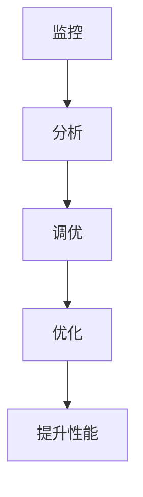
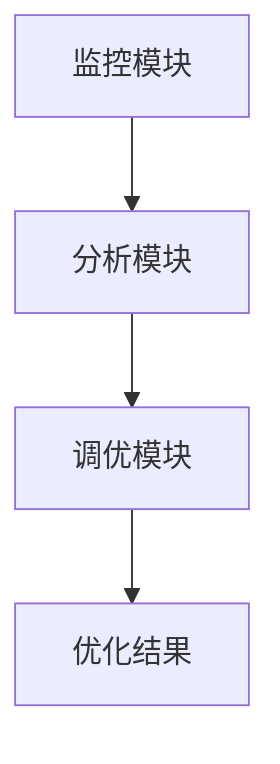
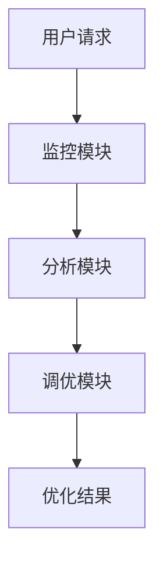

                 


# AI Agent性能优化：监控、分析与调优技巧

> 关键词：AI Agent，性能优化，监控，分析，调优，算法原理，数学模型

> 摘要：本文将深入探讨AI Agent性能优化的关键方面，包括监控、分析和调优的技巧。通过详细分析核心概念、算法原理、数学模型、系统架构设计以及实际案例，本文旨在帮助读者全面理解并掌握AI Agent性能优化的方法，从而有效提升系统的性能和效率。

---

## 目录

1. [背景介绍](#背景介绍)
   1.1 AI Agent的基本概念
   1.2 性能优化的重要性
   1.3 监控、分析与调优的必要性

2. [核心概念与联系](#核心概念与联系)
   2.1 监控、分析与调优的基本原理
   2.2 核心概念对比分析
   2.3 概念结构与关联性

3. [算法原理](#算法原理)
   3.1 监控算法原理
   3.2 分析算法原理
   3.3 调优算法原理
   3.4 算法流程图与代码示例

4. [数学模型与公式](#数学模型与公式)
   4.1 监控指标的数学模型
   4.2 调优算法的数学公式
   4.3 公式解释与实际应用

5. [系统分析与架构设计](#系统分析与架构设计)
   5.1 问题场景分析
   5.2 系统功能模块设计
   5.3 系统架构设计
   5.4 系统接口设计

6. [项目实战](#项目实战)
   6.1 环境安装与配置
   6.2 系统核心实现
   6.3 代码应用解读与分析
   6.4 实际案例分析与优化

---

## 背景介绍

### 1.1 AI Agent的基本概念

AI Agent（人工智能代理）是指能够感知环境、自主决策并采取行动以实现目标的智能实体。AI Agent广泛应用于自动驾驶、智能推荐系统、机器人控制等领域。其核心功能包括感知、推理、决策和行动。

#### 1.1.1 AI Agent的定义与特点
- **定义**：AI Agent是具备智能特性的软件或实体，能够根据环境信息自主决策并执行任务。
- **特点**：
  - 自主性：无需外部干预，自主完成任务。
  - 反应性：能够感知环境并实时响应。
  - 智能性：具备学习和推理能力，能够优化决策。

#### 1.1.2 AI Agent的分类与应用场景
- **分类**：
  - 智能体类型：基于行为、知识、目标等不同维度进行分类。
  - 应用场景：包括但不限于自动驾驶、智能助手、推荐系统、游戏AI等。
- **应用场景**：
  - 自动驾驶：实时感知环境并做出驾驶决策。
  - 智能助手：通过语音或文本交互帮助用户完成任务。
  - 推荐系统：根据用户行为推荐个性化内容。

#### 1.1.3 AI Agent性能优化的必要性
- AI Agent的性能直接影响用户体验和系统效率。
- 优化性能可以提升响应速度、减少资源消耗、提高决策准确性。
- 在高并发和复杂环境中，性能优化尤为重要。

---

### 1.2 性能优化的重要性

AI Agent的性能优化是确保其高效运行的关键。以下是性能优化的重要性：

1. **提升用户体验**：更快的响应时间和更准确的决策能够提升用户满意度。
2. **降低资源消耗**：优化性能可以减少计算资源和能源消耗，降低成本。
3. **提高系统稳定性**：通过优化算法和架构设计，减少系统崩溃和错误发生。
4. **增强竞争力**：高性能的AI Agent能够在市场中更具竞争力。

---

### 1.3 监控、分析与调优的必要性

为了实现AI Agent的性能优化，需要进行实时监控、深入分析和持续调优：

1. **监控**：实时跟踪系统运行状态，发现潜在问题。
2. **分析**：通过数据分析和模型分析，识别性能瓶颈。
3. **调优**：根据分析结果，优化算法和系统配置，提升性能。

---

## 核心概念与联系

### 2.1 监控、分析与调优的基本原理

#### 2.1.1 监控的原理与实现
- **监控原理**：通过采集系统指标、日志和性能数据，实时了解系统运行状态。
- **实现方法**：
  - 基于指标的监控：收集CPU、内存、磁盘使用率等系统指标。
  - 基于日志的监控：分析日志文件，发现异常行为和错误。
  - 基于模型的监控：使用机器学习模型预测系统行为，识别异常。

#### 2.1.2 分析的原理与方法
- **分析原理**：通过对监控数据的统计分析和模型分析，识别性能瓶颈和优化方向。
- **分析方法**：
  - 数据分析：使用统计方法和数据可视化工具，发现数据中的规律和异常。
  - 模型分析：利用机器学习模型，预测系统行为并评估优化效果。
  - 调试分析：通过调试工具，分析程序运行时的状态和错误。

#### 2.1.3 调优的原理与策略
- **调优原理**：通过调整系统参数、算法参数和配置，优化系统性能。
- **调优策略**：
  - 参数调优：调整算法的超参数，找到最佳配置。
  - 策略调优：优化决策策略，提高决策的准确性和效率。
  - 模型调优：优化模型结构和训练过程，提升模型性能。

---

### 2.2 核心概念对比分析

#### 2.2.1 监控与分析的特征对比

| 特征    | 监控             | 分析             |
|---------|------------------|------------------|
| 目标    | 实时跟踪状态     | 发现问题根源     |
| 方法    | 采集指标和日志   | 统计分析和建模   |
| 工具    | 监控平台（如Prometheus） | 数据分析工具（如Python的pandas库） |

#### 2.2.2 调优与监控的关联性
- **调优依赖监控**：调优需要基于监控数据发现问题。
- **监控依赖调优**：监控数据需要通过调优来优化系统性能。

#### 2.2.3 监控、分析与调优的流程图



---

### 2.3 概念结构与核心要素组成

- **核心要素**：
  - 监控指标：CPU、内存、磁盘使用率等。
  - 分析方法：统计分析、机器学习模型分析。
  - 调优策略：参数调整、算法优化、模型优化。
- **概念结构**：
  - 监控是基础，提供数据支持。
  - 分析是关键，识别问题根源。
  - 调优是目标，提升系统性能。

---

## 算法原理

### 3.1 监控算法原理

#### 3.1.1 基于指标的监控算法

- **定义**：通过采集系统指标，实时监控系统状态。
- **实现步骤**：
  1. 采集指标：CPU使用率、内存占用、磁盘I/O等。
  2. 数据存储：将采集的数据存储在数据库中。
  3. 数据可视化：使用工具如Grafana展示监控数据。
- **代码示例**：

```python
import psutil

def get_system_metrics():
    metrics = {}
    metrics['cpu_usage'] = psutil.cpu_percent()
    metrics['memory_usage'] = psutil.virtual_memory().percent
    metrics['disk_usage'] = psutil.disk_usage('/').percent
    return metrics
```

---

#### 3.1.2 基于日志的监控算法

- **定义**：通过分析日志文件，发现异常行为。
- **实现步骤**：
  1. 日志采集：使用工具如Fluentd采集日志。
  2. 日志存储：将日志存储在 Elastic Search 中。
  3. 日志分析：使用 Kibana 进行日志查询和分析。
- **代码示例**：

```python
import logging
import sys

def setup_logging():
    logging.basicConfig(
        level=logging.INFO,
        format='%(asctime)s - %(name)s - %(levelname)s - %(message)s'
    )
    logger = logging.getLogger('system_monitor')
    return logger

logger = setup_logging()
logger.info('System monitoring started')
```

---

### 3.2 分析算法原理

#### 3.2.1 数据分析方法

- **定义**：通过对监控数据进行统计分析，发现规律和异常。
- **常用方法**：
  - 统计分析：均值、方差、标准差等。
  - 数据可视化：折线图、柱状图、散点图等。
- **代码示例**：

```python
import pandas as pd
import matplotlib.pyplot as plt

data = pd.read_csv('metrics.csv')
data.plot(kind='line')
plt.title('System Metrics Over Time')
plt.xlabel('Time')
plt.ylabel('Value')
plt.show()
```

---

#### 3.2.2 模型分析方法

- **定义**：使用机器学习模型分析数据，预测系统行为。
- **常用模型**：
  - 时间序列分析模型（如ARIMA）。
  - 异常检测模型（如Isolation Forest）。
- **代码示例**：

```python
from sklearn.ensemble import IsolationForest

model = IsolationForest(n_estimators=100, contamination=0.05)
model.fit(X_train)
predictions = model.predict(X_test)
```

---

### 3.3 调优算法原理

#### 3.3.1 参数调优方法

- **定义**：通过调整算法参数，优化系统性能。
- **常用方法**：
  - 网格搜索（Grid Search）：遍历所有可能的参数组合，找到最佳配置。
  - 随机搜索（Random Search）：随机选择参数组合，减少计算量。
- **代码示例**：

```python
from sklearn.model_selection import GridSearchCV
from sklearn.svm import SVC

param_grid = {'C': [0.1, 1, 10], 'gamma': [1, 0.1, 0.01]}
grid_search = GridSearchCV(SVC(), param_grid, cv=5)
grid_search.fit(X_train, y_train)
best_params = grid_search.best_params_
```

---

#### 3.3.2 模型调优方法

- **定义**：优化模型结构和训练过程，提升模型性能。
- **常用方法**：
  - 网络结构调整：增加或减少神经网络层数。
  - 超参数调整：优化学习率、批量大小等。
- **代码示例**：

```python
import tensorflow as tf

model = tf.keras.Sequential([
    tf.keras.layers.Dense(64, activation='relu'),
    tf.keras.layers.Dense(1, activation='sigmoid')
])
model.compile(optimizer='adam', loss='binary_crossentropy', metrics=['accuracy'])
model.fit(X_train, y_train, epochs=10, batch_size=32)
```

---

## 数学模型与公式

### 4.1 监控指标的数学模型

#### 4.1.1 基于指标的优化目标函数

$$ f(x) = \sum_{i=1}^{n} w_i x_i $$

其中，\( w_i \) 是指标 \( x_i \) 的权重，权重越大，该指标对优化目标的影响越大。

#### 4.1.2 基于日志的分析模型

$$ P(A|B) = \frac{P(B|A)P(A)}{P(B)} $$

其中，\( P(A|B) \) 是在事件 \( B \) 发生的情况下，事件 \( A \) 发生的概率。

---

### 4.2 调优算法的数学公式

#### 4.2.1 基于梯度的优化算法

$$ \theta_{new} = \theta_{old} - \eta \nabla J(\theta_{old}) $$

其中，\( \theta \) 是参数向量，\( \eta \) 是学习率，\( J \) 是目标函数。

#### 4.2.2 基于遗传算法的调优

$$ f(x) = \max_{x} \sum_{i=1}^{n} f_i(x) $$

其中，\( f_i(x) \) 是各个目标函数，\( x \) 是优化变量。

---

## 系统分析与架构设计

### 5.1 问题场景分析

#### 5.1.1 系统性能瓶颈的识别

通过监控数据和分析结果，识别系统中的性能瓶颈，例如高CPU使用率、频繁的磁盘I/O操作等。

#### 5.1.2 系统监控的实现方案

设计一个实时监控系统，采集系统的各项指标，并通过数据可视化工具展示监控数据。

#### 5.1.3 系统调优的实施步骤

根据分析结果，调整系统参数和算法配置，优化系统性能。

---

### 5.2 系统架构设计

#### 5.2.1 系统功能模块设计

- **监控模块**：负责采集系统指标。
- **分析模块**：负责分析监控数据，识别问题根源。
- **调优模块**：负责优化系统配置，提升性能。

#### 5.2.2 系统架构设计



---

### 5.3 系统接口设计

- **监控模块接口**：提供采集指标的API。
- **分析模块接口**：提供分析数据的API。
- **调优模块接口**：提供调整参数的API。

---

### 5.4 系统交互流程图



---

## 项目实战

### 6.1 环境安装与配置

安装必要的工具和库，例如Prometheus、Grafana、Fluentd、Elasticsearch等。

### 6.2 系统核心实现

实现监控、分析和调优的核心功能，例如：

- 监控：实时采集系统指标。
- 分析：使用机器学习模型分析数据。
- 调优：调整系统参数，优化性能。

### 6.3 代码应用解读与分析

通过具体的代码示例，展示如何实现监控、分析和调优功能。

### 6.4 实际案例分析与优化

分析一个实际案例，展示如何通过监控、分析和调优提升系统性能。

---

## 总结

AI Agent的性能优化是一个复杂而重要的任务，需要综合运用监控、分析和调优的技巧。通过本文的详细讲解，读者可以掌握AI Agent性能优化的核心概念、算法原理和系统架构设计，并能够在实际项目中应用这些技巧，提升AI Agent的性能和效率。

---

**最佳实践 Tips：**

1. **持续监控**：定期监控系统状态，及时发现潜在问题。
2. **深入分析**：通过数据分析和模型分析，精准识别性能瓶颈。
3. **持续调优**：根据分析结果，不断优化系统配置和算法参数。
4. **使用工具**：借助监控工具和数据分析工具，提高工作效率。

---

**注意事项：**

- 在进行性能优化时，要注意不要过度优化，避免引入新的问题。
- 调优时要结合实际业务需求，找到性能与资源消耗的平衡点。

---

**拓展阅读：**

- 《深入理解AI Agent》
- 《机器学习模型优化实践》
- 《系统性能优化的艺术》

--- 

希望这篇文章能够帮助读者全面理解AI Agent性能优化的相关知识，并能够实际应用这些技巧来提升AI Agent的性能。

