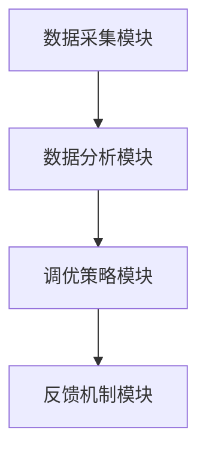

                 


# AI Agent性能监控与调优策略

## 关键词：AI Agent, 性能监控, 调优策略, 算法原理, 系统架构, 项目实战

## 摘要：本文系统地探讨了AI Agent的性能监控与调优策略，从基本概念到核心算法，从系统架构到项目实战，层层深入，旨在为AI Agent的优化提供全面的解决方案。

---

# 第1章: AI Agent性能监控与调优的背景与概念

## 1.1 AI Agent的基本概念

### 1.1.1 AI Agent的定义
AI Agent（人工智能代理）是指在特定环境中能够感知并自主行动以实现目标的智能体。它具备自主性、反应性、目标导向和社会能力等核心特点。

### 1.1.2 AI Agent的核心特点
- **自主性**：能够在无需外部干预的情况下执行任务。
- **反应性**：能够实时感知环境并做出响应。
- **目标导向**：所有行动均以实现特定目标为导向。
- **社会能力**：能够与其他Agent或人类进行交互协作。

### 1.1.3 AI Agent与传统AI的区别
传统AI注重数据处理和模式识别，而AI Agent更强调自主决策和环境交互能力。

## 1.2 AI Agent的发展背景

### 1.2.1 人工智能技术的演进
从专家系统到深度学习，AI技术的进步为AI Agent的发展奠定了基础。

### 1.2.2 AI Agent在企业中的应用前景
AI Agent在客服、物流、智能助手等领域的应用前景广阔。

### 1.2.3 当前AI Agent面临的挑战
包括计算资源限制、环境复杂性和数据隐私等问题。

## 1.3 本章小结
本章介绍了AI Agent的基本概念、发展背景及面临的挑战，为后续章节奠定了基础。

---

# 第2章: AI Agent性能监控的关键指标

## 2.1 性能监控的核心概念

### 2.1.1 响应时间
AI Agent完成任务所需的时间，是衡量其性能的重要指标。

### 2.1.2 资源利用率
AI Agent在运行过程中对计算资源的使用情况。

### 2.1.3 错误率
AI Agent在执行任务过程中出现错误的频率。

### 2.1.4 任务完成率
AI Agent完成任务的百分比，反映其效率。

## 2.2 性能监控的原理

### 2.2.1 数据采集
通过传感器或API接口实时采集AI Agent的运行数据。

### 2.2.2 数据分析
利用统计学方法或机器学习算法对数据进行分析，识别异常。

### 2.2.3 性能评估
基于分析结果，计算各项性能指标，并进行对比分析。

## 2.3 本章小结
本章详细阐述了AI Agent性能监控的关键指标及其监控原理。

---

# 第3章: AI Agent性能监控的算法原理

## 3.1 监控算法概述

### 3.1.1 基于统计的监控算法
如均值-标准差法，适用于简单场景的异常检测。

### 3.1.2 基于机器学习的监控算法
如孤立森林算法，适用于复杂场景的异常检测。

### 3.1.3 基于深度学习的监控算法
如LSTM网络，适用于时间序列数据的异常检测。

## 3.2 常见监控算法的实现原理

### 3.2.1 异常检测算法
使用Isolation Forest算法检测异常点。

### 3.2.2 时间序列分析算法
使用LSTM网络预测并检测异常。

### 3.2.3 分类与回归算法
使用随机森林回归模型预测性能指标。

## 3.3 本章小结
本章介绍了几种常用的监控算法及其原理，为后续的调优策略提供了理论基础。

---

# 第4章: AI Agent性能调优的策略与方法

## 4.1 调优策略概述

### 4.1.1 基于模型的调优
优化AI Agent的模型结构和参数。

### 4.1.2 基于资源的调优
合理分配计算资源，提高运行效率。

### 4.1.3 基于环境的调优
调整环境参数以适应AI Agent的需求。

## 4.2 常见调优方法

### 4.2.1 参数调整
如超参数优化，使用网格搜索或随机搜索方法。

### 4.2.2 模型优化
如模型压缩和知识蒸馏技术。

### 4.2.3 环境适应
如动态调整环境配置以提高性能。

## 4.3 本章小结
本章详细探讨了AI Agent性能调优的策略与方法，为实际应用提供了指导。

---

# 第5章: 系统架构设计

## 5.1 系统功能模块划分

### 5.1.1 数据采集模块
负责采集AI Agent的运行数据。

### 5.1.2 数据分析模块
对采集的数据进行处理和分析。

### 5.1.3 调优策略模块
根据分析结果制定调优策略。

### 5.1.4 反馈机制模块
将调优结果反馈给AI Agent。

## 5.2 系统架构图


## 5.3 本章小结
本章通过系统架构图展示了AI Agent性能监控与调优的整体框架。

---

# 第6章: 项目实战

## 6.1 环境安装与配置

### 6.1.1 开发环境搭建
使用Python 3.8及以上版本，安装必要的库如NumPy、Pandas、Scikit-learn等。

### 6.1.2 工具链安装
安装Jupyter Notebook、TensorFlow和Keras等工具。

### 6.1.3 数据集准备
收集AI Agent的运行数据，包括响应时间、资源利用率等。

## 6.2 核心代码实现

### 6.2.1 数据采集模块代码
```python
import time

def collect_data():
    data = []
    while True:
        # 模拟数据采集
        data.append({'time': time.time(), 'response_time': random.uniform(0.1, 1.0)})
        time.sleep(1)
    return data
```

### 6.2.2 数据分析模块代码
```python
from sklearn.ensemble import IsolationForest

def analyze_data(data):
    model = IsolationForest(random_state=42)
    model.fit([d['response_time'] for d in data])
    return model.predict(data)
```

## 6.3 案例分析
通过实际案例分析，展示如何利用上述代码实现性能监控和调优。

## 6.4 本章小结
本章通过实际项目展示了AI Agent性能监控与调优的具体实现过程。

---

# 第7章: 最佳实践与注意事项

## 7.1 小结
总结全文内容，强调关键点。

## 7.2 注意事项
- 定期检查系统性能，及时调整。
- 注意数据隐私和安全问题。
- 确保系统的可扩展性和可维护性。

## 7.3 拓展阅读
推荐相关书籍和资源，供进一步学习。

---

# 附录: 参考文献
列出本文中引用的文献和工具。

---

通过以上结构和内容安排，读者可以系统地了解AI Agent性能监控与调优的各个方面，并能够实际应用所学知识。

