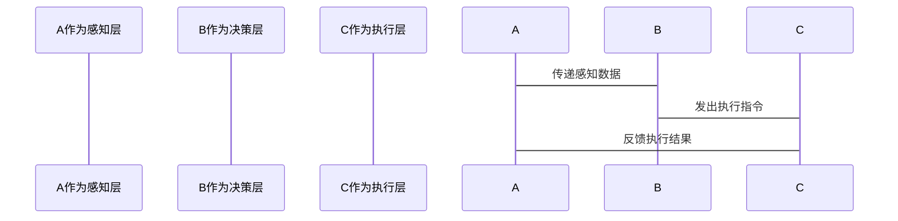

                 


# AI Agent技术未来发展趋势预测

## 关键词：AI Agent，人工智能，多智能体系统，强化学习，分布式系统，边缘计算，未来趋势

## 摘要：本文将全面探讨AI Agent技术的核心概念、技术原理、系统架构以及未来发展趋势。通过分析AI Agent在感知、决策、协作等方面的技术细节，结合实际案例，预测其在未来的发展方向和应用前景。

---

# 第1章: AI Agent技术背景与核心概念

## 1.1 AI Agent的基本概念

### 1.1.1 什么是AI Agent
AI Agent（人工智能代理）是指能够感知环境、自主决策并采取行动以实现目标的智能实体。它可以是一个软件程序、机器人或任何能够执行复杂任务的智能系统。

### 1.1.2 AI Agent的核心特征
- **自主性**：能够在没有外部干预的情况下自主运行。
- **反应性**：能够实时感知环境并做出反应。
- **主动性**：能够主动采取行动以实现目标。
- **社会性**：能够在多智能体系统中与其他Agent协作或竞争。

### 1.1.3 AI Agent与传统AI的区别
传统AI（如专家系统）依赖于规则和知识库，而AI Agent更注重动态环境中的自主决策和实时响应。

---

## 1.2 AI Agent的分类与应用场景

### 1.2.1 基于智能水平的分类
- **反应式Agent**：基于当前感知做出反应。
- **认知式Agent**：具备推理、规划等高级智能。
- **学习式Agent**：能够通过经验改进性能。

### 1.2.2 基于功能类型的分类
- **任务型Agent**：专注于完成特定任务。
- **服务型Agent**：提供持续的服务。
- **社交型Agent**：用于社交互动和协作。

### 1.2.3 典型应用场景分析
- **自动驾驶**：实时感知环境并做出驾驶决策。
- **智能助手**：如Siri、Alexa，提供语音交互服务。
- **机器人协作**：在工业自动化中实现多机器人协作。

---

## 1.3 AI Agent技术的演进历程

### 1.3.1 从规则驱动到学习驱动
早期的AI Agent依赖于预定义的规则，而现代AI Agent越来越多地采用机器学习和深度学习技术。

### 1.3.2 多智能体系统的兴起
随着分布式系统的普及，多智能体协作成为AI Agent发展的主要方向。

### 1.3.3 当前技术发展趋势
- **强化学习**：通过奖励机制优化决策。
- **边缘计算**：AI Agent在边缘设备上的部署。
- **人机协作**：AI Agent与人类协同工作的能力。

---

# 第2章: AI Agent的核心技术与原理

## 2.1 AI Agent的感知与决策机制

### 2.1.1 感知层的实现原理
AI Agent通过传感器或数据接口获取环境信息，并通过特征提取和数据融合技术进行处理。

### 2.1.2 决策层的算法选择
常用的决策算法包括：
- **强化学习**：通过试错优化策略。
- **Q-learning算法**：基于状态-动作价值函数的决策。
- **决策树**：通过树状结构进行决策。

### 2.1.3 执行层的实现方式
AI Agent通过执行器或API调用外部系统，实现具体的动作。

---

## 2.2 AI Agent的通信与协作

### 2.2.1 多智能体通信协议
- **异步通信**：通过消息队列实现。
- **同步通信**：通过 RPC 或 RESTful API 实现。

### 2.2.2 协作机制的设计
- **一致性协议**：如分布式一致性算法。
- **任务分配**：基于资源和能力分配任务。
- **冲突解决**：通过协商或仲裁机制解决冲突。

### 2.2.3 竞争与冲突解决
- **优先级机制**：根据任务优先级分配资源。
- **仲裁机制**：通过仲裁器解决冲突。

---

## 2.3 AI Agent的自我学习与进化

### 2.3.1 自我学习机制
- **在线学习**：实时更新模型参数。
- **迁移学习**：利用已有知识快速适应新任务。

### 2.3.2 知识表示与推理
- **知识图谱**：构建结构化的知识表示。
- **逻辑推理**：通过逻辑规则进行推理。

### 2.3.3 在线优化
- **强化学习**：通过奖励机制优化决策。
- **进化策略**：通过基因算法优化参数。

---

# 第3章: AI Agent的数学模型与算法原理

## 3.1 AI Agent的决策模型

### 3.1.1 Markov决策过程（MDP）
MDP是一个数学模型，描述智能体在一个状态空间中通过采取行动转移到新的状态，并获得奖励的过程。

### 3.1.2 Q-learning算法
Q-learning是一种强化学习算法，通过更新Q值函数来优化决策策略。

### 3.1.3 多智能体协作的数学建模
通过博弈论和分布式系统理论，构建多智能体协作的数学模型。

---

## 3.2 AI Agent的感知模型

### 3.2.1 传感器数据融合
通过加权融合和概率融合技术，提高感知的准确性。

### 3.2.2 深度学习在感知中的应用
使用卷积神经网络（CNN）进行图像识别，使用循环神经网络（RNN）进行时序数据处理。

### 3.2.3 概率图模型
构建贝叶斯网络，用于概率推理和不确定性处理。

---

## 3.3 AI Agent的优化算法

### 3.3.1 强化学习的数学公式
Q-learning的更新公式：
$$ Q(s,a) \leftarrow Q(s,a) + \alpha [r + \gamma \max Q(s',a') - Q(s,a)] $$

### 3.3.2 分布式优化算法
- **分布式梯度下降**：在分布式系统中进行参数优化。
- **联邦学习**：在边缘设备上进行联合优化。

### 3.3.3 稀疏性优化
通过Lasso回归等方法，减少模型的复杂度。

---

# 第4章: AI Agent的系统架构与设计

## 4.1 系统架构设计

### 4.1.1 分层架构
- **感知层**：负责数据采集和处理。
- **决策层**：负责策略选择和优化。
- **执行层**：负责动作执行。

### 4.1.2 微服务架构
- **服务化设计**：将功能模块化。
- **API接口**：通过API进行通信。

### 4.1.3 可扩展性设计
通过模块化设计和动态部署，提高系统的可扩展性。

---

## 4.2 系统功能设计

### 4.2.1 感知功能模块
- **数据采集**：通过传感器或API获取数据。
- **数据处理**：进行数据清洗和特征提取。

### 4.2.2 决策功能模块
- **策略选择**：基于当前状态选择最优策略。
- **策略优化**：通过强化学习优化策略。

### 4.2.3 执行功能模块
- **动作执行**：调用外部系统或API执行动作。
- **反馈收集**：收集执行结果并反馈给决策层。

---

## 4.3 系统接口设计

### 4.3.1 Agent间通信接口
- **消息队列**：如Kafka、RabbitMQ。
- **HTTP API**：如RESTful API。

### 4.3.2 与外部系统的交互接口
- **数据库接口**：如JDBC、ODBC。
- **第三方服务接口**：如API网关。

### 4.3.3 用户界面设计
- **命令行界面**：简洁但不够直观。
- **图形用户界面**：直观但开发复杂。

---

## 4.4 系统交互流程

### 4.4.1 交互流程图


---

# 第5章: AI Agent的项目实战与案例分析

## 5.1 项目环境搭建

### 5.1.1 开发工具选择
- **Python**：支持多种AI库。
- **PyTorch**：深度学习框架。
- **Kafka**：消息队列。

### 5.1.2 依赖库安装
- `pip install torch`
- `pip install kafka-python`

---

## 5.2 核心功能实现

### 5.2.1 感知模块代码实现
```python
import torch

class PerceptionModule(torch.nn.Module):
    def __init__(self):
        super(PerceptionModule, self).__init__()
        self.conv = torch.nn.Conv2d(in_channels=3, out_channels=6, kernel_size=3)

    def forward(self, x):
        return self.conv(x)
```

### 5.2.2 决策模块代码实现
```python
class DecisionModule:
    def __init__(self):
        self.model = torch.nn.Sequential(...)
        self.model.load_state_dict(torch.load('model.pth'))

    def decide(self, state):
        with torch.no_grad():
            return self.model(state)
```

### 5.2.3 通信模块代码实现
```python
from kafka import KafkaProducer

class Communicator:
    def __init__(self, bootstrap_servers):
        self.producer = KafkaProducer(bootstrap_servers=bootstrap_servers)

    def send_message(self, topic, message):
        self.producer.send(topic, value=message)
```

---

## 5.3 案例分析与优化

### 5.3.1 典型案例分析
- **自动驾驶**：实时感知和决策。
- **智能客服**：基于自然语言处理的对话系统。

### 5.3.2 性能优化策略
- **并行计算**：使用GPU加速计算。
- **模型压缩**：减少模型大小，提高推理速度。

### 5.3.3 可靠性优化方法
- **容错设计**：通过冗余设计提高可靠性。
- **自愈机制**：自动检测和修复故障。

---

# 第6章: AI Agent技术的未来发展趋势与挑战

## 6.1 技术发展趋势

### 6.1.1 强化学习的深入应用
强化学习将在复杂环境中发挥重要作用。

### 6.1.2 多智能体协作的普及
随着分布式系统的发展，多智能体协作将成为主流。

### 6.1.3 边缘计算的结合
AI Agent将更多地部署在边缘设备上，实现低延迟和高实时性。

---

## 6.2 技术挑战与解决方案

### 6.2.1 数据隐私问题
通过联邦学习和差分隐私技术解决数据隐私问题。

### 6.2.2 计算资源分配
通过分布式计算和资源调度算法优化计算资源。

### 6.2.3 系统安全性
通过加密技术和访问控制提高系统安全性。

---

## 总结

AI Agent技术正在快速发展，未来将在更多领域得到应用。随着技术的进步，AI Agent将更加智能、自主和协作。然而，我们也需要关注技术挑战，积极寻求解决方案，推动AI Agent技术的进一步发展。

---

## 附录

### 附录A: 相关技术术语解释
- **强化学习**：通过试错优化决策。
- **边缘计算**：在边缘设备上进行计算。

### 附录B: 参考文献
- Russell, S., & Norvig, P. (2010). Artificial Intelligence: A Modern Approach.

### 附录C: 索引
按字母顺序排列文章中出现的技术术语和主要概念。

---

通过以上目录和内容，您可以根据需要进一步扩展每个章节的内容，添加更多细节和技术深度。

