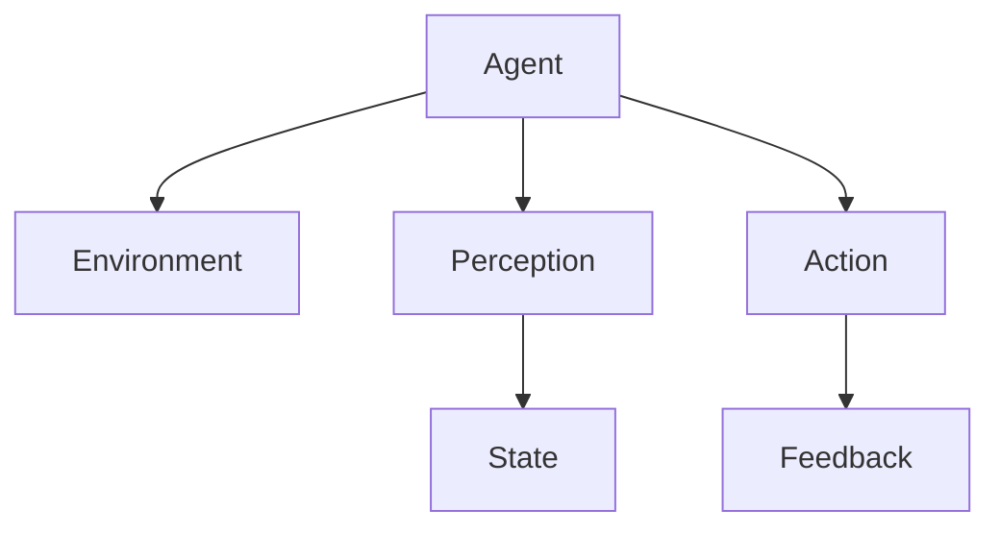
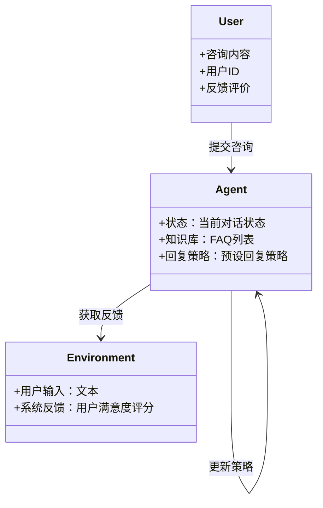
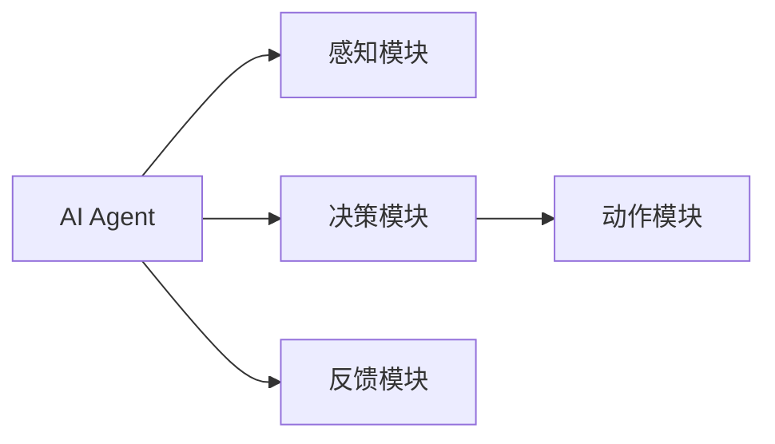
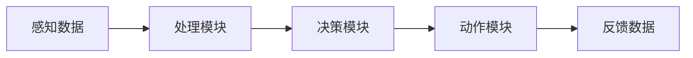
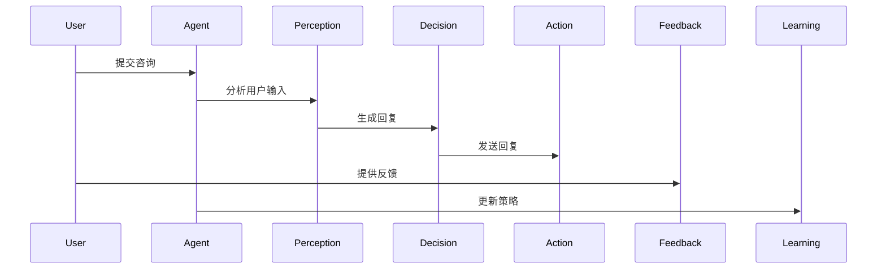

                 


# AI Agent架构设计：从概念到实现

> 关键词：AI Agent，架构设计，强化学习，系统架构，项目实战

> 摘要：本文详细探讨了AI Agent的架构设计，从基本概念到核心算法，再到系统实现和实际应用，逐步展开。通过ER图、类图、流程图等工具，结合数学公式和代码示例，系统地分析了AI Agent的设计原理和实现方法。

---

## 第一部分: AI Agent架构设计基础

### 第1章: AI Agent概述

#### 1.1 问题背景与概念

##### 1.1.1 问题背景
AI Agent是一种智能体，能够在复杂环境中自主感知、决策和行动。其核心目标是通过与环境交互，优化自身行为以实现预定目标。

##### 1.1.2 问题描述
AI Agent面临动态环境中的不确定性，需实时感知状态、选择行动，并根据反馈调整策略。

##### 1.1.3 问题解决
通过强化学习算法，AI Agent能够逐步优化其策略，提升决策的准确性和效率。

##### 1.1.4 边界与外延
AI Agent的边界包括感知范围、行动范围和决策范围。其外延扩展至分布式系统、多智能体协作等领域。

##### 1.1.5 概念结构与核心要素
AI Agent由感知、决策、行动和反馈四个核心要素组成，构成一个闭合的反馈循环。

#### 1.2 核心概念与联系

##### 1.2.1 AI Agent的核心原理
通过状态感知、目标设定、行动决策和执行反馈，AI Agent能够自主适应环境变化。

##### 1.2.2 核心概念对比
AI Agent与传统软件的区别在于其自主性、适应性和学习能力。与人类智能的类比帮助理解其决策机制。

##### 1.2.3 ER实体关系图


### 第2章: AI Agent的核心算法原理

#### 2.1 算法原理概述

##### 2.1.1 AI Agent的基本算法
- 状态空间搜索：通过广度优先搜索（BFS）或深度优先搜索（DFS）探索最优路径。
- 基于规则的决策：通过预定义规则进行简单决策。
- 基于模型的推理：利用模型预测未来状态，做出最优决策。

#### 2.2 基于强化学习的AI Agent

##### 2.2.1 强化学习的基本原理
通过与环境交互，AI Agent通过试错学习，逐步优化策略。

##### 2.2.2 Q-learning算法
- 状态-动作值函数：Q(s, a)表示在状态s下采取动作a的价值。
- 更新公式：
  $$ Q(s, a) = Q(s, a) + \alpha [r + \gamma \max Q(s', a') - Q(s, a)] $$

##### 2.2.3 Deep Q-Network (DQN)
- 使用神经网络近似Q值函数，解决高维状态空间问题。
- 网络结构：输入层、隐藏层、输出层。
- 损失函数：
  $$ \text{损失函数} = \mathbb{E}[(r + \gamma Q(s', \pi(s')) - Q(s, a))^2] $$

#### 2.3 算法实现的代码示例
```python
import numpy as np

class AI_Agent:
    def __init__(self, state_space, action_space):
        self.state_space = state_space
        self.action_space = action_space
        self.q_table = np.zeros((state_space, action_space))
        self.learning_rate = 0.1
        self.gamma = 0.9

    def choose_action(self, state):
        if np.random.random() < 0.9:
            return np.argmax(self.q_table[state, :])
        else:
            return np.random.randint(self.action_space)

    def learn(self, state, action, reward, next_state):
        target = reward + self.gamma * np.max(self.q_table[next_state, :])
        self.q_table[state, action] = self.q_table[state, action] + self.learning_rate * (target - self.q_table[state, action])

# 示例使用
agent = AI_Agent(5, 3)
agent.choose_action(0)
agent.learn(0, 1, 2, 2)
```

---

## 第二部分: 系统分析与架构设计

### 第3章: 系统分析

#### 3.1 问题场景介绍
在智能客服系统中，AI Agent需要根据用户输入生成合适回复，优化用户体验。

#### 3.2 项目介绍
设计一个基于强化学习的智能客服AI Agent，实现用户咨询的自动响应。

#### 3.3 系统功能设计
- 用户咨询处理：解析用户问题，生成回复。
- 状态管理：维护对话上下文，处理多轮对话。
- 反馈收集：根据用户反馈优化回复策略。

#### 3.4 领域模型


#### 3.5 系统架构设计


### 第4章: 系统架构设计

#### 4.1 系统架构设计


#### 4.2 数据流设计


#### 4.3 系统交互设计


---

## 第三部分: 项目实战与应用

### 第5章: 项目实战

#### 5.1 环境安装
- Python 3.8+
- Numpy、Tensorflow、Keras等库

#### 5.2 系统核心实现

##### 5.2.1 感知模块实现
```python
def perceive(input_text):
    # 文本处理逻辑
    return state
```

##### 5.2.2 决策模块实现
```python
def decide(state):
    # 决策逻辑
    return action
```

##### 5.2.3 动作模块实现
```python
def act(action):
    # 行动逻辑
    return response
```

#### 5.3 代码实现
```python
class Agent:
    def __init__(self):
        self.model = self.build_model()

    def build_model(self):
        # 构建神经网络模型
        return model

    def perceive(self, input):
        # 处理输入，返回状态
        return state

    def decide(self, state):
        # 决策动作
        return action

    def act(self, action):
        # 执行动作，返回结果
        return response

    def learn(self, state, action, reward, next_state):
        # 更新Q值
        self.model.fit([state, action], [reward], epochs=10)
```

#### 5.4 案例分析
通过模拟对话，展示AI Agent如何根据用户输入生成回复，并根据反馈优化策略。

### 第6章: 总结与展望

#### 6.1 最佳实践
- 确保数据质量
- 选择合适的算法
- 定期更新模型

#### 6.2 项目总结
总结项目实现过程中的经验和教训，分析系统性能和效果。

#### 6.3 注意事项
- 处理动态环境的不确定性
- 避免过拟合和欠拟合
- 保护用户隐私和数据安全

#### 6.4 拓展阅读
推荐相关书籍和论文，鼓励读者深入研究AI Agent技术。

---

通过以上结构，文章系统地从AI Agent的概念、算法、系统设计到项目实战进行了详细阐述，帮助读者全面理解AI Agent的架构设计与实现。

