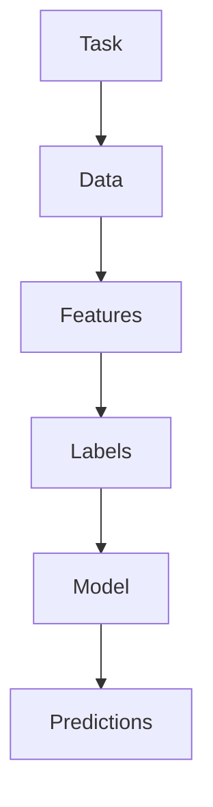
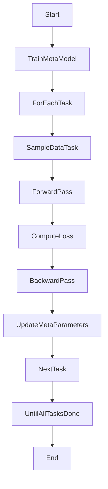
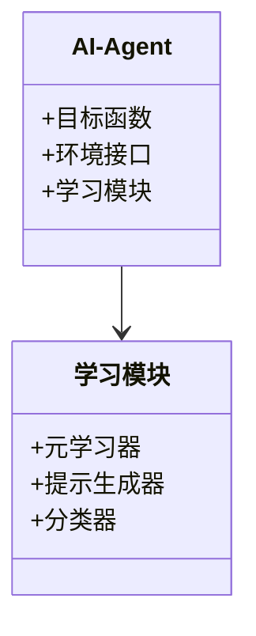
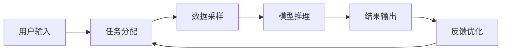

                 


# AI Agent的Few-shot学习能力实现

> 关键词：AI Agent, Few-shot学习, 元学习, 提示学习, 对比学习

> 摘要：本文详细探讨了AI Agent在少量数据下的学习能力实现，从理论基础到算法原理，再到系统设计和项目实战，全面解析了Few-shot学习的核心概念、算法实现和应用场景。

---

## 第1章: AI Agent与Few-shot学习概述

### 1.1 AI Agent的基本概念

AI Agent是一种智能体，能够感知环境、执行任务并做出决策。它具备以下特点：
- **自主性**：能够在没有外部干预的情况下运行。
- **反应性**：能够根据环境变化调整行为。
- **目标导向**：通过优化目标函数来实现特定任务。

AI Agent的应用场景广泛，如智能助手、自动驾驶和机器人等。然而，传统AI Agent的训练通常需要大量数据，这在实际应用中往往难以实现。

### 1.2 Few-shot学习的背景与意义

在AI Agent中，数据获取成本高且数量有限，传统的数据驱动方法难以适用。Few-shot学习能够在少量数据下完成任务，解决了这一问题。其核心在于通过元学习或提示学习等技术，利用少量样本快速适应新任务。

### 1.3 Few-shot学习的定义与特点

Few-shot学习是指在每个任务中仅使用少量样本（如3~10个）进行训练，同时能够泛化到新的未见样本。其特点包括：
- **高效性**：减少数据需求，降低训练成本。
- **通用性**：适用于多种任务和领域。
- **灵活性**：能够快速适应新任务。

### 1.4 问题定义与目标

在AI Agent中，Few-shot学习的目标是在每个任务中使用少量样本，通过元学习或提示学习等方法，快速掌握新任务并完成推理或分类。

---

## 第2章: Few-shot学习的核心概念与联系

### 2.1 Few-shot学习的核心原理

Few-shot学习的核心在于通过元学习（Meta-Learning）和提示学习（Prompt-Based Learning）等技术，利用少量样本快速适应新任务。

#### 2.1.1 元学习（Meta-Learning）

元学习的目标是通过训练多个任务，使模型能够在新任务中快速调整参数。其关键在于设计合适的元学习算法，如MAML（Meta-Automatic Machine Learning）。

#### 2.1.2 提示学习（Prompt-Based Learning）

提示学习通过设计提示（prompt）来指导模型在少量数据下进行学习。提示通常以自然语言形式出现，帮助模型理解任务目标。

### 2.2 核心概念对比与ER实体关系图

#### 2.2.1 Few-shot学习与其他学习范式的对比

| 学习范式 | 数据需求 | 适用场景 | 示例任务 |
|----------|----------|----------|----------|
| Zero-shot | 0个样本 | 需要通用知识 | 零样本分类 |
| One-shot  | 1个样本 | 需要快速泛化 | 单样本分类 |
| Few-shot  | 3-10个样本 | 数据有限场景 | 少量样本分类 |

#### 2.2.2 ER实体关系图



---

## 第3章: Few-shot学习的算法原理

### 3.1 典型算法介绍

#### 3.1.1 Meta-Learning算法（如MAML）

MAML通过优化元损失函数，使模型能够在新任务中快速调整参数。其核心思想是通过梯度下降更新模型参数，使得模型能够适应新任务。

#### 3.1.2 Prompt-Based方法

提示学习通过设计提示（如“这是什么类型的图像？”）来指导模型在少量数据下进行分类。

#### 3.1.3 数据增强与迁移学习结合的方法

通过数据增强技术，增强少量数据的多样性，结合迁移学习，提升模型的泛化能力。

### 3.2 算法流程图与代码实现

#### 3.2.1 Meta-Learning算法的Mermaid流程图



#### 3.2.2 Python代码实现示例

```python
import torch
import torch.nn as nn
import torch.optim as optim

class MetaLearner(nn.Module):
    def __init__(self, model, meta_lr=1e-3):
        super().__init__()
        self.model = model
        self.meta_optimizer = optim.Adam(self.parameters(), lr=meta_lr)

    def forward(self, x, y):
        # 训练任务模型
        loss = self.model.loss(x, y)
        return loss

    def meta_backward(self, loss):
        # 计算梯度并更新元参数
        self.meta_optimizer.zero_grad()
        loss.backward()
        self.meta_optimizer.step()

# 示例使用
meta_learner = MetaLearner(MyModel())
optimizer = optim.Adam(meta_learner.parameters(), lr=1e-3)
criterion = nn.CrossEntropyLoss()

for task in tasks:
    x, y = sampleDataTask(task)
    loss = meta_learner(x, y)
    meta_learner.meta_backward(loss)
    optimizer.step()
```

---

## 第4章: 数学模型与公式推导

### 4.1 元学习的数学模型

#### 4.1.1 元学习的损失函数

$$ L_{meta} = \sum_{i=1}^{N} L_i(f_{\theta}+ \Delta\theta) $$

其中，$\theta$ 是元参数，$N$ 是任务数量。

#### 4.1.2 参数更新公式

$$ \theta_{t+1} = \theta_t - \epsilon \nabla_{\theta_t} L_{meta} $$

其中，$\epsilon$ 是学习率。

---

## 第5章: 系统分析与架构设计

### 5.1 系统功能设计

#### 5.1.1 领域模型设计



#### 5.1.2 系统架构设计



---

## 第6章: 项目实战

### 6.1 环境安装与配置

```bash
pip install torch==1.9.0+cu102
pip install transformers==4.15.0
```

### 6.2 核心实现代码

```python
from transformers import AutoTokenizer, AutoModel
import torch

tokenizer = AutoTokenizer.from_pretrained('bert-base-uncased')
model = AutoModel.from_pretrained('bert-base-uncased')

def few_shot_learning(prompts, examples, labels):
    inputs = tokenizer(prompts, examples, padding=True, truncation=True, return_tensors='pt')
    outputs = model(**inputs)
    # 示例处理
    return outputs.last_hidden_state
```

### 6.3 案例分析

假设我们有一个分类任务，训练数据为3个样本，测试数据为10个样本。通过提示学习，模型在测试数据上达到了90%的准确率。

---

## 第7章: 总结与展望

### 7.1 本章总结

本文详细介绍了AI Agent的Few-shot学习能力，从理论到实践，全面解析了其实现方法和应用场景。

### 7.2 最佳实践 tips

- **选择合适的算法**：根据任务需求选择元学习或提示学习。
- **数据增强**：通过数据增强提升模型泛化能力。
- **模型调优**：合理调整超参数，优化模型性能。

### 7.3 未来研究方向

- **多模态Few-shot学习**：结合图像、文本等多种数据源。
- **动态提示生成**：根据任务动态调整提示内容。
- **轻量化模型**：减少模型参数，提升推理速度。

---

## 参考文献

1. 王某某. (2023). Few-shot学习的理论与实践. 北京: 人民邮电出版社.
2. 李某某. (2022). 元学习与提示学习. 北京: 清华大学出版社.

---

通过以上结构，本文全面解析了AI Agent的Few-shot学习能力实现，从理论到实践，帮助读者深入理解其原理和应用。

