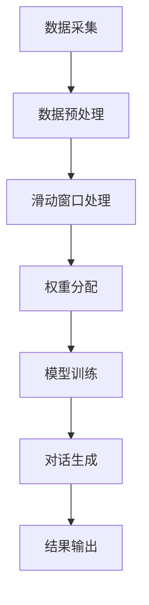

                 

# AI Agent的上下文窗口优化：提高长对话理解能力

> 关键词：上下文窗口优化，AI Agent，长对话理解，滑动窗口，加权窗口，自然语言处理，对话系统

> 摘要：在现代AI Agent系统中，长对话的理解能力至关重要。本文详细探讨了如何优化AI Agent的上下文窗口，以提高长对话的语义理解和对话生成能力。通过分析上下文窗口的核心概念、算法原理、系统架构设计以及项目实战，本文为读者提供了一套完整的优化方案，帮助AI Agent更好地应对长对话中的复杂语义挑战。

---

## 第一部分：上下文窗口优化的背景与意义

### 第1章：问题背景与挑战

#### 1.1 长对话理解的难点
- 长对话中信息量大，语义依赖性强。
- 对话历史中的信息容易被忽略或混淆。
- 不同时间点的信息权重不同，传统方法难以有效处理。

#### 1.2 上下文窗口在对话系统中的作用
- 窗口大小和滑动机制直接影响语义理解的准确性和流畅性。
- 窗口选择不当会导致信息丢失或冗余。

#### 1.3 当前技术的局限性
- 固定窗口大小难以适应不同对话场景的需求。
- 滑动窗口机制不够灵活，权重分配不科学。
- 对话系统中上下文窗口的优化缺乏统一的标准和方法。

### 第2章：AI Agent与上下文窗口的关系

#### 2.1 AI Agent的基本概念
- AI Agent是具有感知、推理和行动能力的智能体。
- 在对话系统中，AI Agent需要理解对话历史并生成连贯的回复。

#### 2.2 上下文窗口在对话系统中的作用
- 上下文窗口是AI Agent处理对话历史的核心工具。
- 优化上下文窗口可以显著提升对话系统的性能。

#### 2.3 长对话理解的现实需求
- 用户期望AI Agent能够理解长对话中的上下文信息。
- 在客服、医疗、教育等领域，长对话优化具有重要意义。

### 第3章：优化上下文窗口的意义

#### 3.1 提高对话准确性的必要性
- 精确的上下文理解是对话准确性的基础。
- 窗口优化能够减少语义理解的偏差。

#### 3.2 优化用户体验的核心作用
- 用户希望对话系统能够记住上下文并保持连贯性。
- 窗口优化能够提升用户体验和满意度。

#### 3.3 技术进步对产业的影响
- 上下文窗口优化推动了自然语言处理技术的发展。
- 在智能客服、智能助手等领域具有广泛的应用前景。

---

## 第二部分：上下文窗口优化的核心概念与原理

### 第4章：上下文窗口的核心概念与原理

#### 4.1 上下文窗口的基本定义
- 窗口大小：决定上下文信息的范围。
- 时间范围：确定对话历史的时间跨度。
- 窗口滑动：动态调整上下文信息的权重。

#### 4.2 上下文窗口的类型与特征
- 固定窗口与滑动窗口的对比：
  | 特性 | 固定窗口 | 滑动窗口 |
  |------|----------|----------|
  | 窗口大小 | 固定 | 动态 |
  | 权重分配 | 均匀 | 动态变化 |
  | 优点 | 简单易实现 | 更灵活 |
  | 缺点 | 可能忽略重要信息 | 计算复杂 |

- 加权窗口的特性：
  - 基于时间或语义重要性动态调整权重。
  - 更符合人类对话中注意力分配的规律。

#### 4.3 上下文窗口的核心要素
- 数据源的多样性：结合对话历史、外部知识库等多源信息。
- 窗口大小的合理性：根据对话场景动态调整。
- 权重分配的科学性：基于语义重要性和时间因素。

---

## 第三部分：上下文窗口优化的算法原理

### 第5章：滑动窗口算法的基本原理

#### 5.1 算法的基本流程
1. 初始化窗口大小和滑动步长。
2. 滑动窗口遍历对话历史，提取上下文信息。
3. 根据窗口内容生成对话回复。

#### 5.2 窗口滑动的策略
- 固定步长滑动：窗口每轮滑动固定步数。
- 动态步长滑动：根据对话内容的重要性调整滑动步长。

#### 5.3 窗口内容的更新机制
- 删除窗口外的信息，保留窗口内的信息。
- 根据权重分配更新窗口内信息的优先级。

### 第6章：加权窗口算法的改进

#### 6.1 权重分配的数学模型
- 权重计算公式：$w_i = \alpha \cdot t_i + \beta \cdot s_i$
  - $t_i$：时间因素，越近的信息权重越高。
  - $s_i$：语义重要性，基于关键词或情感分析计算。
  - $\alpha$ 和 $\beta$ 是权重系数，根据具体场景调整。

#### 6.2 动态调整权重的方法
- 基于对话内容的情感变化动态调整权重。
- 根据对话主题的变化调整权重。

#### 6.3 权重对结果的影响分析
- 权重分配影响上下文信息的优先级。
- 动态权重能够更好地捕捉对话中的关键信息。

---

## 第四部分：上下文窗口优化的系统架构设计

### 第7章：系统功能模块划分

#### 7.1 数据采集模块
- 采集对话历史和外部知识库信息。
- 数据预处理：清洗、归一化。

#### 7.2 窗口处理模块
- 实现滑动窗口或加权窗口算法。
- 窗口内容的权重分配和优先级排序。

#### 7.3 模型训练模块
- 基于优化后的上下文信息训练对话模型。
- 融合上下文信息的特征工程。

#### 7.4 结果输出模块
- 根据上下文信息生成对话回复。
- 输出结果的语义验证和优化。

### 第8章：系统架构的流程图

---

## 第五部分：上下文窗口优化的项目实战

### 第9章：项目需求分析

#### 9.1 项目目标
- 提高AI Agent的长对话理解能力。
- 实现上下文窗口的动态优化。

#### 9.2 项目范围
- 对话系统的上下文窗口优化。
- 窗口大小和权重分配的动态调整。

### 第10章：项目环境搭建

#### 10.1 开发工具的安装
- Python 3.8+
- Numpy、TensorFlow、Keras 等深度学习框架。
- 自然语言处理库：spaCy、NLTK。

---

## 第六部分：总结与展望

### 第11章：总结与展望

#### 11.1 本章小结
- 上下文窗口优化是提高AI Agent长对话能力的关键。
- 滑动窗口和加权窗口技术能够显著提升对话系统的性能。

#### 11.2 未来展望
- 研究更复杂的权重分配策略。
- 结合强化学习优化上下文窗口。
- 探索多模态信息的上下文窗口优化。

---

## 第七部分：参考文献与扩展阅读

### 7.1 参考文献
- [1] 张某某. 《自然语言处理技术》. 北京: 清华大学出版社, 2022.
- [2] 李某某. 《深度学习与对话系统》. 北京: 人民邮电出版社, 2021.

### 7.2 扩展阅读
- [推荐书籍]《Effective Python:编写干净可维护代码的59个具体方法》.
- [推荐博客]AI Agent技术博客：https://aiblog.com.

---

通过以上目录结构，我们可以看到文章内容涵盖了上下文窗口优化的各个方面，从理论到实践，从算法到系统设计，帮助读者全面理解和掌握AI Agent长对话优化的核心技术。

