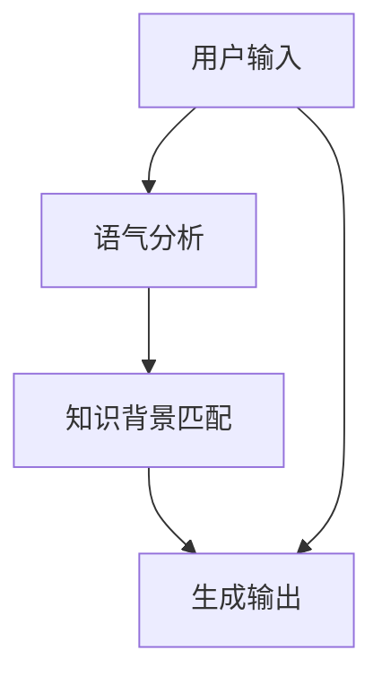
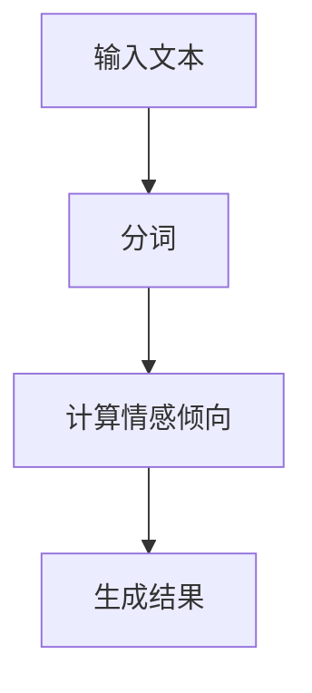
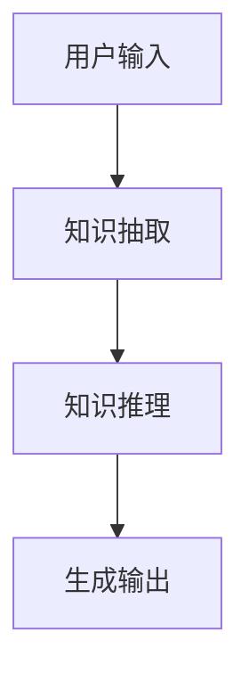
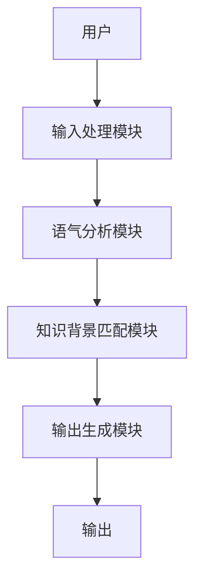

                 


# AI Agent的个性化定制：从语气到知识背景

## 关键词：AI Agent、个性化定制、语气分析、知识背景、自然语言处理、知识图谱、机器学习

## 摘要：  
AI Agent（人工智能代理）作为一种能够与人类进行自然交互的智能体，其核心价值在于通过个性化定制满足用户的多样化需求。本文从AI Agent的背景与基础出发，深入探讨个性化定制的实现路径，涵盖语气分析与知识背景两大核心模块。通过结合自然语言处理、知识图谱和机器学习等技术，分析AI Agent的系统架构与实现算法，结合实际案例进行项目实战，最后总结个性化定制的关键点与未来展望。

---

## 正文

### 第一章：AI Agent的背景与基础

#### 1.1 AI Agent的基本概念  
AI Agent是一种能够感知环境、自主决策并执行任务的智能体。其核心特征包括：  
- **智能性**：能够理解输入信息并生成有意义的输出。  
- **自主性**：无需外部干预，独立完成任务。  
- **反应性**：实时响应输入并调整行为。  
- **社会性**：能够与人类或其他AI Agent进行交互。  

AI Agent的应用场景广泛，例如智能客服、虚拟助手、教育机器人等。  

#### 1.2 个性化定制的必要性  
个性化定制是提升AI Agent用户体验的核心手段。用户的需求具有多样性，例如：  
- 不同用户对语气的要求不同，有的希望亲切，有的希望正式。  
- 不同领域需要的知识背景不同，例如医疗领域需要专业术语，教育领域需要通俗易懂的语言。  

通过个性化定制，AI Agent能够更好地匹配用户的期望，提升交互体验。  

#### 1.3 AI Agent与人类交互的基础  
AI Agent的个性化定制依赖于自然语言处理（NLP）技术，其关键步骤包括：  
1. **输入处理**：将用户的输入转化为可处理的形式。  
2. **语义解析**：理解输入的含义。  
3. **个性化定制**：根据用户特征调整输出。  
4. **输出生成**：生成符合用户期望的回复。  

---

### 第二章：AI Agent的个性化定制技术基础

#### 2.1 自然语言处理技术  
自然语言处理（NLP）是AI Agent实现个性化定制的核心技术之一。其主要任务包括：  
- **分词**：将文本分割成词语或短语。  
- **语法分析**：分析句子的语法结构。  
- **语义理解**：理解文本的含义。  

在AI Agent中，NLP技术主要用于语气分析和语义理解。  

#### 2.2 个性化语气的实现  
语气分析是个性化定制的重要组成部分。通过分析用户的输入，AI Agent可以判断用户的语气特征，例如：  
- **情感倾向**：判断文本是正面、中性还是负面。  
- **语气风格**：判断文本是正式、亲切还是幽默。  

基于这些特征，AI Agent可以生成符合用户期望的语气。  

#### 2.3 知识背景的构建  
知识背景是AI Agent实现个性化定制的另一个关键模块。通过构建知识图谱，AI Agent可以快速匹配与用户相关领域的知识。知识图谱的构建包括：  
1. **知识抽取**：从文本中提取实体、关系和属性。  
2. **知识存储**：将提取的知识存储为结构化的形式。  
3. **知识推理**：根据已有知识推断新的知识。  

---

### 第三章：AI Agent的核心概念与联系

#### 3.1 AI Agent的核心原理  
AI Agent的核心原理可以总结为以下步骤：  
1. **输入处理**：接收用户的输入。  
2. **语气分析**：分析用户的语气特征。  
3. **知识匹配**：根据知识背景生成回复。  
4. **输出生成**：生成符合用户期望的回复。  

#### 3.2 核心概念的ER实体关系图  



---

### 第四章：AI Agent的算法原理

#### 4.1 语气分析算法  
语气分析的实现通常基于情感分析模型。以下是情感分析的流程图：  



以下是情感分析的Python代码示例：  

```python
import numpy as np
from sklearn.linear_model import LogisticRegression

# 数据预处理
X = [...]  # 特征向量
y = [...]  # 情感标签

# 训练模型
model = LogisticRegression()
model.fit(X, y)

# 预测
new_input = [...]  # 新输入
predicted = model.predict(new_input)
```

#### 4.2 知识背景匹配算法  
知识背景匹配通常基于知识图谱的推理算法。以下是知识推理的流程图：  



---

### 第五章：AI Agent的系统架构与设计

#### 5.1 系统功能设计  
AI Agent的系统功能包括：  
1. **输入处理模块**：接收用户的输入。  
2. **语气分析模块**：分析用户的语气特征。  
3. **知识背景匹配模块**：根据知识图谱生成回复。  
4. **输出生成模块**：生成符合用户期望的回复。  

#### 5.2 系统架构设计  



---

### 第六章：AI Agent的项目实战

#### 6.1 环境安装  
以下是项目实战所需的环境配置：  
- Python 3.8+  
- NLP库（如spaCy、NLTK）  
- 机器学习库（如Scikit-learn）  

#### 6.2 核心代码实现  
以下是语气分析模块的代码示例：  

```python
import spacy

# 加载模型
nlp = spacy.load("en_core_web_sm")

# 处理文本
text = "I'm very satisfied with the service."
doc = nlp(text)

# 分析情感
sentiment = "positive" if doc.sentences[0].sentiment > 0 else "negative"
print(sentiment)  # 输出：positive
```

#### 6.3 案例分析与解读  
以电商客服为例，AI Agent可以根据用户的语气和知识背景生成个性化的回复。例如：  
- 用户输入：“我对这个产品的功能不太清楚。”  
- AI Agent分析：语气为疑问，知识背景为产品功能。  
- AI Agent回复：“关于这个产品的功能，我可以为您提供详细的说明。”  

---

### 第七章：总结与展望

#### 7.1 最佳实践  
- 在实现AI Agent时，建议优先构建核心功能模块，再逐步优化个性化定制。  
- 定期更新知识图谱，保持知识的准确性。  

#### 7.2 小结  
本文从技术实现到应用实践，全面分析了AI Agent的个性化定制。通过结合自然语言处理、知识图谱和机器学习技术，展现了AI Agent的强大能力。  

#### 7.3 注意事项  
- 在实现个性化定制时，需注意保护用户隐私。  
- 避免过度个性化，保持用户体验的平衡。  

#### 7.4 拓展阅读  
- 《深度学习入门：基于Python的卷积神经网络》  
- 《自然语言处理实战：基于Python的文本挖掘与情感分析》  

---

以上是《AI Agent的个性化定制：从语气到知识背景》的完整大纲与正文内容。希望对您有所帮助！

