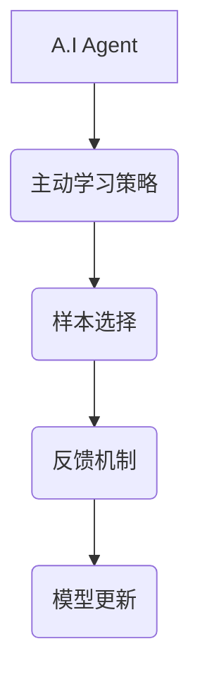
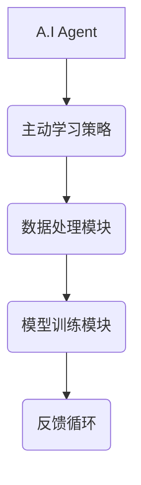
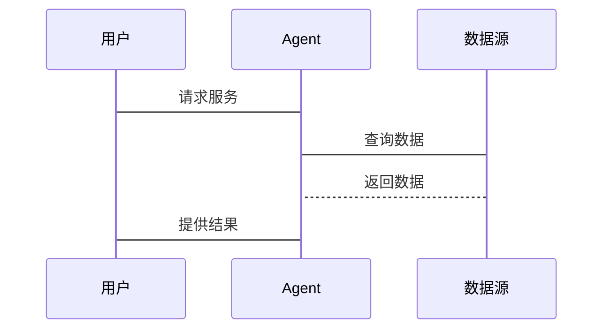

                 


# AI Agent的主动学习策略

> 关键词：AI Agent, 主动学习, 算法实现, 系统架构, 项目实战

> 摘要：本文深入探讨AI Agent在主动学习策略中的应用，从基本概念到算法实现，再到系统设计和项目实战，全面解析主动学习在AI Agent中的重要性及其实际应用。

---

# 第1章: AI Agent与主动学习概述

## 1.1 AI Agent的基本概念

### 1.1.1 AI Agent的定义与分类

AI Agent（人工智能代理）是指能够感知环境、自主决策并采取行动以实现目标的智能实体。根据功能和应用场景，AI Agent可以分为以下几类：

1. **反应式Agent**：基于当前感知做出反应，适用于简单环境。
2. **认知式Agent**：具备推理、规划和学习能力，适用于复杂环境。
3. **协作式Agent**：能够与其他Agent或人类协作完成任务。

### 1.1.2 主动学习的基本概念

主动学习是一种机器学习范式，通过主动选择最有益的数据样本进行学习，以提高模型性能。其核心在于让模型“主动”选择需要标注的数据，而非被动接受数据。

### 1.1.3 AI Agent与主动学习的结合

AI Agent可以通过主动学习策略，根据当前任务需求和环境信息，动态选择最优数据进行学习，从而提升其智能性和适应性。

---

## 1.2 主动学习的背景与问题背景

### 1.2.1 数据驱动学习的局限性

传统监督学习依赖大量标注数据，但在实际应用中，标注数据获取成本高、耗时长，尤其是在处理复杂任务时，数据需求量大且难以获取。

### 1.2.2 主动学习的核心问题描述

主动学习的核心问题是：如何选择最具代表性的样本，以最小化标注数据量，最大化模型性能。其关键在于设计有效的样本选择策略和反馈机制。

### 1.2.3 主动学习在AI Agent中的应用价值

通过主动学习，AI Agent能够根据任务需求动态优化学习过程，减少对大量标注数据的依赖，提升学习效率和效果。

---

## 1.3 主动学习的核心概念与联系

### 1.3.1 主动学习的原理与核心要素

主动学习的原理是通过迭代地选择最有益的样本，逐步优化模型性能。其核心要素包括：

- **样本选择策略**：选择最具代表性的样本。
- **样本查询策略**：确定何时选择新样本。
- **反馈机制**：利用标注数据优化模型。

### 1.3.2 主动学习与监督学习的对比

| 对比维度 | 主动学习 | 监督学习 |
|----------|----------|----------|
| 数据标注 | 部分标注 | 全部标注 |
| 数据量需求 | 较小 | 较大 |
| 算法复杂度 | 较高 | 较低 |

### 1.3.3 主动学习的ER实体关系图



---

# 第2章: 主动学习的核心原理与算法

## 2.1 主动学习的原理

### 2.1.1 样本选择策略

样本选择策略是主动学习的关键，常用的策略包括：

- **不确定性选择**：选择模型预测概率最低的样本。
- **密度选择**：选择密度较低的区域样本。
- **多样性选择**：选择覆盖不同区域的样本。

### 2.1.2 样本查询策略

样本查询策略决定了何时选择新样本，常用的策略包括：

- **贪心策略**：每次选择当前最优的样本。
- **批量选择策略**：一次性选择多个样本。

### 2.1.3 反馈机制

反馈机制通过用户标注数据优化模型，常用的反馈机制包括：

- **主动查询**：模型主动请求标注。
- **半监督学习**：结合标注和未标注数据。

---

## 2.2 主动学习的算法实现

### 2.2.1 基于不确定性度量的主动学习算法

不确定性度量公式：
$$ \text{Uncertainty}(x) = 1 - \max(P(y|x)) $$

实现步骤：

1. 初始化模型和未标注数据集。
2. 计算每个样本的不确定性。
3. 选择不确定性最高的样本。
4. 标注选中的样本并训练模型。
5. 重复步骤2-4直到满足条件。

### 2.2.2 基于密度的主动学习算法

密度估计公式：
$$ P(x) = \frac{1}{(2\pi)^{n/2}\sigma^n} \sum_{i=1}^{n} \exp\left(-\frac{(x_i - x)^2}{2\sigma^2}\right) $$

实现步骤：

1. 计算样本密度。
2. 选择密度最低的样本。
3. 标注选中的样本并训练模型。

### 2.2.3 基于多样性度量的主动学习算法

多样性度量公式：
$$ D(x, y) = 1 - \frac{P(x, y)}{\max(P(x), P(y))} $$

实现步骤：

1. 计算样本间的多样性。
2. 选择多样性最高的样本。

---

## 2.3 主动学习的数学模型

### 2.3.1 不确定性度量公式

$$ \text{Uncertainty}(x) = 1 - \max(P(y|x)) $$

### 2.3.2 期望值的计算公式

$$ E[X] = \sum_{x} P(x) \cdot x $$

---

# 第3章: 主动学习的系统分析与架构设计

## 3.1 系统分析

### 3.1.1 问题场景介绍

以智能客服为例，AI Agent需要通过主动学习策略优化FAQ推荐系统。

### 3.1.2 系统功能需求

- 自动标注FAQ。
- 动态优化推荐结果。
- 提供用户反馈接口。

### 3.1.3 系统性能指标

- 推荐准确率 ≥ 90%。
- 响应时间 ≤ 1秒。

---

## 3.2 系统架构设计

### 3.2.1 系统架构图（Mermaid）



---

## 3.3 系统接口设计

### 3.3.1 接口定义

- `select_samples()`: 选择需要标注的样本。
- `train_model()`: 训练模型。
- `update_model()`: 更新模型。

### 3.3.2 接口交互流程

1. AI Agent调用`select_samples()`选择样本。
2. 数据处理模块返回选中的样本。
3. AI Agent调用`train_model()`训练模型。
4. 模型训练模块返回训练结果。
5. AI Agent调用`update_model()`更新模型。

---

## 3.4 系统交互流程图（Mermaid）



---

# 第4章: 项目实战——基于主动学习的智能客服FAQ推荐系统

## 4.1 环境安装

```bash
pip install scikit-learn
pip install matplotlib
```

---

## 4.2 系统核心实现源代码

```python
import numpy as np
from sklearn.metrics import accuracy_score
from sklearn.neighbors import KNeighborsClassifier

def uncertainty_sampling(X, y, model, num_samples=10):
    # 计算概率
    probs = model.predict_proba(X)
    # 计算不确定性
    uncertainties = [1 - max(p) for p in probs]
    # 选择不确定性最高的样本
    selected_indices = np.argsort(-np.array(uncertainties))[:num_samples]
    # 标注选中的样本
    selected_X = X[selected_indices]
    selected_y = y[selected_indices]
    return selected_X, selected_y

# 初始化数据集
X_train = ...
y_train = ...
X_test = ...
y_test = ...

# 初始化模型
model = KNeighborsClassifier()

# 训练初始模型
model.fit(X_train, y_train)

# 主动学习循环
for _ in range(10):
    # 选择样本
    selected_X, selected_y = uncertainty_sampling(X=X_test, y=y_test, model=model)
    # 标注样本
    # 假设selected_X和selected_y是标注后的数据
    X_train = np.concatenate([X_train, selected_X])
    y_train = np.concatenate([y_train, selected_y])
    # 重新训练模型
    model.fit(X_train, y_train)

# 测试模型
print("Accuracy:", accuracy_score(y_test, model.predict(X_test)))
```

---

## 4.3 项目小结

通过主动学习策略，AI Agent能够显著提高学习效率和推荐系统的准确率。本文通过智能客服FAQ推荐系统的案例，详细讲解了主动学习的实现过程和实际应用效果。

---

# 总结与展望

本文全面探讨了AI Agent的主动学习策略，从理论到实践，深入分析了其核心原理和系统设计。未来，随着AI技术的不断发展，主动学习将在更多领域发挥重要作用。

---

# 最佳实践 Tips

- 在实际应用中，结合主动学习与其他学习策略（如强化学习）可以进一步提升模型性能。
- 定期更新模型和优化反馈机制，能够确保AI Agent的长期有效性和适应性。

--- 

# 注意事项

- 主动学习的样本选择策略需要根据具体任务进行调整。
- 反馈机制的设计直接影响模型优化效果，需谨慎设计。

---

# 拓展阅读

- [《主动学习: 理论与算法》](https://example.com)
- [《AI Agent设计与实现》](https://example.com)

--- 

如果需要进一步讨论或代码细节，请随时联系！

