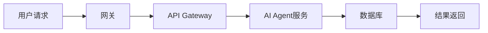

                 


# AI Agent的云端部署与管理

---

## 关键词：
- AI Agent
- 云端部署
- 算法原理
- 系统架构
- 项目实战

---

## 摘要：
本文详细探讨了AI Agent在云端部署与管理的核心技术与实践。从AI Agent的基本概念、算法原理到系统架构设计，再到实际项目的部署与优化，全面分析了AI Agent在云端环境中的实现细节与管理策略。文章结合理论与实践，通过具体案例和系统设计，为读者提供了从理论到实践的完整指导。

---

# 第一章: AI Agent的背景与概念

## 1.1 AI Agent的基本概念
- 1.1.1 AI Agent的定义
  - AI Agent是一种能够感知环境、自主决策并执行任务的智能体。
  - 典型场景：自动驾驶、智能客服、推荐系统。
- 1.1.2 AI Agent的核心特征
  - 自主性：无需人工干预，自动完成任务。
  - 反应性：实时感知环境变化并做出响应。
  - 社会性：与其他系统或用户进行交互协作。

## 1.2 云端部署的意义
- 1.2.1 资源共享与弹性扩展
  - 云端计算资源按需分配，避免本地部署的资源浪费。
  - 通过弹性伸缩应对流量高峰。
- 1.2.2 高可用性与容错性
  - 通过冗余部署确保服务不中断。
  - 利用容器化技术实现快速恢复。
- 1.2.3 成本优化
  - 按需付费模式降低初始投入。
  - 利用云服务提供的高级功能（如AI模型推理服务）节省开发成本。

## 1.3 当前AI Agent技术的现状与趋势
- 1.3.1 现状分析
  - AI Agent在电商、金融、医疗等领域的广泛应用。
  - 云端部署成为主流趋势，尤其是基于深度学习的AI Agent。
- 1.3.2 未来趋势
  - 更加智能化：结合强化学习和自适应算法。
  - 更加高效化：通过模型压缩和推理优化提升性能。
  - 更加安全化：数据隐私保护和模型鲁棒性优化。

---

# 第二章: AI Agent的核心技术与原理

## 2.1 AI Agent的核心模块
- 2.1.1 感知模块
  - 输入数据处理：如文本、图像、语音等。
  - 示例：自然语言处理中的分词、实体识别。
- 2.1.2 决策模块
  - 基于感知结果做出决策。
  - 示例：推荐系统中的物品推荐策略。
- 2.1.3 执行模块
  - 执行决策并返回结果。
  - 示例：调用API完成订单处理。

## 2.2 AI Agent的工作流程
### 2.2.1 感知环境
- 通过传感器或API获取环境数据。
- 示例：智能音箱通过语音助手感知用户需求。

### 2.2.2 制定决策
- 使用算法对感知结果进行处理。
- 示例：基于强化学习的最优路径选择。

### 2.2.3 执行操作
- 根据决策结果执行操作。
- 示例：智能客服系统自动回复用户问题。

## 2.3 AI Agent的分类与应用场景
### 2.3.1 基于规则的AI Agent
- 通过预定义规则进行决策。
- 示例：简单的电商推荐系统。

### 2.3.2 基于模型的AI Agent
- 使用机器学习模型进行决策。
- 示例：复杂推荐系统、图像识别系统。

### 2.3.3 基于强化学习的AI Agent
- 通过与环境交互学习策略。
- 示例：游戏AI、智能机器人。

## 2.4 AI Agent的核心概念对比表
| 概念       | 描述                               | 示例                   |
|------------|------------------------------------|------------------------|
| 感知模块    | 处理输入数据，识别环境状态         | NLP、计算机视觉         |
| 决策模块    | 基于感知结果做出决策             | Q-learning、决策树       |
| 执行模块    | 执行决策并返回结果               | API调用、数据存储       |

---

# 第三章: AI Agent的算法原理与优化

## 3.1 AI Agent的算法原理
### 3.1.1 基于模型的AI Agent算法
- **模型压缩算法**
  - 通过剪枝、量化等技术减少模型体积。
  - 示例：使用剪枝算法移除冗余神经元。
  - ```mermaid
  graph LR
    A[输入数据] --> B[模型压缩] --> C[输出结果]
  ```

- **模型蒸馏算法**
  - 使用小模型模仿大模型的行为。
  - 示例：将大型语言模型的知识迁移到轻量级模型。

### 3.1.2 模型推理优化
- **推理加速算法**
  - 使用矩阵运算优化加速推理过程。
  - 示例：利用GPU加速矩阵乘法。

## 3.2 AI Agent的资源调度优化
### 3.2.1 资源分配策略
- 根据任务需求动态分配计算资源。
- 示例：根据请求量自动扩展计算节点。

### 3.2.2 负载均衡算法
- 使用轮询、随机、最小连接数等算法实现负载均衡。
- 示例：使用最小连接数算法分配请求到负载较轻的节点。

---

# 第四章: AI Agent的系统架构设计

## 4.1 系统功能设计
- **领域模型设计**
  ```mermaid
  classDiagram
    class AI-Agent {
        +输入数据
        +输出结果
        +模型参数
        -推理过程
        -决策过程
    }
    class 环境 {
        +传感器数据
        +用户输入
        -反馈结果
    }
    AI-Agent --> 环境: 接收数据
    AI-Agent --> 环境: 发送结果
  ```

## 4.2 系统架构设计
### 4.2.1 总体架构


### 4.2.2 接口设计
- **输入接口**
  - REST API：`POST /api/predict`
  - 数据格式：JSON
- **输出接口**
  - REST API：`GET /api/results`
  - 数据格式：JSON

---

# 第五章: AI Agent的项目实战

## 5.1 项目背景
- 某电商公司希望部署一个智能推荐系统，提升用户体验。

## 5.2 环境搭建
- **技术选型**
  - 使用Python 3.8及以上版本。
  - 使用TensorFlow框架。
  - 部署在AWS云平台上。

## 5.3 核心实现
### 5.3.1 感知模块
```python
import numpy as np

def preprocess_image(image):
    # 图像预处理代码
    return preprocessed_image
```

### 5.3.2 决策模块
```python
def decide_recommendation(preprocessed_image):
    model.predict(preprocessed_image)
    return recommendations
```

## 5.4 性能优化
- 使用模型压缩技术减少推理时间。
- 通过负载均衡算法提高系统吞吐量。

---

# 第六章: AI Agent的管理与优化

## 6.1 管理策略
- **动态扩缩容**
  - 根据实时负载自动调整资源分配。
- **故障自愈**
  - 使用容器编排工具（如Kubernetes）实现自动恢复。

## 6.2 性能优化技巧
- **模型优化**
  - 使用轻量级模型减少计算开销。
- **资源优化**
  - 通过共享存储和网络资源降低成本。

---

# 第七章: 总结与展望

## 7.1 本章小结
- AI Agent的云端部署与管理涉及多个方面的技术细节。
- 通过合理的架构设计和优化策略，可以显著提升系统的性能和可用性。

## 7.2 未来展望
- 更加智能化的管理策略。
- 更加高效的算法优化。
- 更加安全的数据保护措施。

---

## 附录

### A. 术语表
- AI Agent：人工智能代理。
- 云端部署：将应用程序部署在云服务器上。

### B. 工具清单
- Python：编程语言。
- TensorFlow：机器学习框架。
- AWS：云服务提供商。

---

通过以上内容，您可以根据实际需求进一步扩展每个章节的内容，添加具体的代码实现、数学公式和详细的技术细节。

